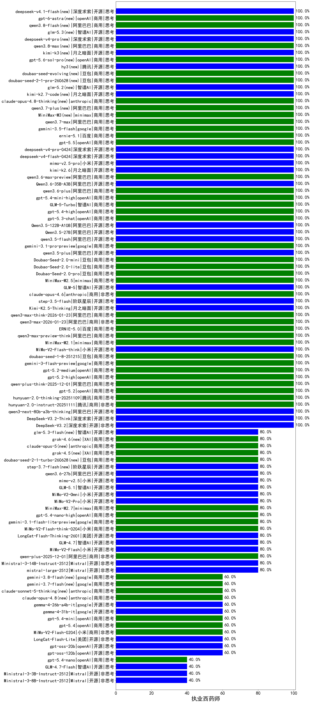

|类别|机构|大模型|【执业西药师】准确率|平均耗时|平均消耗token|花费/千次（元）|排名（准确率）|
|---|---|-----|-------------------|-------|-----------|-----------|-----------|
|商用|阿里巴巴|qwen3.6-max-preview(new)|100.0%|59s|1698|89.0|1|
|商用|anthropic|claude-haiku-4.5-thinking|100.0%|36s|2149|74.5|2|
|商用|腾讯|hunyuan-2.0-instruct-20251111|100.0%|9s|549|1.0|3|
|开源|阶跃星辰|step-3.5-flash|100.0%|16s|2474|5.1|4|
|开源|月之暗面|Kimi-K2.5-Thinking|100.0%|766s|3807|79.0|5|
|商用|阿里巴巴|qwen3-max-think-2026-01-23|100.0%|119s|3849|38.0|6|
|商用|阿里巴巴|qwen3-max-2026-01-23|100.0%|66s|500|4.6|7|
|商用|阿里巴巴|qwen3-max-preview|100.0%|10s|426|9.1|8|
|开源|豆包|Seed-OSS-36B-Instruct|100.0%|90s|2181|8.6|9|
|商用|百度|ERNIE-5.0|100.0%|148s|2969|70.4|10|
|商用|腾讯|hunyuan-turbos-20250926|100.0%|14s|571|1.0|11|
|商用|豆包|doubao-seed-1-6-251015|100.0%|6s|657|4.7|12|
|商用|豆包|doubao-seed-1-6-lite-251015|100.0%|192s|650|1.4|13|
|商用|阿里巴巴|qwen3-max-preview-think|100.0%|201s|2006|47.0|14|
|商用|openAI|gpt-5.1-medium|100.0%|201s|579|37.2|15|
|商用|anthropic|claude-haiku-4.5|100.0%|11s|517|16.2|16|
|商用|minimax|MiniMax-M2.1|100.0%|89s|1829|14.8|17|
|开源|智谱AI|GLM-5(new)|100.0%|55s|1959|34.5|18|
|开源|小米|MiMo-V2-Flash-think|100.0%|32s|3399|0.0|19|
|商用|anthropic|claude-sonnet-4.5(new)|100.0%|8s|515|49.7|20|
|商用|anthropic|claude-sonnet-4.5-thinking|100.0%|28s|1853|192.7|21|
|商用|百度|ERNIE-X1.1-Preview|100.0%|97s|1087|4.2|22|
|商用|百度|ERNIE-5.0-Thinking-Preview|100.0%|305s|2504|59.3|23|
|商用|豆包|doubao-seed-1-8-251215|100.0%|35s|639|4.4|24|
|商用|google|gemini-3-flash-preview|100.0%|44s|873|17.6|25|
|商用|openAI|gpt-5.2-medium|100.0%|8s|302|24.6|26|
|商用|openAI|gpt-5.2-high|100.0%|12s|336|28.0|27|
|开源|深度求索|DeepSeek-V3.2|100.0%|16s|398|1.1|28|
|开源|深度求索|DeepSeek-V3.2-Think|100.0%|138s|1732|5.1|29|
|开源|阿里巴巴|qwen3-next-80b-a3b-thinking|100.0%|185s|4131|16.3|30|
|商用|阿里巴巴|qwen-plus-think-2025-12-01|100.0%|96s|3418|26.9|31|
|商用|openAI|gpt-5.2|100.0%|13s|160|10.5|32|
|商用|anthropic|claude-opus-4.6|100.0%|20s|476|73.1|33|
|商用|阿里巴巴|qwen-flash-think-2025-07-28|100.0%|65s|3143|4.6|34|
|商用|minimax|MiniMax-M2.5(new)|100.0%|25s|1289|10.3|35|
|开源|阿里巴巴|Qwen3.5-122B-A10B(new)|100.0%|172s|3502|22.1|36|
|开源|阿里巴巴|Qwen3.6-35B-A3B(new)|100.0%|20s|2083|22.0|37|
|商用|阿里巴巴|qwen3.6-plus(new)|100.0%|22s|1370|15.8|38|
|商用|openAI|gpt-5.4-mini-high(new)|100.0%|17s|1136|34.1|39|
|商用|智谱AI|GLM-5-Turbo(new)|100.0%|33s|1259|26.8|40|
|商用|openAI|gpt-5.4-high(new)|100.0%|12s|580|55.5|41|
|商用|腾讯|hunyuan-t1-20250711|100.0%|39s|2180|8.4|42|
|商用|openAI|gpt-5-2025-08-07|100.0%|18s|271|16.1|43|
|商用|openAI|gpt-5.3-chat(new)|100.0%|5s|349|28.9|44|
|开源|阿里巴巴|qwen3-235b-a22b-instruct-2507|100.0%|11s|448|3.2|45|
|开源|阿里巴巴|qwen3-235b-a22b-thinking-2507|100.0%|67s|2972|58.3|46|
|商用|腾讯|hunyuan-2.0-thinking-20251109|100.0%|9s|875|3.4|47|
|开源|阿里巴巴|qwen3.5-plus(new)|100.0%|31s|2260|10.6|48|
|商用|google|gemini-3.1-pro-preview(new)|100.0%|25s|1298|106.7|49|
|商用|豆包|Doubao-Seed-2.0-lite(new)|100.0%|226s|941|3.1|50|
|商用|豆包|Doubao-Seed-2.0-mini(new)|100.0%|274s|2887|5.6|51|
|开源|阿里巴巴|Qwen3-30B-A3B-Instruct-2507|100.0%|5s|574|1.6|52|
|商用|豆包|Doubao-Seed-2.0-pro(new)|100.0%|374s|1674|25.5|53|
|开源|阿里巴巴|qwen3.5-flash(new)|100.0%|413s|4222|8.3|54|
|开源|阿里巴巴|Qwen3.5-27B(new)|100.0%|383s|3464|16.4|55|
|开源|阿里巴巴|Qwen3-14B-nothink|100.0%|15s|480|0.9|56|
|商用|百度|ERNIE-4.5-Turbo-32K|95.0%|21s|522|1.5|57|
|商用|百度|ERNIE-X1-Turbo-32K|85.0%|141s|2373|9.3|58|
|开源|深度求索|DeepSeek-R1-0528|85.0%|247s|2254|35.3|59|
|商用|小米|MiMo-V2-Flash-think-0204(new)|80.0%|304s|2719|5.6|60|
|商用|小米|MiMo-V2-Omni(new)|80.0%|26s|1775|21.5|61|
|商用|阿里巴巴|qwen-plus-2025-12-01|80.0%|24s|866|1.7|62|
|开源|智谱AI|GLM-5.1(new)|80.0%|55s|1742|40.8|63|
|开源|美团|LongCat-Flash-Thinking-2601|80.0%|207s|2126|0.0|64|
|商用|openAI|gpt-5.4-nano-high(new)|80.0%|101s|703|5.7|65|
|商用|小米|MiMo-V2-Pro(new)|80.0%|30s|961|16.0|66|
|商用|minimax|MiniMax-M2.7(new)|80.0%|42s|1680|13.6|67|
|商用|google|gemini-3.1-flash-lite-preview(new)|80.0%|5s|348|3.2|68|
|开源|小米|MiMo-V2-Flash|80.0%|19s|433|0.0|69|
|开源|智谱AI|GLM-4.7|80.0%|82s|2794|38.5|70|
|商用|openAI|gpt-5-mini-high|80.0%|111s|2054|29.0|71|
|开源|阿里巴巴|qwen3-next-80b-a3b-instruct|80.0%|12s|571|2.1|72|
|商用|阿里巴巴|qwen-turbo-think-2025-07-15|80.0%|/|3283|9.7|73|
|开源|阿里巴巴|Qwen3-4B-nothink|80.0%|11s|421|1.1|74|
|商用|阿里巴巴|qwen-turbo-2025-07-15|80.0%|7s|348|0.2|75|
|商用|google|gemini-2.5-pro|80.0%|32s|2748|194.8|76|
|商用|openAI|gpt-5-nano-2025-08-07|80.0%|71s|2151|6.1|77|
|商用|阿里巴巴|qwen-flash-2025-07-28|80.0%|8s|574|0.8|78|
|开源|深度求索|DeepSeek-V3.1|80.0%|20s|385|4.2|79|
|开源|深度求索|DeepSeek-V3.1-Think|80.0%|61s|1167|13.6|80|
|开源|阿里巴巴|Qwen3-32B-nothink|80.0%|17s|466|1.7|81|
|商用|阿里巴巴|qwen3-max-2025-09-23|80.0%|17s|444|9.6|82|
|商用|openAI|gpt-5.1-high|80.0%|127s|816|54.1|83|
|开源|Mistral|Ministral-3-14B-Instruct-2512|80.0%|11s|564|0.8|84|
|开源|Mistral|mistral-large-2512|80.0%|12s|388|3.7|85|
|开源|阿里巴巴|Qwen3-32B|80.0%|52s|2079|8.1|86|
|商用|anthropic|claude-opus-4.5|80.0%|9s|513|80.9|87|
|开源|月之暗面|kimi-k2-0905|80.0%|77s|405|5.6|88|
|商用|百川智能|Baichuan4-Turbo|75.0%|/|/|/|89|
|开源|阿里巴巴|Qwen3-14B|75.0%|32s|1237|2.4|90|
|商用|anthropic|claude-4-sonnet-thinking|70.0%|47s|485|46.4|91|
|商用|google|gemini-2.5-flash|70.0%|11s|1931|33.9|92|
|开源|阿里巴巴|Qwen3-8B|65.0%|601s|18361|0.0|93|
|商用|anthropic|claude-4-sonnet|60.0%|40s|763|73.4|94|
|商用|智谱AI|GLM-4.5-Flash|60.0%|38s|2147|0.0|95|
|开源|google|gemma-4-31b-it(new)|60.0%|104s|479|1.2|96|
|开源|阿里巴巴|Qwen3-4B|60.0%|20s|2013|5.8|97|
|商用|openAI|gpt-5.4-mini(new)|60.0%|18s|170|3.7|98|
|开源|智谱AI|GLM-4-9B-0414|60.0%|5s|426|0|99|
|商用|openAI|gpt-5.4(new)|60.0%|4s|222|17.9|100|
|开源|google|gemma-4-26b-a4b-it(new)|60.0%|94s|606|1.6|101|
|开源|openAI|gpt-oss-120b|60.0%|5s|647|1.8|102|
|开源|智谱AI|GLM-4.5-Air|60.0%|33s|1568|9.1|103|
|商用|openAI|gpt-5.1|60.0%|142s|163|7.7|104|
|商用|openAI|gpt-5-nano-high|60.0%|88s|5064|14.5|105|
|开源|智谱AI|GLM-4.5-Air-nothink|60.0%|10s|876|5.0|106|
|商用|XAI|grok-4-1-fast-non-reasoning|60.0%|90s|612|1.7|107|
|开源|openAI|gpt-oss-20b|60.0%|4s|781|0.8|108|
|商用|小米|MiMo-V2-Flash-0204(new)|60.0%|400s|449|0.8|109|
|开源|美团|LongCat-Flash-Lite(new)|60.0%|55s|466|0.0|110|
|商用|openAI|gpt-5-mini-2025-08-07|60.0%|28s|857|11.6|111|
|开源|阿里巴巴|Qwen3-30B-A3B-Thinking-2507|60.0%|93s|4494|12.4|112|
|商用|XAI|grok-4-1-fast-reasoning|60.0%|89s|1385|4.5|113|
|开源|月之暗面|Kimi-K2-Thinking|60.0%|100s|1452|22.6|114|
|商用|openAI|o4-mini|50.0%|35s|1483|45.3|115|
|开源|meta|Llama-4-Scout-17B-16E-Instruct|40.0%|8s|480|1.0|116|
|商用|openAI|gpt-5.4-nano(new)|40.0%|3s|169|1.0|117|
|开源|智谱AI|GLM-4.7-Flash|40.0%|974s|4547|0.0|118|
|商用|google|gemini-2.5-flash-lite|40.0%|4s|664|1.8|119|
|开源|Mistral|Ministral-3-8B-Instruct-2512|40.0%|12s|522|0.6|120|
|商用|智谱AI|GLM-4.5-Flash-nothink|40.0%|20s|810|0.0|121|
|开源|阿里巴巴|Qwen3-8B-nothink|40.0%|153s|407|0.0|122|
|开源|Mistral|Ministral-3-3B-Instruct-2512|40.0%|11s|784|0.6|123|

