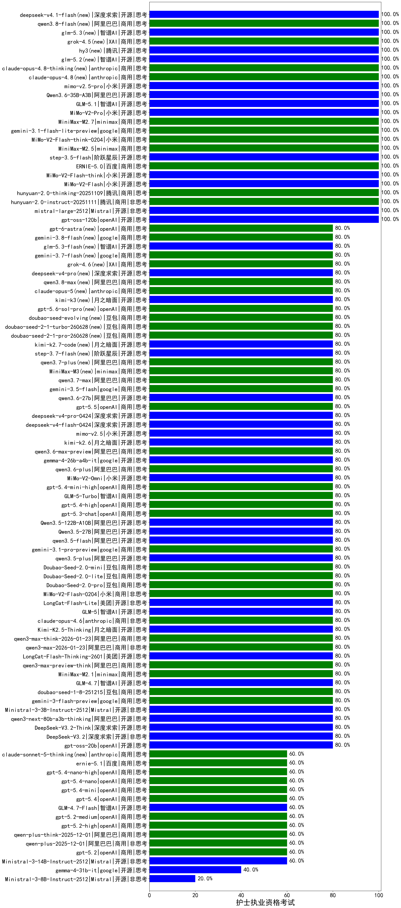

|类别|机构|大模型|【护士执业资格考试】准确率|平均耗时|平均消耗token|花费/千次（元）|排名（准确率）|
|---|---|-----|-------------------|-------|-----------|-----------|-----------|
|开源|Mistral|mistral-large-2512|100.0%|12s|411|3.6|1|
|商用|小米|MiMo-V2-Flash-think-0204(new)|100.0%|456s|1682|3.4|2|
|开源|智谱AI|GLM-4.5-Air|100.0%|29s|1489|8.6|3|
|商用|百度|ERNIE-5.0-Thinking-Preview|100.0%|241s|1384|32.1|4|
|开源|阿里巴巴|Qwen3-30B-A3B-Thinking-2507|100.0%|61s|2279|6.2|5|
|商用|百度|ERNIE-X1.1-Preview|100.0%|110s|400|1.4|6|
|开源|openAI|gpt-oss-120b|100.0%|68s|575|1.5|7|
|商用|百度|ERNIE-5.0|100.0%|139s|1096|25.2|8|
|商用|阿里巴巴|qwen-flash-think-2025-07-28|100.0%|19s|1976|2.9|9|
|商用|anthropic|claude-haiku-4.5|100.0%|12s|651|20.0|10|
|开源|阿里巴巴|Qwen3-8B-nothink|100.0%|16s|406|0.0|11|
|商用|阿里巴巴|qwen-turbo-think-2025-07-15|100.0%|/|2489|7.3|12|
|商用|minimax|MiniMax-M2.5(new)|100.0%|15s|848|6.5|13|
|开源|豆包|Seed-OSS-36B-Instruct|100.0%|40s|1076|4.1|14|
|开源|阿里巴巴|qwen3-next-80b-a3b-instruct|100.0%|6s|479|1.7|15|
|商用|腾讯|hunyuan-turbos-20250926|100.0%|11s|505|0.9|16|
|开源|阶跃星辰|step-3.5-flash|100.0%|18s|1723|3.5|17|
|商用|豆包|doubao-seed-1-6-lite-251015|100.0%|85s|560|1.1|18|
|开源|阿里巴巴|Qwen3-14B-nothink|100.0%|9s|479|0.8|19|
|商用|google|gemini-3.1-flash-lite-preview(new)|100.0%|41s|358|3.1|20|
|开源|小米|MiMo-V2-Flash-think|100.0%|28s|1987|0.0|21|
|商用|小米|MiMo-V2-Pro(new)|100.0%|493s|1059|17.8|22|
|开源|阿里巴巴|Qwen3.6-35B-A3B(new)|100.0%|110s|1496|15.5|23|
|开源|智谱AI|GLM-5.1(new)|100.0%|132s|1071|24.4|24|
|商用|腾讯|hunyuan-2.0-instruct-20251111|100.0%|5s|301|0.5|25|
|商用|腾讯|hunyuan-2.0-thinking-20251109|100.0%|11s|560|2.1|26|
|商用|百度|ERNIE-4.5-Turbo-32K|100.0%|21s|513|1.5|27|
|开源|小米|MiMo-V2-Flash|100.0%|125s|398|0.0|28|
|开源|月之暗面|Kimi-K2-Thinking|100.0%|168s|1198|18.4|29|
|商用|腾讯|hunyuan-t1-20250711|100.0%|17s|1007|3.7|30|
|商用|阿里巴巴|qwen-turbo-2025-07-15|100.0%|7s|319|0.2|31|
|商用|minimax|MiniMax-M2.7(new)|100.0%|25s|976|7.6|32|
|开源|阿里巴巴|Qwen3-32B|95.0%|26s|787|2.9|33|
|商用|anthropic|claude-4-sonnet|90.0%|44s|586|51.8|34|
|开源|阿里巴巴|Qwen3-14B|85.0%|34s|1996|3.9|35|
|商用|百度|ERNIE-X1-Turbo-32K|85.0%|88s|1594|6.2|36|
|开源|深度求索|DeepSeek-R1-0528|85.0%|226s|1642|25.4|37|
|开源|智谱AI|GLM-4.7|80.0%|56s|1573|21.2|38|
|商用|anthropic|claude-opus-4.6|80.0%|11s|608|90.9|39|
|商用|豆包|doubao-seed-1-8-251215|80.0%|28s|568|3.7|40|
|商用|minimax|MiniMax-M2.1|80.0%|21s|1154|9.0|41|
|商用|阿里巴巴|qwen3-max-preview-think|80.0%|203s|2177|50.8|42|
|开源|月之暗面|Kimi-K2.5-Thinking|80.0%|346s|1655|33.6|43|
|商用|阿里巴巴|qwen3-max-think-2026-01-23|80.0%|82s|2409|23.5|44|
|商用|google|gemini-3-flash-preview|80.0%|119s|894|17.7|45|
|开源|美团|LongCat-Flash-Thinking-2601|80.0%|173s|1850|0.0|46|
|商用|阿里巴巴|qwen3-max-2026-01-23|80.0%|38s|385|3.3|47|
|商用|百川智能|Baichuan4-Turbo|80.0%|/|/|/|48|
|开源|智谱AI|GLM-5(new)|80.0%|53s|1638|28.5|49|
|开源|阿里巴巴|Qwen3.5-122B-A10B(new)|80.0%|325s|2239|13.9|50|
|开源|google|gemma-4-26b-a4b-it(new)|80.0%|65s|548|1.4|51|
|商用|阿里巴巴|qwen3.6-plus(new)|80.0%|39s|1453|16.7|52|
|商用|小米|MiMo-V2-Omni(new)|80.0%|12s|957|9.8|53|
|商用|openAI|gpt-5.4-mini-high(new)|80.0%|62s|953|27.7|54|
|商用|智谱AI|GLM-5-Turbo(new)|80.0%|21s|833|17.1|55|
|商用|openAI|gpt-5.4-high(new)|80.0%|8s|432|37.7|56|
|商用|openAI|gpt-5.3-chat(new)|80.0%|8s|391|30.8|57|
|开源|阿里巴巴|Qwen3.5-27B(new)|80.0%|160s|2616|12.2|58|
|开源|美团|LongCat-Flash-Lite(new)|80.0%|154s|328|0.0|59|
|开源|阿里巴巴|qwen3.5-flash(new)|80.0%|325s|2670|5.2|60|
|商用|google|gemini-3.1-pro-preview(new)|80.0%|29s|1127|90.6|61|
|开源|阿里巴巴|qwen3.5-plus(new)|80.0%|30s|2572|12.0|62|
|商用|豆包|Doubao-Seed-2.0-mini(new)|80.0%|421s|1601|3.0|63|
|开源|Mistral|Ministral-3-3B-Instruct-2512|80.0%|14s|567|0.4|64|
|商用|豆包|Doubao-Seed-2.0-pro(new)|80.0%|192s|902|13.0|65|
|商用|小米|MiMo-V2-Flash-0204(new)|80.0%|100s|490|0.9|66|
|商用|豆包|Doubao-Seed-2.0-lite(new)|80.0%|166s|768|2.4|67|
|商用|openAI|gpt-5-mini-high|80.0%|815s|2158|30.2|68|
|开源|深度求索|DeepSeek-V3.1-Think|80.0%|55s|1062|12.2|69|
|开源|月之暗面|kimi-k2-0905|80.0%|113s|286|3.5|70|
|商用|anthropic|claude-haiku-4.5-thinking|80.0%|27s|3293|114.9|71|
|商用|豆包|doubao-seed-1-6-251015|80.0%|14s|634|4.4|72|
|商用|阿里巴巴|qwen3-max-preview|80.0%|10s|404|8.3|73|
|商用|google|gemini-2.5-flash-lite|80.0%|5s|465|1.2|74|
|开源|深度求索|DeepSeek-V3.1|80.0%|13s|260|2.6|75|
|商用|阿里巴巴|qwen-flash-2025-07-28|80.0%|6s|454|0.6|76|
|开源|openAI|gpt-oss-20b|80.0%|9s|950|1.0|77|
|开源|阿里巴巴|Qwen3-30B-A3B-Instruct-2507|80.0%|4s|425|1.1|78|
|商用|智谱AI|GLM-4.5-Flash|80.0%|22s|1294|0.0|79|
|开源|阿里巴巴|qwen3-235b-a22b-instruct-2507|80.0%|9s|426|2.9|80|
|商用|google|gemini-2.5-pro|80.0%|35s|2523|177.6|81|
|商用|google|gemini-2.5-flash|80.0%|11s|1911|33.3|82|
|商用|anthropic|claude-4-sonnet-thinking|80.0%|72s|583|53.7|83|
|开源|阿里巴巴|Qwen3-4B|80.0%|20s|1114|3.1|84|
|开源|阿里巴巴|Qwen3-8B|80.0%|600s|15031|0.0|85|
|商用|XAI|grok-4-1-fast-reasoning|80.0%|12s|1193|3.7|86|
|商用|阿里巴巴|qwen3.6-max-preview(new)|80.0%|40s|1373|70.8|87|
|商用|阿里巴巴|qwen3-max-2025-09-23|80.0%|416s|399|8.1|88|
|开源|阿里巴巴|qwen3-next-80b-a3b-thinking|80.0%|167s|3009|11.8|89|
|开源|深度求索|DeepSeek-V3.2-Think|80.0%|72s|780|2.3|90|
|商用|anthropic|claude-sonnet-4.5(new)|80.0%|10s|686|64.9|91|
|商用|anthropic|claude-sonnet-4.5-thinking|80.0%|22s|1469|147.6|92|
|商用|anthropic|claude-opus-4.5|80.0%|15s|685|106.2|93|
|开源|深度求索|DeepSeek-V3.2|80.0%|156s|339|0.9|94|
|开源|智谱AI|GLM-4-9B-0414|75.0%|8s|424|0|95|
|商用|openAI|gpt-5.4-nano(new)|60.0%|8s|187|1.0|96|
|开源|阿里巴巴|qwen3-235b-a22b-thinking-2507|60.0%|33s|2293|44.4|97|
|商用|openAI|gpt-5.4-mini(new)|60.0%|14s|276|6.4|98|
|商用|openAI|gpt-5.2-high|60.0%|7s|354|27.6|99|
|商用|XAI|grok-4-1-fast-non-reasoning|60.0%|82s|620|1.7|100|
|商用|openAI|gpt-5.4-nano-high(new)|60.0%|5s|364|2.5|101|
|商用|阿里巴巴|qwen-plus-think-2025-12-01|60.0%|53s|2349|18.2|102|
|商用|阿里巴巴|qwen-plus-2025-12-01|60.0%|21s|741|1.4|103|
|商用|openAI|gpt-5.4(new)|60.0%|4s|302|24.0|104|
|商用|openAI|gpt-5.2|60.0%|3s|184|10.7|105|
|开源|阿里巴巴|Qwen3-4B-nothink|60.0%|18s|346|0.8|106|
|商用|openAI|gpt-5.2-medium|60.0%|8s|285|20.7|107|
|开源|阿里巴巴|Qwen3-32B-nothink|60.0%|27s|455|1.6|108|
|商用|openAI|gpt-5.1-high|60.0%|14s|883|57.3|109|
|商用|openAI|gpt-5-nano-high|60.0%|333s|5250|15.0|110|
|商用|openAI|gpt-5-2025-08-07|60.0%|18s|314|17.6|111|
|商用|openAI|gpt-5-mini-2025-08-07|60.0%|44s|1013|13.6|112|
|商用|openAI|gpt-5-nano-2025-08-07|60.0%|129s|1616|4.5|113|
|开源|meta|Llama-4-Scout-17B-16E-Instruct|60.0%|8s|529|1.0|114|
|开源|Mistral|Ministral-3-14B-Instruct-2512|60.0%|15s|502|0.7|115|
|商用|openAI|gpt-5.1-medium|60.0%|150s|473|28.1|116|
|开源|智谱AI|GLM-4.7-Flash|60.0%|296s|1667|0.0|117|
|商用|openAI|o4-mini|50.0%|41s|1165|34.9|118|
|开源|智谱AI|GLM-4.5-Air-nothink|40.0%|14s|874|4.9|119|
|商用|智谱AI|GLM-4.5-Flash-nothink|40.0%|19s|826|0.0|120|
|开源|google|gemma-4-31b-it(new)|40.0%|98s|545|1.4|121|
|商用|openAI|gpt-5.1|40.0%|536s|210|9.5|122|
|开源|Mistral|Ministral-3-8B-Instruct-2512|20.0%|12s|526|0.6|123|

