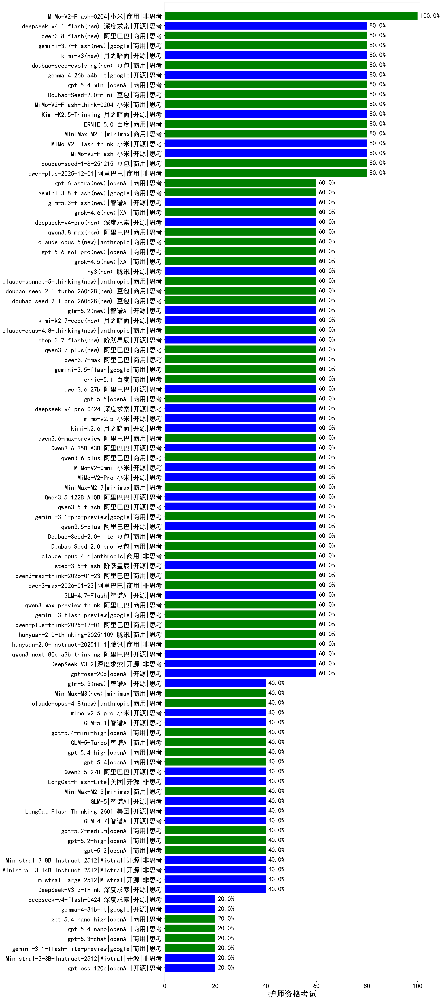

|类别|机构|大模型|【护师资格考试】准确率|平均耗时|平均消耗token|花费/千次（元）|排名（准确率）|
|---|---|-----|-------------------|-------|-----------|-----------|-----------|
|商用|小米|MiMo-V2-Flash-0204(new)|100.0%|331s|390|0.7|1|
|商用|科大讯飞|xunfei-spark-x1-0725|100.0%|/|908|10.9|2|
|商用|百度|ERNIE-4.5-Turbo-32K|95.0%|20s|498|1.5|3|
|开源|月之暗面|kimi-k2-0711-preview|90.0%|22s|392|5.6|4|
|商用|豆包|Doubao-1.5-lite-32k-250115|90.0%|5s|193|0.1|5|
|商用|豆包|doubao-seed-1-6-250615|90.0%|128s|413|2.7|6|
|商用|豆包|doubao-seed-1-6-flash-thinking-250615|90.0%|8s|503|0.6|7|
|商用|百度|ERNIE-X1-Turbo-32K|85.0%|78s|1717|6.7|8|
|开源|阿里巴巴|Qwen3-14B|85.0%|31s|1153|2.2|9|
|开源|阿里巴巴|Qwen3-32B|85.0%|24s|731|2.7|10|
|开源|百度|ERNIE-4.5-300B-A47B|85.0%|20s|262|1.7|11|
|开源|minimax|MiniMax-Text-01|85.0%|13s|883|7.1|12|
|商用|豆包|doubao-seed-1-6-flash-250615|85.0%|3s|285|0.3|13|
|商用|豆包|doubao-seed-1-6-thinking-250715|80.0%|14s|922|6.9|14|
|商用|阿里巴巴|qwen-turbo-2025-07-15|80.0%|6s|297|0.2|15|
|商用|腾讯|hunyuan-turbos-20250926|80.0%|9s|418|0.7|16|
|开源|月之暗面|Kimi-K2.5-Thinking(new)|80.0%|217s|1147|23.1|17|
|商用|腾讯|hunyuan-t1-20250711|80.0%|34s|1949|7.5|18|
|商用|XAI|grok-4-1-fast-reasoning|80.0%|78s|1062|3.3|19|
|商用|anthropic|claude-haiku-4.5-thinking|80.0%|32s|1717|58.4|20|
|开源|腾讯|Hunyuan-A13B-Instruct|80.0%|39s|776|2.9|21|
|商用|百度|ERNIE-5.0(new)|80.0%|234s|3191|75.7|22|
|开源|月之暗面|kimi-k2-0905|80.0%|60s|244|3.0|23|
|商用|minimax|MiniMax-M2.1(new)|80.0%|117s|1356|10.8|24|
|开源|小米|MiMo-V2-Flash-think(new)|80.0%|502s|2281|0.0|25|
|开源|小米|MiMo-V2-Flash(new)|80.0%|9s|383|0.0|26|
|商用|豆包|doubao-seed-1-8-251215(new)|80.0%|20s|548|3.7|27|
|开源|阿里巴巴|Qwen3-30B-A3B-Instruct-2507|80.0%|3s|393|1.0|28|
|商用|阿里巴巴|qwen-plus-2025-12-01(new)|80.0%|18s|694|1.3|29|
|商用|阿里巴巴|qwen-flash-2025-07-28|80.0%|5s|392|0.5|30|
|商用|google|gemini-2.5-flash|80.0%|12s|1577|27.6|31|
|开源|智谱AI|GLM-4.6|80.0%|37s|1809|24.7|32|
|商用|openAI|gpt-5.1|80.0%|100s|165|7.1|33|
|商用|豆包|doubao-seed-1-6-lite-251015|80.0%|255s|657|1.4|34|
|开源|百度|ERNIE-4.5-21B-A3B|80.0%|3s|276|0.0|35|
|开源|minimax|MiniMax-M1|80.0%|248s|3587|25.5|36|
|商用|anthropic|claude-4-sonnet|80.0%|37s|511|47.0|37|
|商用|小米|MiMo-V2-Flash-think-0204(new)|80.0%|1199s|2285|4.7|38|
|开源|深度求索|DeepSeek-R1-0528|80.0%|218s|1903|29.8|39|
|开源|月之暗面|Kimi-K2-Thinking|80.0%|97s|1607|25.0|40|
|开源|meta|Llama-4-Scout-17B-16E-Instruct|80.0%|8s|394|0.8|41|
|商用|豆包|Doubao-Seed-2.0-mini(new)|80.0%|374s|1526|2.9|42|
|开源|阿里巴巴|Qwen3-4B|80.0%|22s|986|2.8|43|
|开源|meta|Llama-4-Maverick-17B-128E-Instruct-FP8|80.0%|6s|413|1.6|44|
|商用|google|gemini-2.5-pro|75.0%|39s|2438|172.9|45|
|商用|百川智能|Baichuan4-Turbo|75.0%|/|/|/|46|
|开源|阿里巴巴|Qwen3-8B|70.0%|600s|17065|0.0|47|
|开源|智谱AI|GLM-4-9B-0414|70.0%|9s|425|0.0|48|
|开源|google|gemma-3-27b-it|70.0%|/|/|/|49|
|商用|XAI|grok-4-0709|70.0%|65s|1497|156.9|50|
|商用|XAI|grok-3-mini|70.0%|157s|1040|3.7|51|
|商用|豆包|doubao-seed-1-6-251015|60.0%|5s|534|3.7|52|
|商用|anthropic|claude-sonnet-4.5-thinking|60.0%|20s|1350|136.6|53|
|商用|百度|ERNIE-5.0-Thinking-Preview|60.0%|309s|1318|30.7|54|
|商用|阿里巴巴|qwen3-max-2025-09-23|60.0%|302s|347|7.1|55|
|商用|XAI|grok-4-1-fast-non-reasoning|60.0%|5s|656|1.8|56|
|商用|anthropic|claude-sonnet-4.5(new)|60.0%|14s|542|51.2|57|
|商用|google|gemini-3-pro-preview(new)|60.0%|47s|1695|139.9|58|
|商用|anthropic|claude-haiku-4.5|60.0%|8s|560|17.3|59|
|商用|anthropic|claude-opus-4.5(new)|60.0%|18s|531|81.8|60|
|商用|阿里巴巴|qwen-plus-think-2025-07-28|60.0%|/|3455|27.2|61|
|开源|深度求索|DeepSeek-V3.2(new)|60.0%|11s|243|0.7|62|
|开源|阿里巴巴|qwen3-next-80b-a3b-thinking|60.0%|97s|3879|15.3|63|
|开源|阿里巴巴|qwen3.5-flash(new)|60.0%|386s|3477|6.8|64|
|商用|google|gemini-3.1-pro-preview(new)|60.0%|58s|1466|120.4|65|
|开源|阿里巴巴|qwen3.5-plus(new)|60.0%|33s|2582|12.1|66|
|商用|豆包|Doubao-Seed-2.0-lite(new)|60.0%|213s|1042|3.4|67|
|商用|豆包|Doubao-Seed-2.0-pro(new)|60.0%|377s|1508|22.8|68|
|商用|anthropic|claude-opus-4.6(new)|60.0%|20s|544|82.8|69|
|商用|阿里巴巴|qwen3-max-think-2026-01-23(new)|60.0%|120s|2924|28.7|70|
|商用|阿里巴巴|qwen3-max-2026-01-23(new)|60.0%|578s|301|2.5|71|
|开源|美团|LongCat-Flash-Thinking-2601(new)|60.0%|77s|1325|0.0|72|
|开源|智谱AI|GLM-4.7-Flash(new)|60.0%|1503s|1887|0.0|73|
|商用|阿里巴巴|qwen3-max-preview-think(new)|60.0%|64s|1998|46.7|74|
|商用|google|gemini-3-flash-preview(new)|60.0%|91s|1072|21.7|75|
|商用|阿里巴巴|qwen-plus-think-2025-12-01(new)|60.0%|83s|3845|30.3|76|
|商用|腾讯|hunyuan-2.0-thinking-20251109|60.0%|9s|745|2.8|77|
|商用|腾讯|hunyuan-2.0-instruct-20251111|60.0%|4s|285|0.5|78|
|开源|阶跃星辰|step-3.5-flash(new)|60.0%|60s|2355|4.9|79|
|开源|阿里巴巴|Qwen3.5-122B-A10B(new)|60.0%|331s|2458|15.4|80|
|开源|智谱AI|GLM-4.5-nothink|60.0%|15s|640|8.3|81|
|开源|阿里巴巴|Qwen3-4B-nothink|60.0%|8s|335|0.8|82|
|开源|智谱AI|GLM-4.5-Air-nothink|60.0%|16s|868|4.9|83|
|开源|阿里巴巴|Qwen3-30B-A3B-Thinking-2507|60.0%|64s|2993|8.2|84|
|商用|阿里巴巴|qwen-flash-think-2025-07-28|60.0%|24s|2370|3.5|85|
|开源|智谱AI|GLM-4.5|60.0%|73s|1625|22.1|86|
|开源|智谱AI|GLM-4.5-Air|60.0%|34s|1304|7.5|87|
|开源|阿里巴巴|Qwen3-32B-nothink|60.0%|20s|406|1.4|88|
|开源|阿里巴巴|Qwen3-8B-nothink|60.0%|157s|409|0.0|89|
|开源|阿里巴巴|qwen3-235b-a22b-instruct-2507|60.0%|9s|401|2.8|90|
|开源|openAI|gpt-oss-20b|60.0%|6s|750|0.8|91|
|商用|阿里巴巴|qwen-plus-2025-07-28|60.0%|8s|364|0.6|92|
|商用|anthropic|claude-4-sonnet-thinking|60.0%|34s|511|47.9|93|
|商用|阿里巴巴|qwen3-max-preview|60.0%|8s|410|8.6|94|
|开源|阿里巴巴|qwen3-next-80b-a3b-instruct|60.0%|6s|500|1.8|95|
|商用|智谱AI|GLM-4.5-Flash-nothink|60.0%|18s|771|0.0|96|
|开源|深度求索|DeepSeek-R1-0528-Qwen3-8B|55.0%|305s|1227|0.0|97|
|开源|阿里巴巴|Qwen3-1.7B|55.0%|17s|1987|5.8|98|
|开源|google|gemma-3-12b-it|55.0%|/|/|/|99|
|商用|百川智能|Baichuan4-Air|55.0%|/|/|/|100|
|商用|百度|ERNIE-Lite-8K|50.0%|/|/|/|101|
|商用|openAI|o4-mini|50.0%|31s|726|21.4|102|
|商用|openAI|gpt-5-mini-high|40.0%|974s|1635|22.8|103|
|开源|智谱AI|GLM-5(new)|40.0%|83s|2283|40.3|104|
|开源|深度求索|DeepSeek-V3.1-Think|40.0%|64s|1194|13.9|105|
|商用|google|gemini-2.5-flash-lite|40.0%|2s|366|0.9|106|
|商用|Mistral|mistral-medium-2508|40.0%|179s|324|3.8|107|
|开源|阿里巴巴|Qwen3-1.7B-nothink|40.0%|6s|351|0.9|108|
|开源|阿里巴巴|qwen3-235b-a22b-thinking-2507|40.0%|136s|3118|61.2|109|
|开源|腾讯|Hunyuan-A13B-Instruct-nothink|40.0%|9s|244|0.8|110|
|商用|minimax|MiniMax-M2.5(new)|40.0%|21s|1126|8.9|111|
|商用|智谱AI|GLM-4.5-Flash|40.0%|23s|1373|0.0|112|
|开源|美团|LongCat-Flash-Lite(new)|40.0%|396s|392|0.0|113|
|商用|阿里巴巴|qwen-turbo-think-2025-07-15|40.0%|/|2098|6.1|114|
|商用|openAI|gpt-5.1-medium|40.0%|47s|429|25.9|115|
|开源|豆包|Seed-OSS-36B-Instruct|40.0%|179s|3383|13.4|116|
|开源|阿里巴巴|Qwen3.5-27B(new)|40.0%|319s|5189|24.6|117|
|开源|智谱AI|GLM-4.7(new)|40.0%|78s|2732|37.6|118|
|开源|阿里巴巴|Qwen3-14B-nothink|40.0%|7s|412|0.7|119|
|商用|openAI|gpt-5.1-high|40.0%|111s|1190|79.9|120|
|商用|openAI|gpt-5.2(new)|40.0%|4s|167|10.1|121|
|商用|openAI|gpt-5-2025-08-07|40.0%|13s|295|17.1|122|
|开源|深度求索|DeepSeek-V3.2-Think(new)|40.0%|169s|1721|5.1|123|
|开源|Mistral|mistral-large-2512(new)|40.0%|7s|330|3.0|124|
|开源|Mistral|Ministral-3-14B-Instruct-2512(new)|40.0%|4s|491|0.7|125|
|开源|Mistral|Ministral-3-8B-Instruct-2512(new)|40.0%|4s|479|0.5|126|
|商用|openAI|gpt-5-mini-2025-08-07|40.0%|18s|950|12.8|127|
|开源|深度求索|DeepSeek-V3.1|40.0%|14s|278|2.9|128|
|商用|openAI|gpt-5-nano-2025-08-07|40.0%|25s|1313|3.6|129|
|开源|深度求索|DeepSeek-V3.2-Exp|40.0%|44s|252|0.7|130|
|开源|阶跃星辰|step-3|40.0%|114s|2240|8.8|131|
|商用|openAI|gpt-5.2-high(new)|40.0%|9s|395|32.9|132|
|商用|openAI|gpt-5.2-medium(new)|40.0%|7s|271|20.5|133|
|商用|百度|ERNIE-X1.1-Preview|40.0%|124s|1030|4.0|134|
|开源|深度求索|DeepSeek-V3.2-Exp-Think|40.0%|471s|1089|3.2|135|
|开源|阿里巴巴|Qwen3-0.6B|35.0%|9s|870|2.4|136|
|开源|google|gemma-3-4b-it|25.0%|/|/|/|137|
|开源|Mistral|Mistral-Small-3.2-24B-Instruct-2506|20.0%|19s|459|0.9|138|
|开源|百度|ERNIE-4.5-0.3B|20.0%|5s|352|0.0|139|
|开源|阿里巴巴|Qwen3-0.6B-nothink|20.0%|4s|209|0.4|140|
|开源|Mistral|Ministral-3-3B-Instruct-2512(new)|20.0%|3s|475|0.3|141|
|开源|openAI|gpt-oss-120b|20.0%|10s|543|1.4|142|
|开源|minimax|MiniMax-M2|20.0%|49s|1614|13.0|143|
|商用|openAI|gpt-5-nano-high|20.0%|873s|2448|6.9|144|

