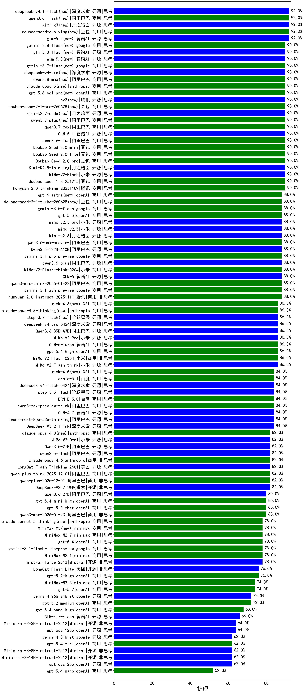

|类别|机构|大模型|【护理】准确率|平均耗时|平均消耗token|花费/千次（元）|排名（准确率）|
|---|---|-----|-------------------|-------|-----------|-----------|-----------|
|商用|豆包|doubao-seed-1-6-lite-251015(new)|94.0%|86s|736|1.5|1|
|商用|百度|ERNIE-4.5-Turbo-32K(new)|93.5%|21s|518|1.5|2|
|商用|腾讯|hunyuan-turbos-20250926(new)|92.0%|14s|621|1.1|3|
|商用|腾讯|hunyuan-2.0-thinking-20251109(new)|90.0%|9s|641|2.4|4|
|商用|豆包|Doubao-Seed-2.0-lite(new)|90.0%|200s|893|2.8|5|
|开源|阿里巴巴|qwen3-235b-a22b-instruct-2507(new)|90.0%|12s|530|3.7|6|
|商用|豆包|Doubao-Seed-2.0-pro(new)|90.0%|211s|962|13.8|7|
|开源|月之暗面|Kimi-K2.5-Thinking(new)|90.0%|292s|1553|31.3|8|
|商用|阿里巴巴|qwen3.6-plus(new)|90.0%|36s|1606|18.4|9|
|商用|豆包|doubao-seed-1-8-251215(new)|90.0%|25s|679|4.6|10|
|开源|智谱AI|GLM-5.1(new)|90.0%|154s|1362|31.3|11|
|开源|小米|MiMo-V2-Flash(new)|90.0%|108s|455|0.0|12|
|商用|豆包|doubao-seed-1-6-251015(new)|90.0%|12s|689|4.8|13|
|商用|豆包|Doubao-Seed-2.0-mini(new)|90.0%|273s|1758|3.3|14|
|商用|google|gemini-3.1-pro-preview(new)|88.0%|41s|1359|109.7|15|
|商用|google|gemini-3-flash-preview(new)|88.0%|95s|1098|21.8|16|
|开源|月之暗面|kimi-k2-0905(new)|88.0%|87s|392|5.1|17|
|开源|智谱AI|GLM-5(new)|88.0%|70s|1839|32.0|18|
|商用|小米|MiMo-V2-Flash-think-0204(new)|88.0%|642s|1982|4.0|19|
|商用|阿里巴巴|qwen3-max-think-2026-01-23(new)|88.0%|132s|2900|28.3|20|
|开源|阿里巴巴|qwen3-next-80b-a3b-instruct(new)|88.0%|9s|602|2.1|21|
|开源|阿里巴巴|Qwen3-30B-A3B-Instruct-2507(new)|88.0%|4s|572|1.5|22|
|商用|小米|mimo-v2.5-pro(new)|88.0%|21s|1272|22.1|23|
|开源|阿里巴巴|qwen3.5-plus(new)|88.0%|29s|2285|10.6|24|
|开源|阿里巴巴|Qwen3.5-122B-A10B(new)|88.0%|228s|2586|16.1|25|
|商用|小米|mimo-v2.5(new)|88.0%|57s|1387|15.8|26|
|商用|腾讯|hunyuan-2.0-instruct-20251111(new)|88.0%|8s|394|0.7|27|
|商用|腾讯|hunyuan-t1-20250711(new)|88.0%|24s|1488|5.6|28|
|开源|月之暗面|kimi-k2.6(new)|88.0%|91s|1570|40.8|29|
|商用|阿里巴巴|qwen3.6-max-preview(new)|88.0%|50s|1601|82.7|30|
|开源|阿里巴巴|Qwen3-32B(new)|86.5%|30s|1047|4.0|31|
|开源|阿里巴巴|Qwen3.6-35B-A3B(new)|86.0%|51s|1703|17.6|32|
|开源|豆包|Seed-OSS-36B-Instruct(new)|86.0%|80s|1691|6.6|33|
|商用|阿里巴巴|qwen3-max-preview(new)|86.0%|10s|504|10.5|34|
|开源|小米|MiMo-V2-Flash-think(new)|86.0%|144s|2131|0.0|35|
|商用|阿里巴巴|qwen3-max-2025-09-23(new)|86.0%|260s|519|10.9|36|
|商用|百度|ERNIE-X1-Turbo-32K(new)|86.0%|86s|1723|6.7|37|
|商用|anthropic|claude-opus-4.5(new)|86.0%|16s|753|115.8|38|
|商用|小米|MiMo-V2-Pro(new)|86.0%|305s|1198|20.5|39|
|商用|智谱AI|GLM-5-Turbo(new)|86.0%|34s|1261|26.4|40|
|商用|小米|MiMo-V2-Flash-0204(new)|86.0%|223s|523|1.0|41|
|商用|openAI|gpt-5.4-high(new)|86.0%|14s|669|61.3|42|
|商用|anthropic|claude-sonnet-4.5(new)|84.0%|12s|696|64.5|43|
|开源|智谱AI|GLM-4.7(new)|84.0%|55s|1998|27.1|44|
|商用|阿里巴巴|qwen3-max-preview-think(new)|84.0%|139s|2278|53.0|45|
|开源|月之暗面|Kimi-K2-Thinking(new)|84.0%|125s|1693|26.2|46|
|开源|阿里巴巴|qwen3-next-80b-a3b-thinking(new)|84.0%|130s|3388|13.3|47|
|商用|百度|ERNIE-5.0(new)|84.0%|163s|1947|45.5|48|
|开源|深度求索|DeepSeek-V3.1-Think(new)|84.0%|53s|1020|11.6|49|
|开源|深度求索|DeepSeek-V3.1(new)|84.0%|17s|356|3.7|50|
|商用|阿里巴巴|qwen-flash-2025-07-28(new)|84.0%|8s|571|0.7|51|
|开源|阶跃星辰|step-3.5-flash(new)|84.0%|28s|1948|4.0|52|
|开源|深度求索|DeepSeek-V3.2-Think(new)|84.0%|98s|1093|3.2|53|
|商用|阿里巴巴|qwen-turbo-2025-07-15(new)|84.0%|8s|395|0.2|54|
|开源|深度求索|DeepSeek-R1-0528(new)|82.5%|228s|1781|27.7|55|
|开源|美团|LongCat-Flash-Thinking-2601(new)|82.0%|162s|2025|0.0|56|
|商用|阿里巴巴|qwen-plus-think-2025-12-01(new)|82.0%|60s|2619|20.3|57|
|开源|阿里巴巴|qwen3.5-flash(new)|82.0%|258s|2888|5.6|58|
|商用|阿里巴巴|qwen-plus-2025-12-01(new)|82.0%|21s|818|1.5|59|
|开源|阿里巴巴|Qwen3.5-27B(new)|82.0%|295s|2985|14.0|60|
|商用|小米|MiMo-V2-Omni(new)|82.0%|286s|1420|16.2|61|
|商用|anthropic|claude-opus-4.6(new)|82.0%|13s|676|100.4|62|
|开源|深度求索|DeepSeek-V3.2(new)|82.0%|59s|360|1.0|63|
|开源|阿里巴巴|qwen3-235b-a22b-thinking-2507(new)|82.0%|82s|2606|50.5|64|
|商用|anthropic|claude-sonnet-4.5-thinking(new)|82.0%|27s|1875|190.2|65|
|商用|openAI|gpt-5.1-high(new)|80.0%|68s|1022|66.3|66|
|商用|openAI|gpt-5.4-mini-high(new)|80.0%|25s|904|25.8|67|
|开源|智谱AI|GLM-4.5-Air(new)|80.0%|33s|1647|9.5|68|
|商用|openAI|gpt-5.3-chat(new)|80.0%|23s|399|30.5|69|
|商用|阿里巴巴|qwen3-max-2026-01-23(new)|80.0%|132s|521|4.6|70|
|开源|阿里巴巴|Qwen3-14B(new)|79.0%|29s|1576|3.0|71|
|商用|百度|ERNIE-5.0-Thinking-Preview(new)|78.0%|246s|1841|42.9|72|
|商用|google|gemini-2.5-pro(new)|78.0%|36s|2366|166.5|73|
|商用|智谱AI|GLM-4.5-Flash(new)|78.0%|27s|1533|0.0|74|
|开源|Mistral|mistral-large-2512(new)|78.0%|13s|564|5.2|75|
|商用|minimax|MiniMax-M2.7(new)|78.0%|37s|1468|11.6|76|
|商用|智谱AI|GLM-4.5-Flash-nothink(new)|78.0%|20s|920|0.0|77|
|商用|openAI|gpt-5.4(new)|78.0%|10s|335|26.3|78|
|商用|anthropic|claude-4-sonnet-thinking(new)|78.0%|43s|619|56.2|79|
|商用|google|gemini-3.1-flash-lite-preview(new)|78.0%|15s|412|3.6|80|
|商用|openAI|gpt-5.1-medium(new)|78.0%|144s|502|29.3|81|
|商用|minimax|MiniMax-M2.1(new)|78.0%|78s|1415|11.2|82|
|商用|google|gemini-2.5-flash(new)|76.5%|11s|1788|31.2|83|
|开源|美团|LongCat-Flash-Lite(new)|76.0%|246s|492|0.0|84|
|开源|阿里巴巴|Qwen3-8B-nothink(new)|76.0%|76s|520|0.0|85|
|商用|anthropic|claude-haiku-4.5-thinking(new)|76.0%|42s|2673|91.9|86|
|商用|openAI|gpt-5-2025-08-07(new)|76.0%|28s|353|19.5|87|
|商用|openAI|gpt-5.2-high(new)|76.0%|10s|449|35.9|88|
|商用|阿里巴巴|qwen-flash-think-2025-07-28(new)|76.0%|26s|2766|4.0|89|
|商用|百川智能|Baichuan4-Turbo(new)|75.9%|/|/|/|90|
|开源|阿里巴巴|Qwen3-30B-A3B-Thinking-2507(new)|75.0%|74s|2734|7.5|91|
|商用|minimax|MiniMax-M2.5(new)|74.0%|28s|1448|11.5|92|
|商用|百度|ERNIE-X1.1-Preview(new)|74.0%|110s|705|2.6|93|
|商用|openAI|gpt-5.2(new)|74.0%|6s|227|13.8|94|
|开源|阿里巴巴|Qwen3-8B(new)|73.0%|417s|10718|0.0|95|
|开源|阿里巴巴|Qwen3-4B(new)|73.0%|20s|1443|4.1|96|
|商用|anthropic|claude-4-sonnet(new)|73.0%|42s|616|55.1|97|
|商用|openAI|gpt-5.2-medium(new)|72.0%|9s|392|30.1|98|
|商用|XAI|grok-4-1-fast-reasoning(new)|72.0%|42s|1207|3.8|99|
|开源|google|gemma-4-26b-a4b-it(new)|72.0%|60s|618|1.5|100|
|开源|智谱AI|GLM-4.5-Air-nothink(new)|72.0%|16s|954|5.3|101|
|商用|阿里巴巴|qwen-turbo-think-2025-07-15(new)|72.0%|/|2164|6.3|102|
|商用|openAI|gpt-5.1(new)|72.0%|255s|251|11.5|103|
|开源|阿里巴巴|Qwen3-32B-nothink(new)|70.0%|84s|544|1.9|104|
|商用|openAI|gpt-5.4-nano-high(new)|68.0%|44s|539|4.0|105|
|开源|meta|Llama-4-Scout-17B-16E-Instruct(new)|68.0%|9s|560|1.1|106|
|开源|智谱AI|GLM-4-9B-0414(new)|66.5%|10s|429|0.0|107|
|商用|anthropic|claude-haiku-4.5(new)|66.0%|12s|679|20.5|108|
|开源|阿里巴巴|Qwen3-14B-nothink(new)|66.0%|13s|580|1.0|109|
|开源|智谱AI|GLM-4.7-Flash(new)|66.0%|950s|2377|0.0|110|
|开源|阿里巴巴|Qwen3-4B-nothink(new)|64.0%|15s|469|1.2|111|
|开源|Mistral|Ministral-3-3B-Instruct-2512(new)|64.0%|16s|1983|1.4|112|
|开源|openAI|gpt-oss-120b(new)|64.0%|31s|652|1.7|113|
|开源|google|gemma-4-31b-it(new)|62.0%|66s|545|1.3|114|
|商用|openAI|gpt-5-mini-high(new)|62.0%|674s|1962|27.2|115|
|开源|openAI|gpt-oss-20b(new)|62.0%|47s|1132|1.2|116|
|开源|Mistral|Ministral-3-14B-Instruct-2512(new)|62.0%|10s|681|1.0|117|
|开源|Mistral|Ministral-3-8B-Instruct-2512(new)|62.0%|9s|592|0.6|118|
|商用|openAI|gpt-5.4-mini(new)|62.0%|68s|293|6.6|119|
|商用|XAI|grok-4-1-fast-non-reasoning(new)|60.0%|46s|684|1.9|120|
|商用|openAI|o4-mini(new)|59.0%|31s|815|23.7|121|
|商用|google|gemini-2.5-flash-lite(new)|58.0%|8s|550|1.4|122|
|商用|openAI|gpt-5-nano-2025-08-07(new)|56.0%|74s|1687|4.6|123|
|商用|openAI|gpt-5-nano-high(new)|54.0%|475s|4140|11.7|124|
|商用|openAI|gpt-5-mini-2025-08-07(new)|54.0%|44s|904|11.8|125|
|商用|openAI|gpt-5.4-nano(new)|52.0%|13s|258|1.5|126|

