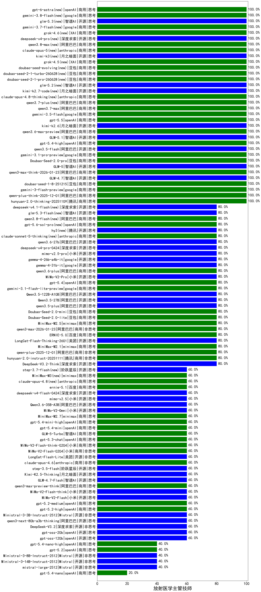

|类别|机构|大模型|【放射医学主管技师】准确率|平均耗时|平均消耗token|花费/千次（元）|排名（准确率）|
|---|---|-----|-------------------|-------|-----------|-----------|-----------|
|商用|阿里巴巴|qwen-plus-think-2025-12-01(new)|100.0%|54s|2507|19.6|1|
|商用|豆包|doubao-seed-1-8-251215(new)|100.0%|31s|723|5.1|2|
|商用|腾讯|hunyuan-2.0-thinking-20251109|100.0%|18s|1169|4.5|3|
|商用|腾讯|hunyuan-turbos-20250926|100.0%|16s|690|1.3|4|
|商用|google|gemini-3-pro-preview(new)|100.0%|20s|1759|145.4|5|
|商用|google|gemini-3-flash-preview(new)|100.0%|130s|1418|29.1|6|
|商用|豆包|doubao-seed-1-6-thinking-250715|100.0%|40s|1641|12.7|7|
|开源|豆包|Seed-OSS-36B-Instruct|100.0%|96s|3085|12.2|8|
|开源|智谱AI|GLM-4.7(new)|100.0%|70s|2213|30.3|9|
|开源|百度|ERNIE-4.5-300B-A47B|100.0%|21s|279|1.8|10|
|商用|阿里巴巴|qwen3-max-preview|100.0%|15s|528|11.5|11|
|商用|豆包|doubao-seed-1-6-250615|95.0%|33s|512|3.4|12|
|商用|百度|ERNIE-X1-Turbo-32K|95.0%|97s|1915|7.5|13|
|开源|阿里巴巴|Qwen3-32B|90.0%|20s|573|2.1|14|
|开源|阿里巴巴|Qwen3-14B|90.0%|27s|951|1.8|15|
|商用|百度|ERNIE-4.5-Turbo-32K|90.0%|22s|543|1.6|16|
|开源|深度求索|DeepSeek-R1-0528|90.0%|261s|2205|34.6|17|
|开源|minimax|MiniMax-M1|85.0%|138s|2746|18.8|18|
|商用|阿里巴巴|qwen-long-2025-01-25|85.0%|177s|325|0.6|19|
|商用|豆包|Doubao-1.5-lite-32k-250115|85.0%|3s|185|0.1|20|
|开源|meta|Llama-4-Maverick-17B-128E-Instruct-FP8|85.0%|7s|555|2.2|21|
|商用|百川智能|Baichuan4-Turbo|85.0%|/|/|/|22|
|商用|360|360zhinao2-o1|85.0%|/|/|/|23|
|开源|月之暗面|kimi-k2-0905|80.0%|109s|335|4.4|24|
|开源|阿里巴巴|Qwen3-14B-nothink|80.0%|10s|514|0.9|25|
|开源|阿里巴巴|Qwen3-32B-nothink|80.0%|27s|548|2.0|26|
|开源|阿里巴巴|Qwen3-30B-A3B-Thinking-2507|80.0%|72s|2569|7.1|27|
|开源|深度求索|DeepSeek-V3.1|80.0%|16s|318|3.4|28|
|商用|google|gemini-2.5-flash-lite|80.0%|4s|493|1.3|29|
|商用|阿里巴巴|qwen-plus-think-2025-07-28|80.0%|/|3247|25.5|30|
|商用|minimax|MiniMax-M2.1(new)|80.0%|187s|1480|11.8|31|
|开源|阿里巴巴|qwen3-next-80b-a3b-instruct|80.0%|12s|658|2.4|32|
|商用|阿里巴巴|qwen3-max-2025-09-23|80.0%|18s|523|11.4|33|
|商用|阿里巴巴|qwen-plus-2025-12-01(new)|80.0%|20s|755|1.4|34|
|开源|深度求索|DeepSeek-V3.2-Exp|80.0%|487s|343|1.0|35|
|开源|智谱AI|GLM-4.6|80.0%|49s|2152|29.4|36|
|商用|豆包|doubao-seed-1-6-251015|80.0%|6s|664|4.7|37|
|开源|minimax|MiniMax-M2|80.0%|35s|2144|17.4|38|
|商用|腾讯|hunyuan-2.0-instruct-20251111|80.0%|6s|423|0.7|39|
|开源|深度求索|DeepSeek-V3.2-Think(new)|80.0%|165s|2129|6.3|40|
|开源|阿里巴巴|qwen3-235b-a22b-thinking-2507|80.0%|55s|2358|46.0|41|
|商用|百度|ERNIE-5.0(new)|80.0%|208s|2874|68.0|42|
|商用|豆包|doubao-seed-1-6-flash-thinking-250615|80.0%|7s|580|0.7|43|
|商用|XAI|grok-3-mini|80.0%|139s|1010|3.6|44|
|开源|腾讯|Hunyuan-A13B-Instruct|80.0%|33s|1027|3.9|45|
|开源|minimax|MiniMax-Text-01|80.0%|10s|875|7.0|46|
|开源|月之暗面|kimi-k2-0711-preview|80.0%|33s|577|8.5|47|
|商用|豆包|doubao-seed-1-6-flash-250615|80.0%|4s|275|0.3|48|
|商用|google|gemini-2.5-pro|80.0%|22s|1947|137.3|49|
|商用|XAI|grok-4-0709|80.0%|223s|1887|199.6|50|
|开源|阿里巴巴|Qwen3-4B|75.0%|22s|1207|3.4|51|
|商用|anthropic|claude-4-sonnet-thinking|70.0%|8s|550|52.1|52|
|开源|百度|ERNIE-4.5-21B-A3B|70.0%|3s|307|0.0|53|
|商用|anthropic|claude-4-sonnet|70.0%|44s|448|41.1|54|
|商用|google|gemini-2.5-flash|65.0%|9s|1614|28.3|55|
|开源|深度求索|DeepSeek-R1-0528-Qwen3-8B|65.0%|245s|1553|0.0|56|
|商用|openAI|o4-mini|60.0%|35s|1112|33.8|57|
|商用|XAI|grok-4-1-fast-reasoning|60.0%|84s|1175|3.7|58|
|商用|openAI|gpt-5.1|60.0%|532s|221|10.9|59|
|商用|anthropic|claude-haiku-4.5-thinking|60.0%|38s|2083|71.6|60|
|商用|anthropic|claude-haiku-4.5|60.0%|7s|572|17.8|61|
|商用|anthropic|claude-sonnet-4.5(new)|60.0%|8s|533|50.2|62|
|开源|月之暗面|Kimi-K2-Thinking|60.0%|84s|1489|23.1|63|
|商用|openAI|gpt-5.1-high|60.0%|16s|1327|89.5|64|
|开源|阿里巴巴|qwen3-235b-a22b-instruct-2507|60.0%|17s|656|4.9|65|
|商用|anthropic|claude-sonnet-4.5-thinking|60.0%|28s|1890|195.3|66|
|商用|百度|ERNIE-X1.1-Preview|60.0%|98s|977|3.8|67|
|商用|anthropic|claude-opus-4.5(new)|60.0%|9s|589|92.1|68|
|商用|openAI|gpt-5-mini-high|60.0%|471s|2521|35.6|69|
|商用|openAI|gpt-5-nano-high|60.0%|711s|3626|10.3|70|
|开源|深度求索|DeepSeek-V3.2(new)|60.0%|41s|538|1.6|71|
|开源|阿里巴巴|qwen3-next-80b-a3b-thinking|60.0%|177s|4145|16.4|72|
|开源|Mistral|Ministral-3-3B-Instruct-2512(new)|60.0%|3s|667|0.5|73|
|商用|openAI|gpt-5.2-high(new)|60.0%|18s|624|55.3|74|
|商用|openAI|gpt-5.2-medium(new)|60.0%|5s|304|23.5|75|
|开源|小米|MiMo-V2-Flash(new)|60.0%|17s|487|0.0|76|
|开源|小米|MiMo-V2-Flash-think(new)|60.0%|140s|1885|0.0|77|
|商用|阿里巴巴|qwen3-max-preview-think(new)|60.0%|127s|3736|88.5|78|
|开源|智谱AI|GLM-4.7-Flash(new)|60.0%|432s|2342|0.0|79|
|开源|美团|LongCat-Flash-Thinking-2601(new)|60.0%|250s|2722|0.0|80|
|商用|百度|ERNIE-5.0-Thinking-Preview|60.0%|213s|1443|33.7|81|
|商用|豆包|doubao-seed-1-6-lite-251015|60.0%|36s|836|1.8|82|
|开源|深度求索|DeepSeek-V3.2-Exp-Think|60.0%|151s|810|2.4|83|
|商用|openAI|gpt-5-nano-2025-08-07|60.0%|20s|1819|5.1|84|
|商用|阿里巴巴|qwen-turbo-2025-07-15|60.0%|8s|355|0.2|85|
|商用|科大讯飞|xunfei-spark-x1-0725|60.0%|/|795|9.5|86|
|商用|腾讯|hunyuan-t1-20250711|60.0%|43s|2468|9.6|87|
|商用|智谱AI|GLM-4.5-Flash|60.0%|47s|2483|0.0|88|
|开源|智谱AI|GLM-4.5|60.0%|113s|3040|41.9|89|
|开源|阿里巴巴|Qwen3-30B-A3B-Instruct-2507|60.0%|7s|694|1.9|90|
|开源|智谱AI|GLM-4.5-nothink|60.0%|21s|688|8.9|91|
|开源|openAI|gpt-oss-120b|60.0%|197s|603|1.6|92|
|开源|openAI|gpt-oss-20b|60.0%|5s|843|0.9|93|
|商用|百川智能|Baichuan4-Air|60.0%|/|/|/|94|
|开源|阶跃星辰|step-3|60.0%|122s|2429|9.5|95|
|商用|openAI|gpt-5-mini-2025-08-07|60.0%|109s|881|11.8|96|
|开源|Mistral|Magistral-Small-2507|60.0%|56s|5094|54.8|97|
|商用|阿里巴巴|qwen-turbo-think-2025-07-15|60.0%|/|2324|6.8|98|
|商用|阿里巴巴|qwen-plus-2025-07-28|60.0%|17s|596|1.1|99|
|商用|阿里巴巴|qwen-flash-think-2025-07-28|60.0%|56s|3162|4.7|100|
|开源|深度求索|DeepSeek-V3.1-Think|60.0%|53s|1031|11.9|101|
|开源|meta|Llama-4-Scout-17B-16E-Instruct|55.0%|7s|562|1.1|102|
|开源|智谱AI|GLM-4-9B-0414|55.0%|12s|426|0.0|103|
|开源|阿里巴巴|Qwen3-8B|55.0%|600s|13664|0.0|104|
|开源|阿里巴巴|Qwen3-1.7B|45.0%|21s|2475|7.3|105|
|开源|google|gemma-3-27b-it|45.0%|/|/|/|106|
|商用|百度|ERNIE-Lite-8K|40.0%|/|/|/|107|
|开源|阿里巴巴|Qwen3-8B-nothink|40.0%|26s|629|0.0|108|
|商用|openAI|gpt-5-2025-08-07|40.0%|14s|339|20.1|109|
|开源|Mistral|Mistral-Small-3.2-24B-Instruct-2506|40.0%|38s|693|1.4|110|
|开源|阿里巴巴|Qwen3-1.7B-nothink|40.0%|8s|427|1.1|111|
|商用|智谱AI|GLM-4.5-Flash-nothink|40.0%|19s|890|0.0|112|
|商用|openAI|gpt-5.2(new)|40.0%|11s|229|16.1|113|
|商用|Mistral|mistral-medium-2508|40.0%|20s|456|5.7|114|
|商用|阿里巴巴|qwen-flash-2025-07-28|40.0%|4s|550|0.7|115|
|开源|智谱AI|GLM-4.5-Air|40.0%|93s|4356|25.8|116|
|开源|Mistral|Ministral-3-8B-Instruct-2512(new)|40.0%|4s|622|0.7|117|
|开源|Mistral|Ministral-3-14B-Instruct-2512(new)|40.0%|13s|500|0.7|118|
|开源|Mistral|mistral-large-2512(new)|40.0%|16s|584|5.7|119|
|开源|腾讯|Hunyuan-A13B-Instruct-nothink|40.0%|15s|378|1.3|120|
|商用|openAI|gpt-5.1-medium|40.0%|199s|523|32.4|121|
|开源|阿里巴巴|Qwen3-4B-nothink|40.0%|24s|550|1.5|122|
|开源|google|gemma-3-4b-it|35.0%|/|/|/|123|
|开源|google|gemma-3-12b-it|30.0%|/|/|/|124|
|开源|百度|ERNIE-4.5-0.3B|30.0%|59s|355|0.0|125|
|开源|阿里巴巴|Qwen3-0.6B-nothink|20.0%|5s|224|0.5|126|
|开源|智谱AI|GLM-4.5-Air-nothink|20.0%|12s|947|5.3|127|
|商用|XAI|grok-4-1-fast-non-reasoning|20.0%|86s|592|1.6|128|
|开源|阿里巴巴|Qwen3-0.6B|20.0%|18s|1469|4.2|129|

