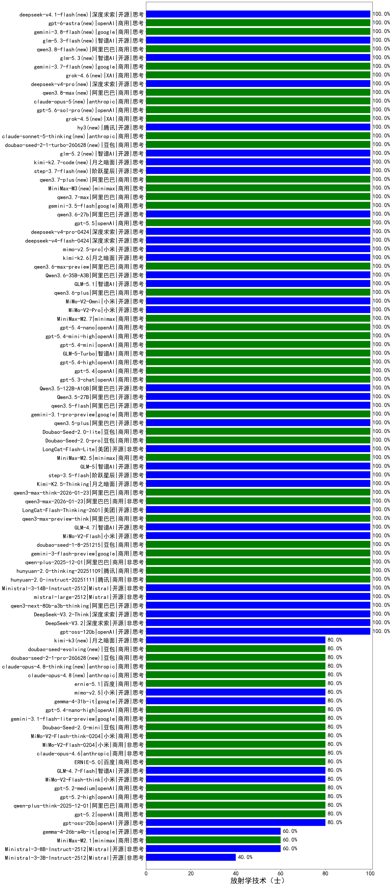

|类别|机构|大模型|【放射学技术（士）】准确率|平均耗时|平均消耗token|花费/千次（元）|排名（准确率）|
|---|---|-----|-------------------|-------|-----------|-----------|-----------|
|开源|深度求索|DeepSeek-V3.2(new)|100.0%|92s|409|1.2|1|
|商用|阿里巴巴|qwen-plus-2025-12-01(new)|100.0%|18s|732|1.4|2|
|开源|阶跃星辰|step-3.5-flash(new)|100.0%|13s|1471|3.0|3|
|开源|月之暗面|Kimi-K2.5-Thinking(new)|100.0%|354s|2073|42.3|4|
|商用|阿里巴巴|qwen3-max-think-2026-01-23(new)|100.0%|93s|2663|26.0|5|
|商用|阿里巴巴|qwen3-max-2026-01-23(new)|100.0%|117s|550|4.9|6|
|开源|美团|LongCat-Flash-Thinking-2601(new)|100.0%|182s|1655|0.0|7|
|商用|阿里巴巴|qwen3-max-preview-think(new)|100.0%|102s|2780|65.2|8|
|开源|智谱AI|GLM-4.7(new)|100.0%|49s|1731|23.4|9|
|开源|小米|MiMo-V2-Flash(new)|100.0%|253s|438|0.0|10|
|商用|豆包|doubao-seed-1-8-251215(new)|100.0%|26s|552|3.6|11|
|商用|google|gemini-3-flash-preview(new)|100.0%|19s|1026|20.5|12|
|商用|腾讯|hunyuan-2.0-thinking-20251109(new)|100.0%|8s|582|2.1|13|
|商用|XAI|grok-4-1-fast-reasoning(new)|100.0%|104s|1769|5.8|14|
|商用|腾讯|hunyuan-2.0-instruct-20251111(new)|100.0%|9s|407|0.7|15|
|开源|Mistral|Ministral-3-14B-Instruct-2512(new)|100.0%|10s|505|0.7|16|
|开源|Mistral|mistral-large-2512(new)|100.0%|12s|449|4.0|17|
|开源|阿里巴巴|qwen3-next-80b-a3b-thinking(new)|100.0%|157s|2593|10.1|18|
|开源|深度求索|DeepSeek-V3.2-Think(new)|100.0%|140s|1131|3.3|19|
|开源|meta|Llama-4-Scout-17B-16E-Instruct(new)|100.0%|10s|598|1.2|20|
|商用|阿里巴巴|qwen3-max-2025-09-23(new)|100.0%|25s|522|11.0|21|
|商用|anthropic|claude-opus-4.5(new)|100.0%|17s|583|86.8|22|
|商用|anthropic|claude-sonnet-4.5-thinking(new)|100.0%|21s|1535|154.0|23|
|商用|openAI|gpt-5.1-high(new)|100.0%|154s|833|53.0|24|
|开源|智谱AI|GLM-5(new)|100.0%|45s|1685|29.3|25|
|商用|minimax|MiniMax-M2.5(new)|100.0%|18s|823|6.2|26|
|开源|美团|LongCat-Flash-Lite(new)|100.0%|42s|391|0.0|27|
|商用|豆包|Doubao-Seed-2.0-pro(new)|100.0%|287s|1262|18.7|28|
|开源|月之暗面|kimi-k2.6(new)|100.0%|60s|1017|25.9|29|
|商用|阿里巴巴|qwen3.6-max-preview(new)|100.0%|51s|1587|82.1|30|
|开源|阿里巴巴|Qwen3.6-35B-A3B(new)|100.0%|10s|1887|19.7|31|
|开源|智谱AI|GLM-5.1(new)|100.0%|110s|1112|25.3|32|
|商用|阿里巴巴|qwen3.6-plus(new)|100.0%|34s|1343|15.3|33|
|商用|小米|MiMo-V2-Omni(new)|100.0%|404s|1412|16.1|34|
|商用|小米|MiMo-V2-Pro(new)|100.0%|14s|1092|18.4|35|
|商用|minimax|MiniMax-M2.7(new)|100.0%|34s|1270|10.0|36|
|商用|openAI|gpt-5.4-nano(new)|100.0%|3s|291|1.8|37|
|商用|openAI|gpt-5.4-mini-high(new)|100.0%|152s|1820|54.7|38|
|商用|openAI|gpt-5.4-mini(new)|100.0%|72s|234|4.8|39|
|商用|智谱AI|GLM-5-Turbo(new)|100.0%|36s|1117|23.3|40|
|商用|openAI|gpt-5.4-high(new)|100.0%|24s|714|66.3|41|
|商用|openAI|gpt-5.4(new)|100.0%|19s|285|21.2|42|
|商用|openAI|gpt-5.3-chat(new)|100.0%|54s|442|34.8|43|
|开源|阿里巴巴|Qwen3.5-122B-A10B(new)|100.0%|114s|2597|16.2|44|
|开源|阿里巴巴|Qwen3.5-27B(new)|100.0%|333s|2754|12.9|45|
|开源|阿里巴巴|qwen3.5-flash(new)|100.0%|323s|2391|4.6|46|
|商用|google|gemini-3.1-pro-preview(new)|100.0%|21s|1256|101.5|47|
|开源|阿里巴巴|qwen3.5-plus(new)|100.0%|24s|1943|9.0|48|
|商用|豆包|Doubao-Seed-2.0-lite(new)|100.0%|151s|684|2.1|49|
|开源|月之暗面|kimi-k2-0905(new)|100.0%|75s|430|5.7|50|
|商用|小米|mimo-v2.5-pro(new)|100.0%|18s|1095|18.4|51|
|开源|openAI|gpt-oss-120b(new)|100.0%|4s|618|1.6|52|
|商用|openAI|gpt-5-2025-08-07(new)|100.0%|15s|263|13.2|53|
|商用|openAI|gpt-5-mini-2025-08-07(new)|100.0%|30s|864|11.3|54|
|开源|智谱AI|GLM-4.5-Air-nothink(new)|100.0%|12s|906|5.0|55|
|开源|阿里巴巴|Qwen3-30B-A3B-Instruct-2507(new)|100.0%|7s|775|2.1|56|
|商用|阿里巴巴|qwen-flash-2025-07-28(new)|100.0%|8s|585|0.8|57|
|商用|阿里巴巴|qwen-flash-think-2025-07-28(new)|100.0%|20s|2091|3.0|58|
|开源|深度求索|DeepSeek-V3.1(new)|100.0%|15s|315|3.2|59|
|开源|智谱AI|GLM-4.5-Air(new)|100.0%|33s|1706|9.9|60|
|商用|智谱AI|GLM-4.5-Flash(new)|100.0%|26s|1451|0.0|61|
|开源|阿里巴巴|Qwen3-8B-nothink(new)|100.0%|22s|481|0.0|62|
|开源|深度求索|DeepSeek-V3.1-Think(new)|100.0%|56s|1108|12.7|63|
|开源|阿里巴巴|Qwen3-4B-nothink(new)|100.0%|17s|604|1.6|64|
|开源|阿里巴巴|qwen3-235b-a22b-thinking-2507(new)|100.0%|52s|2206|42.6|65|
|商用|阿里巴巴|qwen-turbo-2025-07-15(new)|100.0%|10s|375|0.2|66|
|商用|腾讯|hunyuan-t1-20250711(new)|100.0%|15s|970|3.6|67|
|商用|智谱AI|GLM-4.5-Flash-nothink(new)|100.0%|21s|1044|0.0|68|
|商用|阿里巴巴|qwen3-max-preview(new)|100.0%|9s|482|10.1|69|
|商用|豆包|doubao-seed-1-6-lite-251015(new)|100.0%|25s|732|1.5|70|
|商用|openAI|gpt-5.1-medium(new)|100.0%|202s|599|36.4|71|
|商用|openAI|gpt-5.1(new)|100.0%|93s|234|10.5|72|
|开源|豆包|Seed-OSS-36B-Instruct(new)|100.0%|139s|2351|9.2|73|
|开源|月之暗面|Kimi-K2-Thinking(new)|100.0%|88s|1344|20.6|74|
|商用|豆包|doubao-seed-1-6-251015(new)|100.0%|6s|622|4.3|75|
|商用|腾讯|hunyuan-turbos-20250926(new)|100.0%|14s|584|1.0|76|
|开源|阿里巴巴|qwen3-next-80b-a3b-instruct(new)|100.0%|12s|569|2.0|77|
|商用|百度|ERNIE-X1-Turbo-32K(new)|95.0%|94s|1686|6.6|78|
|商用|百度|ERNIE-4.5-Turbo-32K(new)|95.0%|22s|548|1.6|79|
|开源|阿里巴巴|Qwen3-32B(new)|95.0%|26s|977|3.7|80|
|商用|google|gemini-2.5-pro(new)|95.0%|37s|2623|185.5|81|
|商用|google|gemini-2.5-flash(new)|90.0%|12s|1854|32.4|82|
|开源|深度求索|DeepSeek-R1-0528(new)|90.0%|230s|1819|28.3|83|
|开源|阿里巴巴|Qwen3-30B-A3B-Thinking-2507(new)|90.0%|68s|2696|7.3|84|
|开源|阿里巴巴|Qwen3-14B(new)|85.0%|26s|1833|3.6|85|
|商用|百川智能|Baichuan4-Turbo(new)|85.0%|/|/|/|86|
|商用|百度|ERNIE-5.0(new)|80.0%|144s|1645|38.2|87|
|商用|openAI|gpt-5.2(new)|80.0%|6s|213|12.5|88|
|商用|小米|mimo-v2.5(new)|80.0%|8s|1068|11.3|89|
|商用|anthropic|claude-haiku-4.5(new)|80.0%|8s|578|17.1|90|
|开源|google|gemma-4-31b-it(new)|80.0%|56s|472|1.2|91|
|开源|阿里巴巴|Qwen3-4B(new)|80.0%|20s|1461|4.2|92|
|商用|openAI|o4-mini(new)|80.0%|33s|1134|33.6|93|
|商用|百度|ERNIE-X1.1-Preview(new)|80.0%|108s|763|2.8|94|
|商用|百度|ERNIE-5.0-Thinking-Preview(new)|80.0%|247s|1886|44.0|95|
|商用|openAI|gpt-5.4-nano-high(new)|80.0%|13s|604|4.6|96|
|商用|anthropic|claude-4-sonnet(new)|80.0%|45s|618|54.7|97|
|商用|anthropic|claude-4-sonnet-thinking(new)|80.0%|29s|584|53.1|98|
|开源|openAI|gpt-oss-20b(new)|80.0%|4s|1026|1.1|99|
|商用|google|gemini-3.1-flash-lite-preview(new)|80.0%|4s|323|2.7|100|
|开源|阿里巴巴|qwen3-235b-a22b-instruct-2507(new)|80.0%|13s|488|3.4|101|
|商用|google|gemini-2.5-flash-lite(new)|80.0%|3s|813|2.2|102|
|商用|阿里巴巴|qwen-turbo-think-2025-07-15(new)|80.0%|/|2088|6.0|103|
|商用|阿里巴巴|qwen-plus-think-2025-12-01(new)|80.0%|54s|1998|15.4|104|
|商用|小米|MiMo-V2-Flash-think-0204(new)|80.0%|1069s|2182|4.4|105|
|开源|智谱AI|GLM-4.7-Flash(new)|80.0%|551s|3623|0.0|106|
|商用|anthropic|claude-opus-4.6(new)|80.0%|10s|575|83.9|107|
|商用|openAI|gpt-5-nano-2025-08-07(new)|80.0%|35s|1864|5.2|108|
|开源|小米|MiMo-V2-Flash-think(new)|80.0%|24s|2274|0.0|109|
|商用|小米|MiMo-V2-Flash-0204(new)|80.0%|457s|739|1.4|110|
|商用|openAI|gpt-5.2-medium(new)|80.0%|10s|403|31.5|111|
|商用|openAI|gpt-5.2-high(new)|80.0%|11s|527|43.8|112|
|商用|豆包|Doubao-Seed-2.0-mini(new)|80.0%|594s|2604|5.0|113|
|商用|anthropic|claude-haiku-4.5-thinking(new)|80.0%|41s|2675|92.2|114|
|开源|阿里巴巴|Qwen3-8B(new)|75.0%|129s|3868|0.0|115|
|开源|智谱AI|GLM-4-9B-0414(new)|70.0%|13s|440|0|116|
|商用|openAI|gpt-5-mini-high(new)|60.0%|123s|1767|24.4|117|
|商用|openAI|gpt-5-nano-high(new)|60.0%|297s|4279|12.2|118|
|开源|阿里巴巴|Qwen3-14B-nothink(new)|60.0%|9s|530|0.9|119|
|开源|Mistral|Ministral-3-8B-Instruct-2512(new)|60.0%|15s|695|0.7|120|
|开源|阿里巴巴|Qwen3-32B-nothink(new)|60.0%|29s|584|2.1|121|
|商用|minimax|MiniMax-M2.1(new)|60.0%|128s|1930|15.5|122|
|开源|google|gemma-4-26b-a4b-it(new)|60.0%|91s|583|1.5|123|
|商用|anthropic|claude-sonnet-4.5(new)|60.0%|19s|665|61.9|124|
|商用|XAI|grok-4-1-fast-non-reasoning(new)|60.0%|100s|606|1.6|125|
|开源|Mistral|Ministral-3-3B-Instruct-2512(new)|40.0%|14s|696|0.5|126|

