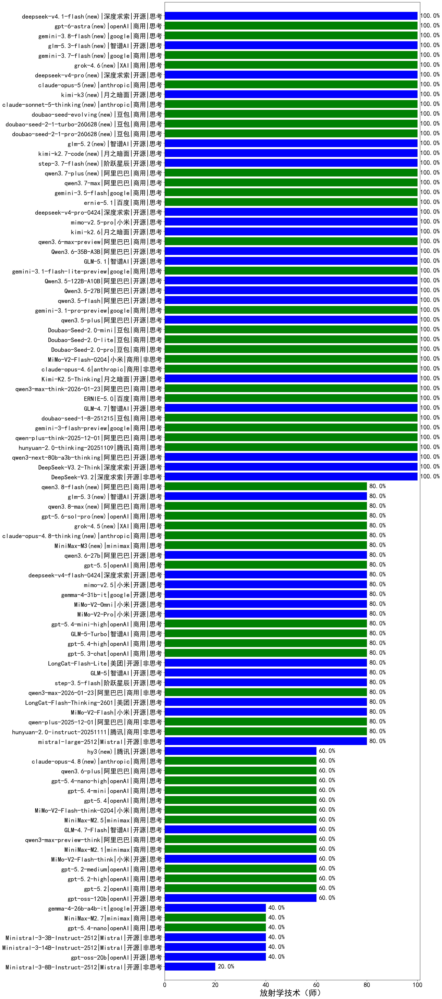

|类别|机构|大模型|【放射学技术（师）】准确率|平均耗时|平均消耗token|花费/千次（元）|排名（准确率）|
|---|---|-----|-------------------|-------|-----------|-----------|-----------|
|开源|月之暗面|kimi-k2.6(new)|100.0%|93s|2268|59.5|1|
|开源|阿里巴巴|qwen3-next-80b-a3b-thinking(new)|100.0%|95s|5323|21.0|2|
|开源|阿里巴巴|Qwen3.5-122B-A10B(new)|100.0%|232s|3458|21.6|3|
|开源|阿里巴巴|Qwen3.5-27B(new)|100.0%|389s|3670|17.2|4|
|开源|阿里巴巴|qwen3.5-flash(new)|100.0%|440s|4921|9.7|5|
|商用|google|gemini-3.1-pro-preview(new)|100.0%|43s|1333|107.6|6|
|开源|阿里巴巴|qwen3.5-plus(new)|100.0%|35s|2597|12.1|7|
|商用|豆包|Doubao-Seed-2.0-mini(new)|100.0%|862s|3864|7.5|8|
|开源|深度求索|DeepSeek-V3.2(new)|100.0%|103s|402|1.1|9|
|商用|豆包|Doubao-Seed-2.0-lite(new)|100.0%|210s|1069|3.5|10|
|商用|anthropic|claude-opus-4.6(new)|100.0%|22s|665|99.1|11|
|商用|豆包|Doubao-Seed-2.0-pro(new)|100.0%|255s|1170|17.1|12|
|商用|小米|MiMo-V2-Flash-0204(new)|100.0%|431s|547|1.0|13|
|开源|智谱AI|GLM-4.7(new)|100.0%|84s|3839|52.8|14|
|开源|豆包|Seed-OSS-36B-Instruct(new)|100.0%|147s|3926|15.5|15|
|开源|阿里巴巴|qwen3-next-80b-a3b-instruct(new)|100.0%|12s|555|1.9|16|
|商用|腾讯|hunyuan-turbos-20250926(new)|100.0%|17s|692|1.2|17|
|商用|豆包|doubao-seed-1-6-251015(new)|100.0%|13s|782|5.5|18|
|商用|豆包|doubao-seed-1-6-lite-251015(new)|100.0%|29s|762|1.6|19|
|开源|月之暗面|Kimi-K2-Thinking(new)|100.0%|171s|2930|45.9|20|
|商用|anthropic|claude-opus-4.5(new)|100.0%|28s|644|97.1|21|
|商用|XAI|grok-4-1-fast-reasoning(new)|100.0%|92s|1722|5.6|22|
|商用|anthropic|claude-sonnet-4.5-thinking(new)|100.0%|23s|1679|169.3|23|
|开源|深度求索|DeepSeek-V3.2-Think(new)|100.0%|53s|1584|4.7|24|
|商用|google|gemini-3.1-flash-lite-preview(new)|100.0%|4s|353|3.0|25|
|商用|百度|ERNIE-5.0(new)|100.0%|223s|2344|54.9|26|
|商用|腾讯|hunyuan-2.0-thinking-20251109(new)|100.0%|13s|1324|5.1|27|
|商用|阿里巴巴|qwen3.6-max-preview(new)|100.0%|51s|1552|79.9|28|
|商用|豆包|doubao-seed-1-8-251215(new)|100.0%|31s|805|5.5|29|
|开源|阿里巴巴|Qwen3.6-35B-A3B(new)|100.0%|20s|2818|29.6|30|
|商用|google|gemini-3-flash-preview(new)|100.0%|84s|1416|28.7|31|
|开源|智谱AI|GLM-5.1(new)|100.0%|101s|3676|86.7|32|
|商用|阿里巴巴|qwen-plus-think-2025-12-01(new)|100.0%|118s|4464|35.1|33|
|商用|anthropic|claude-sonnet-4.5(new)|100.0%|10s|645|59.4|34|
|开源|阿里巴巴|Qwen3-32B-nothink(new)|100.0%|143s|503|1.7|35|
|开源|阿里巴巴|qwen3-235b-a22b-thinking-2507(new)|100.0%|256s|4115|80.7|36|
|商用|阿里巴巴|qwen3-max-think-2026-01-23(new)|100.0%|358s|3996|39.3|37|
|开源|月之暗面|Kimi-K2.5-Thinking(new)|100.0%|363s|2793|57.2|38|
|开源|阿里巴巴|Qwen3-32B(new)|90.0%|28s|877|3.3|39|
|商用|google|gemini-2.5-pro(new)|85.0%|33s|3000|213.3|40|
|商用|百度|ERNIE-X1-Turbo-32K(new)|85.0%|107s|2435|9.6|41|
|商用|百度|ERNIE-4.5-Turbo-32K(new)|85.0%|21s|539|1.6|42|
|开源|深度求索|DeepSeek-R1-0528(new)|85.0%|211s|1928|30.1|43|
|商用|阿里巴巴|qwen3-max-2026-01-23(new)|80.0%|12s|477|4.1|44|
|商用|openAI|gpt-5.1-high(new)|80.0%|155s|1908|129.1|45|
|商用|百度|ERNIE-X1.1-Preview(new)|80.0%|91s|851|3.2|46|
|商用|百度|ERNIE-5.0-Thinking-Preview(new)|80.0%|461s|3548|83.8|47|
|商用|腾讯|hunyuan-2.0-instruct-20251111(new)|80.0%|12s|442|0.7|48|
|商用|阿里巴巴|qwen3-max-2025-09-23(new)|80.0%|191s|489|10.1|49|
|开源|meta|Llama-4-Scout-17B-16E-Instruct(new)|80.0%|9s|596|1.2|50|
|开源|美团|LongCat-Flash-Thinking-2601(new)|80.0%|185s|4179|0.0|51|
|开源|阶跃星辰|step-3.5-flash(new)|80.0%|32s|3656|7.6|52|
|商用|阿里巴巴|qwen-plus-2025-12-01(new)|80.0%|24s|896|1.7|53|
|开源|Mistral|mistral-large-2512(new)|80.0%|13s|566|5.2|54|
|商用|阿里巴巴|qwen3-max-preview(new)|80.0%|9s|471|9.7|55|
|开源|月之暗面|kimi-k2-0905(new)|80.0%|128s|491|6.6|56|
|商用|智谱AI|GLM-5-Turbo(new)|80.0%|79s|1947|41.4|57|
|开源|阿里巴巴|Qwen3-14B(new)|80.0%|30s|967|1.8|58|
|开源|阿里巴巴|Qwen3-4B(new)|80.0%|26s|1450|4.1|59|
|开源|google|gemma-4-31b-it(new)|80.0%|105s|603|1.5|60|
|商用|小米|MiMo-V2-Omni(new)|80.0%|139s|1226|13.4|61|
|商用|google|gemini-2.5-flash(new)|80.0%|11s|2004|35.3|62|
|商用|腾讯|hunyuan-t1-20250711(new)|80.0%|33s|1858|7.1|63|
|商用|阿里巴巴|qwen-turbo-2025-07-15(new)|80.0%|10s|409|0.2|64|
|开源|阿里巴巴|qwen3-235b-a22b-instruct-2507(new)|80.0%|13s|550|3.9|65|
|商用|小米|MiMo-V2-Pro(new)|80.0%|23s|1037|17.1|66|
|商用|openAI|gpt-5.4-mini-high(new)|80.0%|22s|1504|44.7|67|
|商用|openAI|gpt-5.4-high(new)|80.0%|12s|792|74.2|68|
|开源|智谱AI|GLM-5(new)|80.0%|95s|2093|36.5|69|
|商用|openAI|gpt-5.3-chat(new)|80.0%|41s|402|30.6|70|
|开源|阿里巴巴|Qwen3-30B-A3B-Instruct-2507(new)|80.0%|4s|551|1.4|71|
|开源|阿里巴巴|Qwen3-30B-A3B-Thinking-2507(new)|80.0%|80s|3190|8.8|72|
|商用|阿里巴巴|qwen-flash-2025-07-28(new)|80.0%|7s|561|0.7|73|
|商用|阿里巴巴|qwen-flash-think-2025-07-28(new)|80.0%|26s|2724|4.0|74|
|开源|深度求索|DeepSeek-V3.1-Think(new)|80.0%|67s|1318|15.2|75|
|开源|美团|LongCat-Flash-Lite(new)|80.0%|110s|796|0.0|76|
|商用|openAI|gpt-5.1-medium(new)|80.0%|188s|572|34.2|77|
|商用|anthropic|claude-haiku-4.5(new)|80.0%|28s|596|17.6|78|
|商用|anthropic|claude-haiku-4.5-thinking(new)|80.0%|102s|2031|68.7|79|
|开源|小米|MiMo-V2-Flash(new)|80.0%|9s|498|0.0|80|
|商用|百川智能|Baichuan4-Turbo(new)|70.0%|/|/|/|81|
|开源|阿里巴巴|Qwen3-8B(new)|70.0%|419s|12070|0.0|82|
|商用|openAI|o4-mini(new)|70.0%|33s|902|26.7|83|
|商用|anthropic|claude-4-sonnet-thinking(new)|70.0%|62s|596|54.1|84|
|开源|小米|MiMo-V2-Flash-think(new)|60.0%|34s|2853|0.0|85|
|商用|智谱AI|GLM-4.5-Flash(new)|60.0%|30s|1663|0.0|86|
|商用|minimax|MiniMax-M2.1(new)|60.0%|114s|2617|21.2|87|
|开源|openAI|gpt-oss-120b(new)|60.0%|14s|951|2.7|88|
|开源|智谱AI|GLM-4.5-Air-nothink(new)|60.0%|15s|1075|6.0|89|
|开源|智谱AI|GLM-4.5-Air(new)|60.0%|31s|1582|9.1|90|
|商用|openAI|gpt-5.4(new)|60.0%|6s|319|24.5|91|
|商用|openAI|gpt-5.4-mini(new)|60.0%|25s|270|5.8|92|
|开源|阿里巴巴|Qwen3-14B-nothink(new)|60.0%|16s|554|1.0|93|
|商用|openAI|gpt-5-mini-2025-08-07(new)|60.0%|31s|1142|15.3|94|
|商用|openAI|gpt-5.4-nano-high(new)|60.0%|90s|940|7.5|95|
|商用|阿里巴巴|qwen3.6-plus(new)|60.0%|46s|1746|20.3|96|
|商用|anthropic|claude-4-sonnet(new)|60.0%|43s|482|42.5|97|
|商用|openAI|gpt-5-2025-08-07(new)|60.0%|29s|467|27.7|98|
|商用|openAI|gpt-5-nano-high(new)|60.0%|593s|8022|23.0|99|
|商用|google|gemini-2.5-flash-lite(new)|60.0%|6s|1233|3.4|100|
|商用|小米|MiMo-V2-Flash-think-0204(new)|60.0%|1537s|3844|7.9|101|
|商用|阿里巴巴|qwen-turbo-think-2025-07-15(new)|60.0%|/|4359|12.8|102|
|商用|阿里巴巴|qwen3-max-preview-think(new)|60.0%|140s|4275|100.9|103|
|商用|minimax|MiniMax-M2.5(new)|60.0%|72s|3448|28.2|104|
|商用|XAI|grok-4-1-fast-non-reasoning(new)|60.0%|80s|631|1.7|105|
|商用|openAI|gpt-5-mini-high(new)|60.0%|932s|2355|32.8|106|
|开源|智谱AI|GLM-4.7-Flash(new)|60.0%|392s|3843|0.0|107|
|开源|深度求索|DeepSeek-V3.1(new)|60.0%|20s|324|3.2|108|
|商用|openAI|gpt-5.2-medium(new)|60.0%|11s|502|40.9|109|
|商用|openAI|gpt-5.2-high(new)|60.0%|15s|800|70.6|110|
|商用|openAI|gpt-5.2(new)|60.0%|18s|289|19.8|111|
|开源|智谱AI|GLM-4-9B-0414(new)|55.0%|12s|428|0|112|
|商用|openAI|gpt-5-nano-2025-08-07(new)|40.0%|127s|2963|8.3|113|
|开源|阿里巴巴|Qwen3-4B-nothink(new)|40.0%|25s|506|1.3|114|
|开源|google|gemma-4-26b-a4b-it(new)|40.0%|35s|649|1.6|115|
|开源|阿里巴巴|Qwen3-8B-nothink(new)|40.0%|23s|579|0.0|116|
|商用|minimax|MiniMax-M2.7(new)|40.0%|147s|6378|52.9|117|
|开源|Mistral|Ministral-3-3B-Instruct-2512(new)|40.0%|10s|513|0.4|118|
|商用|openAI|gpt-5.4-nano(new)|40.0%|29s|264|1.6|119|
|开源|Mistral|Ministral-3-14B-Instruct-2512(new)|40.0%|5s|735|1.0|120|
|商用|openAI|gpt-5.1(new)|40.0%|110s|306|15.4|121|
|商用|智谱AI|GLM-4.5-Flash-nothink(new)|40.0%|21s|1070|0.0|122|
|开源|openAI|gpt-oss-20b(new)|40.0%|13s|1971|2.2|123|
|开源|Mistral|Ministral-3-8B-Instruct-2512(new)|20.0%|15s|723|0.8|124|

