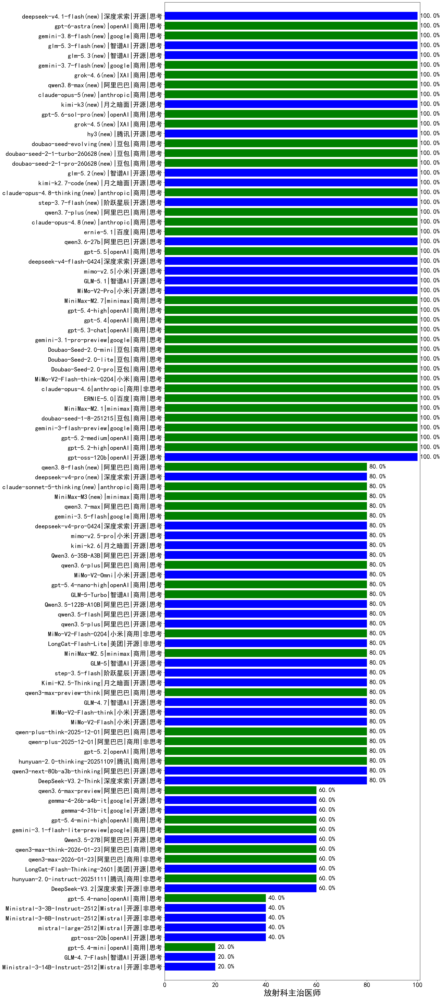

|类别|机构|大模型|【放射科主治医师】准确率|平均耗时|平均消耗token|花费/千次（元）|排名（准确率）|
|---|---|-----|-------------------|-------|-----------|-----------|-----------|
|商用|minimax|MiniMax-M2.1(new)|100.0%|56s|918|7.1|1|
|商用|openAI|gpt-5.4(new)|100.0%|22s|286|21.6|2|
|商用|小米|MiMo-V2-Pro(new)|100.0%|46s|1023|17.0|3|
|商用|minimax|MiniMax-M2.7(new)|100.0%|30s|1336|10.6|4|
|商用|豆包|Doubao-Seed-2.0-lite(new)|100.0%|236s|997|3.3|5|
|开源|智谱AI|GLM-4.5-Air(new)|100.0%|29s|1510|8.7|6|
|商用|豆包|Doubao-Seed-2.0-mini(new)|100.0%|202s|2101|4.0|7|
|商用|openAI|gpt-5.4-high(new)|100.0%|22s|432|36.9|8|
|开源|openAI|gpt-oss-120b(new)|100.0%|2s|529|1.3|9|
|商用|豆包|doubao-seed-1-6-251015(new)|100.0%|6s|711|5.0|10|
|商用|openAI|gpt-5.3-chat(new)|100.0%|23s|387|29.7|11|
|商用|openAI|gpt-5-2025-08-07(new)|100.0%|18s|223|10.5|12|
|商用|google|gemini-3.1-pro-preview(new)|100.0%|41s|1524|124.5|13|
|商用|anthropic|claude-opus-4.6(new)|100.0%|25s|601|89.6|14|
|商用|openAI|gpt-5-mini-high(new)|100.0%|119s|2637|37.0|15|
|商用|百度|ERNIE-X1.1-Preview(new)|100.0%|143s|1582|6.1|16|
|商用|百度|ERNIE-5.0(new)|100.0%|98s|1820|42.6|17|
|开源|阿里巴巴|qwen3-235b-a22b-thinking-2507(new)|100.0%|173s|2935|57.3|18|
|开源|深度求索|DeepSeek-V3.1(new)|100.0%|18s|360|3.8|19|
|商用|openAI|gpt-5.1-medium(new)|100.0%|148s|463|26.9|20|
|商用|小米|mimo-v2.5(new)|100.0%|13s|1037|11.0|21|
|商用|openAI|gpt-5.1(new)|100.0%|542s|196|7.9|22|
|商用|openAI|gpt-5.2-high(new)|100.0%|12s|386|30.0|23|
|商用|openAI|gpt-5.2-medium(new)|100.0%|9s|336|25.0|24|
|开源|智谱AI|GLM-5.1(new)|100.0%|88s|1726|40.2|25|
|商用|google|gemini-3-flash-preview(new)|100.0%|83s|1179|23.8|26|
|商用|openAI|gpt-5.1-high(new)|100.0%|125s|1169|77.0|27|
|商用|豆包|Doubao-Seed-2.0-pro(new)|100.0%|220s|949|13.8|28|
|商用|百度|ERNIE-4.5-Turbo-32K(new)|100.0%|21s|541|1.6|29|
|商用|小米|MiMo-V2-Flash-think-0204(new)|100.0%|711s|1561|3.1|30|
|商用|豆包|doubao-seed-1-8-251215(new)|100.0%|26s|693|4.8|31|
|商用|百度|ERNIE-X1-Turbo-32K(new)|95.0%|97s|2307|9.1|32|
|开源|深度求索|DeepSeek-R1-0528(new)|85.0%|241s|1986|31.0|33|
|开源|阿里巴巴|Qwen3-32B(new)|85.0%|48s|1984|7.7|34|
|商用|anthropic|claude-sonnet-4.5-thinking(new)|80.0%|25s|1696|172.2|35|
|商用|anthropic|claude-sonnet-4.5(new)|80.0%|13s|609|56.6|36|
|商用|百度|ERNIE-5.0-Thinking-Preview(new)|80.0%|223s|1978|46.4|37|
|开源|深度求索|DeepSeek-V3.2-Think(new)|80.0%|133s|1974|5.9|38|
|商用|anthropic|claude-opus-4.5(new)|80.0%|15s|614|93.5|39|
|开源|智谱AI|GLM-5(new)|80.0%|87s|2842|50.2|40|
|开源|阶跃星辰|step-3.5-flash(new)|80.0%|20s|1411|2.9|41|
|开源|美团|LongCat-Flash-Lite(new)|80.0%|87s|631|0.0|42|
|开源|阿里巴巴|qwen3-next-80b-a3b-thinking(new)|80.0%|230s|5110|20.2|43|
|开源|月之暗面|Kimi-K2.5-Thinking(new)|80.0%|477s|2161|44.2|44|
|商用|腾讯|hunyuan-2.0-thinking-20251109(new)|80.0%|31s|815|3.1|45|
|商用|openAI|gpt-5.2(new)|80.0%|5s|223|13.8|46|
|商用|阿里巴巴|qwen-plus-2025-12-01(new)|80.0%|22s|988|1.9|47|
|商用|阿里巴巴|qwen-plus-think-2025-12-01(new)|80.0%|85s|3612|28.3|48|
|开源|小米|MiMo-V2-Flash(new)|80.0%|38s|456|0.0|49|
|开源|小米|MiMo-V2-Flash-think(new)|80.0%|26s|2499|0.0|50|
|开源|智谱AI|GLM-4.7(new)|80.0%|80s|3250|44.7|51|
|商用|minimax|MiniMax-M2.5(new)|80.0%|30s|1277|10.1|52|
|商用|小米|mimo-v2.5-pro(new)|80.0%|20s|1326|23.3|53|
|商用|小米|MiMo-V2-Flash-0204(new)|80.0%|127s|586|1.1|54|
|商用|智谱AI|GLM-5-Turbo(new)|80.0%|33s|2143|46.0|55|
|开源|阿里巴巴|Qwen3-14B(new)|80.0%|23s|1139|2.2|56|
|开源|月之暗面|kimi-k2.6(new)|80.0%|100s|2085|54.9|57|
|开源|阿里巴巴|Qwen3.6-35B-A3B(new)|80.0%|10s|1662|17.3|58|
|商用|google|gemini-2.5-pro(new)|80.0%|40s|2369|167.3|59|
|商用|腾讯|hunyuan-t1-20250711(new)|80.0%|46s|2743|10.7|60|
|商用|阿里巴巴|qwen3.6-plus(new)|80.0%|28s|1885|21.9|61|
|商用|小米|MiMo-V2-Omni(new)|80.0%|10s|1604|18.9|62|
|商用|anthropic|claude-haiku-4.5-thinking(new)|80.0%|35s|2011|68.4|63|
|商用|openAI|gpt-5.4-nano-high(new)|80.0%|50s|538|4.0|64|
|开源|阿里巴巴|qwen3.5-plus(new)|80.0%|56s|4602|21.8|65|
|开源|深度求索|DeepSeek-V3.1-Think(new)|80.0%|36s|697|7.8|66|
|开源|阿里巴巴|qwen3.5-flash(new)|80.0%|404s|4505|8.9|67|
|开源|月之暗面|Kimi-K2-Thinking(new)|80.0%|115s|1524|23.6|68|
|商用|阿里巴巴|qwen3-max-preview-think(new)|80.0%|233s|2974|69.9|69|
|开源|阿里巴巴|Qwen3.5-122B-A10B(new)|80.0%|399s|4163|26.2|70|
|商用|阿里巴巴|qwen-turbo-think-2025-07-15(new)|80.0%|/|2990|8.8|71|
|商用|openAI|gpt-5-mini-2025-08-07(new)|80.0%|20s|978|13.0|72|
|商用|openAI|o4-mini(new)|70.0%|32s|894|26.2|73|
|商用|google|gemini-2.5-flash(new)|70.0%|11s|1930|33.9|74|
|商用|阿里巴巴|qwen3.6-max-preview(new)|60.0%|55s|1713|89.1|75|
|商用|openAI|gpt-5.4-mini-high(new)|60.0%|17s|973|28.1|76|
|开源|google|gemma-4-26b-a4b-it(new)|60.0%|61s|555|1.4|77|
|开源|google|gemma-4-31b-it(new)|60.0%|60s|496|1.2|78|
|开源|阿里巴巴|Qwen3.5-27B(new)|60.0%|487s|6033|28.6|79|
|开源|美团|LongCat-Flash-Thinking-2601(new)|60.0%|90s|1439|0.0|80|
|商用|google|gemini-3.1-flash-lite-preview(new)|60.0%|5s|405|3.6|81|
|商用|阿里巴巴|qwen3-max-think-2026-01-23(new)|60.0%|186s|3636|35.8|82|
|商用|阿里巴巴|qwen3-max-2026-01-23(new)|60.0%|11s|454|4.0|83|
|商用|百川智能|Baichuan4-Turbo(new)|60.0%|/|/|/|84|
|商用|openAI|gpt-5-nano-2025-08-07(new)|60.0%|35s|2337|6.5|85|
|商用|豆包|doubao-seed-1-6-lite-251015(new)|60.0%|198s|803|1.7|86|
|商用|anthropic|claude-4-sonnet-thinking(new)|60.0%|63s|622|58.0|87|
|开源|阿里巴巴|qwen3-235b-a22b-instruct-2507(new)|60.0%|10s|446|3.1|88|
|商用|智谱AI|GLM-4.5-Flash(new)|60.0%|31s|1691|0.0|89|
|开源|阿里巴巴|Qwen3-30B-A3B-Thinking-2507(new)|60.0%|99s|4294|11.9|90|
|商用|腾讯|hunyuan-2.0-instruct-20251111(new)|60.0%|11s|545|1.0|91|
|商用|google|gemini-2.5-flash-lite(new)|60.0%|4s|475|1.2|92|
|商用|阿里巴巴|qwen3-max-preview(new)|60.0%|12s|440|9.1|93|
|开源|豆包|Seed-OSS-36B-Instruct(new)|60.0%|96s|2300|9.0|94|
|商用|腾讯|hunyuan-turbos-20250926(new)|60.0%|14s|615|1.1|95|
|开源|深度求索|DeepSeek-V3.2(new)|60.0%|9s|310|0.9|96|
|商用|阿里巴巴|qwen3-max-2025-09-23(new)|60.0%|113s|410|8.4|97|
|商用|XAI|grok-4-1-fast-reasoning(new)|60.0%|15s|1332|4.2|98|
|商用|anthropic|claude-4-sonnet(new)|50.0%|45s|564|50.4|99|
|开源|阿里巴巴|Qwen3-8B(new)|50.0%|326s|9206|0.0|100|
|开源|阿里巴巴|Qwen3-4B(new)|45.0%|31s|2789|8.2|101|
|开源|智谱AI|GLM-4-9B-0414(new)|45.0%|11s|437|0|102|
|商用|anthropic|claude-haiku-4.5(new)|40.0%|9s|635|19.4|103|
|开源|Mistral|mistral-large-2512(new)|40.0%|16s|582|5.5|104|
|开源|Mistral|Ministral-3-8B-Instruct-2512(new)|40.0%|10s|611|0.7|105|
|开源|阿里巴巴|Qwen3-4B-nothink(new)|40.0%|28s|493|1.3|106|
|开源|阿里巴巴|Qwen3-32B-nothink(new)|40.0%|24s|599|2.1|107|
|商用|openAI|gpt-5.4-nano(new)|40.0%|11s|263|1.6|108|
|开源|智谱AI|GLM-4.5-Air-nothink(new)|40.0%|12s|902|5.0|109|
|开源|Mistral|Ministral-3-3B-Instruct-2512(new)|40.0%|2s|563|0.4|110|
|商用|智谱AI|GLM-4.5-Flash-nothink(new)|40.0%|19s|992|0.0|111|
|开源|openAI|gpt-oss-20b(new)|40.0%|244s|1071|1.1|112|
|开源|meta|Llama-4-Scout-17B-16E-Instruct(new)|40.0%|9s|568|1.1|113|
|商用|阿里巴巴|qwen-flash-2025-07-28(new)|40.0%|44s|646|0.9|114|
|商用|阿里巴巴|qwen-flash-think-2025-07-28(new)|40.0%|39s|4067|6.0|115|
|商用|openAI|gpt-5-nano-high(new)|40.0%|1032s|4563|13.0|116|
|开源|月之暗面|kimi-k2-0905(new)|40.0%|108s|333|4.3|117|
|开源|阿里巴巴|qwen3-next-80b-a3b-instruct(new)|40.0%|10s|676|2.5|118|
|商用|XAI|grok-4-1-fast-non-reasoning(new)|40.0%|87s|647|1.8|119|
|商用|阿里巴巴|qwen-turbo-2025-07-15(new)|40.0%|6s|357|0.2|120|
|开源|阿里巴巴|Qwen3-30B-A3B-Instruct-2507(new)|20.0%|5s|569|1.5|121|
|开源|阿里巴巴|Qwen3-8B-nothink(new)|20.0%|33s|699|0.0|122|
|开源|阿里巴巴|Qwen3-14B-nothink(new)|20.0%|11s|539|1.0|123|
|开源|Mistral|Ministral-3-14B-Instruct-2512(new)|20.0%|13s|658|0.9|124|
|商用|openAI|gpt-5.4-mini(new)|20.0%|8s|247|5.2|125|
|开源|智谱AI|GLM-4.7-Flash(new)|20.0%|1363s|2770|0.0|126|

