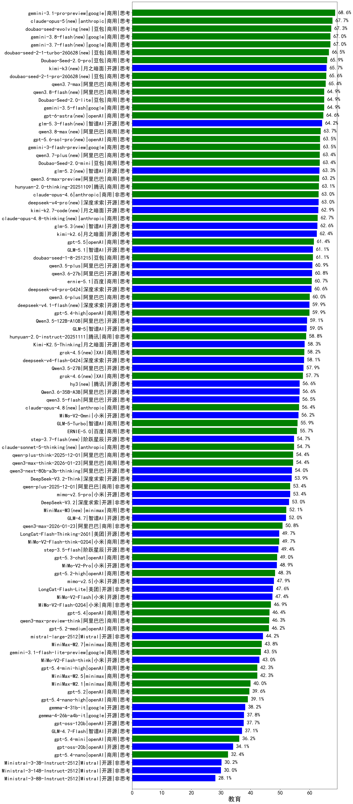

|类别|机构|大模型|【教育】准确率|平均耗时|平均消耗token|花费/千次（元）|排名（准确率）|
|---|---|-----|-------------------|-------|-----------|-----------|-----------|
|商用|google|gemini-3-pro-preview(new)|64.8%|60s|3497|288.0|1|
|商用|豆包|doubao-seed-1-6-thinking-250715|64.4%|22s|1565|11.6|2|
|商用|google|gemini-3-flash-preview(new)|63.5%|78s|2768|56.5|3|
|商用|豆包|doubao-seed-1-6-251015|63.3%|62s|1266|9.0|4|
|商用|腾讯|hunyuan-2.0-thinking-20251109|63.1%|42s|2137|8.2|5|
|商用|豆包|doubao-seed-1-8-251215(new)|61.1%|32s|994|6.7|6|
|商用|anthropic|claude-opus-4.5(new)|60.6%|18s|969|143.6|7|
|商用|豆包|doubao-seed-1-6-lite-251015|60.2%|87s|1264|2.7|8|
|开源|豆包|Seed-OSS-36B-Instruct|59.8%|181s|2215|8.5|9|
|商用|百度|ERNIE-4.5-Turbo-32K|59.1%|89s|677|1.9|10|
|商用|腾讯|hunyuan-t1-20250711|58.9%|83s|2076|7.6|11|
|商用|腾讯|hunyuan-2.0-instruct-20251111|58.8%|25s|812|1.4|12|
|商用|百度|ERNIE-X1.1-Preview|58.8%|176s|2422|9.3|13|
|商用|豆包|doubao-seed-1-6-250615|58.8%|107s|458|2.5|14|
|开源|百度|ERNIE-4.5-300B-A47B|58.2%|219s|642|4.3|15|
|商用|阿里巴巴|qwen-plus-think-2025-07-28|58.2%|/|2785|21.2|16|
|开源|阿里巴巴|qwen3-235b-a22b-thinking-2507|57.2%|139s|2905|52.4|17|
|商用|百度|ERNIE-5.0(new)|55.7%|242s|3891|91.2|18|
|商用|腾讯|hunyuan-turbos-20250926|55.2%|17s|843|1.5|19|
|商用|豆包|doubao-seed-1-6-flash-thinking-250615|54.9%|18s|1157|1.5|20|
|商用|anthropic|claude-sonnet-4.5-thinking|54.9%|48s|3542|365.0|21|
|商用|阿里巴巴|qwen-plus-think-2025-12-01(new)|54.4%|97s|3969|30.7|22|
|商用|阿里巴巴|qwen3-max-think-2026-01-23(new)|54.4%|314s|5134|50.3|23|
|商用|阿里巴巴|qwen3-max-preview|54.2%|58s|762|15.6|24|
|开源|阿里巴巴|qwen3-next-80b-a3b-thinking|54.0%|160s|4814|18.8|25|
|开源|深度求索|DeepSeek-V3.2-Think(new)|53.9%|181s|2588|7.6|26|
|商用|阿里巴巴|qwen-plus-2025-12-01(new)|53.4%|38s|1653|3.1|27|
|商用|科大讯飞|xunfei-spark-x1-0725|53.3%|/|1846|21.8|28|
|商用|豆包|doubao-seed-1-6-flash-250615|53.2%|6s|516|0.6|29|
|开源|深度求索|DeepSeek-V3.2-Exp|53.2%|124s|530|1.5|30|
|开源|深度求索|DeepSeek-V3.2(new)|53.0%|78s|747|2.1|31|
|商用|百度|ERNIE-X1-Turbo-32K|52.2%|191s|2184|8.4|32|
|开源|腾讯|Hunyuan-A13B-Instruct|52.1%|200s|1434|5.4|33|
|开源|智谱AI|GLM-4.7(new)|52.0%|100s|3605|49.0|34|
|开源|阿里巴巴|qwen3-235b-a22b-instruct-2507|51.0%|62s|958|6.8|35|
|商用|阿里巴巴|qwen3-max-2025-09-23|51.0%|197s|1258|27.7|36|
|商用|openAI|gpt-5-2025-08-07|51.0%|75s|598|34.2|37|
|商用|阿里巴巴|qwen3-max-2026-01-23(new)|50.8%|117s|1294|11.9|38|
|商用|阿里巴巴|qwen-plus-2025-07-28|50.8%|64s|937|1.7|39|
|商用|百度|ERNIE-5.0-Thinking-Preview|50.4%|373s|3303|77.1|40|
|开源|深度求索|DeepSeek-V3.2-Exp-Think|50.4%|173s|1531|4.5|41|
|开源|深度求索|DeepSeek-V3.1-Think|50.4%|69s|1464|16.6|42|
|开源|阿里巴巴|Qwen3-30B-A3B-Thinking-2507|50.0%|123s|2778|7.5|43|
|开源|阿里巴巴|qwen3-next-80b-a3b-instruct|49.7%|49s|949|3.4|44|
|商用|豆包|Doubao-1.5-lite-32k-250115|49.6%|20s|350|0.2|45|
|商用|google|gemini-2.5-pro|49.1%|55s|2890|200.8|46|
|商用|anthropic|claude-sonnet-4.5(new)|48.8%|12s|752|64.2|47|
|商用|openAI|gpt-5.1-high|48.5%|101s|2957|200.3|48|
|开源|深度求索|DeepSeek-V3.1|48.4%|24s|567|5.8|49|
|商用|openAI|gpt-5.2-high(new)|48.3%|25s|1132|99.0|50|
|商用|openAI|gpt-5.1-medium|47.7%|141s|1366|87.4|51|
|开源|小米|MiMo-V2-Flash(new)|47.4%|58s|1391|0.0|52|
|开源|美团|LongCat-Flash-Thinking-2601(new)|47.3%|386s|5190|0.0|53|
|开源|智谱AI|GLM-4.6|46.9%|64s|3079|41.6|54|
|商用|阿里巴巴|qwen-flash-think-2025-07-28|46.7%|74s|2765|4.0|55|
|开源|阿里巴巴|Qwen3-32B|46.6%|147s|3599|14.0|56|
|商用|anthropic|claude-4-sonnet|46.4%|36s|621|52.0|57|
|商用|阿里巴巴|qwen3-max-preview-think(new)|46.3%|194s|3850|89.8|58|
|商用|openAI|gpt-5.2-medium(new)|46.2%|18s|857|71.7|59|
|开源|月之暗面|Kimi-K2-Thinking|45.6%|412s|6925|109.3|60|
|开源|月之暗面|kimi-k2-0711-preview|45.5%|67s|835|11.9|61|
|开源|百度|ERNIE-4.5-21B-A3B|45.5%|116s|700|0.2|62|
|开源|智谱AI|GLM-4.5-nothink|45.2%|92s|1414|18.3|63|
|开源|腾讯|Hunyuan-A13B-Instruct-nothink|44.4%|288s|560|1.8|64|
|开源|月之暗面|kimi-k2-0905|44.3%|118s|1003|14.3|65|
|开源|Mistral|mistral-large-2512(new)|44.2%|17s|859|7.9|66|
|开源|阿里巴巴|Qwen3-14B|43.0%|184s|6107|12.0|67|
|商用|阿里巴巴|qwen-flash-2025-07-28|43.0%|53s|996|1.3|68|
|开源|小米|MiMo-V2-Flash-think(new)|43.0%|102s|4102|0.0|69|
|开源|深度求索|DeepSeek-R1-0528|42.5%|211s|2757|42.7|70|
|商用|阿里巴巴|qwen-turbo-think-2025-07-15|42.3%|/|3063|8.8|71|
|商用|openAI|o4-mini|42.1%|33s|1042|29.9|72|
|商用|XAI|grok-4-0709|41.9%|278s|2586|270.0|73|
|商用|anthropic|claude-4-sonnet-thinking|41.7%|48s|1161|110.6|74|
|开源|阿里巴巴|Qwen3-30B-A3B-Instruct-2507|41.5%|62s|978|2.6|75|
|商用|阿里巴巴|qwen-turbo-2025-07-15|41.4%|54s|649|0.3|76|
|开源|智谱AI|GLM-4.5|41.2%|90s|2804|37.7|77|
|商用|anthropic|claude-haiku-4.5-thinking|40.2%|56s|5464|190.9|78|
|商用|openAI|gpt-5-mini-2025-08-07|40.0%|70s|1158|14.9|79|
|商用|minimax|MiniMax-M2.1(new)|40.0%|124s|3478|28.2|80|
|商用|XAI|grok-4-1-fast-reasoning|39.6%|80s|2432|8.0|81|
|商用|openAI|gpt-5.2(new)|39.6%|7s|382|24.5|82|
|商用|百川智能|Baichuan4-Turbo|39.2%|/|/|/|83|
|商用|智谱AI|GLM-4.5-Flash-nothink|39.1%|39s|1635|0.0|84|
|商用|360|360zhinao2-o1|38.7%|/|/|/|85|
|开源|openAI|gpt-oss-120b|37.7%|98s|1020|2.8|86|
|开源|智谱AI|GLM-4.7-Flash(new)|37.1%|1613s|7422|0.0|87|
|开源|智谱AI|GLM-4.5-Air-nothink|37.1%|68s|1847|10.4|88|
|开源|meta|Llama-4-Maverick-17B-128E-Instruct-FP8|36.9%|37s|649|2.5|89|
|商用|XAI|grok-3-mini|36.7%|187s|1394|4.9|90|
|商用|百川智能|Baichuan4-Air|36.4%|/|/|/|91|
|商用|Mistral|mistral-medium-2508|36.4%|86s|660|7.5|92|
|开源|minimax|MiniMax-M1|36.3%|245s|4495|33.6|93|
|开源|meta|Llama-4-Scout-17B-16E-Instruct|36.0%|46s|608|1.1|94|
|商用|google|gemini-2.5-flash|36.0%|46s|2440|42.0|95|
|商用|阿里巴巴|qwen-long-2025-01-25|35.8%|37s|497|0.8|96|
|商用|anthropic|claude-haiku-4.5|35.8%|14s|781|22.0|97|
|商用|openAI|gpt-5.1|35.7%|127s|458|22.9|98|
|开源|深度求索|DeepSeek-R1-0528-Qwen3-8B|35.7%|299s|2813|0.0|99|
|商用|openAI|gpt-5-mini-high|35.4%|349s|3165|43.9|100|
|开源|阿里巴巴|Qwen3-32B-nothink|35.3%|85s|724|2.5|101|
|开源|智谱AI|GLM-4.5-Air|35.0%|92s|2972|17.1|102|
|开源|阿里巴巴|Qwen3-8B|35.0%|423s|9818|0.0|103|
|开源|阶跃星辰|step-3|34.7%|185s|3035|11.8|104|
|开源|Mistral|Magistral-Small-2507|34.4%|158s|6207|66.2|105|
|开源|openAI|gpt-oss-20b|34.1%|113s|1805|1.9|106|
|开源|minimax|MiniMax-M2|34.1%|81s|3497|28.4|107|
|商用|openAI|gpt-5-nano-high|33.9%|435s|6742|19.2|108|
|开源|阿里巴巴|Qwen3-4B|33.1%|127s|3231|9.3|109|
|开源|Mistral|Mistral-Small-3.2-24B-Instruct-2506|31.0%|98s|961|1.8|110|
|商用|google|gemini-2.5-flash-lite|30.9%|39s|2252|6.2|111|
|开源|智谱AI|GLM-4-9B-0414|30.8%|28s|539|0.0|112|
|开源|阿里巴巴|Qwen3-1.7B|30.5%|102s|3623|10.5|113|
|开源|阿里巴巴|Qwen3-4B-nothink|30.4%|60s|659|1.6|114|
|开源|Mistral|Ministral-3-3B-Instruct-2512(new)|30.2%|16s|2166|1.5|115|
|开源|Mistral|Ministral-3-14B-Instruct-2512(new)|30.0%|19s|1765|2.5|116|
|开源|minimax|MiniMax-Text-01|30.0%|34s|953|6.9|117|
|商用|智谱AI|GLM-4.5-Flash|29.6%|60s|2773|0.0|118|
|开源|google|gemma-3-27b-it|29.6%|/|/|/|119|
|商用|openAI|gpt-5-nano-2025-08-07|29.6%|87s|2609|7.2|120|
|开源|Mistral|Ministral-3-8B-Instruct-2512(new)|28.1%|17s|1865|2.0|121|
|开源|google|gemma-3-4b-it|28.1%|/|/|/|122|
|开源|阿里巴巴|Qwen3-1.7B-nothink|27.6%|70s|668|1.6|123|
|商用|百度|ERNIE-Lite-8K|27.0%|/|/|/|124|
|开源|阿里巴巴|Qwen3-0.6B-nothink|26.9%|62s|392|0.8|125|
|开源|阿里巴巴|Qwen3-14B-nothink|26.9%|45s|773|1.3|126|
|商用|XAI|grok-4-1-fast-non-reasoning|25.9%|66s|625|1.6|127|
|开源|google|gemma-3-12b-it|22.1%|/|/|/|128|
|开源|阿里巴巴|Qwen3-0.6B|21.0%|67s|2515|7.2|129|
|开源|阿里巴巴|Qwen3-8B-nothink|20.3%|35s|712|0.0|130|
|开源|百度|ERNIE-4.5-0.3B|14.7%|119s|517|0.0|131|

