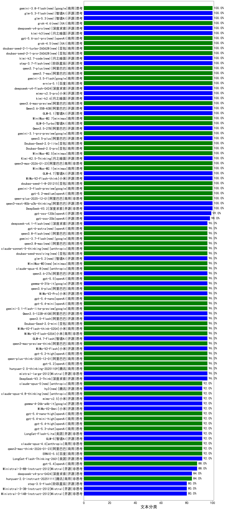

|类别|机构|大模型|【文本分类】准确率|平均耗时|平均消耗token|花费/千次（元）|排名（准确率）|
|---|---|-----|-------------------|-------|-----------|-----------|-----------|
|开源|月之暗面|kimi-k3(new)|100.0%|67s|1332|123.3|1|
|开源|深度求索|DeepSeek-V3.2|100.0%|77s|264|0.8|2|
|商用|阿里巴巴|qwen3.7-plus(new)|100.0%|15s|749|5.7|3|
|开源|豆包|Seed-OSS-36B-Instruct|100.0%|126s|902|3.5|4|
|商用|阿里巴巴|qwen3-max-2026-01-23|100.0%|26s|214|1.8|5|
|商用|阿里巴巴|qwen3.7-max(new)|100.0%|18s|925|32.1|6|
|商用|google|gemini-3.5-flash(new)|100.0%|6s|934|56.2|7|
|商用|百度|ernie-5.1(new)|100.0%|41s|523|8.7|8|
|开源|深度求索|deepseek-v4-flash(new)|100.0%|29s|1533|3.0|9|
|开源|小米|mimo-v2.5-pro(new)|100.0%|12s|860|13.9|10|
|开源|月之暗面|kimi-k2.6(new)|100.0%|48s|765|19.7|11|
|商用|阿里巴巴|qwen3.6-max-preview|100.0%|31s|1006|52.1|12|
|开源|阿里巴巴|Qwen3.6-35B-A3B|100.0%|7s|1038|10.8|13|
|开源|智谱AI|GLM-5.1|100.0%|113s|733|16.8|14|
|商用|阿里巴巴|qwen3-max-2025-09-23|100.0%|192s|205|4.0|15|
|商用|minimax|MiniMax-M2.7|100.0%|19s|673|5.2|16|
|开源|阿里巴巴|qwen3-next-80b-a3b-thinking|100.0%|138s|2153|8.4|17|
|开源|深度求索|DeepSeek-V3.1|100.0%|21s|236|2.5|18|
|商用|智谱AI|GLM-5-Turbo|100.0%|14s|753|15.8|19|
|开源|阿里巴巴|Qwen3.5-27B|100.0%|336s|2400|11.3|20|
|商用|google|gemini-3.1-pro-preview|100.0%|62s|1024|83.7|21|
|开源|阿里巴巴|qwen3.5-plus|100.0%|26s|2078|9.8|22|
|商用|阿里巴巴|qwen-plus-2025-12-01|100.0%|15s|487|0.9|23|
|商用|豆包|Doubao-Seed-2.0-lite|100.0%|130s|653|2.1|24|
|商用|openAI|gpt-5.2-medium|100.0%|6s|157|10.1|25|
|商用|google|gemini-3-flash-preview|100.0%|107s|750|15.1|26|
|商用|豆包|doubao-seed-1-8-251215|100.0%|16s|371|2.3|27|
|商用|豆包|Doubao-Seed-2.0-pro|100.0%|193s|880|12.9|28|
|开源|小米|MiMo-V2-Flash-think|100.0%|23s|1647|0.0|29|
|开源|智谱AI|GLM-4.7|100.0%|38s|1361|18.5|30|
|商用|minimax|MiniMax-M2.1|100.0%|70s|706|5.4|31|
|商用|minimax|MiniMax-M2.5|100.0%|12s|618|4.7|32|
|开源|阶跃星辰|step-3.7-flash(new)|100.0%|18s|1061|8.2|33|
|开源|月之暗面|Kimi-K2.5-Thinking|100.0%|162s|879|17.7|34|
|商用|豆包|doubao-seed-2-1-turbo-260628(new)|100.0%|70s|2190|31.7|35|
|开源|月之暗面|kimi-k2.7-code(new)|100.0%|16s|689|17.7|36|
|商用|openAI|gpt-5.6-sol-pro(new)|100.0%|7s|2407|152.3|37|
|开源|阿里巴巴|Qwen3-32B|100.0%|18s|640|2.4|38|
|商用|XAI|grok-4.5(new)|100.0%|38s|964|33.4|39|
|商用|百度|ERNIE-X1-Turbo-32K|100.0%|40s|944|3.7|40|
|商用|google|gemini-2.5-pro|100.0%|47s|1711|121.3|41|
|商用|腾讯|hunyuan-t1-20250711|100.0%|13s|771|2.8|42|
|商用|阿里巴巴|qwen-turbo-2025-07-15|100.0%|4s|154|0.1|43|
|开源|阿里巴巴|qwen3-235b-a22b-instruct-2507|100.0%|4s|219|1.5|44|
|开源|阿里巴巴|qwen3-235b-a22b-thinking-2507|100.0%|81s|1979|38.7|45|
|商用|豆包|doubao-seed-2-1-pro-260628(new)|100.0%|311s|5210|154.1|46|
|开源|阿里巴巴|Qwen3-30B-A3B-Instruct-2507|99.0%|2s|221|0.6|47|
|商用|百度|ERNIE-4.5-Turbo-32K|99.0%|5s|147|0.4|48|
|开源|阿里巴巴|Qwen3-14B-nothink|99.0%|15s|283|0.5|49|
|商用|阿里巴巴|qwen-flash-2025-07-28|99.0%|4s|227|0.3|50|
|商用|腾讯|hunyuan-turbos-20250926|99.0%|3s|174|0.3|51|
|开源|openAI|gpt-oss-120b|99.0%|2s|478|1.3|52|
|商用|anthropic|claude-4-sonnet-thinking|98.0%|59s|280|22.6|53|
|商用|google|gemini-2.5-flash|98.0%|9s|1197|21.0|54|
|开源|阿里巴巴|Qwen3-8B|98.0%|13s|257|0.0|55|
|商用|豆包|doubao-seed-1-6-251015|98.0%|51s|399|2.7|56|
|开源|阿里巴巴|Qwen3-14B|98.0%|17s|215|0.4|57|
|开源|openAI|gpt-oss-20b|98.0%|3s|584|0.6|58|
|商用|阿里巴巴|qwen-flash-think-2025-07-28|98.0%|17s|1633|2.4|59|
|开源|阿里巴巴|Qwen3-32B-nothink|98.0%|15s|282|1.0|60|
|开源|阿里巴巴|qwen3-next-80b-a3b-instruct|98.0%|10s|296|1.0|61|
|开源|深度求索|DeepSeek-R1-0528|97.0%|202s|1266|19.8|62|
|商用|智谱AI|GLM-4.5-Flash-nothink|97.0%|11s|402|0.0|63|
|商用|openAI|gpt-5-mini-2025-08-07|97.0%|16s|524|6.9|64|
|商用|豆包|doubao-seed-1-6-lite-251015|97.0%|7s|391|0.8|65|
|开源|阿里巴巴|Qwen3-8B-nothink|97.0%|15s|270|0.0|66|
|开源|智谱AI|GLM-4.5-Air-nothink|97.0%|7s|392|2.1|67|
|开源|阿里巴巴|Qwen3-30B-A3B-Thinking-2507|97.0%|42s|1643|4.5|68|
|开源|智谱AI|GLM-4.5-Air|97.0%|26s|1178|6.8|69|
|商用|anthropic|claude-sonnet-5-thinking(new)|96.0%|15s|535|32.5|70|
|开源|智谱AI|glm-5.2(new)|96.0%|20s|889|23.8|71|
|商用|minimax|MiniMax-M3(new)|96.0%|23s|692|8.9|72|
|商用|小米|MiMo-V2-Flash-think-0204|96.0%|1037s|1991|4.1|73|
|商用|小米|MiMo-V2-Flash-0204|96.0%|219s|340|0.6|74|
|商用|anthropic|claude-opus-4.8(new)|96.0%|8s|407|59.0|75|
|商用|openAI|gpt-5.5(new)|96.0%|18s|229|37.0|76|
|商用|豆包|Doubao-Seed-2.0-mini|96.0%|37s|858|1.5|77|
|商用|豆包|doubao-seed-evolving(new)|96.0%|243s|5421|160.4|78|
|开源|阿里巴巴|qwen3.5-flash|96.0%|113s|1978|3.9|79|
|开源|阿里巴巴|qwen3.6-27b(new)|96.0%|25s|1290|22.5|80|
|商用|google|gemini-3.1-flash-lite-preview|96.0%|4s|161|1.3|81|
|商用|openAI|gpt-5.4-mini|96.0%|7s|133|2.6|82|
|商用|openAI|gpt-5.4-nano|96.0%|39s|132|0.7|83|
|开源|小米|MiMo-V2-Pro|96.0%|10s|768|12.0|84|
|商用|阿里巴巴|qwen3.6-plus|96.0%|46s|1274|14.8|85|
|开源|google|gemma-4-31b-it|96.0%|28s|136|0.3|86|
|开源|阿里巴巴|Qwen3.5-122B-A10B|96.0%|296s|1960|12.3|87|
|商用|阿里巴巴|qwen-plus-think-2025-12-01|96.0%|37s|1854|14.5|88|
|商用|openAI|gpt-5.1-high|96.0%|116s|322|19.0|89|
|开源|Mistral|mistral-large-2512|96.0%|10s|345|3.2|90|
|商用|阿里巴巴|qwen-turbo-think-2025-07-15|96.0%|/|1016|2.9|91|
|商用|anthropic|claude-sonnet-4.5|96.0%|5s|333|28.4|92|
|商用|anthropic|claude-haiku-4.5-thinking|96.0%|33s|816|25.7|93|
|商用|XAI|grok-4-1-fast-reasoning|96.0%|7s|724|2.1|94|
|商用|腾讯|hunyuan-2.0-thinking-20251109|96.0%|14s|800|3.1|95|
|商用|openAI|gpt-5.2|96.0%|3s|150|9.4|96|
|商用|openAI|gpt-5-2025-08-07|96.0%|18s|325|20.5|97|
|商用|openAI|gpt-5.2-high|96.0%|6s|212|15.6|98|
|开源|小米|MiMo-V2-Flash|96.0%|99s|286|0.0|99|
|商用|阿里巴巴|qwen3-max-preview-think|96.0%|52s|1721|40.3|100|
|开源|智谱AI|GLM-4.7-Flash|96.0%|189s|1140|0.0|101|
|商用|openAI|gpt-5-mini-high|96.0%|557s|1023|14.0|102|
|商用|anthropic|claude-opus-4.5|96.0%|23s|391|56.8|103|
|商用|XAI|grok-4-1-fast-non-reasoning|96.0%|80s|319|0.7|104|
|商用|百度|ERNIE-5.0-Thinking-Preview|96.0%|179s|776|17.9|105|
|开源|阿里巴巴|Qwen3-4B|96.0%|8s|777|2.2|106|
|开源|深度求索|DeepSeek-V3.2-Think|96.0%|165s|1255|3.7|107|
|商用|阿里巴巴|qwen3-max-preview|95.0%|4s|216|4.3|108|
|开源|深度求索|DeepSeek-V3.1-Think|94.0%|39s|728|8.4|109|
|商用|智谱AI|GLM-4.5-Flash|94.0%|31s|1335|0.0|110|
|开源|阿里巴巴|Qwen3-4B-nothink|94.0%|12s|261|0.6|111|
|商用|openAI|o4-mini|94.0%|31s|510|14.9|112|
|商用|openAI|gpt-5.1|92.0%|102s|124|4.9|113|
|开源|月之暗面|Kimi-K2-Thinking|92.0%|57s|772|11.8|114|
|商用|openAI|gpt-5.1-medium|92.0%|57s|216|11.4|115|
|商用|anthropic|claude-opus-4.8-thinking(new)|92.0%|7s|479|71.5|116|
|商用|openAI|gpt-5-nano-2025-08-07|92.0%|27s|853|2.3|117|
|开源|腾讯|hy3(new)|92.0%|19s|179|0.6|118|
|开源|小米|mimo-v2.5(new)|92.0%|14s|1078|11.8|119|
|开源|月之暗面|kimi-k2-0905|92.0%|61s|282|3.7|120|
|商用|阿里巴巴|qwen3-max-think-2026-01-23|92.0%|107s|2913|28.7|121|
|商用|百度|ERNIE-X1.1-Preview|92.0%|131s|621|2.4|122|
|商用|anthropic|claude-sonnet-4.5-thinking|92.0%|9s|641|59.3|123|
|开源|google|gemma-4-26b-a4b-it|92.0%|9s|178|0.4|124|
|商用|百度|ERNIE-5.0|92.0%|61s|1059|24.7|125|
|开源|小米|MiMo-V2-Omni|92.0%|362s|946|10.0|126|
|商用|openAI|gpt-5.4-nano-high|92.0%|11s|199|1.3|127|
|商用|anthropic|claude-opus-4.6|92.0%|8s|353|49.1|128|
|开源|智谱AI|GLM-5|92.0%|49s|1248|21.8|129|
|开源|美团|LongCat-Flash-Thinking-2601|92.0%|137s|1734|0.0|130|
|商用|openAI|gpt-5.4-mini-high|92.0%|27s|501|14.1|131|
|商用|openAI|gpt-5.4-high|92.0%|7s|336|29.8|132|
|开源|美团|LongCat-Flash-Lite|92.0%|46s|186|0.0|133|
|商用|openAI|gpt-5.3-chat|92.0%|36s|142|8.5|134|
|商用|百川智能|Baichuan4-Turbo|91.0%|/|/|/|135|
|商用|anthropic|claude-4-sonnet|90.0%|35s|318|27.2|136|
|商用|google|gemini-2.5-flash-lite|89.0%|1s|259|0.7|137|
|开源|Mistral|Ministral-3-8B-Instruct-2512|88.0%|11s|229|0.2|138|
|商用|openAI|gpt-5.4|88.0%|4s|174|12.7|139|
|商用|openAI|gpt-5-nano-high|88.0%|82s|2474|7.0|140|
|开源|智谱AI|GLM-4-9B-0414|88.0%|3s|200|0|141|
|商用|腾讯|hunyuan-2.0-instruct-20251111|84.0%|12s|328|0.6|142|
|开源|meta|Llama-4-Scout-17B-16E-Instruct|84.0%|3s|210|0.4|143|
|商用|anthropic|claude-haiku-4.5|84.0%|5s|377|10.6|144|
|开源|深度求索|deepseek-v4-pro(new)|84.0%|11s|405|9.2|145|
|开源|Mistral|Ministral-3-14B-Instruct-2512|80.0%|9s|433|0.6|146|
|开源|Mistral|Ministral-3-3B-Instruct-2512|80.0%|12s|274|0.2|147|
|开源|阶跃星辰|step-3.5-flash|80.0%|15s|1253|2.6|148|

