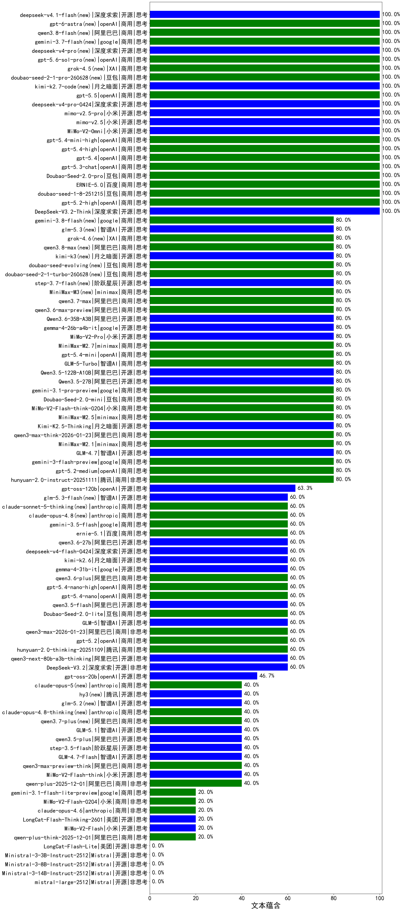

|类别|机构|大模型|【文本蕴含】准确率|平均耗时|平均消耗token|花费/千次（元）|排名（准确率）|
|---|---|-----|-------------------|-------|-----------|-----------|-----------|
|商用|openAI|gpt-5.4|100.0%|6s|275|22.6|1|
|开源|小米|mimo-v2.5-pro|100.0%|23s|1402|25.2|2|
|商用|豆包|doubao-seed-1-8-251215|100.0%|18s|654|4.5|3|
|商用|XAI|grok-4.5(new)|100.0%|112s|1535|57.1|4|
|开源|小米|mimo-v2.5|100.0%|25s|1646|19.7|5|
|商用|openAI|gpt-5.6-sol-pro(new)|100.0%|11s|2558|163.3|6|
|商用|openAI|gpt-5.4-mini-high|100.0%|20s|446|12.2|7|
|商用|openAI|gpt-5.4-high|100.0%|7s|452|41.1|8|
|商用|豆包|doubao-seed-2-1-pro-260628(new)|100.0%|578s|13477|402.0|9|
|商用|openAI|gpt-5.2-high|100.0%|10s|485|42.0|10|
|开源|月之暗面|kimi-k2.7-code(new)|100.0%|11s|321|7.6|11|
|商用|百度|ERNIE-5.0|100.0%|110s|2165|51.1|12|
|开源|深度求索|deepseek-v4-pro-0424|100.0%|33s|1025|24.0|13|
|开源|深度求索|deepseek-v4-pro(new)|100.0%|25s|994|24.5|14|
|商用|openAI|gpt-5.5|100.0%|5s|271|44.2|15|
|商用|豆包|Doubao-Seed-2.0-pro|100.0%|347s|1493|22.6|16|
|商用|google|gemini-3.7-flash(new)|100.0%|4s|464|11.0|17|
|商用|openAI|gpt-5.3-chat|100.0%|7s|386|31.7|18|
|开源|小米|MiMo-V2-Omni|100.0%|494s|1297|14.8|19|
|商用|阿里巴巴|qwen3.8-flash(new)|100.0%|20s|592|1.4|20|
|开源|深度求索|DeepSeek-V3.2-Think|100.0%|183s|1119|3.3|21|
|商用|openAI|gpt-5.1-high|100.0%|119s|454|27.8|22|
|商用|豆包|doubao-seed-1-6-251015|83.3%|44s|680|4.9|23|
|商用|google|gemini-3.1-pro-preview|80.0%|25s|1143|93.3|24|
|商用|openAI|gpt-5.2-medium|80.0%|9s|335|27.0|25|
|商用|腾讯|hunyuan-2.0-instruct-20251111|80.0%|6s|388|0.7|26|
|开源|智谱AI|GLM-4.7|80.0%|58s|2709|37.3|27|
|商用|google|gemini-3-flash-preview|80.0%|104s|1212|24.8|28|
|商用|minimax|MiniMax-M2.1|80.0%|83s|2333|19.0|29|
|商用|阿里巴巴|qwen3.6-max-preview|80.0%|47s|1456|76.1|30|
|开源|阿里巴巴|Qwen3.6-35B-A3B|80.0%|9s|1568|16.4|31|
|开源|google|gemma-4-26b-a4b-it|80.0%|15s|468|1.2|32|
|商用|豆包|Doubao-Seed-2.0-mini|80.0%|677s|2949|5.7|33|
|商用|阿里巴巴|qwen3-max-think-2026-01-23|80.0%|127s|3511|34.7|34|
|开源|月之暗面|Kimi-K2.5-Thinking|80.0%|453s|2248|46.3|35|
|开源|小米|MiMo-V2-Pro|80.0%|342s|1345|24.1|36|
|商用|minimax|MiniMax-M2.5|80.0%|30s|1526|12.3|37|
|商用|openAI|gpt-5.4-mini|80.0%|10s|192|4.2|38|
|商用|openAI|gpt-5-nano-high|80.0%|68s|2757|7.8|39|
|开源|阿里巴巴|Qwen3.5-27B|80.0%|370s|3483|16.5|40|
|商用|智谱AI|GLM-5-Turbo|80.0%|26s|960|20.2|41|
|开源|智谱AI|glm-5.3(new)|80.0%|166s|5429|150.8|42|
|商用|XAI|grok-4.6(new)|80.0%|30s|1550|57.8|43|
|商用|阿里巴巴|qwen3.8-max(new)|80.0%|59s|2365|82.9|44|
|开源|月之暗面|Kimi-K2-Thinking|80.0%|102s|1514|23.6|45|
|商用|openAI|gpt-5.1|80.0%|66s|219|11.1|46|
|商用|阿里巴巴|qwen3.7-max|80.0%|20s|879|30.3|47|
|开源|月之暗面|kimi-k3(new)|80.0%|43s|1110|100.5|48|
|商用|XAI|grok-4-1-fast-reasoning|80.0%|10s|972|3.0|49|
|商用|openAI|gpt-5.1-medium|80.0%|173s|326|18.6|50|
|商用|豆包|doubao-seed-evolving(new)|80.0%|330s|12189|363.4|51|
|商用|豆包|doubao-seed-2-1-turbo-260628(new)|80.0%|265s|10255|152.7|52|
|商用|百度|ERNIE-5.0-Thinking-Preview|80.0%|301s|1192|27.7|53|
|开源|阶跃星辰|step-3.7-flash(new)|80.0%|28s|2980|23.7|54|
|商用|openAI|gpt-5-mini-high|80.0%|106s|1001|13.6|55|
|商用|小米|MiMo-V2-Flash-think-0204|80.0%|478s|1661|3.4|56|
|商用|minimax|MiniMax-M3(new)|80.0%|28s|797|10.6|57|
|开源|阿里巴巴|Qwen3.5-122B-A10B|80.0%|253s|3702|23.4|58|
|商用|minimax|MiniMax-M2.7|80.0%|38s|1428|11.4|59|
|商用|openAI|gpt-5-mini-2025-08-07|76.7%|296s|504|6.4|60|
|商用|openAI|gpt-5-2025-08-07|76.7%|278s|377|23.3|61|
|开源|豆包|Seed-OSS-36B-Instruct|73.3%|384s|1187|4.6|62|
|商用|豆包|doubao-seed-1-6-lite-251015|70.0%|114s|770|1.7|63|
|商用|腾讯|hunyuan-turbos-20250926|70.0%|11s|453|0.8|64|
|开源|阿里巴巴|qwen3-next-80b-a3b-instruct|70.0%|314s|470|1.7|65|
|开源|深度求索|DeepSeek-V3.1-Think|70.0%|47s|920|10.6|66|
|开源|openAI|gpt-oss-120b|63.3%|240s|450|1.1|67|
|商用|阿里巴巴|qwen-flash-think-2025-07-28|63.3%|293s|2712|4.0|68|
|商用|openAI|gpt-5.4-nano-high|60.0%|12s|277|1.9|69|
|商用|阿里巴巴|qwen3.6-plus|60.0%|29s|1512|17.6|70|
|商用|openAI|gpt-5.4-nano|60.0%|6s|185|1.1|71|
|开源|google|gemma-4-31b-it|60.0%|38s|364|0.9|72|
|开源|月之暗面|kimi-k2.6|60.0%|69s|1219|31.8|73|
|开源|深度求索|deepseek-v4-flash-0424|60.0%|28s|1111|2.2|74|
|开源|阿里巴巴|qwen3.6-27b|60.0%|27s|1584|27.6|75|
|商用|google|gemini-3.5-flash|60.0%|13s|1638|100.2|76|
|商用|anthropic|claude-opus-4.8(new)|60.0%|6s|387|54.2|77|
|商用|anthropic|claude-sonnet-5-thinking(new)|60.0%|11s|545|32.8|78|
|商用|百度|ernie-5.1|60.0%|23s|915|15.6|79|
|开源|智谱AI|GLM-5|60.0%|64s|2201|38.9|80|
|开源|智谱AI|glm-5.3-flash(new)|60.0%|94s|1513|4.1|81|
|商用|阿里巴巴|qwen3-max-2026-01-23|60.0%|121s|456|4.1|82|
|开源|深度求索|DeepSeek-V3.2|60.0%|82s|435|1.3|83|
|开源|阿里巴巴|qwen3-next-80b-a3b-thinking|60.0%|176s|3925|15.5|84|
|开源|阿里巴巴|qwen3.5-flash|60.0%|474s|5778|11.5|85|
|商用|腾讯|hunyuan-2.0-thinking-20251109|60.0%|27s|2179|8.6|86|
|商用|openAI|gpt-5.2|60.0%|5s|226|16.2|87|
|商用|openAI|gpt-5-nano-2025-08-07|60.0%|27s|1205|3.3|88|
|商用|豆包|Doubao-Seed-2.0-lite|60.0%|255s|1141|3.8|89|
|商用|阿里巴巴|qwen-turbo-think-2025-07-15|56.7%|857s|1542|4.5|90|
|商用|阿里巴巴|qwen-flash-2025-07-28|53.3%|285s|516|0.7|91|
|商用|阿里巴巴|qwen3-max-preview|50.0%|18s|350|7.4|92|
|开源|openAI|gpt-oss-20b|46.7%|238s|613|0.6|93|
|开源|深度求索|DeepSeek-V3.1|43.3%|16s|298|3.2|94|
|开源|月之暗面|kimi-k2-0905|40.0%|53s|182|2.0|95|
|商用|anthropic|claude-sonnet-4.5|40.0%|15s|492|44.9|96|
|商用|anthropic|claude-sonnet-4.5-thinking|40.0%|28s|1834|188.4|97|
|商用|百度|ERNIE-X1.1-Preview|40.0%|124s|516|1.9|98|
|开源|智谱AI|glm-5.2(new)|40.0%|34s|1092|29.4|99|
|商用|anthropic|claude-opus-4.5|40.0%|16s|498|74.7|100|
|商用|anthropic|claude-opus-4.8-thinking(new)|40.0%|11s|695|108.2|101|
|商用|阿里巴巴|qwen3-max-2025-09-23|40.0%|14s|344|7.2|102|
|商用|阿里巴巴|qwen3.7-plus(new)|40.0%|48s|2400|18.9|103|
|开源|阿里巴巴|qwen3.5-plus|40.0%|61s|4680|22.2|104|
|商用|anthropic|claude-haiku-4.5|40.0%|10s|474|13.9|105|
|商用|anthropic|claude-haiku-4.5-thinking|40.0%|38s|2055|70.4|106|
|开源|阶跃星辰|step-3.5-flash|40.0%|21s|3417|7.1|107|
|商用|anthropic|claude-opus-5(new)|40.0%|9s|537|80.4|108|
|商用|XAI|grok-4-1-fast-non-reasoning|40.0%|4s|443|1.1|109|
|商用|阿里巴巴|qwen-plus-2025-12-01|40.0%|18s|808|1.5|110|
|开源|小米|MiMo-V2-Flash-think|40.0%|38s|1826|0.0|111|
|商用|阿里巴巴|qwen3-max-preview-think|40.0%|66s|2360|55.6|112|
|开源|智谱AI|GLM-4.7-Flash|40.0%|429s|3897|0.0|113|
|开源|智谱AI|GLM-5.1|40.0%|114s|1161|26.9|114|
|开源|腾讯|hy3(new)|40.0%|148s|164|0.5|115|
|商用|google|gemini-2.5-flash-lite|30.0%|169s|313|0.8|116|
|商用|google|gemini-3.1-flash-lite-preview|20.0%|2s|282|2.5|117|
|商用|阿里巴巴|qwen-plus-think-2025-12-01|20.0%|43s|2079|16.2|118|
|开源|小米|MiMo-V2-Flash|20.0%|14s|240|0.0|119|
|开源|美团|LongCat-Flash-Thinking-2601|20.0%|246s|2635|0.0|120|
|商用|anthropic|claude-opus-4.6|20.0%|18s|442|63.6|121|
|商用|小米|MiMo-V2-Flash-0204|20.0%|62s|303|0.5|122|
|开源|Mistral|Ministral-3-14B-Instruct-2512|0.0%|27s|359|0.5|123|
|开源|Mistral|Ministral-3-8B-Instruct-2512|0.0%|2s|345|0.4|124|
|开源|Mistral|Ministral-3-3B-Instruct-2512|0.0%|1s|304|0.2|125|
|开源|美团|LongCat-Flash-Lite|0.0%|163s|210|0.0|126|
|开源|Mistral|mistral-large-2512|0.0%|8s|282|2.5|127|

