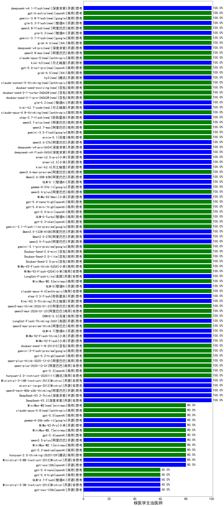

|类别|机构|大模型|【核医学主治医师】准确率|平均耗时|平均消耗token|花费/千次（元）|排名（准确率）|
|---|---|-----|-------------------|-------|-----------|-----------|-----------|
|商用|阿里巴巴|qwen-plus-think-2025-07-28|100.0%|/|1440|11.0|1|
|商用|阿里巴巴|qwen-flash-think-2025-07-28|100.0%|18s|1806|2.6|2|
|开源|深度求索|DeepSeek-V3.2(new)|100.0%|97s|399|1.1|3|
|商用|openAI|gpt-5-nano-high|100.0%|634s|3319|9.4|4|
|商用|阿里巴巴|qwen3-max-2025-09-23|100.0%|19s|485|10.3|5|
|商用|anthropic|claude-opus-4.5(new)|100.0%|25s|759|120.5|6|
|商用|百度|ERNIE-5.0-Thinking-Preview|100.0%|81s|1244|28.8|7|
|商用|百度|ERNIE-X1.1-Preview|100.0%|87s|571|2.1|8|
|商用|anthropic|claude-sonnet-4.5-thinking|100.0%|22s|1447|145.9|9|
|商用|openAI|gpt-5.1-high|100.0%|144s|1463|98.6|10|
|开源|月之暗面|kimi-k2-0905|100.0%|86s|414|5.6|11|
|商用|google|gemini-3-pro-preview(new)|100.0%|64s|1119|90.6|12|
|商用|XAI|grok-4-1-fast-reasoning|100.0%|91s|817|2.4|13|
|商用|anthropic|claude-haiku-4.5-thinking|100.0%|38s|1587|53.3|14|
|商用|openAI|gpt-5.1-medium|100.0%|66s|465|27.7|15|
|开源|月之暗面|Kimi-K2-Thinking|100.0%|98s|1508|23.3|16|
|开源|minimax|MiniMax-M2|100.0%|49s|3454|28.4|17|
|商用|豆包|doubao-seed-1-6-lite-251015|100.0%|35s|691|1.5|18|
|商用|豆包|doubao-seed-1-6-251015|100.0%|6s|654|4.6|19|
|开源|智谱AI|GLM-4.6|100.0%|69s|2136|29.1|20|
|商用|腾讯|hunyuan-turbos-20250926|100.0%|14s|591|1.1|21|
|开源|深度求索|DeepSeek-V3.2-Exp-Think|100.0%|487s|1109|3.3|22|
|开源|深度求索|DeepSeek-V3.2-Exp|100.0%|104s|374|1.1|23|
|开源|阿里巴巴|qwen3-next-80b-a3b-instruct|100.0%|12s|524|1.9|24|
|开源|豆包|Seed-OSS-36B-Instruct|100.0%|53s|1163|4.5|25|
|商用|阿里巴巴|qwen3-max-preview|100.0%|11s|487|10.3|26|
|商用|阿里巴巴|qwen-turbo-think-2025-07-15|100.0%|/|1575|4.5|27|
|商用|阿里巴巴|qwen-plus-2025-07-28|100.0%|13s|516|0.9|28|
|商用|Mistral|mistral-medium-2508|100.0%|18s|437|5.2|29|
|商用|google|gemini-2.5-flash-lite|100.0%|2s|416|1.1|30|
|开源|深度求索|DeepSeek-V3.1-Think|100.0%|39s|780|8.8|31|
|开源|深度求索|DeepSeek-V3.2-Think(new)|100.0%|196s|861|2.5|32|
|开源|阿里巴巴|qwen3-next-80b-a3b-thinking|100.0%|140s|2354|9.2|33|
|开源|Mistral|mistral-large-2512(new)|100.0%|13s|549|5.2|34|
|开源|月之暗面|Kimi-K2.5-Thinking(new)|100.0%|246s|1458|29.5|35|
|开源|阿里巴巴|Qwen3.5-27B(new)|100.0%|103s|2209|10.3|36|
|开源|阿里巴巴|qwen3.5-flash(new)|100.0%|240s|3082|6.0|37|
|商用|google|gemini-3.1-pro-preview(new)|100.0%|30s|1229|99.9|38|
|商用|豆包|Doubao-Seed-2.0-mini(new)|100.0%|168s|1315|2.4|39|
|商用|豆包|Doubao-Seed-2.0-lite(new)|100.0%|143s|727|2.3|40|
|商用|豆包|Doubao-Seed-2.0-pro(new)|100.0%|154s|724|10.2|41|
|商用|小米|MiMo-V2-Flash-think-0204(new)|100.0%|118s|1799|3.7|42|
|商用|小米|MiMo-V2-Flash-0204(new)|100.0%|105s|549|1.0|43|
|开源|美团|LongCat-Flash-Lite(new)|100.0%|332s|554|0.0|44|
|商用|minimax|MiniMax-M2.5(new)|100.0%|23s|1348|10.7|45|
|开源|智谱AI|GLM-5(new)|100.0%|37s|1434|24.9|46|
|商用|anthropic|claude-opus-4.6(new)|100.0%|21s|631|96.0|47|
|开源|阶跃星辰|step-3.5-flash(new)|100.0%|11s|1096|2.2|48|
|商用|阿里巴巴|qwen3-max-think-2026-01-23(new)|100.0%|68s|1912|18.6|49|
|开源|Mistral|Ministral-3-14B-Instruct-2512(new)|100.0%|3s|441|0.6|50|
|商用|阿里巴巴|qwen3-max-2026-01-23(new)|100.0%|137s|493|4.4|51|
|商用|百度|ERNIE-5.0(new)|100.0%|55s|1094|25.2|52|
|商用|阿里巴巴|qwen3-max-preview-think(new)|100.0%|59s|1394|32.1|53|
|开源|智谱AI|GLM-4.7(new)|100.0%|49s|1710|23.2|54|
|开源|小米|MiMo-V2-Flash-think(new)|100.0%|12s|1351|0.0|55|
|开源|小米|MiMo-V2-Flash(new)|100.0%|24s|446|0.0|56|
|商用|豆包|doubao-seed-1-8-251215(new)|100.0%|15s|550|3.6|57|
|商用|google|gemini-3-flash-preview(new)|100.0%|85s|1026|20.6|58|
|商用|openAI|gpt-5.2-high(new)|100.0%|10s|430|35.3|59|
|商用|阿里巴巴|qwen-plus-think-2025-12-01(new)|100.0%|31s|1398|10.7|60|
|商用|阿里巴巴|qwen-plus-2025-12-01(new)|100.0%|23s|743|1.4|61|
|商用|openAI|gpt-5.2(new)|100.0%|13s|217|14.1|62|
|商用|腾讯|hunyuan-2.0-instruct-20251111|100.0%|10s|481|0.8|63|
|开源|深度求索|DeepSeek-V3.1|100.0%|15s|314|3.3|64|
|开源|阿里巴巴|Qwen3.5-122B-A10B(new)|100.0%|108s|2567|16.0|65|
|开源|智谱AI|GLM-4.5-Air|100.0%|24s|1199|6.8|66|
|开源|阶跃星辰|step-3|100.0%|68s|1371|5.3|67|
|商用|豆包|doubao-seed-1-6-thinking-250715|100.0%|20s|1003|7.5|68|
|开源|阿里巴巴|qwen3-235b-a22b-thinking-2507|100.0%|19s|1518|29.0|69|
|商用|科大讯飞|xunfei-spark-x1-0725|100.0%|/|858|10.3|70|
|商用|腾讯|hunyuan-t1-20250711|100.0%|23s|1426|5.4|71|
|开源|月之暗面|kimi-k2-0711-preview|100.0%|33s|610|8.8|72|
|商用|anthropic|claude-4-sonnet-thinking|100.0%|52s|605|56.8|73|
|商用|百度|ERNIE-X1-Turbo-32K|100.0%|77s|1807|7.0|74|
|商用|智谱AI|GLM-4.5-Flash|100.0%|20s|1084|0.0|75|
|开源|智谱AI|GLM-4.5|100.0%|37s|1303|17.5|76|
|开源|阿里巴巴|qwen3-235b-a22b-instruct-2507|100.0%|13s|529|3.8|77|
|开源|智谱AI|GLM-4.5-nothink|100.0%|30s|1011|13.4|78|
|商用|openAI|gpt-5-mini-2025-08-07|100.0%|24s|1042|14.0|79|
|商用|openAI|gpt-5-nano-2025-08-07|100.0%|26s|1500|4.1|80|
|商用|XAI|grok-3-mini|100.0%|154s|983|3.4|81|
|开源|阿里巴巴|Qwen3-32B|95.0%|24s|722|2.6|82|
|开源|meta|Llama-4-Maverick-17B-128E-Instruct-FP8|95.0%|9s|466|1.8|83|
|商用|豆包|doubao-seed-1-6-250615|95.0%|7s|464|2.9|84|
|开源|minimax|MiniMax-M1|95.0%|54s|1341|7.5|85|
|开源|百度|ERNIE-4.5-300B-A47B|95.0%|18s|366|2.4|86|
|商用|XAI|grok-4-0709|90.0%|367s|990|99.2|87|
|开源|阿里巴巴|Qwen3-30B-A3B-Thinking-2507|90.0%|55s|2401|6.5|88|
|商用|anthropic|claude-4-sonnet|90.0%|42s|583|51.0|89|
|商用|百度|ERNIE-4.5-Turbo-32K|90.0%|24s|602|1.8|90|
|开源|阿里巴巴|Qwen3-14B|90.0%|22s|729|1.3|91|
|开源|meta|Llama-4-Scout-17B-16E-Instruct|85.0%|9s|594|1.2|92|
|商用|google|gemini-2.5-pro|85.0%|32s|2285|160.4|93|
|开源|深度求索|DeepSeek-R1-0528|85.0%|238s|2107|32.8|94|
|商用|腾讯|hunyuan-2.0-thinking-20251109|80.0%|29s|878|3.3|95|
|商用|阿里巴巴|qwen-flash-2025-07-28|80.0%|8s|520|0.7|96|
|商用|minimax|MiniMax-M2.1(new)|80.0%|140s|8651|72.0|97|
|商用|豆包|doubao-seed-1-6-flash-thinking-250615|80.0%|7s|685|0.9|98|
|商用|openAI|gpt-5.2-medium(new)|80.0%|9s|317|24.0|99|
|商用|豆包|doubao-seed-1-6-flash-250615|80.0%|4s|357|0.4|100|
|开源|美团|LongCat-Flash-Thinking-2601(new)|80.0%|498s|2667|0.0|101|
|商用|openAI|o4-mini|80.0%|34s|756|21.5|102|
|开源|阿里巴巴|qwen3.5-plus(new)|80.0%|33s|2496|11.7|103|
|商用|豆包|Doubao-1.5-lite-32k-250115|80.0%|5s|191|0.1|104|
|开源|minimax|MiniMax-Text-01|80.0%|18s|911|7.3|105|
|开源|Mistral|Ministral-3-8B-Instruct-2512(new)|80.0%|11s|626|0.7|106|
|商用|google|gemini-2.5-flash|80.0%|9s|1682|29.2|107|
|开源|阿里巴巴|Qwen3-32B-nothink|80.0%|18s|536|1.9|108|
|开源|阿里巴巴|Qwen3-14B-nothink|80.0%|12s|605|1.1|109|
|商用|openAI|gpt-5-2025-08-07|80.0%|68s|314|17.7|110|
|商用|openAI|gpt-5-mini-high|80.0%|123s|2174|30.4|111|
|开源|openAI|gpt-oss-20b|80.0%|220s|1055|1.1|112|
|商用|阿里巴巴|qwen-turbo-2025-07-15|80.0%|7s|366|0.2|113|
|开源|Mistral|Mistral-Small-3.2-24B-Instruct-2506|80.0%|13s|626|1.2|114|
|商用|anthropic|claude-sonnet-4.5(new)|80.0%|9s|598|56.1|115|
|商用|XAI|grok-4-1-fast-non-reasoning|80.0%|77s|581|1.6|116|
|商用|百川智能|Baichuan4-Turbo|80.0%|/|/|/|117|
|商用|智谱AI|GLM-4.5-Flash-nothink|80.0%|22s|1062|0.0|118|
|商用|anthropic|claude-haiku-4.5|80.0%|7s|614|18.8|119|
|开源|智谱AI|GLM-4.5-Air-nothink|80.0%|17s|979|5.5|120|
|开源|阿里巴巴|Qwen3-30B-A3B-Instruct-2507|80.0%|5s|517|1.4|121|
|商用|openAI|gpt-5.1|80.0%|151s|246|12.2|122|
|开源|阿里巴巴|Qwen3-8B-nothink|80.0%|25s|526|0.0|123|
|开源|腾讯|Hunyuan-A13B-Instruct|75.0%|52s|1105|4.2|124|
|开源|智谱AI|GLM-4-9B-0414|70.0%|9s|490|0.0|125|
|开源|阿里巴巴|Qwen3-1.7B|70.0%|14s|1369|3.9|126|
|开源|阿里巴巴|Qwen3-4B|70.0%|20s|1095|3.0|127|
|商用|百川智能|Baichuan4-Air|65.0%|/|/|/|128|
|开源|深度求索|DeepSeek-R1-0528-Qwen3-8B|65.0%|256s|1841|0.0|129|
|开源|腾讯|Hunyuan-A13B-Instruct-nothink|60.0%|22s|475|1.7|130|
|开源|google|gemma-3-12b-it|60.0%|/|/|/|131|
|开源|openAI|gpt-oss-120b|60.0%|5s|688|1.9|132|
|开源|Mistral|Ministral-3-3B-Instruct-2512(new)|60.0%|10s|621|0.4|133|
|开源|智谱AI|GLM-4.7-Flash(new)|60.0%|1443s|2180|0.0|134|
|开源|阿里巴巴|Qwen3-1.7B-nothink|60.0%|24s|485|1.2|135|
|开源|阿里巴巴|Qwen3-8B|60.0%|600s|12559|0.0|136|
|开源|阿里巴巴|Qwen3-4B-nothink|60.0%|20s|494|1.3|137|
|开源|阿里巴巴|Qwen3-0.6B-nothink|60.0%|9s|325|0.8|138|
|开源|百度|ERNIE-4.5-21B-A3B|55.0%|4s|364|0.0|139|
|开源|google|gemma-3-27b-it|50.0%|/|/|/|140|
|开源|百度|ERNIE-4.5-0.3B|50.0%|3s|440|0.0|141|
|商用|百度|ERNIE-Lite-8K|40.0%|/|/|/|142|
|开源|阿里巴巴|Qwen3-0.6B|35.0%|6s|1132|3.2|143|
|开源|google|gemma-3-4b-it|25.0%|/|/|/|144|

