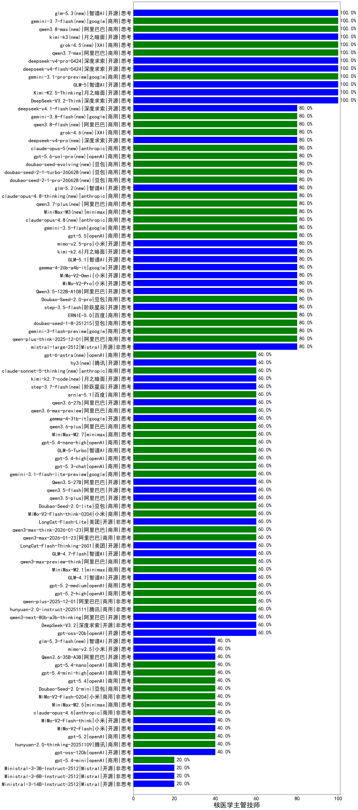

|类别|机构|大模型|【核医学主管技师】准确率|平均耗时|平均消耗token|花费/千次（元）|排名（准确率）|
|---|---|-----|-------------------|-------|-----------|-----------|-----------|
|商用|google|gemini-3-pro-preview(new)|100.0%|25s|2043|167.5|1|
|商用|google|gemini-3.1-pro-preview(new)|100.0%|47s|1985|162.5|2|
|开源|智谱AI|GLM-4.5|100.0%|69s|2169|29.4|3|
|开源|月之暗面|Kimi-K2-Thinking|100.0%|65s|1176|17.7|4|
|开源|智谱AI|GLM-5(new)|100.0%|134s|2805|49.2|5|
|商用|openAI|gpt-5-2025-08-07|100.0%|23s|414|23.6|6|
|开源|月之暗面|Kimi-K2.5-Thinking(new)|100.0%|465s|2421|49.3|7|
|商用|百度|ERNIE-4.5-Turbo-32K|100.0%|21s|538|1.6|8|
|开源|深度求索|DeepSeek-V3.2-Think(new)|100.0%|51s|1497|4.4|9|
|商用|google|gemini-2.5-pro|80.0%|44s|2662|187.9|10|
|开源|minimax|MiniMax-M2|80.0%|46s|1353|10.6|11|
|商用|豆包|doubao-seed-1-6-lite-251015|80.0%|22s|727|1.5|12|
|商用|google|gemini-2.5-flash|80.0%|14s|2038|35.6|13|
|商用|XAI|grok-4-0709|80.0%|110s|2402|253.7|14|
|商用|豆包|doubao-seed-1-6-251015|80.0%|19s|686|4.6|15|
|开源|阿里巴巴|Qwen3.5-122B-A10B(new)|80.0%|388s|3678|23.0|16|
|开源|月之暗面|kimi-k2-0711-preview|80.0%|34s|590|8.5|17|
|开源|智谱AI|GLM-4.6|80.0%|49s|2514|34.2|18|
|开源|月之暗面|kimi-k2-0905|80.0%|101s|350|4.2|19|
|开源|深度求索|DeepSeek-V3.1-Think|80.0%|40s|802|8.9|20|
|商用|openAI|gpt-5-nano-2025-08-07|80.0%|19s|1655|4.5|21|
|商用|豆包|doubao-seed-1-6-thinking-250715|80.0%|61s|1139|8.4|22|
|开源|阿里巴巴|qwen3-235b-a22b-thinking-2507|80.0%|80s|3425|66.7|23|
|商用|科大讯飞|xunfei-spark-x1-0725|80.0%|/|928|11.1|24|
|商用|智谱AI|GLM-4.5-Flash-nothink|80.0%|16s|1009|0.0|25|
|开源|智谱AI|GLM-4.5-Air-nothink|80.0%|11s|1032|5.7|26|
|开源|深度求索|DeepSeek-V3.2-Exp-Think|80.0%|482s|1461|4.3|27|
|商用|anthropic|claude-4-sonnet-thinking|80.0%|50s|625|56.5|28|
|商用|openAI|gpt-5.1-high|80.0%|26s|1658|111.0|29|
|开源|Mistral|mistral-large-2512(new)|80.0%|10s|421|3.7|30|
|商用|豆包|doubao-seed-1-8-251215(new)|80.0%|26s|734|4.9|31|
|开源|meta|Llama-4-Maverick-17B-128E-Instruct-FP8|80.0%|6s|439|1.6|32|
|商用|google|gemini-3-flash-preview(new)|80.0%|24s|1488|30.1|33|
|开源|阿里巴巴|Qwen3-32B|80.0%|48s|2089|8.1|34|
|开源|阶跃星辰|step-3.5-flash(new)|80.0%|66s|2754|5.6|35|
|商用|阿里巴巴|qwen-plus-think-2025-12-01(new)|80.0%|83s|3599|28.1|36|
|商用|openAI|gpt-5-mini-high|80.0%|753s|1867|25.7|37|
|商用|百度|ERNIE-5.0(new)|80.0%|271s|3426|80.7|38|
|商用|豆包|Doubao-Seed-2.0-pro(new)|80.0%|360s|1633|24.4|39|
|商用|百度|ERNIE-X1-Turbo-32K|80.0%|138s|2940|11.5|40|
|商用|anthropic|claude-opus-4.5(new)|80.0%|11s|742|113.2|41|
|商用|anthropic|claude-4-sonnet|80.0%|42s|525|46.7|42|
|开源|美团|LongCat-Flash-Thinking-2601(new)|80.0%|145s|1855|0.0|43|
|开源|深度求索|DeepSeek-R1-0528|75.0%|249s|2101|32.7|44|
|开源|minimax|MiniMax-Text-01|70.0%|10s|912|7.3|45|
|开源|阿里巴巴|Qwen3-14B|70.0%|32s|1156|2.2|46|
|开源|minimax|MiniMax-M1|70.0%|123s|2442|16.2|47|
|商用|openAI|o4-mini|70.0%|36s|1288|38.8|48|
|开源|百度|ERNIE-4.5-300B-A47B|70.0%|7s|346|2.3|49|
|开源|阿里巴巴|Qwen3-30B-A3B-Thinking-2507|70.0%|73s|3033|8.3|50|
|商用|阿里巴巴|qwen-long-2025-01-25|65.0%|6s|296|0.5|51|
|商用|豆包|Doubao-1.5-lite-32k-250115|65.0%|3s|183|0.1|52|
|商用|豆包|doubao-seed-1-6-flash-thinking-250615|65.0%|5s|619|0.7|53|
|商用|百度|ERNIE-5.0-Thinking-Preview|60.0%|269s|1886|43.8|54|
|商用|腾讯|hunyuan-2.0-instruct-20251111|60.0%|8s|506|0.9|55|
|开源|阿里巴巴|Qwen3-4B|60.0%|47s|2838|8.3|56|
|开源|阿里巴巴|qwen3-next-80b-a3b-thinking|60.0%|168s|4184|16.4|57|
|开源|深度求索|DeepSeek-V3.2(new)|60.0%|51s|375|1.0|58|
|商用|openAI|gpt-5-nano-high|60.0%|946s|3755|10.6|59|
|商用|阿里巴巴|qwen3-max-2025-09-23|60.0%|178s|466|9.4|60|
|开源|阿里巴巴|Qwen3-32B-nothink|60.0%|27s|509|1.7|61|
|开源|阿里巴巴|Qwen3-8B|60.0%|312s|9510|0.0|62|
|商用|智谱AI|GLM-4.5-Flash|60.0%|30s|1502|0.0|63|
|商用|anthropic|claude-sonnet-4.5-thinking|60.0%|27s|1828|184.8|64|
|商用|anthropic|claude-sonnet-4.5(new)|60.0%|14s|619|55.8|65|
|商用|豆包|doubao-seed-1-6-250615|60.0%|101s|505|3.2|66|
|商用|openAI|gpt-5.1-medium|60.0%|35s|772|48.1|67|
|商用|阿里巴巴|qwen-plus-2025-12-01(new)|60.0%|21s|786|1.5|68|
|商用|openAI|gpt-5.2-high(new)|60.0%|8s|501|40.4|69|
|商用|XAI|grok-3-mini|60.0%|159s|1087|3.8|70|
|商用|openAI|gpt-5.2-medium(new)|60.0%|14s|574|47.8|71|
|开源|智谱AI|GLM-4.7(new)|60.0%|94s|3845|52.8|72|
|商用|minimax|MiniMax-M2.1(new)|60.0%|89s|2807|22.8|73|
|商用|阿里巴巴|qwen3-max-preview-think(new)|60.0%|120s|3505|82.3|74|
|开源|智谱AI|GLM-4.7-Flash(new)|60.0%|1183s|2444|0.0|75|
|商用|阿里巴巴|qwen3-max-2026-01-23(new)|60.0%|20s|497|4.2|76|
|商用|阿里巴巴|qwen3-max-think-2026-01-23(new)|60.0%|362s|4753|46.8|77|
|开源|美团|LongCat-Flash-Lite(new)|60.0%|436s|492|0.0|78|
|商用|小米|MiMo-V2-Flash-think-0204(new)|60.0%|538s|1880|3.8|79|
|商用|豆包|Doubao-Seed-2.0-lite(new)|60.0%|271s|1289|4.2|80|
|开源|阿里巴巴|qwen3.5-plus(new)|60.0%|47s|4025|18.9|81|
|开源|阿里巴巴|qwen3.5-flash(new)|60.0%|388s|3642|7.1|82|
|开源|阿里巴巴|Qwen3.5-27B(new)|60.0%|365s|3424|16.0|83|
|商用|openAI|gpt-5.1|60.0%|320s|221|9.1|84|
|商用|百度|ERNIE-X1.1-Preview|60.0%|151s|1444|5.5|85|
|开源|深度求索|DeepSeek-V3.1|60.0%|14s|305|3.0|86|
|开源|openAI|gpt-oss-20b|60.0%|7s|1179|1.2|87|
|商用|阿里巴巴|qwen-flash-think-2025-07-28|60.0%|24s|2568|3.7|88|
|开源|阿里巴巴|qwen3-235b-a22b-instruct-2507|60.0%|13s|537|3.7|89|
|商用|百川智能|Baichuan4-Air|60.0%|/|/|/|90|
|商用|阿里巴巴|qwen-plus-2025-07-28|60.0%|15s|512|0.9|91|
|商用|openAI|gpt-5-mini-2025-08-07|60.0%|131s|864|11.2|92|
|商用|阿里巴巴|qwen-plus-think-2025-07-28|60.0%|/|3994|31.2|93|
|商用|阿里巴巴|qwen-turbo-think-2025-07-15|60.0%|/|3121|9.1|94|
|商用|阿里巴巴|qwen3-max-preview|60.0%|10s|476|9.7|95|
|商用|google|gemini-2.5-flash-lite|60.0%|51s|471|1.2|96|
|开源|豆包|Seed-OSS-36B-Instruct|60.0%|165s|1873|7.3|97|
|开源|深度求索|DeepSeek-V3.2-Exp|60.0%|459s|337|0.9|98|
|开源|智谱AI|GLM-4.5-nothink|60.0%|35s|941|12.1|99|
|开源|阶跃星辰|step-3|60.0%|121s|2384|9.3|100|
|商用|腾讯|hunyuan-turbos-20250926|60.0%|15s|630|1.1|101|
|商用|腾讯|hunyuan-t1-20250711|60.0%|30s|1752|6.6|102|
|开源|智谱AI|GLM-4.5-Air|60.0%|30s|1570|8.9|103|
|商用|豆包|doubao-seed-1-6-flash-250615|55.0%|3s|320|0.4|104|
|商用|360|360zhinao2-o1|55.0%|/|/|/|105|
|开源|深度求索|DeepSeek-R1-0528-Qwen3-8B|55.0%|236s|2273|0.0|106|
|开源|meta|Llama-4-Scout-17B-16E-Instruct|55.0%|14s|649|1.3|107|
|开源|百度|ERNIE-4.5-21B-A3B|55.0%|58s|322|0.0|108|
|商用|百川智能|Baichuan4-Turbo|50.0%|/|/|/|109|
|开源|阿里巴巴|Qwen3-1.7B|50.0%|20s|2035|5.9|110|
|开源|google|gemma-3-27b-it|45.0%|/|/|/|111|
|开源|腾讯|Hunyuan-A13B-Instruct|45.0%|62s|1348|5.2|112|
|开源|openAI|gpt-oss-120b|40.0%|13s|617|1.6|113|
|商用|腾讯|hunyuan-2.0-thinking-20251109|40.0%|20s|1332|5.1|114|
|商用|anthropic|claude-haiku-4.5|40.0%|7s|644|19.1|115|
|开源|阿里巴巴|Qwen3-30B-A3B-Instruct-2507|40.0%|4s|533|1.4|116|
|商用|豆包|Doubao-Seed-2.0-mini(new)|40.0%|470s|1994|3.7|117|
|开源|阿里巴巴|Qwen3-8B-nothink|40.0%|22s|524|0.0|118|
|商用|anthropic|claude-haiku-4.5-thinking|40.0%|15s|2006|67.6|119|
|商用|小米|MiMo-V2-Flash-0204(new)|40.0%|72s|538|1.0|120|
|商用|XAI|grok-4-1-fast-reasoning|40.0%|8s|897|2.7|121|
|商用|minimax|MiniMax-M2.5(new)|40.0%|26s|1422|11.2|122|
|开源|阿里巴巴|Qwen3-4B-nothink|40.0%|17s|539|1.3|123|
|商用|anthropic|claude-opus-4.6(new)|40.0%|23s|672|99.1|124|
|商用|XAI|grok-4-1-fast-non-reasoning|40.0%|80s|623|1.7|125|
|商用|阿里巴巴|qwen-turbo-2025-07-15|40.0%|9s|391|0.2|126|
|开源|阿里巴巴|Qwen3-1.7B-nothink|40.0%|11s|478|1.2|127|
|开源|Mistral|Mistral-Small-3.2-24B-Instruct-2506|40.0%|639s|563|1.1|128|
|开源|智谱AI|GLM-4-9B-0414|40.0%|13s|476|0.0|129|
|商用|阿里巴巴|qwen-flash-2025-07-28|40.0%|7s|550|0.7|130|
|开源|阿里巴巴|qwen3-next-80b-a3b-instruct|40.0%|12s|563|2.0|131|
|商用|openAI|gpt-5.2(new)|40.0%|9s|210|11.6|132|
|开源|阿里巴巴|Qwen3-0.6B|40.0%|7s|1542|4.4|133|
|开源|Mistral|Magistral-Small-2507|40.0%|1184s|7814|84.1|134|
|开源|小米|MiMo-V2-Flash-think(new)|40.0%|31s|2544|0.0|135|
|开源|小米|MiMo-V2-Flash(new)|40.0%|10s|500|0.0|136|
|开源|腾讯|Hunyuan-A13B-Instruct-nothink|40.0%|14s|391|1.3|137|
|商用|百度|ERNIE-Lite-8K|35.0%|/|/|/|138|
|开源|google|gemma-3-4b-it|35.0%|/|/|/|139|
|开源|google|gemma-3-12b-it|20.0%|/|/|/|140|
|开源|Mistral|Ministral-3-14B-Instruct-2512(new)|20.0%|7s|494|0.7|141|
|开源|Mistral|Ministral-3-8B-Instruct-2512(new)|20.0%|3s|510|0.5|142|
|商用|Mistral|mistral-medium-2508|20.0%|160s|455|5.3|143|
|开源|阿里巴巴|Qwen3-0.6B-nothink|20.0%|14s|261|0.5|144|
|开源|阿里巴巴|Qwen3-14B-nothink|20.0%|12s|589|1.0|145|
|开源|百度|ERNIE-4.5-0.3B|20.0%|57s|404|0.0|146|
|开源|Mistral|Ministral-3-3B-Instruct-2512(new)|20.0%|2s|573|0.4|147|

