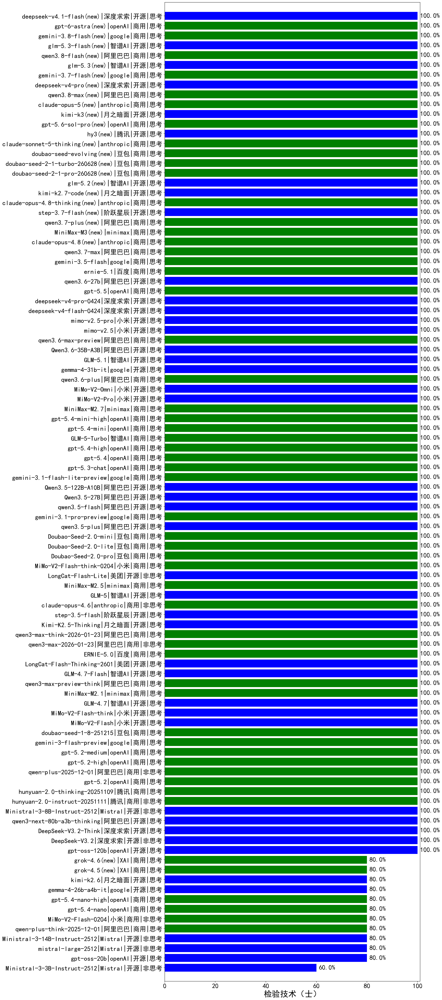

|类别|机构|大模型|【检验技术（士）】准确率|平均耗时|平均消耗token|花费/千次（元）|排名（准确率）|
|---|---|-----|-------------------|-------|-----------|-----------|-----------|
|商用|阿里巴巴|qwen-plus-2025-12-01|100.0%|18s|608|1.1|1|
|商用|openAI|gpt-5.2-high|100.0%|8s|265|19.2|2|
|商用|阿里巴巴|qwen3-max-2026-01-23|100.0%|15s|424|3.7|3|
|商用|百度|ERNIE-5.0|100.0%|89s|1645|38.5|4|
|开源|美团|LongCat-Flash-Thinking-2601|100.0%|92s|1171|0.0|5|
|开源|智谱AI|GLM-4.7-Flash|100.0%|1441s|1550|0.0|6|
|商用|阿里巴巴|qwen3-max-preview-think|100.0%|53s|1432|33.1|7|
|商用|minimax|MiniMax-M2.1|100.0%|63s|605|4.5|8|
|开源|智谱AI|GLM-4.7|100.0%|52s|1486|20.1|9|
|开源|小米|MiMo-V2-Flash-think|100.0%|16s|1349|0.0|10|
|开源|小米|MiMo-V2-Flash|100.0%|9s|413|0.0|11|
|商用|豆包|doubao-seed-1-8-251215|100.0%|23s|660|4.5|12|
|商用|google|gemini-3-flash-preview|100.0%|65s|901|18.1|13|
|商用|openAI|gpt-5.2-medium|100.0%|3s|234|16.1|14|
|开源|小米|mimo-v2.5-pro(new)|100.0%|17s|1013|16.9|15|
|开源|月之暗面|Kimi-K2.5-Thinking|100.0%|292s|1467|29.8|16|
|开源|meta|Llama-4-Scout-17B-16E-Instruct|100.0%|7s|478|0.9|17|
|商用|openAI|gpt-5.2|100.0%|3s|190|11.8|18|
|商用|腾讯|hunyuan-2.0-thinking-20251109|100.0%|4s|506|1.9|19|
|商用|腾讯|hunyuan-2.0-instruct-20251111|100.0%|8s|414|0.7|20|
|开源|深度求索|deepseek-v4-flash(new)|100.0%|11s|366|0.7|21|
|开源|Mistral|Ministral-3-8B-Instruct-2512|100.0%|11s|534|0.6|22|
|开源|深度求索|deepseek-v4-pro(new)|100.0%|18s|442|9.9|23|
|商用|openAI|gpt-5.5(new)|100.0%|20s|284|45.2|24|
|开源|阿里巴巴|qwen3-next-80b-a3b-thinking|100.0%|126s|1786|6.9|25|
|开源|深度求索|DeepSeek-V3.2-Think|100.0%|15s|498|1.4|26|
|开源|深度求索|DeepSeek-V3.2|100.0%|30s|369|1.0|27|
|商用|openAI|gpt-5-nano-high|100.0%|71s|2937|8.3|28|
|商用|阿里巴巴|qwen3-max-think-2026-01-23|100.0%|188s|1772|17.2|29|
|开源|阶跃星辰|step-3.5-flash|100.0%|13s|795|1.6|30|
|商用|阿里巴巴|qwen3-max-2025-09-23|100.0%|17s|409|8.6|31|
|商用|google|gemini-3.1-flash-lite-preview|100.0%|5s|364|3.3|32|
|商用|阿里巴巴|qwen3.6-plus|100.0%|41s|1223|14.0|33|
|开源|小米|MiMo-V2-Omni|100.0%|502s|1059|11.4|34|
|开源|小米|MiMo-V2-Pro|100.0%|153s|1065|18.0|35|
|商用|minimax|MiniMax-M2.7|100.0%|17s|715|5.4|36|
|开源|阿里巴巴|Qwen3.6-35B-A3B|100.0%|92s|1475|15.3|37|
|商用|阿里巴巴|qwen3.6-max-preview|100.0%|39s|1282|66.3|38|
|商用|openAI|gpt-5.4-mini-high|100.0%|31s|336|8.4|39|
|商用|openAI|gpt-5.4-mini|100.0%|25s|235|5.3|40|
|商用|智谱AI|GLM-5-Turbo|100.0%|15s|997|20.9|41|
|商用|openAI|gpt-5.4-high|100.0%|7s|387|33.5|42|
|商用|openAI|gpt-5.4|100.0%|6s|276|21.8|43|
|商用|openAI|gpt-5.3-chat|100.0%|6s|309|23.2|44|
|开源|阿里巴巴|Qwen3.5-122B-A10B|100.0%|67s|1601|9.9|45|
|商用|anthropic|claude-opus-4.6|100.0%|23s|697|107.8|46|
|开源|阿里巴巴|Qwen3.5-27B|100.0%|295s|2161|10.1|47|
|开源|阿里巴巴|qwen3.5-flash|100.0%|65s|1714|3.3|48|
|商用|google|gemini-3.1-pro-preview|100.0%|54s|1080|87.4|49|
|开源|阿里巴巴|qwen3.5-plus|100.0%|21s|1479|6.8|50|
|商用|豆包|Doubao-Seed-2.0-mini|100.0%|229s|944|1.7|51|
|商用|豆包|Doubao-Seed-2.0-lite|100.0%|148s|742|2.4|52|
|商用|豆包|Doubao-Seed-2.0-pro|100.0%|171s|749|10.6|53|
|商用|小米|MiMo-V2-Flash-think-0204|100.0%|583s|1275|2.6|54|
|开源|小米|mimo-v2.5(new)|100.0%|13s|931|9.6|55|
|开源|美团|LongCat-Flash-Lite|100.0%|251s|474|0.0|56|
|商用|minimax|MiniMax-M2.5|100.0%|17s|825|6.3|57|
|开源|智谱AI|GLM-5|100.0%|36s|1307|22.7|58|
|开源|阿里巴巴|qwen3.6-27b(new)|100.0%|22s|1398|24.2|59|
|商用|anthropic|claude-opus-4.5|100.0%|10s|636|98.7|60|
|开源|智谱AI|GLM-5.1|100.0%|110s|1005|23.0|61|
|开源|阿里巴巴|qwen3-235b-a22b-instruct-2507|100.0%|13s|492|3.5|62|
|开源|openAI|gpt-oss-120b|100.0%|4s|499|1.3|63|
|商用|智谱AI|GLM-4.5-Flash-nothink|100.0%|18s|942|0.0|64|
|商用|anthropic|claude-opus-4.8(new)|100.0%|7s|473|68.8|65|
|开源|阿里巴巴|Qwen3-30B-A3B-Instruct-2507|100.0%|4s|497|1.3|66|
|开源|智谱AI|GLM-4.5-Air|100.0%|24s|1270|7.3|67|
|商用|智谱AI|GLM-4.5-Flash|100.0%|24s|1167|0.0|68|
|开源|阿里巴巴|Qwen3-32B-nothink|100.0%|27s|489|1.7|69|
|商用|minimax|MiniMax-M3(new)|100.0%|17s|509|5.7|70|
|开源|阿里巴巴|Qwen3-8B-nothink|100.0%|24s|536|0.0|71|
|商用|阿里巴巴|qwen3.7-plus(new)|100.0%|16s|712|5.3|72|
|开源|阿里巴巴|qwen3-235b-a22b-thinking-2507|100.0%|97s|1533|29.4|73|
|商用|阿里巴巴|qwen-turbo-2025-07-15|100.0%|9s|346|0.2|74|
|商用|openAI|gpt-5-2025-08-07|100.0%|28s|168|7.4|75|
|商用|腾讯|hunyuan-t1-20250711|100.0%|16s|969|3.6|76|
|开源|阶跃星辰|step-3.7-flash(new)|100.0%|16s|1344|10.4|77|
|商用|anthropic|claude-opus-4.8-thinking(new)|100.0%|11s|676|104.3|78|
|开源|月之暗面|kimi-k2.7-code(new)|100.0%|10s|414|9.9|79|
|商用|百度|ERNIE-4.5-Turbo-32K|100.0%|22s|560|1.7|80|
|开源|智谱AI|glm-5.2(new)|100.0%|29s|940|24.9|81|
|商用|豆包|doubao-seed-2-1-pro-260628(new)|100.0%|95s|4004|117.7|82|
|商用|豆包|doubao-seed-2-1-turbo-260628(new)|100.0%|104s|3982|58.5|83|
|商用|豆包|doubao-seed-evolving(new)|100.0%|113s|2916|85.0|84|
|商用|anthropic|claude-sonnet-5-thinking(new)|100.0%|12s|676|41.7|85|
|开源|腾讯|hy3(new)|100.0%|72s|205|0.6|86|
|商用|百度|ERNIE-5.0-Thinking-Preview|100.0%|312s|1550|36.2|87|
|商用|阿里巴巴|qwen3.7-max(new)|100.0%|24s|741|25.1|88|
|商用|openAI|gpt-5-mini-2025-08-07|100.0%|83s|451|5.5|89|
|商用|豆包|doubao-seed-1-6-lite-251015|100.0%|16s|739|1.6|90|
|商用|百度|ERNIE-X1.1-Preview|100.0%|75s|617|2.3|91|
|商用|anthropic|claude-sonnet-4.5-thinking|100.0%|21s|1349|135.3|92|
|商用|anthropic|claude-sonnet-4.5|100.0%|9s|602|56.6|93|
|商用|openAI|gpt-5.1-high|100.0%|129s|346|19.4|94|
|开源|月之暗面|kimi-k2-0905|100.0%|16s|327|4.2|95|
|商用|百度|ernie-5.1(new)|100.0%|21s|705|11.9|96|
|商用|google|gemini-3.5-flash(new)|100.0%|7s|1049|62.7|97|
|商用|anthropic|claude-haiku-4.5-thinking|100.0%|17s|1998|68.2|98|
|商用|anthropic|claude-haiku-4.5|100.0%|8s|655|20.4|99|
|商用|openAI|gpt-5.1-medium|100.0%|145s|312|17.0|100|
|商用|openAI|gpt-5.1|100.0%|92s|223|10.7|101|
|商用|openAI|gpt-5-nano-2025-08-07|100.0%|13s|1131|3.1|102|
|开源|月之暗面|Kimi-K2-Thinking|100.0%|53s|953|14.5|103|
|商用|豆包|doubao-seed-1-6-251015|100.0%|7s|666|4.7|104|
|商用|腾讯|hunyuan-turbos-20250926|100.0%|14s|571|1.0|105|
|开源|阿里巴巴|qwen3-next-80b-a3b-instruct|100.0%|12s|449|1.6|106|
|开源|豆包|Seed-OSS-36B-Instruct|100.0%|70s|1115|4.3|107|
|商用|阿里巴巴|qwen3-max-preview|100.0%|10s|418|8.8|108|
|商用|阿里巴巴|qwen-turbo-think-2025-07-15|100.0%|/|1655|4.8|109|
|商用|google|gemini-2.5-flash-lite|100.0%|3s|488|1.3|110|
|开源|深度求索|DeepSeek-V3.1-Think|100.0%|33s|645|7.2|111|
|开源|深度求索|DeepSeek-V3.1|100.0%|14s|289|3.0|112|
|商用|阿里巴巴|qwen-flash-think-2025-07-28|100.0%|16s|1652|2.4|113|
|商用|阿里巴巴|qwen-flash-2025-07-28|100.0%|7s|595|0.8|114|
|开源|google|gemma-4-31b-it|100.0%|84s|518|1.3|115|
|商用|google|gemini-2.5-pro|90.0%|48s|2726|193.5|116|
|商用|google|gemini-2.5-flash|90.0%|11s|1923|33.8|117|
|开源|深度求索|DeepSeek-R1-0528|90.0%|244s|2031|31.7|118|
|开源|阿里巴巴|Qwen3-30B-A3B-Thinking-2507|90.0%|75s|2658|7.3|119|
|商用|百川智能|Baichuan4-Turbo|85.0%|/|/|/|120|
|开源|阿里巴巴|Qwen3-32B|85.0%|33s|1153|4.4|121|
|商用|百度|ERNIE-X1-Turbo-32K|85.0%|108s|1599|6.2|122|
|开源|google|gemma-4-26b-a4b-it|80.0%|16s|605|1.6|123|
|商用|XAI|grok-4-1-fast-reasoning|80.0%|8s|814|2.4|124|
|开源|阿里巴巴|Qwen3-14B|80.0%|25s|1157|2.2|125|
|商用|anthropic|claude-4-sonnet-thinking|80.0%|9s|589|55.1|126|
|开源|阿里巴巴|Qwen3-4B-nothink|80.0%|31s|495|1.3|127|
|商用|openAI|gpt-5.4-nano-high|80.0%|94s|274|1.8|128|
|开源|openAI|gpt-oss-20b|80.0%|6s|1319|1.4|129|
|开源|智谱AI|GLM-4.5-Air-nothink|80.0%|14s|942|5.3|130|
|商用|openAI|gpt-5-mini-high|80.0%|83s|949|12.7|131|
|开源|Mistral|mistral-large-2512|80.0%|12s|506|4.7|132|
|开源|Mistral|Ministral-3-14B-Instruct-2512|80.0%|15s|616|0.9|133|
|商用|阿里巴巴|qwen-plus-think-2025-12-01|80.0%|44s|1813|14.0|134|
|商用|小米|MiMo-V2-Flash-0204|80.0%|204s|504|0.9|135|
|开源|月之暗面|kimi-k2.6(new)|80.0%|58s|1030|26.6|136|
|商用|openAI|gpt-5.4-nano|80.0%|8s|247|1.6|137|
|商用|XAI|grok-4.5(new)|80.0%|41s|822|27.1|138|
|商用|anthropic|claude-4-sonnet|70.0%|44s|550|50.7|139|
|商用|openAI|o4-mini|70.0%|26s|737|21.7|140|
|商用|XAI|grok-4-1-fast-non-reasoning|60.0%|5s|571|1.5|141|
|开源|阿里巴巴|Qwen3-14B-nothink|60.0%|27s|528|0.9|142|
|开源|Mistral|Ministral-3-3B-Instruct-2512|60.0%|9s|1058|0.8|143|
|开源|阿里巴巴|Qwen3-8B|60.0%|123s|3693|0.0|144|
|开源|智谱AI|GLM-4-9B-0414|55.0%|12s|423|0|145|
|开源|阿里巴巴|Qwen3-4B|50.0%|19s|1757|5.1|146|

