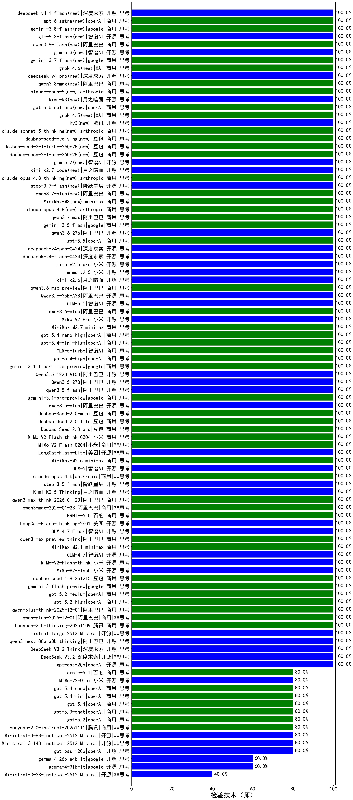

|类别|机构|大模型|【检验技术（师）】准确率|平均耗时|平均消耗token|花费/千次（元）|排名（准确率）|
|---|---|-----|-------------------|-------|-----------|-----------|-----------|
|商用|豆包|Doubao-Seed-2.0-mini(new)|100.0%|457s|2099|4.0|1|
|商用|anthropic|claude-haiku-4.5|100.0%|7s|595|18.9|2|
|商用|anthropic|claude-sonnet-4.5-thinking|100.0%|21s|1395|142.3|3|
|商用|openAI|gpt-5-mini-2025-08-07|100.0%|39s|633|8.3|4|
|商用|openAI|gpt-5-2025-08-07|100.0%|68s|280|16.5|5|
|开源|openAI|gpt-oss-20b|100.0%|5s|933|1.0|6|
|商用|百度|ERNIE-X1.1-Preview|100.0%|87s|374|1.3|7|
|商用|百度|ERNIE-5.0-Thinking-Preview|100.0%|273s|1395|32.5|8|
|商用|anthropic|claude-opus-4.5(new)|100.0%|20s|538|84.5|9|
|开源|智谱AI|GLM-4.5-nothink|100.0%|30s|866|11.4|10|
|开源|阶跃星辰|step-3|100.0%|76s|1510|5.9|11|
|开源|阿里巴巴|Qwen3-30B-A3B-Instruct-2507|100.0%|3s|424|1.1|12|
|开源|智谱AI|GLM-4.5|100.0%|30s|1598|21.7|13|
|开源|智谱AI|GLM-4.5-Air|100.0%|26s|1222|7.0|14|
|商用|智谱AI|GLM-4.5-Flash|100.0%|32s|1596|0.0|15|
|商用|阿里巴巴|qwen3-max-2025-09-23|100.0%|57s|432|9.2|16|
|商用|openAI|gpt-5-mini-high|100.0%|62s|1529|21.3|17|
|开源|深度求索|DeepSeek-V3.2(new)|100.0%|9s|245|0.7|18|
|开源|深度求索|DeepSeek-V3.2-Think(new)|100.0%|83s|579|1.7|19|
|开源|阿里巴巴|qwen3-next-80b-a3b-thinking|100.0%|143s|2345|9.2|20|
|开源|Mistral|mistral-large-2512(new)|100.0%|9s|411|3.9|21|
|商用|阿里巴巴|qwen-flash-2025-07-28|100.0%|8s|457|0.6|22|
|商用|阿里巴巴|qwen-flash-think-2025-07-28|100.0%|22s|2308|3.4|23|
|开源|深度求索|DeepSeek-V3.1|100.0%|14s|275|2.8|24|
|开源|阿里巴巴|qwen3-next-80b-a3b-instruct|100.0%|11s|385|1.3|25|
|开源|月之暗面|Kimi-K2-Thinking|100.0%|81s|890|13.5|26|
|开源|minimax|MiniMax-M2|100.0%|16s|1001|7.8|27|
|商用|豆包|doubao-seed-1-6-lite-251015|100.0%|23s|719|1.5|28|
|商用|豆包|doubao-seed-1-6-251015|100.0%|13s|612|4.3|29|
|开源|智谱AI|GLM-4.6|100.0%|40s|2035|27.8|30|
|商用|腾讯|hunyuan-turbos-20250926|100.0%|15s|616|1.1|31|
|开源|深度求索|DeepSeek-V3.2-Exp-Think|100.0%|39s|667|1.9|32|
|开源|深度求索|DeepSeek-V3.2-Exp|100.0%|16s|307|0.9|33|
|开源|豆包|Seed-OSS-36B-Instruct|100.0%|71s|1271|4.9|34|
|开源|深度求索|DeepSeek-V3.1-Think|100.0%|33s|653|7.4|35|
|商用|阿里巴巴|qwen3-max-preview|100.0%|10s|438|9.3|36|
|商用|阿里巴巴|qwen-turbo-think-2025-07-15|100.0%|/|2903|8.5|37|
|商用|阿里巴巴|qwen-plus-think-2025-07-28|100.0%|/|1895|14.7|38|
|商用|阿里巴巴|qwen-plus-2025-07-28|100.0%|15s|434|0.8|39|
|商用|google|gemini-3-pro-preview(new)|100.0%|98s|1123|91.6|40|
|开源|月之暗面|kimi-k2-0905|100.0%|97s|324|4.2|41|
|商用|openAI|gpt-5.1-high|100.0%|138s|830|54.9|42|
|商用|anthropic|claude-sonnet-4.5(new)|100.0%|8s|495|46.9|43|
|商用|科大讯飞|xunfei-spark-x1-0725|100.0%|/|841|10.1|44|
|开源|阿里巴巴|qwen3-235b-a22b-thinking-2507|100.0%|45s|1748|33.8|45|
|商用|豆包|doubao-seed-1-6-thinking-250715|100.0%|17s|881|6.6|46|
|商用|minimax|MiniMax-M2.1(new)|100.0%|65s|851|6.6|47|
|开源|智谱AI|GLM-4.7-Flash(new)|100.0%|1337s|1514|0.0|48|
|开源|美团|LongCat-Flash-Thinking-2601(new)|100.0%|343s|1124|0.0|49|
|商用|百度|ERNIE-5.0(new)|100.0%|142s|1524|35.6|50|
|商用|阿里巴巴|qwen3-max-2026-01-23(new)|100.0%|16s|412|3.6|51|
|商用|阿里巴巴|qwen3-max-think-2026-01-23(new)|100.0%|112s|2276|22.2|52|
|开源|月之暗面|Kimi-K2.5-Thinking(new)|100.0%|252s|1296|26.2|53|
|开源|阶跃星辰|step-3.5-flash(new)|100.0%|13s|798|1.6|54|
|商用|anthropic|claude-opus-4.6(new)|100.0%|23s|537|82.7|55|
|开源|智谱AI|GLM-5(new)|100.0%|57s|1386|24.1|56|
|商用|minimax|MiniMax-M2.5(new)|100.0%|17s|916|7.1|57|
|开源|美团|LongCat-Flash-Lite(new)|100.0%|209s|403|0.0|58|
|商用|小米|MiMo-V2-Flash-0204(new)|100.0%|319s|526|1.0|59|
|商用|小米|MiMo-V2-Flash-think-0204(new)|100.0%|720s|1160|2.3|60|
|商用|豆包|Doubao-Seed-2.0-pro(new)|100.0%|207s|849|12.3|61|
|商用|豆包|Doubao-Seed-2.0-lite(new)|100.0%|158s|747|2.4|62|
|开源|阿里巴巴|qwen3-235b-a22b-instruct-2507|100.0%|28s|490|3.5|63|
|商用|阿里巴巴|qwen3-max-preview-think(new)|100.0%|74s|1616|37.6|64|
|商用|XAI|grok-4-1-fast-reasoning|100.0%|8s|813|2.4|65|
|商用|openAI|gpt-5.2-high(new)|100.0%|8s|347|28.8|66|
|开源|智谱AI|GLM-4.7(new)|100.0%|43s|1414|19.2|67|
|开源|小米|MiMo-V2-Flash-think(new)|100.0%|17s|1524|0.0|68|
|商用|腾讯|hunyuan-2.0-thinking-20251109|100.0%|14s|919|3.5|69|
|商用|阿里巴巴|qwen-turbo-2025-07-15|100.0%|9s|323|0.2|70|
|开源|小米|MiMo-V2-Flash(new)|100.0%|8s|373|0.0|71|
|商用|腾讯|hunyuan-t1-20250711|100.0%|16s|1015|3.8|72|
|商用|豆包|doubao-seed-1-8-251215(new)|100.0%|23s|649|4.5|73|
|商用|google|gemini-3-flash-preview(new)|100.0%|9s|896|18.1|74|
|商用|openAI|gpt-5.2-medium(new)|100.0%|8s|273|21.4|75|
|商用|阿里巴巴|qwen-plus-2025-12-01(new)|100.0%|18s|673|1.3|76|
|商用|阿里巴巴|qwen-plus-think-2025-12-01(new)|100.0%|43s|1941|15.1|77|
|开源|阿里巴巴|Qwen3-32B|95.0%|26s|784|2.9|78|
|开源|minimax|MiniMax-M1|95.0%|84s|1457|8.5|79|
|商用|百度|ERNIE-4.5-Turbo-32K|95.0%|22s|549|1.6|80|
|开源|阿里巴巴|Qwen3-30B-A3B-Thinking-2507|90.0%|52s|2238|6.1|81|
|商用|anthropic|claude-4-sonnet|90.0%|41s|547|51.0|82|
|商用|XAI|grok-4-0709|90.0%|381s|981|100.6|83|
|开源|阿里巴巴|Qwen3-14B|90.0%|32s|1999|3.9|84|
|商用|google|gemini-2.5-pro|90.0%|27s|1984|139.9|85|
|开源|月之暗面|kimi-k2-0711-preview|90.0%|33s|548|8.0|86|
|开源|深度求索|DeepSeek-R1-0528|90.0%|244s|1724|26.9|87|
|开源|minimax|MiniMax-Text-01|90.0%|8s|890|7.1|88|
|商用|anthropic|claude-4-sonnet-thinking|90.0%|67s|536|51.3|89|
|商用|阿里巴巴|qwen-long-2025-01-25|85.0%|135s|389|0.7|90|
|商用|google|gemini-2.5-flash|85.0%|11s|1603|28.0|91|
|商用|豆包|Doubao-1.5-lite-32k-250115|85.0%|3s|180|0.1|92|
|商用|360|360zhinao2-o1|85.0%|/|/|/|93|
|开源|meta|Llama-4-Maverick-17B-128E-Instruct-FP8|85.0%|7s|477|1.9|94|
|商用|百度|ERNIE-X1-Turbo-32K|85.0%|64s|1467|5.7|95|
|商用|豆包|doubao-seed-1-6-flash-thinking-250615|85.0%|6s|1580|2.2|96|
|商用|豆包|doubao-seed-1-6-250615|85.0%|139s|435|2.8|97|
|开源|百度|ERNIE-4.5-300B-A47B|85.0%|25s|338|2.3|98|
|商用|anthropic|claude-haiku-4.5-thinking|80.0%|35s|1883|64.7|99|
|商用|腾讯|hunyuan-2.0-instruct-20251111|80.0%|8s|387|0.7|100|
|开源|腾讯|Hunyuan-A13B-Instruct-nothink|80.0%|316s|405|1.4|101|
|商用|openAI|gpt-5.2(new)|80.0%|6s|143|8.5|102|
|商用|豆包|doubao-seed-1-6-flash-250615|80.0%|3s|314|0.4|103|
|开源|Mistral|Ministral-3-14B-Instruct-2512(new)|80.0%|10s|426|0.6|104|
|商用|openAI|o4-mini|80.0%|22s|809|24.0|105|
|开源|meta|Llama-4-Scout-17B-16E-Instruct|80.0%|9s|496|1.0|106|
|开源|Mistral|Ministral-3-8B-Instruct-2512(new)|80.0%|12s|357|0.4|107|
|商用|openAI|gpt-5.1-medium|80.0%|144s|576|36.8|108|
|商用|google|gemini-2.5-flash-lite|80.0%|4s|864|2.4|109|
|商用|openAI|gpt-5-nano-2025-08-07|80.0%|129s|1275|3.5|110|
|开源|阿里巴巴|Qwen3-4B-nothink|80.0%|14s|547|1.5|111|
|商用|openAI|gpt-5-nano-high|80.0%|976s|2725|7.7|112|
|商用|openAI|gpt-5.1|80.0%|101s|124|4.7|113|
|开源|Mistral|Magistral-Small-2507|80.0%|42s|3655|39.2|114|
|开源|阿里巴巴|Qwen3-32B-nothink|80.0%|16s|577|2.1|115|
|开源|智谱AI|GLM-4.5-Air-nothink|80.0%|13s|1002|5.7|116|
|商用|XAI|grok-4-1-fast-non-reasoning|80.0%|77s|624|1.7|117|
|商用|智谱AI|GLM-4.5-Flash-nothink|80.0%|20s|1019|0.0|118|
|开源|openAI|gpt-oss-120b|80.0%|212s|545|1.5|119|
|商用|百川智能|Baichuan4-Turbo|75.0%|/|/|/|120|
|开源|阿里巴巴|Qwen3-8B|75.0%|602s|15639|0.0|121|
|开源|智谱AI|GLM-4-9B-0414|70.0%|10s|434|0.0|122|
|开源|深度求索|DeepSeek-R1-0528-Qwen3-8B|70.0%|232s|1855|0.0|123|
|开源|阿里巴巴|Qwen3-4B|70.0%|24s|1405|4.0|124|
|开源|腾讯|Hunyuan-A13B-Instruct|70.0%|94s|1053|4.0|125|
|商用|XAI|grok-3-mini|70.0%|244s|994|3.5|126|
|商用|百川智能|Baichuan4-Air|65.0%|/|/|/|127|
|开源|百度|ERNIE-4.5-21B-A3B|65.0%|55s|319|0.0|128|
|开源|Mistral|Mistral-Small-3.2-24B-Instruct-2506|60.0%|20s|456|0.9|129|
|商用|百度|ERNIE-Lite-8K|60.0%|/|/|/|130|
|商用|Mistral|mistral-medium-2508|60.0%|718s|422|5.3|131|
|开源|阿里巴巴|Qwen3-14B-nothink|60.0%|14s|516|0.9|132|
|开源|阿里巴巴|Qwen3-8B-nothink|60.0%|18s|482|0.0|133|
|开源|google|gemma-3-27b-it|55.0%|/|/|/|134|
|开源|阿里巴巴|Qwen3-0.6B|50.0%|7s|1059|3.0|135|
|开源|google|gemma-3-12b-it|45.0%|/|/|/|136|
|开源|阿里巴巴|Qwen3-1.7B|40.0%|21s|2292|6.7|137|
|开源|Mistral|Ministral-3-3B-Instruct-2512(new)|40.0%|13s|423|0.3|138|
|开源|百度|ERNIE-4.5-0.3B|30.0%|54s|391|0.0|139|
|开源|阿里巴巴|Qwen3-1.7B-nothink|20.0%|12s|459|1.2|140|
|开源|阿里巴巴|Qwen3-0.6B-nothink|20.0%|6s|160|0.3|141|
|开源|google|gemma-3-4b-it|10.0%|/|/|/|142|

