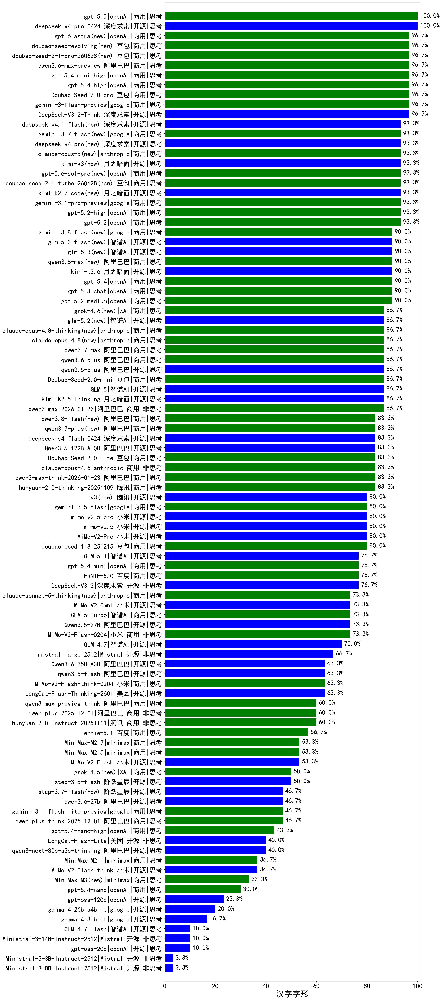

|类别|机构|大模型|【汉字字形】准确率|平均耗时|平均消耗token|花费/千次（元）|排名（准确率）|
|---|---|-----|-------------------|-------|-----------|-----------|-----------|
|商用|openAI|gpt-5.5|100.0%|14s|354|69.7|1|
|开源|深度求索|deepseek-v4-pro-0424|100.0%|40s|830|19.7|2|
|商用|google|gemini-3-flash-preview|96.7%|16s|1232|25.9|3|
|开源|深度求索|DeepSeek-V3.2-Think|96.7%|208s|1149|3.4|4|
|商用|豆包|Doubao-Seed-2.0-pro|96.7%|278s|1235|18.9|5|
|商用|openAI|gpt-5.4-high|96.7%|14s|646|65.6|6|
|商用|openAI|gpt-5.4-mini-high|96.7%|19s|1212|37.5|7|
|商用|豆包|doubao-seed-evolving(new)|96.7%|259s|10195|304.3|8|
|商用|阿里巴巴|qwen3.6-max-preview|96.7%|49s|1515|80.6|9|
|商用|豆包|doubao-seed-2-1-pro-260628(new)|96.7%|237s|9548|284.9|10|
|商用|google|gemini-3.7-flash(new)|93.3%|6s|1022|26.4|11|
|商用|google|gemini-3.1-pro-preview|93.3%|58s|3826|324.5|12|
|商用|openAI|gpt-5.2|93.3%|7s|104|8.0|13|
|商用|openAI|gpt-5.2-high|93.3%|22s|846|81.8|14|
|开源|月之暗面|kimi-k2.7-code(new)|93.3%|72s|3602|96.7|15|
|开源|深度求索|deepseek-v4-pro(new)|93.3%|173s|4948|131.8|16|
|商用|豆包|doubao-seed-2-1-turbo-260628(new)|93.3%|176s|8670|129.3|17|
|商用|openAI|gpt-5.6-sol-pro(new)|93.3%|12s|2591|186.3|18|
|开源|月之暗面|kimi-k3(new)|93.3%|103s|2180|202.9|19|
|商用|anthropic|claude-opus-5(new)|93.3%|12s|672|113.0|20|
|开源|月之暗面|kimi-k2.6|90.0%|254s|3520|94.5|21|
|商用|openAI|gpt-5.2-medium|90.0%|12s|551|52.5|22|
|商用|openAI|gpt-5.4|90.0%|9s|92|7.4|23|
|商用|openAI|gpt-5.3-chat|90.0%|6s|370|34.0|24|
|商用|阿里巴巴|qwen3.8-max(new)|90.0%|92s|3921|139.6|25|
|商用|豆包|Doubao-Seed-2.0-mini|86.7%|104s|1880|3.6|26|
|商用|XAI|grok-4.6(new)|86.7%|40s|2009|78.1|27|
|商用|阿里巴巴|qwen3-max-2026-01-23|86.7%|14s|401|3.8|28|
|开源|月之暗面|Kimi-K2.5-Thinking|86.7%|575s|2781|58.0|29|
|开源|智谱AI|GLM-5|86.7%|197s|5249|94.2|30|
|商用|anthropic|claude-opus-4.8-thinking(new)|86.7%|14s|902|153.4|31|
|开源|阿里巴巴|qwen3.5-plus|86.7%|68s|5117|24.4|32|
|商用|阿里巴巴|qwen3.6-plus|86.7%|38s|1838|21.8|33|
|商用|阿里巴巴|qwen3-max-preview|86.7%|10s|441|10.1|34|
|开源|智谱AI|glm-5.2(new)|86.7%|140s|6351|177.2|35|
|商用|阿里巴巴|qwen3.7-max|86.7%|51s|2420|86.5|36|
|商用|anthropic|claude-opus-4.8(new)|86.7%|5s|195|29.6|37|
|商用|豆包|Doubao-Seed-2.0-lite|83.3%|393s|1726|6.0|38|
|商用|阿里巴巴|qwen3.7-plus(new)|83.3%|362s|19652|157.1|39|
|开源|深度求索|deepseek-v4-flash-0424|83.3%|61s|2034|4.0|40|
|商用|阿里巴巴|qwen3-max-think-2026-01-23|83.3%|305s|3672|36.5|41|
|开源|阿里巴巴|Qwen3.5-122B-A10B|83.3%|532s|4238|27.0|42|
|商用|anthropic|claude-opus-4.6|83.3%|17s|227|34.9|43|
|商用|腾讯|hunyuan-2.0-thinking-20251109|83.3%|17s|1591|6.3|44|
|开源|深度求索|DeepSeek-V3.1|83.3%|17s|301|3.4|45|
|开源|深度求索|DeepSeek-V3.1-Think|83.3%|77s|1389|16.5|46|
|商用|google|gemini-3.5-flash|80.0%|14s|1766|110.2|47|
|商用|豆包|doubao-seed-1-8-251215|80.0%|23s|553|3.9|48|
|商用|anthropic|claude-opus-4.5|80.0%|13s|157|23.1|49|
|开源|小米|mimo-v2.5-pro|80.0%|45s|2308|44.7|50|
|开源|小米|mimo-v2.5|80.0%|32s|2371|30.2|51|
|开源|小米|MiMo-V2-Pro|80.0%|379s|913|15.4|52|
|开源|腾讯|hy3(new)|80.0%|32s|271|1.0|53|
|商用|anthropic|claude-sonnet-4.5|76.7%|3s|144|12.7|54|
|商用|百度|ERNIE-5.0|76.7%|289s|2731|65.2|55|
|商用|openAI|gpt-5-2025-08-07|76.7%|42s|495|34.6|56|
|商用|openAI|gpt-5.4-mini|76.7%|49s|106|2.7|57|
|商用|阿里巴巴|qwen3-max-2025-09-23|76.7%|277s|443|10.2|58|
|开源|智谱AI|GLM-5.1|76.7%|463s|6483|155.2|59|
|开源|深度求索|DeepSeek-V3.2|76.7%|103s|380|1.1|60|
|商用|智谱AI|GLM-5-Turbo|73.3%|75s|4144|90.8|61|
|开源|阿里巴巴|Qwen3.5-27B|73.3%|178s|5514|26.3|62|
|商用|腾讯|hunyuan-turbos-20250926|73.3%|16s|625|1.2|63|
|商用|小米|MiMo-V2-Flash-0204|73.3%|149s|254|0.5|64|
|开源|月之暗面|Kimi-K2-Thinking|73.3%|49s|555|8.6|65|
|开源|小米|MiMo-V2-Omni|73.3%|748s|1344|15.8|66|
|商用|anthropic|claude-sonnet-5-thinking(new)|73.3%|27s|824|55.8|67|
|开源|月之暗面|kimi-k2-0905|70.0%|107s|1252|19.5|68|
|商用|anthropic|claude-sonnet-4.5-thinking|70.0%|26s|1439|150.9|69|
|开源|智谱AI|GLM-4.7|70.0%|111s|4132|57.6|70|
|商用|百度|ERNIE-5.0-Thinking-Preview|70.0%|100s|1143|27.1|71|
|商用|openAI|gpt-5.1-medium|70.0%|42s|1036|71.9|72|
|开源|Mistral|mistral-large-2512|66.7%|8s|244|2.4|73|
|商用|openAI|gpt-5.1-high|66.7%|209s|3486|245.9|74|
|商用|openAI|gpt-5.1|66.7%|110s|100|5.5|75|
|商用|豆包|doubao-seed-1-6-251015|63.3%|42s|634|4.7|76|
|开源|阿里巴巴|Qwen3.6-35B-A3B|63.3%|148s|1876|20.0|77|
|商用|百度|ERNIE-X1.1-Preview|63.3%|84s|1503|6.0|78|
|开源|阿里巴巴|qwen3.5-flash|63.3%|603s|5568|11.1|79|
|商用|小米|MiMo-V2-Flash-think-0204|63.3%|799s|3501|7.3|80|
|开源|美团|LongCat-Flash-Thinking-2601|63.3%|169s|2103|0.0|81|
|商用|腾讯|hunyuan-2.0-instruct-20251111|60.0%|13s|835|1.6|82|
|商用|阿里巴巴|qwen-plus-2025-12-01|60.0%|31s|1357|2.7|83|
|商用|阿里巴巴|qwen3-max-preview-think|60.0%|82s|3029|72.2|84|
|商用|百度|ernie-5.1|56.7%|45s|1593|28.4|85|
|商用|minimax|MiniMax-M2.7|53.3%|121s|4907|40.9|86|
|商用|minimax|MiniMax-M2.5|53.3%|59s|3102|25.7|87|
|开源|小米|MiMo-V2-Flash|53.3%|30s|206|0.0|88|
|商用|XAI|grok-4.5(new)|50.0%|49s|1958|76.0|89|
|开源|阶跃星辰|step-3.5-flash|50.0%|38s|3275|6.8|90|
|商用|google|gemini-3.1-flash-lite-preview|46.7%|4s|154|1.4|91|
|商用|阿里巴巴|qwen-plus-think-2025-12-01|46.7%|79s|3709|29.5|92|
|开源|阿里巴巴|qwen3.6-27b|46.7%|39s|2321|41.4|93|
|开源|阶跃星辰|step-3.7-flash(new)|46.7%|25s|2400|19.2|94|
|商用|openAI|gpt-5.4-nano-high|43.3%|100s|1199|10.3|95|
|开源|阿里巴巴|qwen3-next-80b-a3b-instruct|43.3%|8s|545|2.1|96|
|商用|anthropic|claude-haiku-4.5-thinking|40.0%|51s|3056|108.5|97|
|商用|anthropic|claude-haiku-4.5|40.0%|9s|174|4.9|98|
|开源|阿里巴巴|qwen3-next-80b-a3b-thinking|40.0%|42s|4623|18.4|99|
|开源|美团|LongCat-Flash-Lite|40.0%|76s|494|0.0|100|
|商用|minimax|MiniMax-M2.1|36.7%|136s|3516|29.2|101|
|开源|小米|MiMo-V2-Flash-think|36.7%|56s|2977|0.0|102|
|商用|openAI|gpt-5-mini-2025-08-07|36.7%|34s|1595|22.8|103|
|商用|阿里巴巴|qwen-flash-think-2025-07-28|33.3%|29s|2910|4.3|104|
|商用|minimax|MiniMax-M3(new)|33.3%|135s|2423|38.3|105|
|商用|openAI|gpt-5-mini-high|33.3%|91s|5378|77.6|106|
|商用|google|gemini-2.5-flash-lite|30.0%|1s|96|0.2|107|
|开源|豆包|Seed-OSS-36B-Instruct|30.0%|162s|2221|8.8|108|
|商用|openAI|gpt-5.4-nano|30.0%|7s|121|0.9|109|
|商用|豆包|doubao-seed-1-6-lite-251015|30.0%|116s|767|1.7|110|
|商用|阿里巴巴|qwen-flash-2025-07-28|23.3%|9s|635|0.9|111|
|商用|openAI|gpt-5-nano-2025-08-07|23.3%|29s|3727|10.7|112|
|开源|openAI|gpt-oss-120b|23.3%|240s|1091|3.4|113|
|开源|google|gemma-4-26b-a4b-it|20.0%|46s|205|0.5|114|
|开源|google|gemma-4-31b-it|16.7%|34s|122|0.3|115|
|商用|openAI|gpt-5-nano-high|13.3%|103s|9694|28.0|116|
|商用|阿里巴巴|qwen-turbo-think-2025-07-15|10.0%|/|2316|6.9|117|
|商用|XAI|grok-4-1-fast-non-reasoning|10.0%|116s|322|0.7|118|
|开源|openAI|gpt-oss-20b|10.0%|216s|4441|5.1|119|
|开源|Mistral|Ministral-3-14B-Instruct-2512|10.0%|2s|202|0.3|120|
|开源|智谱AI|GLM-4.7-Flash|10.0%|440s|2378|0.0|121|
|商用|XAI|grok-4-1-fast-reasoning|3.3%|12s|1066|3.4|122|
|开源|Mistral|Ministral-3-8B-Instruct-2512|3.3%|2s|221|0.2|123|
|开源|Mistral|Ministral-3-3B-Instruct-2512|3.3%|1s|170|0.1|124|

