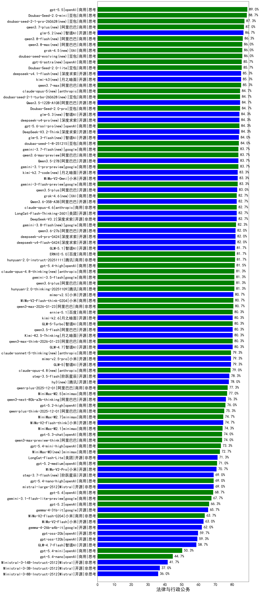

|类别|机构|大模型|【法律与行政公务】准确率|平均耗时|平均消耗token|花费/千次（元）|排名（准确率）|
|---|---|-----|-------------------|-------|-----------|-----------|-----------|
|商用|豆包|Doubao-Seed-2.0-mini(new)|88.7%|363s|4966|9.6|1|
|商用|豆包|doubao-seed-1-6-251015|85.7%|26s|1139|7.9|2|
|商用|豆包|Doubao-Seed-2.0-lite(new)|85.7%|296s|1476|4.8|3|
|商用|豆包|Doubao-Seed-2.0-pro(new)|84.7%|303s|1398|20.0|4|
|商用|豆包|doubao-seed-1-6-lite-251015|84.7%|44s|1220|2.6|5|
|开源|阿里巴巴|Qwen3.5-122B-A10B(new)|84.7%|238s|4438|27.7|6|
|开源|深度求索|DeepSeek-V3.2-Think|84.3%|137s|1957|5.7|7|
|商用|豆包|doubao-seed-1-8-251215|84.0%|37s|1105|7.5|8|
|开源|阿里巴巴|Qwen3.5-27B(new)|83.7%|356s|4390|20.5|9|
|商用|google|gemini-3.1-pro-preview(new)|83.7%|44s|2118|169.9|10|
|商用|google|gemini-3-flash-preview|83.3%|91s|2531|51.3|11|
|商用|小米|MiMo-V2-Omni(new)|83.3%|256s|2299|27.9|12|
|开源|阿里巴巴|qwen3.5-plus(new)|83.0%|50s|4028|18.8|13|
|商用|anthropic|claude-opus-4.6|82.7%|23s|931|130.9|14|
|开源|深度求索|DeepSeek-V3.2|82.7%|67s|809|2.3|15|
|商用|google|gemini-3-pro-preview|82.7%|83s|2700|219.4|16|
|商用|豆包|doubao-seed-1-6-250615|82.7%|53s|685|4.3|17|
|商用|阿里巴巴|qwen-plus-2025-07-28|82.7%|29s|1096|2.0|18|
|商用|百度|ERNIE-5.0-Thinking-Preview|82.3%|229s|2021|46.3|19|
|开源|月之暗面|kimi-k2-0905|82.3%|73s|937|13.3|20|
|商用|腾讯|hunyuan-turbos-20250926|82.3%|24s|1052|1.9|21|
|商用|anthropic|claude-opus-4.5|82.3%|17s|1037|152.0|22|
|开源|深度求索|DeepSeek-V3.1-Think|82.0%|85s|1761|20.1|23|
|开源|深度求索|DeepSeek-V3.2-Exp-Think|82.0%|300s|1977|5.8|24|
|商用|腾讯|hunyuan-2.0-instruct-20251111|81.7%|9s|755|1.3|25|
|商用|百度|ERNIE-5.0|81.7%|203s|2926|68.0|26|
|商用|openAI|gpt-5.4-high(new)|81.5%|31s|1472|140.2|27|
|商用|百度|ERNIE-4.5-Turbo-32K|81.5%|29s|808|2.3|28|
|商用|腾讯|hunyuan-2.0-thinking-20251109|81.3%|23s|2140|8.2|29|
|商用|阿里巴巴|qwen3.6-plus(new)|81.3%|61s|2606|30.0|30|
|商用|百度|ERNIE-X1-Turbo-32K|81.2%|428s|2451|9.4|31|
|开源|豆包|Seed-OSS-36B-Instruct|81.0%|190s|3016|11.7|32|
|商用|anthropic|claude-sonnet-4.5-thinking|81.0%|49s|3580|366.9|33|
|开源|深度求索|DeepSeek-R1-0528|81.0%|189s|2743|42.4|34|
|开源|阿里巴巴|qwen3-next-80b-a3b-instruct|80.7%|19s|1270|4.7|35|
|商用|小米|MiMo-V2-Flash-think-0204(new)|80.7%|427s|2754|5.6|36|
|商用|阿里巴巴|qwen3-max-2026-01-23|80.7%|94s|1035|9.3|37|
|开源|阿里巴巴|qwen3.5-flash(new)|80.3%|353s|5118|10.0|38|
|商用|阿里巴巴|qwen3-max-think-2026-01-23|80.3%|150s|4425|43.2|39|
|开源|月之暗面|Kimi-K2.5-Thinking|80.3%|196s|3815|78.0|40|
|开源|智谱AI|GLM-4.6|80.3%|59s|3047|41.2|41|
|开源|智谱AI|GLM-4.7|80.3%|87s|3058|41.4|42|
|商用|智谱AI|GLM-5-Turbo(new)|80.3%|38s|2294|48.3|43|
|开源|深度求索|DeepSeek-V3.2-Exp|80.0%|281s|731|2.1|44|
|开源|阿里巴巴|qwen3-235b-a22b-instruct-2507|79.3%|27s|1115|8.1|45|
|开源|智谱AI|GLM-5(new)|79.3%|126s|3217|56.1|46|
|商用|google|gemini-2.5-pro|78.8%|35s|3088|214.1|47|
|商用|阿里巴巴|qwen-plus-think-2025-07-28|78.7%|/|3924|30.4|48|
|开源|阿里巴巴|qwen3-235b-a22b-thinking-2507|78.3%|87s|3721|71.9|49|
|开源|阶跃星辰|step-3.5-flash|78.3%|30s|4434|9.1|50|
|商用|阿里巴巴|qwen3-max-2025-09-23|78.0%|212s|1093|23.7|51|
|商用|阿里巴巴|qwen-plus-2025-12-01|77.3%|34s|1459|2.8|52|
|开源|美团|LongCat-Flash-Thinking-2601|77.3%|459s|3856|0.0|53|
|商用|minimax|MiniMax-M2.5(new)|77.0%|51s|2888|23.3|54|
|商用|阿里巴巴|qwen3-max-preview|77.0%|19s|873|18.4|55|
|商用|豆包|doubao-seed-1-6-flash-thinking-250615|76.8%|14s|922|1.1|56|
|商用|科大讯飞|xunfei-spark-x1-0725|76.7%|/|1972|23.2|57|
|商用|腾讯|hunyuan-t1-20250711|76.3%|33s|2077|7.8|58|
|开源|阿里巴巴|qwen3-next-80b-a3b-thinking|76.3%|190s|4646|18.2|59|
|商用|openAI|gpt-5.2-high|76.0%|29s|1133|98.3|60|
|开源|阿里巴巴|Qwen3-30B-A3B-Thinking-2507|75.7%|77s|3419|9.3|61|
|商用|阿里巴巴|qwen-plus-think-2025-12-01|75.3%|93s|3693|28.5|62|
|商用|openAI|gpt-5.1-high|75.0%|161s|3350|227.6|63|
|开源|小米|MiMo-V2-Flash-think|74.7%|88s|2835|0.0|64|
|开源|深度求索|DeepSeek-V3.1|74.7%|35s|723|7.7|65|
|商用|minimax|MiniMax-M2.7(new)|74.7%|80s|3391|27.5|66|
|商用|minimax|MiniMax-M2.1|74.3%|107s|2969|23.9|67|
|商用|anthropic|claude-4-sonnet-thinking|74.3%|63s|1544|149.2|68|
|商用|XAI|grok-4-0709|74.0%|424s|2495|258.8|69|
|商用|openAI|gpt-5.3-chat(new)|74.0%|25s|709|55.4|70|
|商用|openAI|gpt-5-2025-08-07|73.7%|34s|577|31.8|71|
|商用|openAI|gpt-5.4-mini-high(new)|73.3%|72s|2317|68.7|72|
|商用|阿里巴巴|qwen3-max-preview-think|73.2%|206s|3498|81.4|73|
|开源|百度|ERNIE-4.5-300B-A47B|73.2%|224s|564|3.6|74|
|商用|百度|ERNIE-X1.1-Preview|73.0%|121s|1277|4.7|75|
|商用|google|gemini-2.5-flash|73.0%|15s|2991|51.7|76|
|开源|阶跃星辰|step-3|73.0%|165s|3255|12.7|77|
|开源|智谱AI|GLM-4.5|72.7%|84s|2126|27.0|78|
|商用|阿里巴巴|qwen-flash-think-2025-07-28|72.7%|39s|3762|5.5|79|
|商用|anthropic|claude-sonnet-4.5(new)|72.7%|11s|833|70.7|80|
|商用|智谱AI|GLM-4.5-Flash|72.7%|37s|2154|0.0|81|
|开源|腾讯|Hunyuan-A13B-Instruct|72.3%|62s|1824|6.9|82|
|开源|月之暗面|Kimi-K2-Thinking|72.3%|472s|8208|129.9|83|
|开源|美团|LongCat-Flash-Lite(new)|71.3%|236s|1111|0.0|84|
|商用|openAI|gpt-5.1-medium|71.3%|240s|1544|99.4|85|
|商用|openAI|gpt-5.2-medium|71.0%|18s|882|73.4|86|
|商用|小米|MiMo-V2-Pro(new)|70.7%|322s|1574|27.7|87|
|商用|阿里巴巴|qwen-turbo-think-2025-07-15|70.0%|/|3323|9.6|88|
|商用|anthropic|claude-4-sonnet|70.0%|44s|771|65.1|89|
|开源|智谱AI|GLM-4.5-Air|69.7%|36s|2184|12.1|90|
|开源|智谱AI|GLM-4.5-nothink|69.3%|41s|1375|16.9|91|
|开源|阿里巴巴|Qwen3-32B|69.3%|182s|4935|19.3|92|
|商用|阿里巴巴|qwen-flash-2025-07-28|69.0%|13s|1263|1.7|93|
|商用|openAI|gpt-5.4-nano-high(new)|69.0%|64s|1464|11.6|94|
|开源|Mistral|mistral-large-2512|69.0%|17s|857|7.8|95|
|商用|openAI|gpt-5.4(new)|68.7%|8s|543|42.7|96|
|开源|minimax|MiniMax-M2|68.7%|64s|3177|25.7|97|
|商用|google|gemini-3.1-flash-lite-preview(new)|67.7%|7s|629|5.3|98|
|商用|智谱AI|GLM-4.5-Flash-nothink|67.7%|35s|2115|0.0|99|
|开源|阿里巴巴|Qwen3-8B|66.8%|352s|5655|0.0|100|
|开源|阿里巴巴|Qwen3-30B-A3B-Instruct-2507|66.7%|10s|1157|3.2|101|
|商用|anthropic|claude-haiku-4.5-thinking|66.7%|53s|5684|198.2|102|
|商用|openAI|gpt-5.2|66.3%|9s|455|31.0|103|
|开源|阿里巴巴|Qwen3-14B|66.2%|201s|6637|13.1|104|
|商用|豆包|doubao-seed-1-6-flash-250615|66.2%|5s|464|0.5|105|
|商用|XAI|grok-4-1-fast-reasoning|65.3%|45s|1856|6.0|106|
|商用|Mistral|mistral-medium-2508|64.3%|133s|853|10.1|107|
|商用|XAI|grok-3-mini|64.0%|147s|1544|5.4|108|
|商用|小米|MiMo-V2-Flash-0204(new)|63.7%|214s|1096|2.1|109|
|商用|openAI|o4-mini|63.3%|35s|1589|47.1|110|
|开源|小米|MiMo-V2-Flash|63.0%|19s|1087|0.0|111|
|开源|阿里巴巴|Qwen3-14B-nothink|63.0%|19s|948|1.7|112|
|开源|阿里巴巴|Qwen3-32B-nothink|62.7%|50s|868|3.0|113|
|开源|meta|Llama-4-Maverick-17B-128E-Instruct-FP8|62.0%|12s|787|3.0|114|
|商用|阿里巴巴|qwen-turbo-2025-07-15|61.3%|12s|828|0.5|115|
|开源|Mistral|Mistral-Small-3.2-24B-Instruct-2506|60.3%|25s|1486|2.9|116|
|商用|openAI|gpt-5-mini-2025-08-07|60.0%|98s|1568|20.7|117|
|开源|openAI|gpt-oss-20b|59.7%|123s|2182|2.3|118|
|开源|openAI|gpt-oss-120b|59.3%|130s|1227|3.4|119|
|开源|智谱AI|GLM-4.7-Flash|58.7%|837s|8774|0.0|120|
|开源|深度求索|DeepSeek-R1-0528-Qwen3-8B|58.5%|518s|2905|0.0|121|
|开源|百度|ERNIE-4.5-21B-A3B|58.3%|31s|1046|0.0|122|
|开源|腾讯|Hunyuan-A13B-Instruct-nothink|58.0%|542s|568|1.9|123|
|商用|openAI|gpt-5-mini-high|56.7%|853s|3633|50.6|124|
|商用|百川智能|Baichuan4-Turbo|56.5%|/|/|/|125|
|商用|openAI|gpt-5-nano-high|54.0%|441s|7590|21.6|126|
|商用|anthropic|claude-haiku-4.5|53.3%|12s|868|24.4|127|
|开源|阿里巴巴|Qwen3-4B|53.0%|111s|2845|8.1|128|
|开源|阿里巴巴|Qwen3-8B-nothink|52.7%|34s|872|0.0|129|
|开源|智谱AI|GLM-4.5-Air-nothink|52.3%|41s|3312|18.9|130|
|商用|openAI|gpt-5-nano-2025-08-07|52.3%|47s|3854|10.8|131|
|商用|openAI|gpt-5.1|52.0%|131s|632|34.7|132|
|开源|智谱AI|GLM-4-9B-0414|51.5%|13s|584|0.0|133|
|商用|google|gemini-2.5-flash-lite|50.7%|32s|6752|19.3|134|
|商用|XAI|grok-4-1-fast-non-reasoning|50.7%|57s|727|1.9|135|
|商用|openAI|gpt-5.4-mini(new)|50.3%|48s|468|10.4|136|
|开源|阿里巴巴|Qwen3-1.7B|46.0%|97s|3532|10.2|137|
|开源|meta|Llama-4-Scout-17B-16E-Instruct|44.7%|13s|810|1.6|138|
|商用|openAI|gpt-5.4-nano(new)|44.7%|65s|535|3.5|139|
|开源|google|gemma-3-12b-it|42.5%|/|/|/|140|
|开源|Mistral|Ministral-3-14B-Instruct-2512|41.7%|18s|1517|2.2|141|
|开源|google|gemma-3-27b-it|39.7%|/|/|/|142|
|商用|百川智能|Baichuan4-Air|39.3%|/|/|/|143|
|开源|阿里巴巴|Qwen3-4B-nothink|39.0%|23s|926|2.4|144|
|开源|Mistral|Ministral-3-3B-Instruct-2512|37.0%|10s|1018|0.7|145|
|开源|Mistral|Ministral-3-8B-Instruct-2512|36.0%|10s|1026|1.1|146|
|开源|阿里巴巴|Qwen3-0.6B|30.7%|65s|2539|7.2|147|
|开源|google|gemma-3-4b-it|28.5%|/|/|/|148|
|开源|阿里巴巴|Qwen3-0.6B-nothink|27.0%|8s|480|1.1|149|
|开源|阿里巴巴|Qwen3-1.7B-nothink|22.0%|12s|775|1.9|150|
|开源|百度|ERNIE-4.5-0.3B|21.3%|16s|758|0.0|151|

