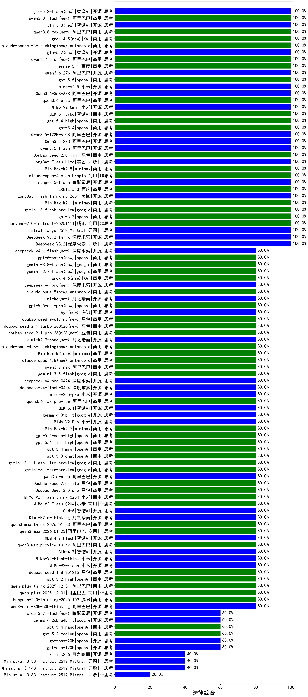

|类别|机构|大模型|【法律综合】准确率|平均耗时|平均消耗token|花费/千次（元）|排名（准确率）|
|---|---|-----|-------------------|-------|-----------|-----------|-----------|
|商用|minimax|MiniMax-M2.5|100.0%|27s|1254|9.8|1|
|商用|百度|ERNIE-5.0-Thinking-Preview|100.0%|270s|1201|27.4|2|
|商用|阿里巴巴|qwen3.7-plus(new)|100.0%|22s|1137|8.5|3|
|开源|深度求索|DeepSeek-V3.2|100.0%|101s|486|1.4|4|
|开源|深度求索|DeepSeek-V3.2-Think|100.0%|25s|775|2.2|5|
|开源|阿里巴巴|Qwen3.5-27B|100.0%|282s|2035|9.4|6|
|商用|百度|ernie-5.1|100.0%|20s|790|12.9|7|
|开源|阿里巴巴|qwen3.6-27b|100.0%|33s|2082|36.1|8|
|商用|腾讯|hunyuan-2.0-instruct-20251111|100.0%|6s|326|0.5|9|
|商用|openAI|gpt-5.5|100.0%|8s|533|91.8|10|
|商用|openAI|gpt-5.2|100.0%|6s|304|20.3|11|
|开源|小米|mimo-v2.5|100.0%|14s|1240|13.6|12|
|商用|google|gemini-3-flash-preview|100.0%|77s|1204|23.9|13|
|开源|阿里巴巴|Qwen3.6-35B-A3B|100.0%|117s|1691|17.4|14|
|商用|minimax|MiniMax-M2.1|100.0%|53s|1410|11.1|15|
|商用|阿里巴巴|qwen3.6-plus|100.0%|42s|1631|18.6|16|
|开源|小米|MiMo-V2-Omni|100.0%|7s|1166|12.6|17|
|开源|美团|LongCat-Flash-Thinking-2601|100.0%|187s|1996|0.0|18|
|商用|百度|ERNIE-5.0|100.0%|53s|1072|24.3|19|
|开源|阶跃星辰|step-3.5-flash|100.0%|10s|1207|2.4|20|
|商用|anthropic|claude-opus-4.6|100.0%|11s|613|85.3|21|
|开源|美团|LongCat-Flash-Lite|100.0%|302s|432|0.0|22|
|商用|智谱AI|GLM-5-Turbo|100.0%|31s|1130|23.4|23|
|商用|openAI|gpt-5.4-high|100.0%|14s|845|78.7|24|
|商用|openAI|gpt-5.4|100.0%|5s|337|25.4|25|
|商用|豆包|Doubao-Seed-2.0-mini|100.0%|382s|1726|3.2|26|
|开源|阿里巴巴|Qwen3.5-122B-A10B|100.0%|162s|3066|19.1|27|
|商用|anthropic|claude-opus-4.5|100.0%|18s|663|95.7|28|
|开源|Mistral|mistral-large-2512|100.0%|9s|457|4.0|29|
|开源|阿里巴巴|qwen3.5-flash|100.0%|238s|3223|6.3|30|
|开源|深度求索|DeepSeek-V3.1-Think|100.0%|48s|953|10.8|31|
|开源|阿里巴巴|qwen3-next-80b-a3b-instruct|100.0%|7s|591|2.1|32|
|商用|腾讯|hunyuan-turbos-20250926|100.0%|14s|612|1.1|33|
|商用|anthropic|claude-sonnet-4.5-thinking|100.0%|23s|1534|150.6|34|
|商用|豆包|doubao-seed-1-6-251015|100.0%|8s|701|4.7|35|
|商用|豆包|doubao-seed-1-6-lite-251015|100.0%|23s|696|1.4|36|
|商用|XAI|grok-4.5(new)|100.0%|25s|1167|40.8|37|
|商用|阿里巴巴|qwen3.8-max(new)|100.0%|22s|990|32.5|38|
|商用|anthropic|claude-sonnet-5-thinking(new)|100.0%|23s|637|35.9|39|
|商用|anthropic|claude-sonnet-4.5|100.0%|13s|598|51.4|40|
|开源|智谱AI|glm-5.3-flash(new)|100.0%|132s|5058|14.0|41|
|开源|智谱AI|glm-5.3(new)|100.0%|35s|1423|37.9|42|
|开源|智谱AI|glm-5.2(new)|100.0%|24s|1229|32.4|43|
|商用|阿里巴巴|qwen3.8-flash(new)|100.0%|15s|765|1.8|44|
|开源|月之暗面|kimi-k2-0905|100.0%|55s|458|6.0|45|
|商用|google|gemini-3.7-flash(new)|80.0%|5s|670|15.5|46|
|商用|openAI|gpt-5.4-nano-high|80.0%|16s|840|6.5|47|
|商用|minimax|MiniMax-M2.7|80.0%|47s|1393|11.0|48|
|商用|google|gemini-3.1-flash-lite-preview|80.0%|5s|451|3.9|49|
|商用|openAI|gpt-5.3-chat|80.0%|8s|496|38.8|50|
|商用|XAI|grok-4.6(new)|80.0%|29s|1356|48.7|51|
|商用|openAI|gpt-5.4-mini-high|80.0%|10s|1392|40.8|52|
|商用|openAI|gpt-5.4-mini|80.0%|85s|331|7.4|53|
|商用|anthropic|claude-opus-5(new)|80.0%|13s|731|106.2|54|
|开源|深度求索|deepseek-v4-pro(new)|80.0%|19s|616|13.7|55|
|开源|小米|MiMo-V2-Pro|80.0%|336s|1103|18.5|56|
|商用|anthropic|claude-opus-4.8-thinking(new)|80.0%|9s|690|99.1|57|
|开源|月之暗面|kimi-k3(new)|80.0%|101s|1579|115.8|58|
|商用|豆包|doubao-seed-2-1-turbo-260628(new)|80.0%|370s|6133|90.3|59|
|商用|minimax|MiniMax-M3(new)|80.0%|27s|818|10.4|60|
|商用|anthropic|claude-opus-4.8(new)|80.0%|9s|597|82.7|61|
|开源|月之暗面|kimi-k2.7-code(new)|80.0%|88s|1031|26.1|62|
|商用|阿里巴巴|qwen3.7-max|80.0%|16s|938|31.5|63|
|商用|google|gemini-3.5-flash|80.0%|12s|1307|77.1|64|
|商用|豆包|doubao-seed-2-1-pro-260628(new)|80.0%|220s|6622|195.3|65|
|商用|豆包|doubao-seed-evolving(new)|80.0%|176s|7582|224.1|66|
|商用|openAI|gpt-5.6-sol-pro(new)|80.0%|29s|3512|277.3|67|
|开源|腾讯|hy3(new)|80.0%|213s|253|0.7|68|
|开源|深度求索|deepseek-v4-pro-0424|80.0%|38s|631|14.2|69|
|开源|深度求索|deepseek-v4-flash-0424|80.0%|16s|785|1.5|70|
|开源|小米|mimo-v2.5-pro|80.0%|22s|1453|25.8|71|
|商用|阿里巴巴|qwen3.6-max-preview|80.0%|58s|1804|93.2|72|
|开源|google|gemma-4-31b-it|80.0%|121s|587|1.4|73|
|开源|智谱AI|GLM-5.1|80.0%|172s|1295|29.5|74|
|商用|google|gemini-3.8-flash(new)|80.0%|11s|665|30.7|75|
|商用|google|gemini-3.1-pro-preview|80.0%|23s|1340|107.1|76|
|开源|阿里巴巴|qwen3.5-plus|80.0%|24s|2127|9.8|77|
|开源|深度求索|DeepSeek-V3.1|80.0%|13s|287|2.8|78|
|商用|openAI|gpt-5.2-high|80.0%|12s|651|54.8|79|
|商用|阿里巴巴|qwen-plus-think-2025-12-01|80.0%|65s|2567|19.8|80|
|商用|阿里巴巴|qwen-plus-2025-12-01|80.0%|21s|936|1.8|81|
|商用|腾讯|hunyuan-2.0-thinking-20251109|80.0%|10s|956|3.6|82|
|商用|阿里巴巴|qwen-turbo-think-2025-07-15|80.0%|/|2192|6.3|83|
|商用|阿里巴巴|qwen3-max-preview|80.0%|12s|546|11.4|84|
|开源|小米|MiMo-V2-Flash|80.0%|11s|479|0.0|85|
|开源|阿里巴巴|qwen3-next-80b-a3b-thinking|80.0%|139s|2989|11.7|86|
|开源|豆包|Seed-OSS-36B-Instruct|80.0%|56s|2023|7.8|87|
|商用|阿里巴巴|qwen3-max-2025-09-23|80.0%|413s|573|12.0|88|
|商用|openAI|gpt-5.1|80.0%|320s|317|15.4|89|
|商用|openAI|gpt-5.1-medium|80.0%|161s|628|37.5|90|
|商用|openAI|gpt-5.1-high|80.0%|159s|1198|78.0|91|
|商用|anthropic|claude-haiku-4.5-thinking|80.0%|41s|2404|81.3|92|
|商用|豆包|doubao-seed-1-8-251215|80.0%|19s|649|4.2|93|
|开源|小米|MiMo-V2-Flash-think|80.0%|47s|2159|0.0|94|
|商用|阿里巴巴|qwen-flash-think-2025-07-28|80.0%|21s|2239|3.2|95|
|商用|豆包|Doubao-Seed-2.0-lite|80.0%|158s|862|2.7|96|
|商用|豆包|Doubao-Seed-2.0-pro|80.0%|206s|932|13.1|97|
|商用|小米|MiMo-V2-Flash-think-0204|80.0%|481s|1530|3.1|98|
|商用|小米|MiMo-V2-Flash-0204|80.0%|204s|565|1.0|99|
|商用|openAI|gpt-5-2025-08-07|80.0%|33s|507|29.9|100|
|开源|智谱AI|GLM-5|80.0%|74s|2085|36.3|101|
|商用|阿里巴巴|qwen-flash-2025-07-28|80.0%|9s|645|0.8|102|
|开源|月之暗面|Kimi-K2.5-Thinking|80.0%|178s|878|17.0|103|
|商用|阿里巴巴|qwen3-max-think-2026-01-23|80.0%|108s|2872|28.0|104|
|商用|阿里巴巴|qwen3-max-2026-01-23|80.0%|13s|595|5.2|105|
|开源|智谱AI|GLM-4.7-Flash|80.0%|1173s|3281|0.0|106|
|商用|阿里巴巴|qwen3-max-preview-think|80.0%|186s|2064|47.8|107|
|开源|智谱AI|GLM-4.7|80.0%|46s|1611|21.6|108|
|商用|anthropic|claude-haiku-4.5|80.0%|10s|647|18.5|109|
|开源|月之暗面|Kimi-K2-Thinking|60.0%|71s|1240|18.8|110|
|商用|google|gemini-2.5-flash-lite|60.0%|49s|13819|39.9|111|
|开源|openAI|gpt-oss-120b|60.0%|10s|617|1.6|112|
|商用|XAI|grok-4-1-fast-reasoning|60.0%|83s|947|2.8|113|
|商用|XAI|grok-4-1-fast-non-reasoning|60.0%|4s|591|1.6|114|
|商用|百度|ERNIE-X1.1-Preview|60.0%|83s|346|1.1|115|
|开源|阶跃星辰|step-3.7-flash(new)|60.0%|49s|2488|19.5|116|
|商用|openAI|gpt-5.2-medium|60.0%|13s|531|42.9|117|
|开源|google|gemma-4-26b-a4b-it|60.0%|42s|631|1.6|118|
|商用|openAI|gpt-5.4-nano|60.0%|14s|296|1.8|119|
|开源|openAI|gpt-oss-20b|60.0%|10s|1744|1.9|120|
|商用|openAI|gpt-5-nano-high|40.0%|114s|6166|17.6|121|
|开源|Mistral|Ministral-3-14B-Instruct-2512|40.0%|12s|633|0.9|122|
|开源|Mistral|Ministral-3-3B-Instruct-2512|40.0%|7s|536|0.4|123|
|开源|月之暗面|kimi-k2.6|40.0%|39s|952|17.9|124|
|商用|openAI|gpt-5-nano-2025-08-07|40.0%|77s|2455|6.8|125|
|商用|openAI|gpt-5-mini-2025-08-07|40.0%|79s|1146|15.2|126|
|商用|openAI|gpt-5-mini-high|20.0%|1027s|2964|41.5|127|
|开源|Mistral|Ministral-3-8B-Instruct-2512|20.0%|12s|597|0.6|128|

