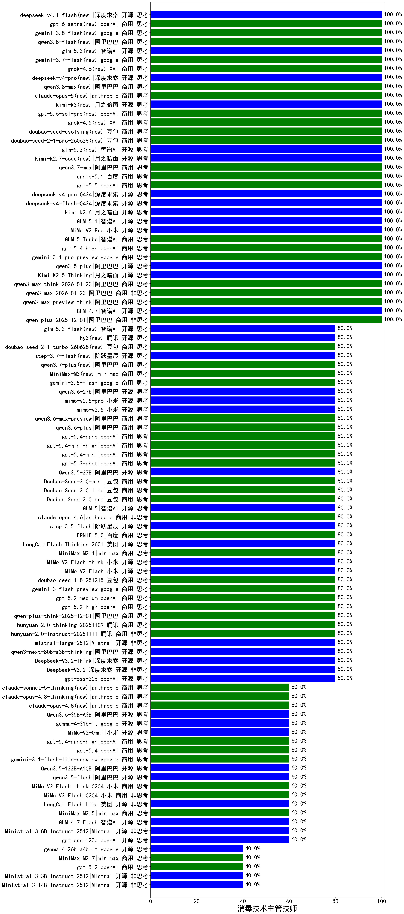

|类别|机构|大模型|【消毒技术主管技师】准确率|平均耗时|平均消耗token|花费/千次（元）|排名（准确率）|
|---|---|-----|-------------------|-------|-----------|-----------|-----------|
|开源|智谱AI|glm-5.2(new)|100.0%|80s|1215|31.6|1|
|商用|豆包|doubao-seed-2-1-pro-260628(new)|100.0%|119s|3684|106.7|2|
|商用|openAI|gpt-5.5(new)|100.0%|7s|403|60.3|3|
|商用|阿里巴巴|qwen3.7-max(new)|100.0%|16s|787|25.5|4|
|商用|阿里巴巴|qwen3-max-preview|100.0%|10s|453|8.6|5|
|商用|openAI|gpt-5-mini-2025-08-07|100.0%|117s|694|8.3|6|
|商用|阿里巴巴|qwen-plus-2025-12-01|100.0%|16s|674|1.2|7|
|开源|深度求索|deepseek-v4-pro(new)|100.0%|21s|518|11.3|8|
|开源|深度求索|deepseek-v4-flash(new)|100.0%|34s|695|1.3|9|
|开源|智谱AI|GLM-5.1|100.0%|147s|1220|27.2|10|
|开源|智谱AI|GLM-4.7|100.0%|49s|1615|21.4|11|
|开源|阿里巴巴|qwen3.5-plus|100.0%|32s|2618|12.1|12|
|开源|月之暗面|kimi-k2.7-code(new)|100.0%|50s|546|12.5|13|
|商用|阿里巴巴|qwen3-max-preview-think|100.0%|208s|2258|51.9|14|
|开源|小米|MiMo-V2-Pro|100.0%|55s|932|14.5|15|
|商用|百度|ernie-5.1(new)|100.0%|49s|720|11.3|16|
|商用|阿里巴巴|qwen3-max-think-2026-01-23|100.0%|223s|2513|24.2|17|
|商用|豆包|doubao-seed-evolving(new)|100.0%|146s|4734|138.3|18|
|商用|google|gemini-3.1-pro-preview|100.0%|50s|1037|79.1|19|
|商用|百度|ERNIE-5.0-Thinking-Preview|100.0%|211s|1753|40.1|20|
|商用|智谱AI|GLM-5-Turbo|100.0%|62s|1055|21.3|21|
|开源|月之暗面|kimi-k2.6(new)|100.0%|92s|1126|28.1|22|
|商用|阿里巴巴|qwen3-max-2026-01-23|100.0%|7s|333|2.4|23|
|开源|月之暗面|Kimi-K2.5-Thinking|100.0%|214s|1100|21.2|24|
|商用|openAI|gpt-5.4-high|100.0%|10s|766|68.3|25|
|商用|百度|ERNIE-4.5-Turbo-32K|90.0%|21s|527|1.5|26|
|商用|google|gemini-2.5-pro|85.0%|41s|2224|154.7|27|
|商用|openAI|gpt-5.4-mini|80.0%|11s|234|3.7|28|
|开源|深度求索|DeepSeek-V3.2-Think|80.0%|135s|1046|3.0|29|
|开源|Mistral|mistral-large-2512|80.0%|8s|491|4.0|30|
|开源|阿里巴巴|qwen3-next-80b-a3b-thinking|80.0%|61s|2592|10.0|31|
|商用|阿里巴巴|qwen3-max-2025-09-23|80.0%|752s|418|7.8|32|
|开源|深度求索|DeepSeek-V3.2|80.0%|95s|316|0.8|33|
|商用|anthropic|claude-opus-4.5|80.0%|14s|736|105.4|34|
|商用|豆包|Doubao-Seed-2.0-pro|80.0%|102s|664|8.6|35|
|商用|阿里巴巴|qwen3.6-plus|80.0%|20s|1541|17.3|36|
|开源|月之暗面|kimi-k2-0905|80.0%|115s|271|2.7|37|
|商用|openAI|gpt-5.2-medium|80.0%|5s|337|21.4|38|
|商用|openAI|gpt-5.4-mini-high|80.0%|99s|1354|39.0|39|
|开源|小米|MiMo-V2-Flash|80.0%|5s|364|0.0|40|
|商用|anthropic|claude-opus-4.6|80.0%|20s|598|79.6|41|
|开源|阶跃星辰|step-3.5-flash|80.0%|23s|2198|4.4|42|
|商用|百度|ERNIE-5.0|80.0%|83s|1632|37.2|43|
|开源|美团|LongCat-Flash-Thinking-2601|80.0%|134s|2152|0.0|44|
|商用|minimax|MiniMax-M2.1|80.0%|135s|1850|14.6|45|
|开源|小米|MiMo-V2-Flash-think|80.0%|140s|1898|0.0|46|
|商用|豆包|doubao-seed-1-8-251215|80.0%|18s|488|2.8|47|
|商用|腾讯|hunyuan-2.0-instruct-20251111|80.0%|2s|395|0.6|48|
|商用|google|gemini-3-flash-preview|80.0%|106s|779|14.3|49|
|商用|anthropic|claude-sonnet-4.5-thinking|80.0%|17s|1231|115.7|50|
|商用|openAI|gpt-5.2-high|80.0%|7s|441|31.8|51|
|商用|阿里巴巴|qwen-plus-think-2025-12-01|80.0%|69s|3196|24.7|52|
|开源|meta|Llama-4-Scout-17B-16E-Instruct|80.0%|11s|599|1.1|53|
|商用|腾讯|hunyuan-2.0-thinking-20251109|80.0%|10s|1099|4.1|54|
|商用|阿里巴巴|qwen3.6-max-preview|80.0%|50s|1550|78.3|55|
|开源|月之暗面|Kimi-K2-Thinking|80.0%|72s|1350|20.3|56|
|商用|anthropic|claude-sonnet-4.5|80.0%|8s|614|51.2|57|
|开源|阿里巴巴|Qwen3-32B-nothink|80.0%|18s|473|1.5|58|
|商用|minimax|MiniMax-M3(new)|80.0%|17s|599|6.5|59|
|开源|智谱AI|GLM-4.5-Air-nothink|80.0%|11s|745|3.8|60|
|商用|豆包|Doubao-Seed-2.0-mini|80.0%|137s|1901|3.5|61|
|商用|阿里巴巴|qwen3.7-plus(new)|80.0%|19s|1033|7.5|62|
|开源|智谱AI|GLM-4.5-Air|80.0%|33s|1584|8.9|63|
|开源|阶跃星辰|step-3.7-flash(new)|80.0%|18s|1120|8.3|64|
|开源|阿里巴巴|Qwen3-8B-nothink|80.0%|154s|491|0.0|65|
|开源|openAI|gpt-oss-20b|80.0%|7s|1043|1.0|66|
|开源|阿里巴巴|qwen3-235b-a22b-instruct-2507|80.0%|7s|384|2.3|67|
|商用|阿里巴巴|qwen-turbo-2025-07-15|80.0%|8s|379|0.2|68|
|开源|深度求索|DeepSeek-R1-0528|80.0%|243s|1640|25.2|69|
|开源|阿里巴巴|Qwen3.5-27B|80.0%|108s|2652|12.2|70|
|商用|豆包|doubao-seed-2-1-turbo-260628(new)|80.0%|228s|9304|137.7|71|
|开源|阿里巴巴|Qwen3-32B|80.0%|18s|810|2.9|72|
|商用|openAI|gpt-5.1-high|80.0%|171s|859|52.3|73|
|商用|豆包|Doubao-Seed-2.0-lite|80.0%|122s|665|1.9|74|
|商用|openAI|gpt-5-2025-08-07|80.0%|15s|280|11.8|75|
|商用|豆包|doubao-seed-1-6-lite-251015|80.0%|28s|555|1.0|76|
|商用|openAI|gpt-5.3-chat|80.0%|15s|355|22.8|77|
|商用|XAI|grok-4-1-fast-reasoning|80.0%|7s|889|2.6|78|
|开源|小米|mimo-v2.5(new)|80.0%|14s|1008|10.0|79|
|开源|小米|mimo-v2.5-pro(new)|80.0%|16s|901|13.8|80|
|商用|openAI|gpt-5.1-medium|80.0%|146s|383|18.6|81|
|商用|openAI|gpt-5-nano-2025-08-07|80.0%|16s|1637|4.4|82|
|商用|openAI|gpt-5.4-nano|80.0%|15s|284|1.5|83|
|商用|豆包|doubao-seed-1-6-251015|80.0%|15s|577|3.6|84|
|商用|腾讯|hunyuan-turbos-20250926|80.0%|14s|626|1.1|85|
|开源|豆包|Seed-OSS-36B-Instruct|80.0%|65s|1530|5.8|86|
|开源|阿里巴巴|qwen3.6-27b(new)|80.0%|29s|1793|30.5|87|
|开源|深度求索|DeepSeek-V3.1-Think|80.0%|75s|1481|16.9|88|
|商用|google|gemini-3.5-flash(new)|80.0%|8s|1106|62.8|89|
|开源|智谱AI|GLM-5|80.0%|88s|1678|28.6|90|
|商用|google|gemini-2.5-flash|75.0%|10s|1841|31.7|91|
|商用|百度|ERNIE-X1-Turbo-32K|75.0%|64s|1496|5.7|92|
|开源|阿里巴巴|Qwen3-8B|75.0%|601s|16457|0.0|93|
|商用|百川智能|Baichuan4-Turbo|71.4%|/|/|/|94|
|开源|阿里巴巴|Qwen3-30B-A3B-Thinking-2507|70.0%|49s|1997|5.4|95|
|商用|anthropic|claude-4-sonnet-thinking|70.0%|61s|580|47.4|96|
|商用|anthropic|claude-4-sonnet|70.0%|39s|513|41.5|97|
|商用|openAI|o4-mini|70.0%|37s|930|26.7|98|
|开源|阿里巴巴|Qwen3-4B|65.0%|17s|1703|4.8|99|
|商用|openAI|gpt-5.4-nano-high|60.0%|7s|453|2.9|100|
|开源|小米|MiMo-V2-Omni|60.0%|8s|1471|16.5|101|
|开源|google|gemma-4-31b-it|60.0%|31s|372|0.8|102|
|开源|阿里巴巴|Qwen3.6-35B-A3B|60.0%|101s|1579|16.0|103|
|商用|anthropic|claude-opus-4.8(new)|60.0%|7s|480|57.9|104|
|商用|anthropic|claude-opus-4.8-thinking(new)|60.0%|7s|572|74.1|105|
|商用|openAI|gpt-5.4|60.0%|3s|251|14.2|106|
|商用|anthropic|claude-sonnet-5-thinking(new)|60.0%|9s|519|25.9|107|
|商用|google|gemini-3.1-flash-lite-preview|60.0%|4s|308|2.1|108|
|商用|XAI|grok-4-1-fast-non-reasoning|60.0%|102s|580|1.5|109|
|开源|阿里巴巴|Qwen3-14B|60.0%|54s|2269|4.4|110|
|商用|腾讯|hunyuan-t1-20250711|60.0%|17s|1121|4.0|111|
|开源|阿里巴巴|qwen3-235b-a22b-thinking-2507|60.0%|221s|3630|70.4|112|
|开源|阿里巴巴|Qwen3-4B-nothink|60.0%|14s|510|1.2|113|
|商用|智谱AI|GLM-4.5-Flash|60.0%|35s|2189|0.0|114|
|开源|阿里巴巴|Qwen3-30B-A3B-Instruct-2507|60.0%|3s|402|0.9|115|
|开源|openAI|gpt-oss-120b|60.0%|4s|653|1.6|116|
|商用|阿里巴巴|qwen-flash-2025-07-28|60.0%|7s|437|0.5|117|
|开源|深度求索|DeepSeek-V3.1|60.0%|9s|231|1.9|118|
|商用|google|gemini-2.5-flash-lite|60.0%|2s|467|1.1|119|
|开源|阿里巴巴|qwen3-next-80b-a3b-instruct|60.0%|11s|422|1.3|120|
|商用|openAI|gpt-5.1|60.0%|87s|220|7.0|121|
|开源|阿里巴巴|Qwen3.5-122B-A10B|60.0%|292s|2304|14.1|122|
|商用|anthropic|claude-haiku-4.5-thinking|60.0%|42s|2638|89.1|123|
|商用|anthropic|claude-haiku-4.5|60.0%|10s|653|18.1|124|
|商用|百度|ERNIE-X1.1-Preview|60.0%|67s|352|1.1|125|
|商用|minimax|MiniMax-M2.5|60.0%|16s|814|5.9|126|
|商用|openAI|gpt-5-nano-high|60.0%|898s|3986|11.2|127|
|开源|阿里巴巴|qwen3.5-flash|60.0%|229s|3327|6.4|128|
|商用|小米|MiMo-V2-Flash-think-0204|60.0%|525s|1511|3.0|129|
|开源|Mistral|Ministral-3-8B-Instruct-2512|60.0%|12s|514|0.5|130|
|商用|小米|MiMo-V2-Flash-0204|60.0%|55s|441|0.7|131|
|开源|美团|LongCat-Flash-Lite|60.0%|41s|418|0.0|132|
|开源|智谱AI|GLM-4.7-Flash|60.0%|381s|2519|0.0|133|
|商用|openAI|gpt-5-mini-high|60.0%|985s|1204|15.7|134|
|开源|智谱AI|GLM-4-9B-0414|55.0%|12s|428|0|135|
|开源|阿里巴巴|Qwen3-14B-nothink|40.0%|17s|520|0.8|136|
|商用|智谱AI|GLM-4.5-Flash-nothink|40.0%|14s|708|0.0|137|
|商用|minimax|MiniMax-M2.7|40.0%|44s|1582|12.4|138|
|开源|Mistral|Ministral-3-3B-Instruct-2512|40.0%|8s|556|0.4|139|
|商用|阿里巴巴|qwen-flash-think-2025-07-28|40.0%|60s|2016|2.9|140|
|开源|Mistral|Ministral-3-14B-Instruct-2512|40.0%|11s|556|0.8|141|
|商用|阿里巴巴|qwen-turbo-think-2025-07-15|40.0%|/|2325|6.6|142|
|开源|google|gemma-4-26b-a4b-it|40.0%|75s|492|1.1|143|
|商用|openAI|gpt-5.2|40.0%|3s|239|11.7|144|

