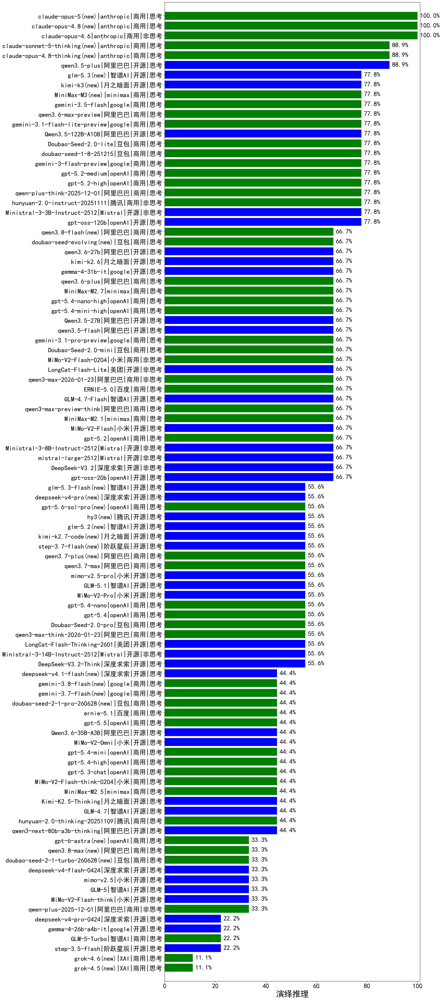

|类别|机构|大模型|【演绎推理】准确率|平均耗时|平均消耗token|花费/千次（元）|排名（准确率）|
|---|---|-----|-------------------|-------|-----------|-----------|-----------|
|商用|anthropic|claude-4-sonnet|100.0%|42s|445|38.1|1|
|商用|anthropic|claude-opus-4.6|100.0%|14s|411|54.7|2|
|商用|openAI|o4-mini|100.0%|20s|423|11.5|3|
|开源|阿里巴巴|qwen3.5-plus(new)|88.9%|48s|3655|17.2|4|
|开源|深度求索|DeepSeek-V3.1|88.9%|12s|248|2.4|5|
|商用|anthropic|claude-haiku-4.5|88.9%|11s|511|14.6|6|
|商用|google|gemini-2.5-flash|88.9%|27s|924|15.5|7|
|商用|google|gemini-2.5-pro|88.9%|37s|1528|105.9|8|
|开源|月之暗面|kimi-k2-0905|88.9%|45s|427|5.8|9|
|开源|腾讯|Hunyuan-A13B-Instruct-nothink|88.9%|662s|359|1.2|10|
|开源|阿里巴巴|qwen3-235b-a22b-instruct-2507|88.9%|18s|357|2.4|11|
|开源|meta|Llama-4-Scout-17B-16E-Instruct|88.9%|7s|514|1.0|12|
|商用|豆包|doubao-seed-1-8-251215|77.8%|19s|490|3.1|13|
|商用|腾讯|hunyuan-2.0-instruct-20251111|77.8%|7s|375|0.6|14|
|商用|google|gemini-3.1-flash-lite-preview(new)|77.8%|4s|241|1.9|15|
|商用|openAI|gpt-5.2-high|77.8%|6s|341|26.8|16|
|开源|阿里巴巴|Qwen3.5-122B-A10B(new)|77.8%|223s|4158|26.2|17|
|商用|openAI|gpt-5.2-medium|77.8%|7s|268|19.6|18|
|商用|google|gemini-3-flash-preview|77.8%|40s|1528|31.2|19|
|商用|阿里巴巴|qwen-plus-think-2025-12-01|77.8%|26s|1245|9.4|20|
|开源|深度求索|DeepSeek-V3.1-Think|77.8%|29s|590|6.5|21|
|开源|深度求索|DeepSeek-R1-0528|77.8%|129s|1375|21.2|22|
|商用|豆包|Doubao-Seed-2.0-lite(new)|77.8%|173s|825|2.6|23|
|开源|Mistral|Ministral-3-3B-Instruct-2512|77.8%|9s|543|0.4|24|
|开源|openAI|gpt-oss-120b|77.8%|41s|498|1.3|25|
|商用|anthropic|claude-sonnet-4.5(new)|77.8%|7s|503|44.0|26|
|开源|google|gemma-3-12b-it|77.8%|/|/|/|27|
|开源|google|gemma-3-27b-it|77.8%|/|/|/|28|
|开源|meta|Llama-4-Maverick-17B-128E-Instruct-FP8|75.0%|8s|563|2.2|29|
|开源|深度求索|DeepSeek-R1-0528-Qwen3-8B|71.4%|674s|1617|0.0|30|
|开源|美团|LongCat-Flash-Lite(new)|66.7%|210s|511|0.0|31|
|商用|小米|MiMo-V2-Flash-0204(new)|66.7%|45s|404|0.7|32|
|开源|智谱AI|GLM-4.7-Flash|66.7%|905s|2654|0.0|33|
|开源|Mistral|mistral-large-2512|66.7%|11s|451|4.2|34|
|开源|豆包|Seed-OSS-36B-Instruct|66.7%|127s|959|3.6|35|
|商用|阿里巴巴|qwen3-max-preview-think|66.7%|35s|1189|27.1|36|
|商用|腾讯|hunyuan-turbos-20250926|66.7%|8s|403|0.7|37|
|商用|豆包|doubao-seed-1-6-251015|66.7%|4s|521|3.4|38|
|商用|豆包|doubao-seed-1-6-lite-251015|66.7%|14s|661|1.4|39|
|开源|深度求索|DeepSeek-V3.2|66.7%|79s|331|0.9|40|
|商用|openAI|gpt-5-mini-2025-08-07|66.7%|26s|490|6.1|41|
|商用|openAI|gpt-5.1|66.7%|307s|256|13.2|42|
|商用|openAI|gpt-5.1-medium|66.7%|57s|426|25.2|43|
|商用|anthropic|claude-haiku-4.5-thinking|66.7%|13s|1548|51.3|44|
|商用|百川智能|Baichuan4-Turbo|66.7%|/|/|/|45|
|商用|openAI|gpt-5-mini-high|66.7%|73s|1711|23.8|46|
|商用|anthropic|claude-sonnet-4.5-thinking|66.7%|22s|1564|156.9|47|
|商用|openAI|gpt-5-nano-2025-08-07|66.7%|38s|1031|2.8|48|
|商用|google|gemini-3.1-pro-preview(new)|66.7%|30s|1178|94.8|49|
|开源|Mistral|Ministral-3-8B-Instruct-2512|66.7%|7s|444|0.5|50|
|开源|阿里巴巴|Qwen3.5-27B(new)|66.7%|328s|4036|19.0|51|
|开源|google|gemma-4-31b-it(new)|66.7%|15s|327|0.8|52|
|商用|阿里巴巴|qwen3.6-plus(new)|66.7%|36s|1525|17.5|53|
|商用|minimax|MiniMax-M2.1|66.7%|43s|1116|8.7|54|
|商用|百度|ERNIE-5.0|66.7%|89s|1124|25.8|55|
|商用|minimax|MiniMax-M2.7(new)|66.7%|20s|786|6.0|56|
|商用|openAI|gpt-5.4-nano-high(new)|66.7%|9s|347|2.4|57|
|开源|小米|MiMo-V2-Flash|66.7%|273s|394|0.0|58|
|商用|openAI|gpt-5.4-mini-high(new)|66.7%|16s|307|7.5|59|
|商用|阿里巴巴|qwen3-max-2026-01-23|66.7%|72s|510|4.5|60|
|开源|阿里巴巴|qwen3-235b-a22b-thinking-2507|66.7%|46s|1010|18.5|61|
|商用|openAI|gpt-5.2|66.7%|4s|220|14.8|62|
|开源|阿里巴巴|qwen3.5-flash(new)|66.7%|206s|3494|6.8|63|
|商用|阿里巴巴|qwen3-max-2025-09-23|66.7%|20s|459|9.7|64|
|商用|豆包|Doubao-Seed-2.0-mini(new)|66.7%|178s|1239|2.3|65|
|开源|阶跃星辰|step-3|66.7%|91s|1763|6.9|66|
|开源|openAI|gpt-oss-20b|66.7%|105s|490|0.5|67|
|商用|百度|ERNIE-5.0-Thinking-Preview|66.7%|93s|1152|26.4|68|
|开源|阿里巴巴|Qwen3-8B-nothink|57.1%|31s|395|0.0|69|
|商用|百度|ERNIE-X1-Turbo-32K|57.1%|359s|760|2.8|70|
|开源|Mistral|Mistral-Small-3.2-24B-Instruct-2506|57.1%|17s|868|1.8|71|
|商用|Mistral|mistral-medium-2508|57.1%|392s|332|3.9|72|
|开源|Mistral|Ministral-3-14B-Instruct-2512|55.6%|9s|348|0.5|73|
|开源|深度求索|DeepSeek-V3.2-Think|55.6%|42s|897|2.6|74|
|商用|阿里巴巴|qwen3-max-think-2026-01-23|55.6%|63s|1819|17.6|75|
|商用|openAI|gpt-5-nano-high|55.6%|319s|3032|8.6|76|
|开源|美团|LongCat-Flash-Thinking-2601|55.6%|88s|1946|0.0|77|
|开源|智谱AI|GLM-5.1(new)|55.6%|22s|903|20.4|78|
|商用|anthropic|claude-opus-4.5|55.6%|9s|496|70.8|79|
|开源|阿里巴巴|Qwen3-32B-nothink|55.6%|103s|432|1.5|80|
|商用|小米|MiMo-V2-Pro(new)|55.6%|44s|1247|21.8|81|
|开源|阿里巴巴|Qwen3-8B|55.6%|55s|1154|0.0|82|
|商用|openAI|gpt-5.4-nano(new)|55.6%|44s|231|1.4|83|
|开源|百度|ERNIE-4.5-0.3B|55.6%|31s|285|0.0|84|
|商用|openAI|gpt-5.4(new)|55.6%|5s|230|17.0|85|
|开源|腾讯|Hunyuan-A13B-Instruct|55.6%|95s|587|2.2|86|
|商用|腾讯|hunyuan-t1-20250711|55.6%|64s|745|2.7|87|
|商用|openAI|gpt-5.1-high|55.6%|102s|848|55.2|88|
|商用|阿里巴巴|qwen-flash-think-2025-07-28|55.6%|62s|1181|1.7|89|
|开源|阿里巴巴|Qwen3-30B-A3B-Instruct-2507|55.6%|36s|389|1.0|90|
|商用|豆包|Doubao-Seed-2.0-pro(new)|55.6%|371s|1691|25.6|91|
|商用|阿里巴巴|qwen-flash-2025-07-28|55.6%|52s|390|0.5|92|
|商用|阿里巴巴|qwen-turbo-think-2025-07-15|55.6%|1098s|1159|3.3|93|
|商用|阿里巴巴|qwen3-max-preview|55.6%|63s|329|6.6|94|
|开源|月之暗面|Kimi-K2-Thinking|55.6%|95s|1190|18.2|95|
|商用|小米|MiMo-V2-Flash-think-0204(new)|44.4%|1090s|2104|4.3|96|
|商用|openAI|gpt-5.4-high(new)|44.4%|9s|438|38.9|97|
|开源|月之暗面|Kimi-K2.5-Thinking|44.4%|319s|1557|31.5|98|
|商用|openAI|gpt-5.4-mini(new)|44.4%|9s|201|4.2|99|
|商用|minimax|MiniMax-M2.5(new)|44.4%|21s|1148|9.0|100|
|商用|小米|MiMo-V2-Omni(new)|44.4%|81s|1345|15.3|101|
|商用|openAI|gpt-5.3-chat(new)|44.4%|6s|379|30.2|102|
|商用|百川智能|Baichuan4-Air|44.4%|/|/|/|103|
|开源|智谱AI|GLM-4.7|44.4%|89s|3862|53.3|104|
|开源|阿里巴巴|qwen3-next-80b-a3b-instruct|44.4%|32s|364|1.2|105|
|商用|阿里巴巴|qwen-turbo-2025-07-15|44.4%|62s|301|0.2|106|
|开源|阿里巴巴|Qwen3-1.7B-nothink|44.4%|30s|341|0.8|107|
|商用|智谱AI|GLM-4.5-Flash-nothink|44.4%|24s|1138|0.0|108|
|商用|google|gemini-2.5-flash-lite|44.4%|21s|434|1.1|109|
|商用|XAI|grok-4-1-fast-reasoning|44.4%|44s|684|1.9|110|
|开源|阿里巴巴|qwen3-next-80b-a3b-thinking|44.4%|123s|2958|11.6|111|
|商用|腾讯|hunyuan-2.0-thinking-20251109|44.4%|16s|1568|6.1|112|
|开源|阿里巴巴|Qwen3-1.7B|42.9%|37s|1056|3.0|113|
|开源|智谱AI|GLM-5(new)|33.3%|82s|2740|48.3|114|
|开源|阿里巴巴|Qwen3-14B-nothink|33.3%|27s|394|0.7|115|
|开源|google|gemma-3-4b-it|33.3%|/|/|/|116|
|开源|智谱AI|GLM-4-9B-0414|33.3%|10s|310|0|117|
|商用|XAI|grok-4-1-fast-non-reasoning|33.3%|3s|440|1.1|118|
|开源|小米|MiMo-V2-Flash-think|33.3%|161s|2378|0.0|119|
|商用|阿里巴巴|qwen-plus-2025-12-01|33.3%|16s|669|1.2|120|
|开源|阿里巴巴|Qwen3-30B-A3B-Thinking-2507|33.3%|72s|1264|3.4|121|
|开源|智谱AI|GLM-4.5-Air-nothink|33.3%|43s|1034|5.8|122|
|开源|阿里巴巴|Qwen3-0.6B|28.6%|24s|755|2.1|123|
|开源|阿里巴巴|Qwen3-14B|28.6%|88s|1429|2.7|124|
|开源|阿里巴巴|Qwen3-4B|28.6%|61s|953|2.7|125|
|商用|智谱AI|GLM-4.5-Flash|22.2%|37s|1756|0.0|126|
|开源|google|gemma-4-26b-a4b-it(new)|22.2%|30s|565|1.4|127|
|商用|百度|ERNIE-X1.1-Preview|22.2%|141s|1119|4.3|128|
|开源|阶跃星辰|step-3.5-flash|22.2%|30s|1610|3.3|129|
|商用|openAI|gpt-5-2025-08-07|22.2%|79s|216|10.8|130|
|开源|阿里巴巴|Qwen3-4B-nothink|22.2%|66s|366|0.9|131|
|商用|智谱AI|GLM-5-Turbo(new)|22.2%|26s|921|19.1|132|
|开源|阿里巴巴|Qwen3-0.6B-nothink|22.2%|64s|196|0.4|133|
|开源|阿里巴巴|Qwen3-32B|14.3%|96s|1331|5.1|134|
|商用|百度|ERNIE-4.5-Turbo-32K|14.3%|11s|297|0.8|135|
|开源|百度|ERNIE-4.5-21B-A3B|11.1%|8s|361|0.0|136|
|开源|百度|ERNIE-4.5-300B-A47B|11.1%|60s|295|1.9|137|
|开源|智谱AI|GLM-4.5-Air|0.0%|53s|1843|10.7|138|
|商用|anthropic|claude-4-sonnet-thinking|0.0%|47s|541|48.2|139|

