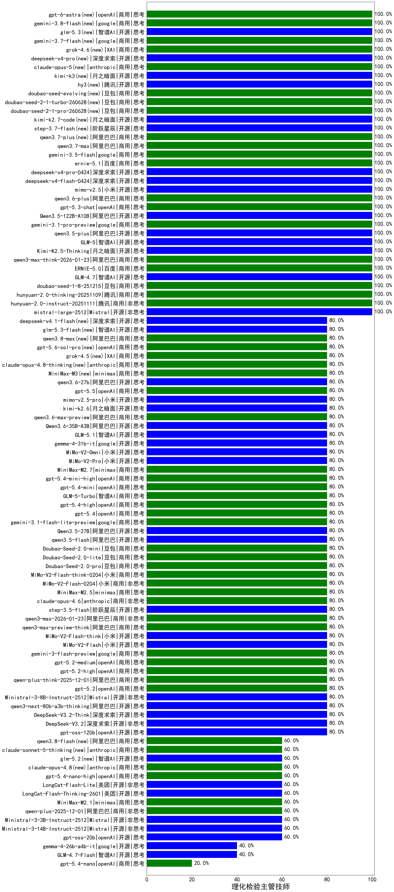

|类别|机构|大模型|【理化检验主管技师】准确率|平均耗时|平均消耗token|花费/千次（元）|排名（准确率）|
|---|---|-----|-------------------|-------|-----------|-----------|-----------|
|商用|XAI|grok-4-1-fast-reasoning|100.0%|100s|893|2.7|1|
|开源|阿里巴巴|qwen3-235b-a22b-instruct-2507|100.0%|8s|339|2.3|2|
|开源|智谱AI|GLM-5(new)|100.0%|65s|1865|32.7|3|
|商用|阿里巴巴|qwen3-max-think-2026-01-23|100.0%|240s|2777|27.2|4|
|商用|anthropic|claude-haiku-4.5-thinking|100.0%|102s|2182|75.2|5|
|商用|百度|ERNIE-5.0|100.0%|96s|2054|48.3|6|
|开源|阿里巴巴|Qwen3-8B-nothink|100.0%|19s|377|0.0|7|
|开源|智谱AI|GLM-4.7|100.0%|43s|1640|22.3|8|
|开源|智谱AI|GLM-4.5-Air|100.0%|34s|1777|10.4|9|
|开源|阿里巴巴|qwen3.5-plus(new)|100.0%|23s|2022|9.4|10|
|商用|google|gemini-3.1-pro-preview(new)|100.0%|25s|1245|101.5|11|
|商用|豆包|doubao-seed-1-8-251215|100.0%|20s|496|3.2|12|
|商用|腾讯|hunyuan-2.0-thinking-20251109|100.0%|12s|1011|3.9|13|
|开源|阿里巴巴|Qwen3.5-122B-A10B(new)|100.0%|294s|2339|14.6|14|
|商用|腾讯|hunyuan-2.0-instruct-20251111|100.0%|9s|311|0.5|15|
|商用|openAI|gpt-5.3-chat(new)|100.0%|7s|337|26.5|16|
|开源|Mistral|mistral-large-2512|100.0%|12s|474|4.5|17|
|商用|Mistral|mistral-medium-2508|100.0%|17s|387|4.6|18|
|商用|anthropic|claude-opus-4.5|100.0%|13s|473|71.4|19|
|商用|百度|ERNIE-5.0-Thinking-Preview|100.0%|184s|1441|33.6|20|
|商用|anthropic|claude-sonnet-4.5-thinking|100.0%|21s|1292|130.1|21|
|商用|anthropic|claude-sonnet-4.5(new)|100.0%|8s|502|46.7|22|
|商用|腾讯|hunyuan-turbos-20250926|100.0%|9s|387|0.7|23|
|商用|豆包|doubao-seed-1-6-lite-251015|100.0%|27s|547|1.1|24|
|商用|阿里巴巴|qwen3.6-plus(new)|100.0%|22s|1210|13.9|25|
|开源|月之暗面|Kimi-K2-Thinking|100.0%|178s|1698|26.5|26|
|开源|月之暗面|Kimi-K2.5-Thinking|100.0%|481s|2397|49.3|27|
|开源|深度求索|DeepSeek-R1-0528|85.0%|237s|1955|30.5|28|
|商用|百度|ERNIE-4.5-Turbo-32K|85.0%|22s|581|1.7|29|
|商用|百川智能|Baichuan4-Turbo|83.3%|/|/|/|30|
|开源|阶跃星辰|step-3.5-flash|80.0%|25s|1379|2.8|31|
|开源|Mistral|Ministral-3-8B-Instruct-2512|80.0%|14s|819|0.9|32|
|开源|阿里巴巴|qwen3-next-80b-a3b-thinking|80.0%|175s|3800|15.0|33|
|开源|深度求索|DeepSeek-V3.2-Think|80.0%|173s|885|2.6|34|
|开源|深度求索|DeepSeek-V3.2|80.0%|9s|256|0.7|35|
|商用|阿里巴巴|qwen3-max-2025-09-23|80.0%|184s|307|6.1|36|
|商用|openAI|gpt-5.4-high(new)|80.0%|16s|802|77.6|37|
|商用|智谱AI|GLM-5-Turbo(new)|80.0%|66s|942|19.7|38|
|商用|openAI|gpt-5.4-mini(new)|80.0%|17s|184|3.8|39|
|商用|百度|ERNIE-X1.1-Preview|80.0%|74s|503|1.8|40|
|商用|openAI|gpt-5.4-mini-high(new)|80.0%|20s|994|29.3|41|
|商用|minimax|MiniMax-M2.7(new)|80.0%|35s|1228|9.7|42|
|商用|小米|MiMo-V2-Pro(new)|80.0%|483s|883|14.2|43|
|商用|openAI|gpt-5.1-high|80.0%|112s|1294|87.2|44|
|商用|小米|MiMo-V2-Omni(new)|80.0%|133s|1118|12.2|45|
|开源|google|gemma-4-31b-it(new)|80.0%|73s|367|0.9|46|
|开源|月之暗面|kimi-k2-0905|80.0%|83s|613|8.8|47|
|商用|openAI|gpt-5.4(new)|80.0%|3s|238|18.4|48|
|商用|google|gemini-3.1-flash-lite-preview(new)|80.0%|6s|242|2.0|49|
|商用|anthropic|claude-opus-4.6|80.0%|22s|493|73.6|50|
|开源|阿里巴巴|Qwen3.5-27B(new)|80.0%|156s|2638|12.4|51|
|商用|minimax|MiniMax-M2.5(new)|80.0%|17s|979|7.7|52|
|商用|小米|MiMo-V2-Flash-0204(new)|80.0%|307s|392|0.7|53|
|商用|小米|MiMo-V2-Flash-think-0204(new)|80.0%|924s|1853|3.8|54|
|商用|豆包|Doubao-Seed-2.0-pro(new)|80.0%|238s|1047|15.4|55|
|商用|阿里巴巴|qwen3-max-preview-think|80.0%|227s|2766|65.1|56|
|商用|豆包|Doubao-Seed-2.0-lite(new)|80.0%|133s|705|2.2|57|
|开源|小米|MiMo-V2-Flash-think|80.0%|499s|2011|0.0|58|
|商用|豆包|Doubao-Seed-2.0-mini(new)|80.0%|263s|1220|2.2|59|
|开源|小米|MiMo-V2-Flash|80.0%|10s|349|0.0|60|
|开源|阿里巴巴|qwen3.5-flash(new)|80.0%|285s|2071|4.0|61|
|商用|google|gemini-3-flash-preview|80.0%|83s|791|15.7|62|
|商用|openAI|gpt-5.2-medium|80.0%|9s|331|26.3|63|
|商用|openAI|gpt-5.2-high|80.0%|10s|439|37.0|64|
|商用|阿里巴巴|qwen-plus-think-2025-12-01|80.0%|82s|3429|26.9|65|
|商用|openAI|gpt-5.2|80.0%|3s|182|11.5|66|
|商用|阿里巴巴|qwen3-max-2026-01-23|80.0%|7s|326|2.7|67|
|开源|智谱AI|GLM-5.1(new)|80.0%|149s|991|22.7|68|
|商用|anthropic|claude-haiku-4.5|80.0%|8s|520|15.8|69|
|商用|阿里巴巴|qwen-flash-2025-07-28|80.0%|8s|327|0.4|70|
|开源|阿里巴巴|qwen3-235b-a22b-thinking-2507|80.0%|222s|3287|64.5|71|
|开源|阿里巴巴|Qwen3-14B-nothink|80.0%|11s|313|0.5|72|
|商用|阿里巴巴|qwen-turbo-2025-07-15|80.0%|7s|270|0.1|73|
|开源|阿里巴巴|Qwen3-32B-nothink|80.0%|134s|386|1.3|74|
|商用|智谱AI|GLM-4.5-Flash|80.0%|34s|1901|0.0|75|
|开源|阿里巴巴|Qwen3-30B-A3B-Instruct-2507|80.0%|3s|372|1.0|76|
|开源|阿里巴巴|Qwen3-30B-A3B-Thinking-2507|80.0%|58s|3111|8.5|77|
|开源|阶跃星辰|step-3|80.0%|110s|2169|8.5|78|
|商用|腾讯|hunyuan-t1-20250711|80.0%|43s|2490|9.7|79|
|开源|openAI|gpt-oss-120b|80.0%|3s|496|1.3|80|
|商用|openAI|gpt-5-2025-08-07|80.0%|26s|430|26.8|81|
|商用|openAI|gpt-5-mini-2025-08-07|80.0%|29s|860|11.5|82|
|开源|阿里巴巴|Qwen3-4B-nothink|80.0%|15s|396|1.0|83|
|商用|anthropic|claude-4-sonnet-thinking|80.0%|6s|445|40.6|84|
|商用|openAI|gpt-5-nano-2025-08-07|80.0%|35s|1658|4.6|85|
|商用|阿里巴巴|qwen-flash-think-2025-07-28|80.0%|31s|3072|4.5|86|
|开源|Mistral|Mistral-Small-3.2-24B-Instruct-2506|80.0%|710s|367|0.7|87|
|开源|meta|Llama-4-Maverick-17B-128E-Instruct-FP8|80.0%|5s|411|1.6|88|
|商用|openAI|gpt-5.1|80.0%|116s|193|9.0|89|
|商用|豆包|doubao-seed-1-6-251015|80.0%|16s|511|3.4|90|
|开源|阿里巴巴|Qwen3-32B|80.0%|43s|1808|7.0|91|
|开源|豆包|Seed-OSS-36B-Instruct|80.0%|58s|1385|5.4|92|
|商用|阿里巴巴|qwen3-max-preview|80.0%|6s|357|7.3|93|
|商用|阿里巴巴|qwen-turbo-think-2025-07-15|80.0%|/|2355|6.9|94|
|商用|openAI|gpt-5.1-medium|80.0%|146s|582|36.6|95|
|开源|深度求索|DeepSeek-V3.1|80.0%|12s|230|2.3|96|
|开源|深度求索|DeepSeek-V3.1-Think|80.0%|67s|1267|14.7|97|
|商用|google|gemini-2.5-pro|75.0%|40s|2129|149.7|98|
|商用|百度|ERNIE-X1-Turbo-32K|75.0%|108s|2191|8.6|99|
|商用|google|gemini-2.5-flash|75.0%|11s|1529|26.5|100|
|开源|阿里巴巴|Qwen3-14B|75.0%|33s|1156|2.2|101|
|开源|腾讯|Hunyuan-A13B-Instruct|70.0%|56s|1102|4.2|102|
|商用|anthropic|claude-4-sonnet|70.0%|46s|545|50.4|103|
|开源|百度|ERNIE-4.5-300B-A47B|70.0%|23s|351|2.4|104|
|商用|百川智能|Baichuan4-Air|66.7%|/|/|/|105|
|开源|美团|LongCat-Flash-Thinking-2601|60.0%|246s|2626|0.0|106|
|开源|Mistral|Ministral-3-3B-Instruct-2512|60.0%|2s|472|0.3|107|
|开源|阿里巴巴|qwen3-next-80b-a3b-instruct|60.0%|5s|403|1.4|108|
|商用|google|gemini-2.5-flash-lite|60.0%|37s|13037|37.7|109|
|商用|openAI|gpt-5-mini-high|60.0%|865s|1818|25.4|110|
|开源|深度求索|DeepSeek-R1-0528-Qwen3-8B|60.0%|210s|1780|0.0|111|
|商用|openAI|gpt-5-nano-high|60.0%|417s|4789|13.7|112|
|开源|Mistral|Ministral-3-14B-Instruct-2512|60.0%|3s|401|0.6|113|
|商用|openAI|gpt-5.4-nano-high(new)|60.0%|75s|586|4.6|114|
|开源|百度|ERNIE-4.5-21B-A3B|60.0%|4s|374|0.0|115|
|开源|智谱AI|GLM-4-9B-0414|60.0%|13s|424|0|116|
|开源|openAI|gpt-oss-20b|60.0%|82s|940|1.0|117|
|商用|阿里巴巴|qwen-plus-2025-12-01|60.0%|16s|651|1.2|118|
|开源|美团|LongCat-Flash-Lite(new)|60.0%|55s|316|0.0|119|
|开源|智谱AI|GLM-4.5-Air-nothink|60.0%|10s|782|4.4|120|
|商用|minimax|MiniMax-M2.1|60.0%|97s|1171|9.2|121|
|开源|腾讯|Hunyuan-A13B-Instruct-nothink|60.0%|8s|242|0.8|122|
|开源|阿里巴巴|Qwen3-4B|55.0%|30s|2434|7.1|123|
|开源|阿里巴巴|Qwen3-8B|55.0%|1651s|14762|0.0|124|
|开源|google|gemma-3-12b-it|50.0%|/|/|/|125|
|开源|google|gemma-3-27b-it|45.0%|/|/|/|126|
|开源|阿里巴巴|Qwen3-1.7B|45.0%|/|/|/|127|
|开源|meta|Llama-4-Scout-17B-16E-Instruct|40.0%|11s|468|0.9|128|
|商用|XAI|grok-4-1-fast-non-reasoning|40.0%|76s|531|1.4|129|
|开源|google|gemma-4-26b-a4b-it(new)|40.0%|12s|418|1.0|130|
|商用|openAI|o4-mini|40.0%|26s|1217|36.8|131|
|开源|阿里巴巴|Qwen3-0.6B-nothink|40.0%|17s|216|0.4|132|
|商用|智谱AI|GLM-4.5-Flash-nothink|40.0%|17s|682|0.0|133|
|开源|智谱AI|GLM-4.7-Flash|40.0%|969s|3690|0.0|134|
|开源|google|gemma-3-4b-it|30.0%|/|/|/|135|
|开源|百度|ERNIE-4.5-0.3B|25.0%|56s|417|0.0|136|
|商用|openAI|gpt-5.4-nano(new)|20.0%|4s|250|1.6|137|
|开源|阿里巴巴|Qwen3-0.6B|20.0%|/|/|/|138|
|开源|阿里巴巴|Qwen3-1.7B-nothink|0.0%|8s|380|0.9|139|

