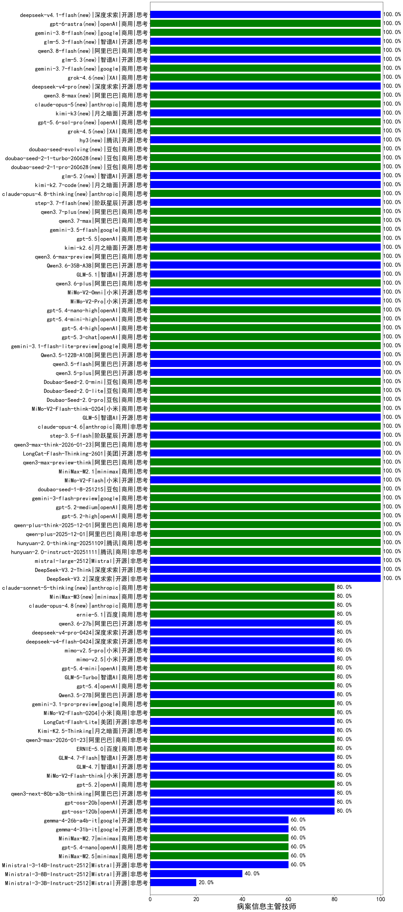

|类别|机构|大模型|【病案信息主管技师】准确率|平均耗时|平均消耗token|花费/千次（元）|排名（准确率）|
|---|---|-----|-------------------|-------|-----------|-----------|-----------|
|开源|智谱AI|GLM-5|100.0%|456s|1926|33.9|1|
|开源|阿里巴巴|Qwen3.6-35B-A3B|100.0%|98s|1496|15.6|2|
|商用|阿里巴巴|qwen3.6-plus|100.0%|45s|1548|18.0|3|
|开源|小米|MiMo-V2-Omni|100.0%|529s|1300|14.7|4|
|开源|小米|MiMo-V2-Pro|100.0%|261s|958|15.8|5|
|商用|openAI|gpt-5.4-nano-high|100.0%|6s|399|2.9|6|
|商用|openAI|gpt-5.4-mini-high|100.0%|29s|657|18.7|7|
|商用|openAI|gpt-5.4-high|100.0%|12s|671|63.7|8|
|商用|openAI|gpt-5.3-chat|100.0%|39s|338|26.6|9|
|商用|google|gemini-3.1-flash-lite-preview|100.0%|3s|376|3.4|10|
|开源|阿里巴巴|Qwen3.5-122B-A10B|100.0%|396s|3771|23.8|11|
|开源|阿里巴巴|qwen3.5-flash|100.0%|347s|2839|5.6|12|
|开源|阿里巴巴|qwen3.5-plus|100.0%|36s|2807|13.2|13|
|商用|豆包|Doubao-Seed-2.0-mini|100.0%|361s|1522|2.9|14|
|商用|豆包|Doubao-Seed-2.0-lite|100.0%|155s|710|2.2|15|
|商用|豆包|Doubao-Seed-2.0-pro|100.0%|174s|752|10.7|16|
|商用|小米|MiMo-V2-Flash-think-0204|100.0%|941s|1753|3.6|17|
|商用|anthropic|claude-opus-4.6|100.0%|10s|544|82.0|18|
|开源|阶跃星辰|step-3.5-flash|100.0%|64s|2562|5.3|19|
|商用|阿里巴巴|qwen3-max-think-2026-01-23|100.0%|178s|4693|46.4|20|
|开源|美团|LongCat-Flash-Thinking-2601|100.0%|83s|1276|0.0|21|
|商用|阿里巴巴|qwen3-max-preview-think|100.0%|94s|2372|55.7|22|
|商用|minimax|MiniMax-M2.1|100.0%|90s|1707|13.8|23|
|开源|智谱AI|GLM-5.1|100.0%|196s|1627|38.0|24|
|商用|阿里巴巴|qwen3.6-max-preview|100.0%|42s|1470|76.6|25|
|商用|豆包|doubao-seed-1-8-251215|100.0%|21s|547|3.6|26|
|开源|月之暗面|kimi-k2.6|100.0%|47s|1142|29.6|27|
|开源|智谱AI|glm-5.3(new)|100.0%|157s|1252|33.8|28|
|商用|google|gemini-3.7-flash(new)|100.0%|5s|708|17.3|29|
|商用|XAI|grok-4.6(new)|100.0%|355s|1623|60.8|30|
|开源|深度求索|deepseek-v4-pro(new)|100.0%|382s|471|10.3|31|
|商用|阿里巴巴|qwen3.8-max(new)|100.0%|16s|628|20.2|32|
|商用|anthropic|claude-opus-5(new)|100.0%|13s|734|115.5|33|
|开源|月之暗面|kimi-k3(new)|100.0%|44s|901|79.3|34|
|商用|openAI|gpt-5.6-sol-pro(new)|100.0%|14s|3211|245.0|35|
|商用|XAI|grok-4.5(new)|100.0%|36s|1661|62.4|36|
|开源|腾讯|hy3(new)|100.0%|30s|166|0.5|37|
|商用|豆包|doubao-seed-evolving(new)|100.0%|130s|5789|171.3|38|
|商用|豆包|doubao-seed-2-1-turbo-260628(new)|100.0%|159s|7893|117.2|39|
|商用|豆包|doubao-seed-2-1-pro-260628(new)|100.0%|177s|5458|161.3|40|
|开源|智谱AI|glm-5.2(new)|100.0%|88s|2941|81.0|41|
|开源|月之暗面|kimi-k2.7-code(new)|100.0%|19s|682|17.2|42|
|商用|anthropic|claude-opus-4.8-thinking(new)|100.0%|24s|891|142.9|43|
|开源|阶跃星辰|step-3.7-flash(new)|100.0%|17s|2127|16.8|44|
|商用|阿里巴巴|qwen3.7-plus(new)|100.0%|20s|934|7.1|45|
|商用|阿里巴巴|qwen3.7-max|100.0%|30s|1518|53.1|46|
|商用|google|gemini-3.5-flash|100.0%|8s|1458|88.6|47|
|商用|openAI|gpt-5.5|100.0%|8s|372|64.7|48|
|开源|小米|MiMo-V2-Flash|100.0%|39s|374|0.0|49|
|商用|阿里巴巴|qwen3.8-flash(new)|100.0%|50s|2437|6.4|50|
|商用|google|gemini-3-flash-preview|100.0%|12s|1364|27.9|51|
|开源|月之暗面|kimi-k2-0905|100.0%|60s|358|4.8|52|
|开源|深度求索|DeepSeek-V3.2-Think|100.0%|26s|792|2.3|53|
|开源|深度求索|DeepSeek-V3.2|100.0%|17s|281|0.8|54|
|商用|阿里巴巴|qwen3-max-2025-09-23|100.0%|478s|426|9.0|55|
|商用|anthropic|claude-opus-4.5|100.0%|9s|596|92.7|56|
|商用|百度|ERNIE-X1.1-Preview|100.0%|91s|488|1.8|57|
|商用|openAI|gpt-5.1-high|100.0%|137s|1228|82.4|58|
|商用|XAI|grok-4-1-fast-non-reasoning|100.0%|86s|621|1.7|59|
|商用|腾讯|hunyuan-2.0-instruct-20251111|100.0%|6s|355|0.6|60|
|商用|openAI|gpt-5.1-medium|100.0%|186s|373|21.7|61|
|商用|豆包|doubao-seed-1-6-lite-251015|100.0%|31s|676|1.4|62|
|商用|豆包|doubao-seed-1-6-251015|100.0%|6s|667|4.7|63|
|商用|腾讯|hunyuan-turbos-20250926|100.0%|12s|501|0.9|64|
|商用|阿里巴巴|qwen3-max-preview|100.0%|8s|416|8.8|65|
|商用|openAI|gpt-5-2025-08-07|100.0%|17s|298|17.1|66|
|开源|Mistral|mistral-large-2512|100.0%|11s|408|3.8|67|
|商用|anthropic|claude-sonnet-4.5-thinking|100.0%|22s|1443|146.2|68|
|商用|阿里巴巴|qwen-plus-2025-12-01|100.0%|19s|840|1.6|69|
|商用|openAI|gpt-5.2-medium|100.0%|8s|271|20.2|70|
|商用|openAI|gpt-5.2-high|100.0%|7s|331|26.2|71|
|商用|阿里巴巴|qwen-plus-think-2025-12-01|100.0%|57s|2544|19.9|72|
|商用|腾讯|hunyuan-2.0-thinking-20251109|100.0%|9s|631|2.4|73|
|商用|百度|ERNIE-5.0|80.0%|92s|1799|42.2|74|
|开源|小米|mimo-v2.5-pro|80.0%|19s|1138|19.6|75|
|开源|深度求索|deepseek-v4-pro-0424|80.0%|34s|1032|24.1|76|
|商用|XAI|grok-4-1-fast-reasoning|80.0%|91s|1669|5.5|77|
|开源|阿里巴巴|qwen3.6-27b|80.0%|30s|1891|33.1|78|
|商用|百度|ernie-5.1|80.0%|20s|769|13.0|79|
|商用|anthropic|claude-haiku-4.5|80.0%|16s|590|18.2|80|
|商用|anthropic|claude-opus-4.8(new)|80.0%|7s|464|68.2|81|
|商用|minimax|MiniMax-M3(new)|80.0%|29s|746|9.7|82|
|开源|深度求索|deepseek-v4-flash-0424|80.0%|19s|654|1.3|83|
|商用|openAI|gpt-5.1|80.0%|101s|205|9.8|84|
|开源|小米|mimo-v2.5|80.0%|36s|2077|25.7|85|
|开源|智谱AI|GLM-4.7-Flash|80.0%|539s|4429|0.0|86|
|开源|阿里巴巴|qwen3-next-80b-a3b-instruct|80.0%|15s|647|2.4|87|
|开源|豆包|Seed-OSS-36B-Instruct|80.0%|90s|1690|6.6|88|
|商用|anthropic|claude-sonnet-5-thinking(new)|80.0%|12s|864|55.3|89|
|开源|深度求索|DeepSeek-V3.1-Think|80.0%|55s|1039|12.0|90|
|开源|深度求索|DeepSeek-V3.1|80.0%|20s|382|4.1|91|
|商用|阿里巴巴|qwen-flash-2025-07-28|80.0%|8s|520|0.7|92|
|开源|智谱AI|GLM-4.7|80.0%|56s|2013|27.5|93|
|开源|月之暗面|Kimi-K2-Thinking|80.0%|60s|1031|15.8|94|
|开源|openAI|gpt-oss-120b|80.0%|7s|585|1.6|95|
|商用|阿里巴巴|qwen3-max-2026-01-23|80.0%|255s|1017|9.7|96|
|开源|openAI|gpt-oss-20b|80.0%|4s|804|0.8|97|
|商用|google|gemini-3.1-pro-preview|80.0%|41s|2651|221.4|98|
|开源|阿里巴巴|qwen3-next-80b-a3b-thinking|80.0%|165s|2834|11.1|99|
|开源|阿里巴巴|Qwen3.5-27B|80.0%|331s|2672|12.6|100|
|开源|美团|LongCat-Flash-Lite|80.0%|164s|401|0.0|101|
|商用|openAI|gpt-5-nano-high|80.0%|101s|3892|11.1|102|
|商用|openAI|gpt-5.4|80.0%|6s|269|21.5|103|
|开源|月之暗面|Kimi-K2.5-Thinking|80.0%|322s|1535|31.3|104|
|商用|智谱AI|GLM-5-Turbo|80.0%|82s|1919|41.2|105|
|商用|小米|MiMo-V2-Flash-0204|80.0%|383s|623|1.2|106|
|商用|openAI|gpt-5.4-mini|80.0%|6s|234|5.3|107|
|商用|百度|ERNIE-5.0-Thinking-Preview|80.0%|208s|1849|43.4|108|
|商用|openAI|gpt-5.2|80.0%|3s|207|13.8|109|
|开源|小米|MiMo-V2-Flash-think|80.0%|29s|1925|0.0|110|
|商用|anthropic|claude-sonnet-4.5|80.0%|12s|599|57.0|111|
|商用|openAI|gpt-5.4-nano|60.0%|30s|251|1.6|112|
|商用|minimax|MiniMax-M2.7|60.0%|27s|1044|8.2|113|
|商用|openAI|gpt-5-mini-2025-08-07|60.0%|30s|1048|14.2|114|
|商用|minimax|MiniMax-M2.5|60.0%|25s|966|7.5|115|
|开源|google|gemma-4-31b-it|60.0%|63s|521|1.3|116|
|开源|google|gemma-4-26b-a4b-it|60.0%|22s|530|1.3|117|
|商用|阿里巴巴|qwen-turbo-think-2025-07-15|60.0%|/|2533|7.4|118|
|商用|openAI|gpt-5-nano-2025-08-07|60.0%|18s|1558|4.3|119|
|开源|Mistral|Ministral-3-14B-Instruct-2512|60.0%|10s|502|0.7|120|
|商用|阿里巴巴|qwen-flash-think-2025-07-28|60.0%|26s|2900|4.3|121|
|商用|openAI|gpt-5-mini-high|40.0%|648s|2771|39.2|122|
|商用|google|gemini-2.5-flash-lite|40.0%|3s|457|1.2|123|
|商用|anthropic|claude-haiku-4.5-thinking|40.0%|18s|2330|80.5|124|
|开源|Mistral|Ministral-3-8B-Instruct-2512|40.0%|11s|650|0.7|125|
|开源|Mistral|Ministral-3-3B-Instruct-2512|20.0%|12s|974|0.7|126|

