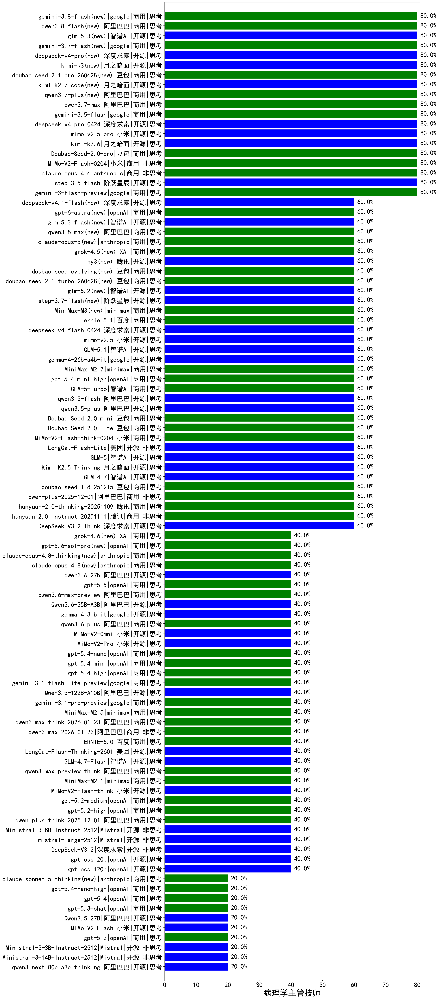

|类别|机构|大模型|【病理学主管技师】准确率|平均耗时|平均消耗token|花费/千次（元）|排名（准确率）|
|---|---|-----|-------------------|-------|-----------|-----------|-----------|
|商用|百度|ERNIE-4.5-Turbo-32K|90.0%|23s|553|1.6|1|
|商用|百川智能|Baichuan4-Turbo|85.0%|/|/|/|2|
|商用|google|gemini-3-flash-preview|80.0%|95s|1028|20.7|3|
|商用|豆包|Doubao-Seed-2.0-pro(new)|80.0%|231s|1057|15.5|4|
|开源|阿里巴巴|Qwen3-30B-A3B-Thinking-2507|80.0%|76s|2584|7.1|5|
|商用|小米|MiMo-V2-Flash-0204(new)|80.0%|365s|500|0.9|6|
|商用|anthropic|claude-opus-4.6|80.0%|10s|535|79.9|7|
|开源|阶跃星辰|step-3.5-flash|80.0%|18s|1379|2.8|8|
|商用|anthropic|claude-opus-4.5|80.0%|9s|609|94.4|9|
|开源|阿里巴巴|Qwen3-32B|80.0%|36s|1583|6.1|10|
|商用|google|gemini-2.5-pro|75.0%|32s|2365|167.1|11|
|开源|深度求索|DeepSeek-R1-0528|70.0%|191s|1529|23.6|12|
|开源|阿里巴巴|Qwen3-14B|70.0%|18s|854|1.6|13|
|商用|百度|ERNIE-X1-Turbo-32K|70.0%|79s|1818|7.1|14|
|开源|阿里巴巴|Qwen3-8B|70.0%|129s|3787|0.0|15|
|商用|google|gemini-2.5-flash|70.0%|11s|1664|29.1|16|
|商用|anthropic|claude-4-sonnet-thinking|70.0%|8s|528|48.9|17|
|商用|anthropic|claude-4-sonnet|70.0%|45s|458|41.5|18|
|商用|腾讯|hunyuan-2.0-instruct-20251111|60.0%|7s|380|0.6|19|
|商用|豆包|Doubao-Seed-2.0-lite(new)|60.0%|154s|805|2.6|20|
|开源|智谱AI|GLM-4.7|60.0%|46s|1637|22.2|21|
|开源|阿里巴巴|qwen3-next-80b-a3b-instruct|60.0%|6s|504|1.8|22|
|商用|腾讯|hunyuan-turbos-20250926|60.0%|12s|523|0.9|23|
|商用|豆包|doubao-seed-1-6-251015|60.0%|6s|575|3.9|24|
|商用|豆包|doubao-seed-1-6-lite-251015|60.0%|11s|536|1.1|25|
|开源|月之暗面|Kimi-K2-Thinking|60.0%|75s|1314|20.2|26|
|商用|openAI|gpt-5.1|60.0%|66s|153|5.6|27|
|商用|openAI|gpt-5.1-medium|60.0%|197s|424|24.8|28|
|商用|豆包|Doubao-Seed-2.0-mini(new)|60.0%|348s|1672|3.1|29|
|商用|小米|MiMo-V2-Flash-think-0204(new)|60.0%|1148s|2475|5.1|30|
|开源|深度求索|DeepSeek-V3.2-Think|60.0%|149s|1470|4.3|31|
|开源|月之暗面|kimi-k2-0905|60.0%|105s|280|3.4|32|
|开源|美团|LongCat-Flash-Lite(new)|60.0%|362s|377|0.0|33|
|开源|智谱AI|GLM-5(new)|60.0%|62s|2023|35.5|34|
|商用|阿里巴巴|qwen-plus-2025-12-01|60.0%|32s|1180|2.3|35|
|商用|阿里巴巴|qwen3-max-preview|60.0%|10s|451|9.4|36|
|商用|腾讯|hunyuan-2.0-thinking-20251109|60.0%|12s|710|2.7|37|
|开源|meta|Llama-4-Scout-17B-16E-Instruct|60.0%|9s|516|1.0|38|
|开源|月之暗面|Kimi-K2.5-Thinking|60.0%|567s|2739|56.4|39|
|开源|阿里巴巴|qwen3.5-plus(new)|60.0%|29s|2184|10.2|40|
|开源|阿里巴巴|qwen3.5-flash(new)|60.0%|332s|2979|5.8|41|
|商用|豆包|doubao-seed-1-8-251215|60.0%|21s|546|3.6|42|
|商用|智谱AI|GLM-4.5-Flash-nothink|60.0%|21s|808|0.0|43|
|开源|智谱AI|GLM-5.1(new)|60.0%|174s|1533|35.6|44|
|开源|阿里巴巴|qwen3-235b-a22b-thinking-2507|60.0%|243s|3824|75.1|45|
|开源|google|gemma-4-26b-a4b-it(new)|60.0%|83s|490|1.2|46|
|开源|阿里巴巴|Qwen3-14B-nothink|60.0%|18s|631|1.1|47|
|开源|阿里巴巴|Qwen3-32B-nothink|60.0%|19s|585|2.1|48|
|商用|腾讯|hunyuan-t1-20250711|60.0%|17s|1072|4.0|49|
|商用|minimax|MiniMax-M2.7(new)|60.0%|49s|1888|15.2|50|
|商用|openAI|gpt-5.4-mini-high(new)|60.0%|139s|1672|50.4|51|
|开源|阿里巴巴|Qwen3-4B|60.0%|41s|1938|5.6|52|
|商用|智谱AI|GLM-5-Turbo(new)|60.0%|25s|1445|30.6|53|
|商用|阿里巴巴|qwen-flash-2025-07-28|60.0%|8s|404|0.5|54|
|商用|阿里巴巴|qwen-flash-think-2025-07-28|60.0%|33s|3657|5.4|55|
|商用|openAI|o4-mini|50.0%|30s|681|20.0|56|
|开源|智谱AI|GLM-4-9B-0414|45.0%|12s|439|0|57|
|商用|minimax|MiniMax-M2.1|40.0%|74s|2688|21.9|58|
|商用|阿里巴巴|qwen3-max-2026-01-23|40.0%|12s|463|4.0|59|
|商用|阿里巴巴|qwen3-max-preview-think|40.0%|134s|3590|84.7|60|
|开源|智谱AI|GLM-4.7-Flash|40.0%|209s|1800|0.0|61|
|开源|美团|LongCat-Flash-Thinking-2601|40.0%|185s|3213|0.0|62|
|开源|小米|MiMo-V2-Flash-think|40.0%|21s|1668|0.0|63|
|商用|百度|ERNIE-5.0|40.0%|327s|4407|104.7|64|
|商用|google|gemini-3.1-pro-preview(new)|40.0%|39s|2459|204.6|65|
|开源|阿里巴巴|Qwen3.6-35B-A3B(new)|40.0%|113s|1792|18.7|66|
|商用|阿里巴巴|qwen3-max-think-2026-01-23|40.0%|290s|3956|39.0|67|
|开源|阿里巴巴|Qwen3.5-122B-A10B(new)|40.0%|351s|2841|17.8|68|
|商用|minimax|MiniMax-M2.5(new)|40.0%|26s|1056|8.3|69|
|商用|阿里巴巴|qwen3.6-plus(new)|40.0%|22s|1553|17.9|70|
|商用|小米|MiMo-V2-Omni(new)|40.0%|11s|1507|17.5|71|
|商用|小米|MiMo-V2-Pro(new)|40.0%|139s|917|14.8|72|
|商用|openAI|gpt-5.4-nano(new)|40.0%|16s|198|1.1|73|
|商用|openAI|gpt-5.4-mini(new)|40.0%|2s|166|3.0|74|
|商用|openAI|gpt-5.4-high(new)|40.0%|28s|1555|155.8|75|
|商用|google|gemini-3.1-flash-lite-preview(new)|40.0%|2s|307|2.6|76|
|开源|google|gemma-4-31b-it(new)|40.0%|75s|397|1.0|77|
|商用|阿里巴巴|qwen3.6-max-preview(new)|40.0%|56s|1578|82.0|78|
|商用|openAI|gpt-5.2-medium|40.0%|7s|375|29.8|79|
|商用|anthropic|claude-sonnet-4.5(new)|40.0%|9s|543|50.5|80|
|开源|阿里巴巴|qwen3-235b-a22b-instruct-2507|40.0%|12s|467|3.3|81|
|开源|阿里巴巴|Qwen3-8B-nothink|40.0%|157s|510|0.0|82|
|商用|智谱AI|GLM-4.5-Flash|40.0%|190s|1687|0.0|83|
|开源|阿里巴巴|Qwen3-30B-A3B-Instruct-2507|40.0%|4s|467|1.2|84|
|开源|智谱AI|GLM-4.5-Air-nothink|40.0%|12s|862|4.8|85|
|开源|openAI|gpt-oss-120b|40.0%|193s|612|1.6|86|
|开源|openAI|gpt-oss-20b|40.0%|8s|1166|1.2|87|
|开源|深度求索|DeepSeek-V3.1-Think|40.0%|68s|1201|13.9|88|
|商用|阿里巴巴|qwen-turbo-think-2025-07-15|40.0%|/|2136|6.2|89|
|商用|anthropic|claude-haiku-4.5|40.0%|9s|547|16.6|90|
|商用|anthropic|claude-haiku-4.5-thinking|40.0%|18s|1981|67.7|91|
|商用|XAI|grok-4-1-fast-reasoning|40.0%|15s|1419|4.6|92|
|商用|XAI|grok-4-1-fast-non-reasoning|40.0%|87s|650|1.8|93|
|商用|openAI|gpt-5.1-high|40.0%|113s|735|46.9|94|
|开源|豆包|Seed-OSS-36B-Instruct|40.0%|145s|1547|6.0|95|
|商用|anthropic|claude-sonnet-4.5-thinking|40.0%|21s|1274|127.5|96|
|商用|百度|ERNIE-5.0-Thinking-Preview|40.0%|350s|2344|55.2|97|
|商用|openAI|gpt-5.2-high|40.0%|12s|465|38.9|98|
|商用|阿里巴巴|qwen-plus-think-2025-12-01|40.0%|63s|2583|20.1|99|
|开源|深度求索|DeepSeek-V3.2|40.0%|14s|277|0.8|100|
|开源|Mistral|Ministral-3-8B-Instruct-2512|40.0%|3s|460|0.5|101|
|开源|Mistral|mistral-large-2512|40.0%|10s|387|3.5|102|
|商用|百度|ERNIE-X1.1-Preview|40.0%|95s|796|3.0|103|
|商用|openAI|gpt-5-2025-08-07|20.0%|37s|487|30.3|104|
|商用|阿里巴巴|qwen-turbo-2025-07-15|20.0%|7s|333|0.2|105|
|商用|openAI|gpt-5.2|20.0%|5s|162|8.7|106|
|开源|智谱AI|GLM-4.5-Air|20.0%|34s|1762|10.2|107|
|开源|Mistral|Ministral-3-3B-Instruct-2512|20.0%|3s|503|0.4|108|
|商用|openAI|gpt-5.4-nano-high(new)|20.0%|11s|751|5.9|109|
|开源|Mistral|Ministral-3-14B-Instruct-2512|20.0%|9s|557|0.8|110|
|商用|openAI|gpt-5-mini-2025-08-07|20.0%|97s|945|12.6|111|
|商用|openAI|gpt-5-nano-2025-08-07|20.0%|19s|2088|5.8|112|
|商用|openAI|gpt-5.4(new)|20.0%|5s|207|14.2|113|
|商用|openAI|gpt-5.3-chat(new)|20.0%|5s|355|27.5|114|
|开源|深度求索|DeepSeek-V3.1|20.0%|13s|261|2.6|115|
|开源|阿里巴巴|qwen3-next-80b-a3b-thinking|20.0%|161s|3914|15.4|116|
|开源|阿里巴巴|Qwen3.5-27B(new)|20.0%|239s|3057|14.4|117|
|商用|google|gemini-2.5-flash-lite|20.0%|3s|490|1.3|118|
|开源|小米|MiMo-V2-Flash|20.0%|20s|384|0.0|119|
|商用|openAI|gpt-5-nano-high|20.0%|1032s|4227|12.0|120|
|商用|阿里巴巴|qwen3-max-2025-09-23|20.0%|217s|431|9.0|121|
|商用|openAI|gpt-5-mini-high|20.0%|968s|2561|36.1|122|
|开源|阿里巴巴|Qwen3-4B-nothink|0.0%|12s|502|1.3|123|

