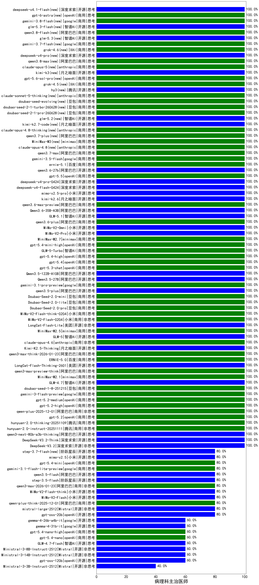

|类别|机构|大模型|【病理科主治医师】准确率|平均耗时|平均消耗token|花费/千次（元）|排名（准确率）|
|---|---|-----|-------------------|-------|-----------|-----------|-----------|
|开源|美团|LongCat-Flash-Thinking-2601(new)|100.0%|185s|1897|0.0|1|
|开源|深度求索|DeepSeek-V3.2-Exp(new)|100.0%|484s|326|0.9|2|
|商用|openAI|gpt-5.1-medium(new)|100.0%|33s|416|23.0|3|
|开源|月之暗面|Kimi-K2-Thinking(new)|100.0%|139s|950|14.3|4|
|商用|豆包|doubao-seed-1-6-lite-251015(new)|100.0%|193s|774|1.6|5|
|商用|豆包|doubao-seed-1-6-251015(new)|100.0%|12s|590|4.0|6|
|商用|XAI|grok-4-0709|100.0%|405s|978|98.9|7|
|开源|智谱AI|GLM-4.6(new)|100.0%|42s|2068|28.1|8|
|商用|腾讯|hunyuan-turbos-20250926(new)|100.0%|16s|666|1.2|9|
|商用|腾讯|hunyuan-t1-20250711|100.0%|17s|1065|3.9|10|
|商用|阿里巴巴|qwen-turbo-2025-07-15|100.0%|9s|373|0.2|11|
|开源|深度求索|DeepSeek-V3.2-Exp-Think(new)|100.0%|113s|719|2.1|12|
|开源|阿里巴巴|qwen3-235b-a22b-instruct-2507|100.0%|10s|452|3.1|13|
|商用|豆包|doubao-seed-1-6-thinking-250715|100.0%|20s|790|5.8|14|
|开源|阿里巴巴|qwen3-next-80b-a3b-instruct|100.0%|11s|536|1.9|15|
|商用|智谱AI|GLM-4.5-Flash-nothink|100.0%|17s|842|0.0|16|
|商用|阿里巴巴|qwen3-max-preview|100.0%|11s|507|10.6|17|
|商用|阿里巴巴|qwen-plus-think-2025-07-28|100.0%|/|1866|14.3|18|
|商用|阿里巴巴|qwen-plus-2025-07-28|100.0%|10s|463|0.8|19|
|商用|Mistral|mistral-medium-2508|100.0%|20s|493|5.8|20|
|开源|深度求索|DeepSeek-V3.1-Think|100.0%|34s|668|7.4|21|
|开源|深度求索|DeepSeek-V3.1|100.0%|13s|270|2.6|22|
|商用|智谱AI|GLM-4.5-Flash|100.0%|23s|1263|0.0|23|
|开源|智谱AI|GLM-4.5-Air|100.0%|40s|1291|7.3|24|
|开源|智谱AI|GLM-4.5|100.0%|37s|1250|16.6|25|
|开源|阿里巴巴|Qwen3-30B-A3B-Instruct-2507|100.0%|4s|536|1.4|26|
|商用|阿里巴巴|qwen-flash-think-2025-07-28|100.0%|22s|2297|3.3|27|
|商用|阿里巴巴|qwen-flash-2025-07-28|100.0%|8s|595|0.8|28|
|商用|anthropic|claude-haiku-4.5-thinking(new)|100.0%|44s|1587|52.6|29|
|商用|XAI|grok-4-1-fast-reasoning(new)|100.0%|8s|937|2.8|30|
|商用|google|gemini-3-pro-preview(new)|100.0%|67s|1177|94.4|31|
|开源|阿里巴巴|qwen3-next-80b-a3b-thinking(new)|100.0%|56s|2319|9.0|32|
|商用|阿里巴巴|qwen3-max-preview-think(new)|100.0%|194s|1907|44.2|33|
|商用|minimax|MiniMax-M2.1(new)|100.0%|82s|1100|8.6|34|
|开源|智谱AI|GLM-4.7(new)|100.0%|39s|1455|19.5|35|
|商用|豆包|doubao-seed-1-8-251215(new)|100.0%|22s|568|3.7|36|
|商用|google|gemini-3-flash-preview(new)|100.0%|91s|825|16.1|37|
|商用|openAI|gpt-5.2-medium(new)|100.0%|8s|293|20.0|38|
|商用|openAI|gpt-5.2-high(new)|100.0%|7s|315|22.2|39|
|商用|阿里巴巴|qwen-plus-2025-12-01(new)|100.0%|19s|738|1.4|40|
|商用|openAI|gpt-5.2(new)|100.0%|5s|247|15.4|41|
|商用|腾讯|hunyuan-2.0-thinking-20251109(new)|100.0%|14s|693|2.6|42|
|商用|腾讯|hunyuan-2.0-instruct-20251111(new)|100.0%|5s|361|0.6|43|
|开源|深度求索|DeepSeek-V3.2-Think(new)|100.0%|156s|849|2.5|44|
|开源|深度求索|DeepSeek-V3.2(new)|100.0%|13s|434|1.2|45|
|商用|阿里巴巴|qwen3-max-2025-09-23(new)|100.0%|189s|483|10.0|46|
|商用|anthropic|claude-opus-4.5(new)|100.0%|11s|807|125.6|47|
|商用|百度|ERNIE-5.0-Thinking-Preview(new)|100.0%|241s|1389|32.1|48|
|商用|百度|ERNIE-X1.1-Preview(new)|100.0%|104s|696|2.6|49|
|商用|anthropic|claude-sonnet-4.5-thinking(new)|100.0%|22s|1514|151.1|50|
|商用|anthropic|claude-sonnet-4.5(new)|100.0%|9s|628|57.3|51|
|商用|openAI|gpt-5.1-high(new)|100.0%|175s|769|48.1|52|
|开源|月之暗面|kimi-k2-0905(new)|100.0%|83s|376|4.9|53|
|商用|openAI|gpt-5-2025-08-07|100.0%|15s|245|11.5|54|
|商用|豆包|doubao-seed-1-6-flash-thinking-250615|95.0%|5s|451|0.5|55|
|开源|meta|Llama-4-Maverick-17B-128E-Instruct-FP8|95.0%|7s|448|1.7|56|
|开源|深度求索|DeepSeek-R1-0528|95.0%|230s|1381|21.3|57|
|商用|百度|ERNIE-4.5-Turbo-32K|95.0%|21s|510|1.5|58|
|商用|google|gemini-2.5-pro|95.0%|24s|2022|141.7|59|
|商用|阿里巴巴|qwen-long-2025-01-25|90.0%|38s|346|0.6|60|
|商用|豆包|doubao-seed-1-6-250615|90.0%|141s|426|2.7|61|
|开源|minimax|MiniMax-M1|90.0%|126s|1875|11.7|62|
|商用|豆包|doubao-seed-1-6-flash-250615|90.0%|3s|263|0.3|63|
|商用|豆包|Doubao-1.5-lite-32k-250115|90.0%|7s|179|0.1|64|
|商用|anthropic|claude-4-sonnet-thinking|90.0%|9s|639|58.5|65|
|开源|阿里巴巴|Qwen3-30B-A3B-Thinking-2507|90.0%|50s|2081|5.6|66|
|开源|阿里巴巴|Qwen3-32B|90.0%|28s|919|3.4|67|
|商用|百度|ERNIE-X1-Turbo-32K|85.0%|115s|1771|6.9|68|
|开源|百度|ERNIE-4.5-300B-A47B|85.0%|21s|299|1.9|69|
|商用|google|gemini-2.5-flash|85.0%|8s|1531|26.5|70|
|商用|openAI|gpt-5-nano-high(new)|80.0%|1002s|4307|12.2|71|
|商用|XAI|grok-3-mini|80.0%|220s|1102|3.9|72|
|商用|openAI|o4-mini|80.0%|26s|642|18.1|73|
|开源|Mistral|mistral-large-2512(new)|80.0%|12s|531|4.8|74|
|商用|anthropic|claude-4-sonnet|80.0%|45s|535|46.6|75|
|商用|阿里巴巴|qwen-plus-think-2025-12-01(new)|80.0%|48s|2056|15.8|76|
|开源|小米|MiMo-V2-Flash(new)|80.0%|9s|450|0.0|77|
|开源|小米|MiMo-V2-Flash-think(new)|80.0%|139s|1724|0.0|78|
|商用|anthropic|claude-haiku-4.5(new)|80.0%|12s|643|19.2|79|
|商用|openAI|gpt-5.1(new)|80.0%|89s|211|8.4|80|
|开源|minimax|MiniMax-Text-01|80.0%|14s|899|7.2|81|
|商用|openAI|gpt-5-mini-high(new)|80.0%|526s|1679|23.0|82|
|开源|智谱AI|GLM-4.5-Air-nothink|80.0%|10s|791|4.3|83|
|开源|月之暗面|kimi-k2-0711-preview|80.0%|33s|583|8.5|84|
|开源|豆包|Seed-OSS-36B-Instruct|80.0%|93s|2202|8.6|85|
|开源|openAI|gpt-oss-20b|80.0%|13s|1173|1.2|86|
|开源|智谱AI|GLM-4.5-nothink|80.0%|31s|766|9.8|87|
|开源|阶跃星辰|step-3|80.0%|73s|1409|5.4|88|
|商用|openAI|gpt-5-mini-2025-08-07|80.0%|34s|779|10.0|89|
|开源|阿里巴巴|qwen3-235b-a22b-thinking-2507|80.0%|110s|2114|40.7|90|
|商用|科大讯飞|xunfei-spark-x1-0725|80.0%|/|843|10.1|91|
|开源|百度|ERNIE-4.5-21B-A3B|75.0%|63s|313|0.0|92|
|开源|meta|Llama-4-Scout-17B-16E-Instruct|75.0%|8s|459|0.9|93|
|商用|百川智能|Baichuan4-Turbo|70.0%|/|/|/|94|
|开源|腾讯|Hunyuan-A13B-Instruct|70.0%|77s|1034|3.9|95|
|开源|阿里巴巴|Qwen3-14B|65.0%|30s|1040|2.0|96|
|开源|阿里巴巴|Qwen3-8B-nothink|60.0%|28s|604|0.0|97|
|开源|阿里巴巴|Qwen3-32B-nothink|60.0%|26s|550|1.9|98|
|开源|Mistral|Ministral-3-8B-Instruct-2512(new)|60.0%|15s|503|0.5|99|
|开源|Mistral|Ministral-3-14B-Instruct-2512(new)|60.0%|15s|597|0.9|100|
|开源|腾讯|Hunyuan-A13B-Instruct-nothink|60.0%|12s|365|1.2|101|
|商用|google|gemini-2.5-flash-lite|60.0%|7s|455|1.1|102|
|商用|openAI|gpt-5-nano-2025-08-07|60.0%|29s|1888|5.2|103|
|商用|360|360zhinao2-o1|60.0%|/|/|/|104|
|开源|Mistral|Magistral-Small-2507|60.0%|50s|4419|47.2|105|
|开源|Mistral|Mistral-Small-3.2-24B-Instruct-2506|60.0%|815s|667|1.3|106|
|开源|深度求索|DeepSeek-R1-0528-Qwen3-8B|60.0%|267s|1421|0.0|107|
|开源|minimax|MiniMax-M2(new)|60.0%|58s|2242|18.2|108|
|开源|阿里巴巴|Qwen3-1.7B-nothink|60.0%|24s|614|1.6|109|
|商用|阿里巴巴|qwen-turbo-think-2025-07-15|60.0%|/|1707|4.9|110|
|开源|openAI|gpt-oss-120b|60.0%|9s|666|1.8|111|
|开源|智谱AI|GLM-4.7-Flash(new)|60.0%|2152s|2431|0.0|112|
|开源|智谱AI|GLM-4-9B-0414|60.0%|11s|422|0.0|113|
|开源|阿里巴巴|Qwen3-8B|55.0%|326s|12045|0.0|114|
|开源|阿里巴巴|Qwen3-4B|45.0%|45s|2409|7.0|115|
|开源|google|gemma-3-12b-it|40.0%|/|/|/|116|
|开源|Mistral|Ministral-3-3B-Instruct-2512(new)|40.0%|15s|810|0.6|117|
|开源|阿里巴巴|Qwen3-1.7B|40.0%|25s|2850|8.3|118|
|商用|百川智能|Baichuan4-Air|40.0%|/|/|/|119|
|商用|百度|ERNIE-Lite-8K|40.0%|/|/|/|120|
|商用|XAI|grok-4-1-fast-non-reasoning(new)|40.0%|80s|600|1.6|121|
|开源|阿里巴巴|Qwen3-14B-nothink|40.0%|15s|624|1.1|122|
|开源|google|gemma-3-27b-it|30.0%|/|/|/|123|
|开源|google|gemma-3-4b-it|20.0%|/|/|/|124|
|开源|阿里巴巴|Qwen3-0.6B|20.0%|17s|1324|3.8|125|
|开源|阿里巴巴|Qwen3-4B-nothink|20.0%|24s|505|1.3|126|
|开源|阿里巴巴|Qwen3-0.6B-nothink|20.0%|14s|271|0.6|127|
|开源|百度|ERNIE-4.5-0.3B|15.0%|44s|359|0.0|128|

