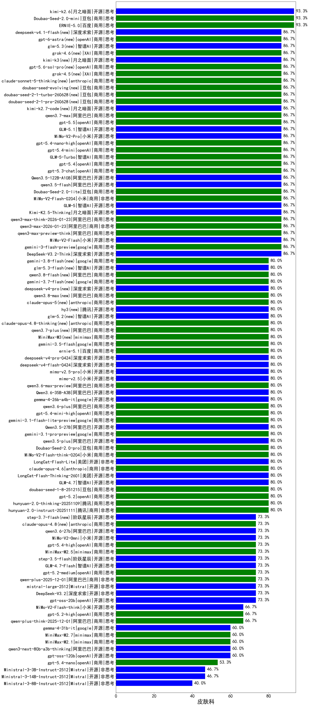

|类别|机构|大模型|【皮肤科】准确率|平均耗时|平均消耗token|花费/千次（元）|排名（准确率）|
|---|---|-----|-------------------|-------|-----------|-----------|-----------|
|商用|百度|ERNIE-4.5-Turbo-32K|95.0%|21s|522|1.5|1|
|商用|anthropic|claude-sonnet-4.5(new)|93.3%|16s|669|63.0|2|
|商用|anthropic|claude-haiku-4.5|93.3%|9s|641|19.6|3|
|商用|anthropic|claude-sonnet-4.5-thinking|93.3%|26s|1806|184.2|4|
|商用|豆包|Doubao-Seed-2.0-mini(new)|93.3%|313s|1770|3.3|5|
|商用|百度|ERNIE-X1-Turbo-32K|93.3%|57s|1329|5.1|6|
|商用|豆包|doubao-seed-1-6-250615|91.7%|117s|469|3.0|7|
|商用|豆包|doubao-seed-1-6-flash-thinking-250615|90.0%|5s|528|0.6|8|
|商用|XAI|grok-4-0709|90.0%|102s|1233|126.7|9|
|开源|百度|ERNIE-4.5-300B-A47B|88.3%|18s|336|2.2|10|
|商用|google|gemini-2.5-pro|88.3%|37s|2200|154.6|11|
|开源|月之暗面|Kimi-K2.5-Thinking|86.7%|442s|2139|43.8|12|
|商用|科大讯飞|xunfei-spark-x1-0725|86.7%|/|1118|13.4|13|
|商用|阿里巴巴|qwen3-max-preview-think|86.7%|114s|2206|51.5|14|
|开源|阿里巴巴|qwen3-235b-a22b-instruct-2507|86.7%|11s|459|3.2|15|
|商用|阿里巴巴|qwen3-max-think-2026-01-23|86.7%|190s|3890|38.3|16|
|商用|阿里巴巴|qwen3-max-2026-01-23|86.7%|83s|534|4.8|17|
|商用|豆包|doubao-seed-1-6-lite-251015|86.7%|27s|644|1.3|18|
|开源|智谱AI|GLM-4.5|86.7%|52s|1750|23.7|19|
|开源|小米|MiMo-V2-Flash|86.7%|13s|442|0.0|20|
|商用|google|gemini-3-flash-preview|86.7%|61s|923|18.3|21|
|开源|深度求索|DeepSeek-V3.2-Think|86.7%|31s|922|2.7|22|
|商用|anthropic|claude-opus-4.5|86.7%|12s|659|101.5|23|
|商用|百度|ERNIE-X1.1-Preview|86.7%|114s|692|2.6|24|
|开源|深度求索|DeepSeek-V3.1|86.7%|18s|332|3.4|25|
|商用|google|gemini-3-pro-preview|86.7%|48s|1396|113.7|26|
|商用|anthropic|claude-haiku-4.5-thinking|86.7%|25s|2260|77.4|27|
|商用|阿里巴巴|qwen3-max-preview|86.7%|8s|417|8.6|28|
|开源|豆包|Seed-OSS-36B-Instruct|86.7%|66s|1677|6.5|29|
|开源|阿里巴巴|qwen3-next-80b-a3b-instruct|86.7%|11s|516|1.8|30|
|商用|小米|MiMo-V2-Flash-0204(new)|86.7%|279s|531|1.0|31|
|开源|智谱AI|GLM-5(new)|86.7%|68s|1655|28.8|32|
|开源|智谱AI|GLM-4.6|86.7%|50s|1969|26.8|33|
|商用|anthropic|claude-4-sonnet-thinking|86.7%|48s|1286|128.5|34|
|开源|阿里巴巴|Qwen3-32B|86.7%|162s|2094|8.1|35|
|开源|阿里巴巴|qwen3.5-flash(new)|86.7%|212s|2799|5.5|36|
|商用|openAI|gpt-5.3-chat(new)|86.7%|20s|359|27.3|37|
|商用|openAI|gpt-5.4(new)|86.7%|14s|276|20.8|38|
|开源|阿里巴巴|Qwen3-14B|86.7%|114s|2756|5.4|39|
|商用|anthropic|claude-4-sonnet|86.7%|44s|588|52.6|40|
|开源|阿里巴巴|Qwen3.5-122B-A10B(new)|86.7%|168s|2369|14.8|41|
|商用|豆包|doubao-seed-1-6-flash-250615|86.7%|3s|303|0.4|42|
|商用|豆包|Doubao-Seed-2.0-lite(new)|86.7%|177s|781|2.5|43|
|商用|智谱AI|GLM-5-Turbo(new)|86.7%|26s|1151|24.1|44|
|商用|小米|MiMo-V2-Pro(new)|86.7%|141s|1066|17.9|45|
|开源|深度求索|DeepSeek-R1-0528|85.0%|215s|1606|24.9|46|
|开源|腾讯|Hunyuan-A13B-Instruct|85.0%|40s|993|3.8|47|
|开源|meta|Llama-4-Maverick-17B-128E-Instruct-FP8|83.3%|7s|523|2.0|48|
|商用|google|gemini-2.5-flash|81.7%|10s|1645|28.6|49|
|商用|百川智能|Baichuan4-Turbo|81.7%|/|/|/|50|
|商用|豆包|doubao-seed-1-6-251015|80.0%|5s|585|4.0|51|
|开源|minimax|MiniMax-M2|80.0%|19s|1403|11.1|52|
|开源|月之暗面|Kimi-K2-Thinking|80.0%|118s|1449|22.4|53|
|商用|阿里巴巴|qwen3.6-plus(new)|80.0%|34s|1482|17.1|54|
|开源|月之暗面|kimi-k2-0905|80.0%|100s|369|4.8|55|
|商用|openAI|gpt-5.1-high|80.0%|126s|845|54.2|56|
|商用|小米|MiMo-V2-Flash-think-0204(new)|80.0%|984s|1922|3.9|57|
|商用|google|gemini-3.1-flash-lite-preview(new)|80.0%|14s|359|3.1|58|
|商用|百度|ERNIE-5.0-Thinking-Preview|80.0%|288s|1820|42.6|59|
|开源|阿里巴巴|Qwen3.5-27B(new)|80.0%|274s|2942|13.8|60|
|商用|豆包|Doubao-Seed-2.0-pro(new)|80.0%|257s|1194|17.7|61|
|商用|腾讯|hunyuan-2.0-instruct-20251111|80.0%|21s|402|0.7|62|
|商用|openAI|gpt-5.2|80.0%|4s|199|11.7|63|
|商用|google|gemini-3.1-pro-preview(new)|80.0%|32s|1377|112.0|64|
|商用|豆包|doubao-seed-1-8-251215|80.0%|28s|725|5.0|65|
|开源|阿里巴巴|qwen3.5-plus(new)|80.0%|33s|2471|11.6|66|
|开源|智谱AI|GLM-4.7|80.0%|43s|1775|24.1|67|
|开源|美团|LongCat-Flash-Thinking-2601|80.0%|228s|1863|0.0|68|
|商用|anthropic|claude-opus-4.6|80.0%|16s|637|95.8|69|
|商用|腾讯|hunyuan-turbos-20250926|80.0%|13s|551|1.0|70|
|开源|美团|LongCat-Flash-Lite(new)|80.0%|80s|445|0.0|71|
|商用|阿里巴巴|qwen3-max-2025-09-23|80.0%|155s|417|8.6|72|
|开源|google|gemma-4-26b-a4b-it(new)|80.0%|48s|545|1.4|73|
|开源|阶跃星辰|step-3|80.0%|93s|1815|7.1|74|
|开源|智谱AI|GLM-4.5-Air-nothink|80.0%|18s|798|4.4|75|
|开源|智谱AI|GLM-4.5-nothink|80.0%|19s|631|8.0|76|
|商用|腾讯|hunyuan-t1-20250711|80.0%|23s|1398|5.3|77|
|商用|阿里巴巴|qwen-plus-2025-07-28|80.0%|11s|441|0.8|78|
|商用|XAI|grok-3-mini|80.0%|222s|1105|3.9|79|
|开源|meta|Llama-4-Scout-17B-16E-Instruct|80.0%|9s|558|1.1|80|
|开源|阿里巴巴|Qwen3-32B-nothink|80.0%|136s|499|1.8|81|
|开源|百度|ERNIE-4.5-21B-A3B|76.7%|21s|302|0.0|82|
|商用|openAI|o4-mini|76.7%|32s|673|19.2|83|
|开源|阿里巴巴|qwen3-235b-a22b-thinking-2507|73.3%|64s|2329|45.2|84|
|开源|智谱AI|GLM-4.7-Flash|73.3%|665s|2067|0.0|85|
|开源|深度求索|DeepSeek-V3.2|73.3%|96s|345|1.0|86|
|开源|深度求索|DeepSeek-V3.2-Exp|73.3%|173s|335|0.9|87|
|开源|阿里巴巴|Qwen3-30B-A3B-Thinking-2507|73.3%|62s|2265|6.2|88|
|开源|阿里巴巴|Qwen3-14B-nothink|73.3%|18s|535|0.9|89|
|开源|阶跃星辰|step-3.5-flash|73.3%|17s|1808|3.7|90|
|商用|智谱AI|GLM-4.5-Flash-nothink|73.3%|16s|804|0.0|91|
|开源|腾讯|Hunyuan-A13B-Instruct-nothink|73.3%|112s|342|1.1|92|
|开源|openAI|gpt-oss-20b|73.3%|9s|1002|1.0|93|
|商用|minimax|MiniMax-M2.5(new)|73.3%|18s|1009|7.8|94|
|商用|阿里巴巴|qwen-plus-2025-12-01|73.3%|22s|854|1.6|95|
|开源|深度求索|DeepSeek-V3.1-Think|73.3%|48s|923|10.5|96|
|商用|Mistral|mistral-medium-2508|73.3%|183s|551|6.8|97|
|商用|openAI|gpt-5.4-high(new)|73.3%|10s|560|50.7|98|
|商用|阿里巴巴|qwen-plus-think-2025-07-28|73.3%|/|2276|17.6|99|
|商用|小米|MiMo-V2-Omni(new)|73.3%|192s|1367|15.6|100|
|开源|阿里巴巴|Qwen3-4B|70.0%|78s|2204|6.4|101|
|开源|深度求索|DeepSeek-R1-0528-Qwen3-8B|68.3%|275s|1473|0.0|102|
|商用|百川智能|Baichuan4-Air|68.3%|/|/|/|103|
|商用|阿里巴巴|qwen-turbo-2025-07-15|66.7%|6s|350|0.2|104|
|商用|智谱AI|GLM-4.5-Flash|66.7%|24s|1315|0.0|105|
|商用|阿里巴巴|qwen-plus-think-2025-12-01|66.7%|57s|2345|18.2|106|
|开源|深度求索|DeepSeek-V3.2-Exp-Think|66.7%|217s|930|2.7|107|
|开源|Mistral|Mistral-Small-3.2-24B-Instruct-2506|66.7%|58s|501|0.9|108|
|商用|openAI|gpt-5.1-medium|66.7%|99s|527|31.6|109|
|商用|openAI|gpt-5-nano-2025-08-07|66.7%|19s|1766|4.9|110|
|商用|XAI|grok-4-1-fast-reasoning|66.7%|68s|1408|4.5|111|
|商用|openAI|gpt-5-2025-08-07|66.7%|36s|278|14.7|112|
|商用|google|gemini-2.5-flash-lite|66.7%|14s|4722|13.5|113|
|商用|openAI|gpt-5-nano-high|66.7%|650s|4406|12.5|114|
|商用|阿里巴巴|qwen-turbo-think-2025-07-15|66.7%|/|2096|6.1|115|
|开源|google|gemma-3-27b-it|65.0%|/|/|/|116|
|开源|智谱AI|GLM-4-9B-0414|63.3%|10s|414|0.0|117|
|开源|阿里巴巴|Qwen3-8B|63.3%|445s|10541|0.0|118|
|商用|openAI|gpt-5.1|60.0%|117s|198|8.3|119|
|商用|XAI|grok-4-1-fast-non-reasoning|60.0%|59s|649|1.8|120|
|开源|阿里巴巴|Qwen3-1.7B|60.0%|61s|2180|6.3|121|
|开源|阿里巴巴|Qwen3-8B-nothink|60.0%|70s|522|0.0|122|
|开源|阿里巴巴|Qwen3-4B-nothink|60.0%|19s|450|1.1|123|
|开源|阿里巴巴|Qwen3-1.7B-nothink|60.0%|8s|458|1.2|124|
|商用|openAI|gpt-5-mini-high|60.0%|289s|1742|24.1|125|
|开源|智谱AI|GLM-4.5-Air|60.0%|29s|1458|8.4|126|
|开源|openAI|gpt-oss-120b|60.0%|5s|686|1.9|127|
|开源|阿里巴巴|Qwen3-30B-A3B-Instruct-2507|60.0%|6s|612|1.7|128|
|开源|google|gemma-4-31b-it(new)|60.0%|60s|489|1.2|129|
|商用|阿里巴巴|qwen-flash-2025-07-28|60.0%|9s|610|0.8|130|
|商用|阿里巴巴|qwen-flash-think-2025-07-28|53.3%|40s|2978|4.4|131|
|开源|google|gemma-3-12b-it|48.3%|/|/|/|132|
|商用|openAI|gpt-5-mini-2025-08-07|46.7%|104s|926|12.3|133|
|开源|google|gemma-3-4b-it|41.7%|/|/|/|134|
|开源|阿里巴巴|Qwen3-0.6B|36.7%|40s|1386|3.9|135|
|开源|阿里巴巴|Qwen3-0.6B-nothink|33.3%|8s|249|0.5|136|
|开源|百度|ERNIE-4.5-0.3B|20.0%|22s|384|0.0|137|
|商用|openAI|gpt-5.4-mini(new)|/%|13s|238|5.1|138|
|商用|openAI|gpt-5.4-mini-high(new)|/%|14s|727|20.5|139|
|商用|openAI|gpt-5.4-nano(new)|/%|13s|234|1.4|140|
|商用|openAI|gpt-5.4-nano-high(new)|/%|25s|511|3.8|141|
|商用|minimax|MiniMax-M2.7(new)|/%|/|1231|9.7|142|
|商用|腾讯|hunyuan-2.0-thinking-20251109|/%|19s|690|2.6|143|
|商用|openAI|gpt-5.2-high|/%|12s|496|41.3|144|
|商用|百度|ERNIE-5.0|/%|116s|1607|37.5|145|
|开源|阿里巴巴|qwen3-next-80b-a3b-thinking|/%|96s|2967|11.6|146|
|开源|Mistral|mistral-large-2512|/%|14s|516|4.8|147|
|商用|minimax|MiniMax-M2.1|/%|73s|1092|8.5|148|
|开源|Mistral|Ministral-3-14B-Instruct-2512|/%|13s|574|0.8|149|
|开源|Mistral|Ministral-3-8B-Instruct-2512|/%|14s|911|1.0|150|
|开源|Mistral|Ministral-3-3B-Instruct-2512|/%|10s|618|0.4|151|
|商用|openAI|gpt-5.2-medium|/%|6s|320|23.8|152|
|开源|小米|MiMo-V2-Flash-think|/%|24s|1980|0.0|153|

