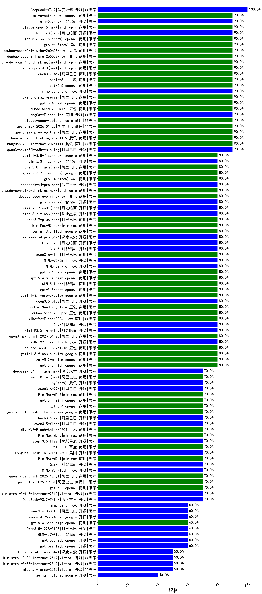

|类别|机构|大模型|【眼科】准确率|平均耗时|平均消耗token|花费/千次（元）|排名（准确率）|
|---|---|-----|-------------------|-------|-----------|-----------|-----------|
|商用|腾讯|hunyuan-turbos-20250926|100.0%|20s|853|1.6|1|
|开源|深度求索|DeepSeek-V3.2|100.0%|125s|691|2.0|2|
|商用|百度|ERNIE-X1.1-Preview|100.0%|90s|685|2.5|3|
|商用|豆包|doubao-seed-1-6-251015|90.0%|13s|994|7.1|4|
|开源|美团|LongCat-Flash-Lite(new)|90.0%|300s|615|0.0|5|
|开源|阿里巴巴|qwen3-235b-a22b-instruct-2507|90.0%|12s|557|3.9|6|
|商用|腾讯|hunyuan-2.0-instruct-20251111|90.0%|21s|557|1.0|7|
|商用|豆包|Doubao-Seed-2.0-mini(new)|90.0%|234s|2656|5.1|8|
|开源|阿里巴巴|qwen3-next-80b-a3b-thinking|90.0%|185s|4336|17.1|9|
|开源|智谱AI|GLM-4.5-nothink|90.0%|26s|748|9.5|10|
|商用|anthropic|claude-sonnet-4.5(new)|90.0%|12s|620|56.5|11|
|商用|openAI|gpt-5.1-high|90.0%|152s|1987|134.8|12|
|商用|google|gemini-3-pro-preview|90.0%|83s|2011|165.0|13|
|商用|百度|ERNIE-4.5-Turbo-32K|90.0%|20s|505|1.5|14|
|商用|阿里巴巴|qwen3-max-preview-think|90.0%|180s|3459|81.3|15|
|商用|腾讯|hunyuan-2.0-thinking-20251109|90.0%|20s|1709|6.6|16|
|商用|anthropic|claude-opus-4.6|90.0%|16s|691|103.4|17|
|商用|openAI|gpt-5.1|90.0%|156s|277|13.4|18|
|商用|openAI|gpt-5.4-high(new)|90.0%|17s|680|62.4|19|
|商用|阿里巴巴|qwen3-max-2026-01-23|90.0%|67s|567|5.0|20|
|商用|阿里巴巴|qwen-plus-2025-07-28|90.0%|14s|604|1.1|21|
|开源|百度|ERNIE-4.5-300B-A47B|87.5%|10s|340|2.3|22|
|开源|阿里巴巴|Qwen3-14B|85.0%|27s|887|1.6|23|
|商用|google|gemini-2.5-pro|82.5%|46s|2205|155.3|24|
|商用|百度|ERNIE-X1-Turbo-32K|82.5%|94s|1951|7.6|25|
|商用|阿里巴巴|qwen3-max-2025-09-23|80.0%|101s|579|12.2|26|
|商用|阿里巴巴|qwen3-max-preview|80.0%|11s|516|10.7|27|
|商用|智谱AI|GLM-4.5-Flash-nothink|80.0%|20s|976|0.0|28|
|商用|google|gemini-3.1-pro-preview(new)|80.0%|36s|1609|127.5|29|
|开源|智谱AI|GLM-4.5-Air-nothink|80.0%|13s|992|5.5|30|
|开源|阿里巴巴|qwen3-next-80b-a3b-instruct|80.0%|12s|738|2.7|31|
|商用|openAI|gpt-5.1-medium|80.0%|122s|862|54.9|32|
|商用|阿里巴巴|qwen-plus-think-2025-07-28|80.0%|/|3675|28.7|33|
|商用|豆包|Doubao-Seed-2.0-lite(new)|80.0%|293s|1278|4.2|34|
|商用|豆包|doubao-seed-1-6-lite-251015|80.0%|116s|825|1.7|35|
|开源|阿里巴巴|Qwen3-32B-nothink|80.0%|18s|619|2.2|36|
|开源|阿里巴巴|qwen3.5-plus(new)|80.0%|49s|4057|19.1|37|
|商用|豆包|Doubao-Seed-2.0-pro(new)|80.0%|298s|1412|20.9|38|
|商用|科大讯飞|xunfei-spark-x1-0725|80.0%|/|1035|12.4|39|
|商用|google|gemini-3-flash-preview|80.0%|109s|1725|35.2|40|
|商用|小米|MiMo-V2-Flash-0204(new)|80.0%|275s|1223|2.4|41|
|商用|阿里巴巴|qwen3-max-think-2026-01-23|80.0%|126s|3197|31.3|42|
|开源|月之暗面|Kimi-K2.5-Thinking|80.0%|250s|3374|69.5|43|
|商用|openAI|gpt-5.3-chat(new)|80.0%|7s|470|37.4|44|
|开源|小米|MiMo-V2-Flash-think|80.0%|148s|2499|0.0|45|
|商用|豆包|doubao-seed-1-8-251215|80.0%|33s|887|6.2|46|
|商用|google|gemini-2.5-flash|80.0%|9s|1671|29.1|47|
|商用|腾讯|hunyuan-t1-20250711|80.0%|44s|2551|9.8|48|
|商用|智谱AI|GLM-5-Turbo(new)|80.0%|59s|2706|58.1|49|
|开源|腾讯|Hunyuan-A13B-Instruct-nothink|80.0%|12s|362|1.2|50|
|开源|阿里巴巴|qwen3-235b-a22b-thinking-2507|80.0%|100s|3862|75.5|51|
|开源|智谱AI|GLM-5(new)|80.0%|107s|3004|52.9|52|
|开源|meta|Llama-4-Maverick-17B-128E-Instruct-FP8|77.5%|8s|545|2.1|53|
|商用|豆包|doubao-seed-1-6-250615|77.5%|98s|520|3.4|54|
|商用|豆包|doubao-seed-1-6-flash-thinking-250615|77.5%|17s|614|0.8|55|
|开源|阿里巴巴|Qwen3-32B|75.0%|40s|1547|5.9|56|
|商用|豆包|doubao-seed-1-6-flash-250615|75.0%|7s|326|0.4|57|
|开源|深度求索|DeepSeek-R1-0528|75.0%|249s|2127|33.2|58|
|商用|百川智能|Baichuan4-Turbo|72.5%|/|/|/|59|
|开源|阶跃星辰|step-3.5-flash|70.0%|35s|5358|11.1|60|
|开源|美团|LongCat-Flash-Thinking-2601|70.0%|416s|2993|0.0|61|
|商用|anthropic|claude-haiku-4.5|70.0%|13s|671|20.3|62|
|商用|anthropic|claude-haiku-4.5-thinking|70.0%|42s|4290|150.6|63|
|商用|anthropic|claude-sonnet-4.5-thinking|70.0%|35s|2246|230.8|64|
|商用|minimax|MiniMax-M2.1|70.0%|142s|2658|21.6|65|
|开源|月之暗面|kimi-k2-0905|70.0%|116s|758|10.9|66|
|开源|智谱AI|GLM-4.7|70.0%|93s|3127|42.9|67|
|商用|阿里巴巴|qwen-plus-think-2025-12-01|70.0%|61s|2574|19.9|68|
|商用|anthropic|claude-opus-4.5|70.0%|15s|767|118.6|69|
|开源|小米|MiMo-V2-Flash|70.0%|21s|724|0.0|70|
|开源|深度求索|DeepSeek-V3.2-Think|70.0%|194s|2303|6.8|71|
|开源|Mistral|Ministral-3-14B-Instruct-2512|70.0%|7s|688|1.0|72|
|商用|小米|MiMo-V2-Flash-think-0204(new)|70.0%|717s|2803|5.7|73|
|商用|openAI|gpt-5.2|70.0%|7s|245|15.6|74|
|商用|阿里巴巴|qwen-plus-2025-12-01|70.0%|20s|868|1.6|75|
|开源|智谱AI|GLM-4.6|70.0%|68s|2716|37.1|76|
|商用|Mistral|mistral-medium-2508|70.0%|22s|568|6.9|77|
|开源|智谱AI|GLM-4.5-Air|70.0%|64s|3564|21.0|78|
|开源|阿里巴巴|Qwen3-30B-A3B-Thinking-2507|70.0%|74s|2981|8.2|79|
|商用|openAI|gpt-5.4(new)|70.0%|16s|318|24.6|80|
|商用|anthropic|claude-4-sonnet-thinking|70.0%|46s|1104|108.7|81|
|开源|腾讯|Hunyuan-A13B-Instruct|70.0%|54s|1108|4.2|82|
|商用|XAI|grok-4-0709|70.0%|292s|1911|200.4|83|
|商用|阿里巴巴|qwen-turbo-2025-07-15|70.0%|8s|470|0.3|84|
|商用|google|gemini-3.1-flash-lite-preview(new)|70.0%|9s|423|3.7|85|
|开源|阿里巴巴|Qwen3.5-27B(new)|70.0%|401s|4046|19.0|86|
|开源|阿里巴巴|Qwen3-14B-nothink|70.0%|14s|621|1.1|87|
|开源|阿里巴巴|Qwen3-30B-A3B-Instruct-2507|70.0%|5s|597|1.6|88|
|商用|minimax|MiniMax-M2.5(new)|70.0%|69s|3059|25.0|89|
|开源|深度求索|DeepSeek-V3.2-Exp-Think|70.0%|51s|1165|3.4|90|
|开源|深度求索|DeepSeek-V3.1|70.0%|18s|393|4.1|91|
|开源|深度求索|DeepSeek-V3.2-Exp|70.0%|239s|605|1.7|92|
|商用|阿里巴巴|qwen-flash-2025-07-28|70.0%|8s|611|0.8|93|
|开源|阿里巴巴|qwen3.5-flash(new)|70.0%|336s|4619|9.1|94|
|开源|豆包|Seed-OSS-36B-Instruct|70.0%|148s|3214|12.6|95|
|开源|百度|ERNIE-4.5-21B-A3B|67.5%|31s|336|0.0|96|
|开源|meta|Llama-4-Scout-17B-16E-Instruct|67.5%|12s|603|1.2|97|
|商用|XAI|grok-3-mini|65.0%|155s|1163|4.1|98|
|开源|智谱AI|GLM-4-9B-0414|65.0%|10s|464|0.0|99|
|商用|anthropic|claude-4-sonnet|65.0%|42s|612|55.2|100|
|商用|XAI|grok-4-1-fast-reasoning|60.0%|56s|1661|5.4|101|
|商用|openAI|gpt-5-nano-2025-08-07|60.0%|89s|2909|8.2|102|
|商用|阿里巴巴|qwen-turbo-think-2025-07-15|60.0%|/|3960|11.6|103|
|开源|阿里巴巴|Qwen3.5-122B-A10B(new)|60.0%|256s|4191|26.3|104|
|开源|智谱AI|GLM-4.7-Flash|60.0%|1314s|11607|0.0|105|
|商用|openAI|gpt-5-mini-2025-08-07|60.0%|29s|1114|14.9|106|
|开源|minimax|MiniMax-M2|60.0%|42s|2629|21.4|107|
|开源|深度求索|DeepSeek-V3.1-Think|60.0%|55s|1059|12.1|108|
|商用|智谱AI|GLM-4.5-Flash|60.0%|54s|3019|0.0|109|
|开源|月之暗面|Kimi-K2-Thinking|60.0%|456s|7706|122.3|110|
|开源|智谱AI|GLM-4.5|60.0%|169s|3153|43.2|111|
|开源|阶跃星辰|step-3|60.0%|164s|3204|12.6|112|
|开源|openAI|gpt-oss-120b|60.0%|24s|1070|3.1|113|
|商用|openAI|gpt-5-nano-high|60.0%|658s|6301|18.0|114|
|开源|阿里巴巴|Qwen3-8B-nothink|60.0%|37s|815|0.0|115|
|开源|openAI|gpt-oss-20b|60.0%|9s|1174|1.2|116|
|商用|百度|ERNIE-5.0-Thinking-Preview|60.0%|312s|2881|67.8|117|
|商用|openAI|gpt-5-2025-08-07|60.0%|24s|407|23.5|118|
|开源|google|gemma-3-27b-it|55.0%|/|/|/|119|
|商用|openAI|o4-mini|55.0%|32s|1159|34.7|120|
|开源|阿里巴巴|Qwen3-8B|52.5%|269s|7842|0.0|121|
|开源|深度求索|DeepSeek-R1-0528-Qwen3-8B|52.5%|206s|1807|0.0|122|
|商用|openAI|gpt-5-mini-high|50.0%|531s|2533|35.5|123|
|开源|Mistral|Ministral-3-8B-Instruct-2512|50.0%|15s|928|1.0|124|
|商用|google|gemini-2.5-flash-lite|50.0%|23s|7227|20.8|125|
|开源|阿里巴巴|Qwen3-4B|45.0%|28s|1988|5.7|126|
|开源|阿里巴巴|Qwen3-1.7B|45.0%|23s|1781|5.1|127|
|商用|百川智能|Baichuan4-Air|42.5%|/|/|/|128|
|开源|google|gemma-3-12b-it|42.5%|/|/|/|129|
|开源|google|gemma-3-4b-it|40.0%|/|/|/|130|
|商用|阿里巴巴|qwen-flash-think-2025-07-28|40.0%|37s|4006|5.9|131|
|开源|阿里巴巴|Qwen3-4B-nothink|40.0%|16s|491|1.2|132|
|开源|阿里巴巴|Qwen3-0.6B|32.5%|7s|1398|4.0|133|
|开源|阿里巴巴|Qwen3-0.6B-nothink|30.0%|14s|282|0.6|134|
|商用|XAI|grok-4-1-fast-non-reasoning|30.0%|69s|625|1.7|135|
|开源|Mistral|Mistral-Small-3.2-24B-Instruct-2506|30.0%|18s|834|1.6|136|
|开源|阿里巴巴|Qwen3-1.7B-nothink|30.0%|11s|562|1.4|137|
|开源|百度|ERNIE-4.5-0.3B|25.0%|32s|393|0.0|138|
|商用|openAI|gpt-5.4-nano-high(new)|/%|76s|1002|8.0|139|
|商用|openAI|gpt-5.4-nano(new)|/%|55s|257|1.5|140|
|商用|openAI|gpt-5.4-mini-high(new)|/%|45s|799|22.5|141|
|商用|openAI|gpt-5.4-mini(new)|/%|10s|295|6.6|142|
|商用|百度|ERNIE-5.0|/%|235s|2904|68.3|143|
|商用|openAI|gpt-5.2-medium|/%|10s|521|43.0|144|
|开源|Mistral|mistral-large-2512|/%|13s|584|5.4|145|
|开源|Mistral|Ministral-3-3B-Instruct-2512|/%|13s|637|0.5|146|
|商用|openAI|gpt-5.2-high|/%|22s|916|82.2|147|
|商用|minimax|MiniMax-M2.7(new)|/%|41s|1740|13.9|148|

