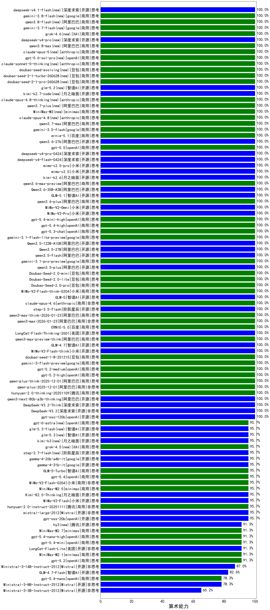

|类别|机构|大模型|【算术能力】准确率|平均耗时|平均消耗token|花费/千次（元）|排名（准确率）|
|---|---|-----|-------------------|-------|-----------|-----------|-----------|
|开源|阶跃星辰|step-3.5-flash(new)|100.0%|21s|1374|2.8|1|
|开源|深度求索|DeepSeek-V3.2-Think(new)|100.0%|26s|807|2.4|2|
|商用|openAI|gpt-5-nano-2025-08-07|100.0%|53s|752|2.1|3|
|商用|openAI|gpt-5-mini-2025-08-07|100.0%|46s|352|4.9|4|
|开源|openAI|gpt-oss-120b|100.0%|14s|379|1.1|5|
|开源|阿里巴巴|Qwen3-30B-A3B-Thinking-2507|100.0%|113s|1677|4.6|6|
|开源|智谱AI|GLM-4.5-Air|100.0%|181s|4337|25.9|7|
|开源|深度求索|DeepSeek-V3.2(new)|100.0%|135s|236|0.7|8|
|商用|XAI|grok-4-1-fast-reasoning|100.0%|6s|683|2.0|9|
|商用|阿里巴巴|qwen-plus-think-2025-12-01(new)|100.0%|24s|1200|9.3|10|
|开源|阿里巴巴|qwen3-235b-a22b-thinking-2507|100.0%|167s|1766|23.6|11|
|商用|豆包|doubao-seed-1-6-thinking-250715|100.0%|5s|776|6.0|12|
|商用|腾讯|hunyuan-2.0-thinking-20251109|100.0%|9s|860|3.4|13|
|商用|腾讯|hunyuan-t1-20250711|100.0%|18s|704|2.6|14|
|开源|月之暗面|kimi-k2-0711-preview|100.0%|41s|205|3.0|15|
|商用|google|gemini-2.5-pro|100.0%|23s|1485|106.5|16|
|商用|阿里巴巴|qwen-flash-think-2025-07-28|100.0%|49s|1808|2.7|17|
|开源|深度求索|DeepSeek-V3.1|100.0%|25s|461|5.4|18|
|开源|深度求索|DeepSeek-V3.1-Think|100.0%|251s|4901|58.7|19|
|商用|百度|ERNIE-X1.1-Preview|100.0%|301s|6196|24.7|20|
|商用|anthropic|claude-sonnet-4.5-thinking|100.0%|15s|901|91.7|21|
|商用|anthropic|claude-sonnet-4.5(new)|100.0%|3s|153|12.9|22|
|商用|阿里巴巴|qwen-plus-think-2025-07-28|100.0%|/|1248|9.7|23|
|商用|阿里巴巴|qwen-turbo-think-2025-07-15|100.0%|/|3275|9.7|24|
|开源|豆包|Seed-OSS-36B-Instruct|100.0%|51s|1086|4.2|25|
|开源|深度求索|DeepSeek-V3.2-Exp|100.0%|544s|243|0.7|26|
|开源|深度求索|DeepSeek-V3.2-Exp-Think|100.0%|657s|1288|3.8|27|
|商用|豆包|doubao-seed-1-6-251015|100.0%|85s|496|3.5|28|
|商用|豆包|doubao-seed-1-6-lite-251015|100.0%|11s|468|1.0|29|
|开源|minimax|MiniMax-M2|100.0%|26s|2090|17.2|30|
|开源|月之暗面|Kimi-K2-Thinking|100.0%|262s|3700|58.8|31|
|商用|openAI|gpt-5.1-high|100.0%|152s|845|58.0|32|
|商用|google|gemini-3-pro-preview(new)|100.0%|104s|1709|143.5|33|
|商用|阿里巴巴|qwen-plus-2025-12-01(new)|100.0%|13s|502|1.0|34|
|开源|阿里巴巴|qwen3-next-80b-a3b-thinking|100.0%|107s|1109|4.3|35|
|开源|腾讯|Hunyuan-A13B-Instruct|100.0%|204s|844|3.3|36|
|开源|深度求索|DeepSeek-R1-0528-Qwen3-8B|100.0%|677s|5783|0.0|37|
|商用|百度|ERNIE-4.5-Turbo-32K|100.0%|76s|326|1.0|38|
|开源|深度求索|DeepSeek-R1-0528|100.0%|273s|5468|87.3|39|
|商用|openAI|o4-mini|100.0%|90s|724|22.7|40|
|开源|小米|MiMo-V2-Flash-think(new)|100.0%|79s|4964|0.0|41|
|开源|阿里巴巴|Qwen3-4B|100.0%|171s|3083|9.2|42|
|开源|阿里巴巴|Qwen3-8B|100.0%|428s|11854|0.0|43|
|开源|阿里巴巴|Qwen3-14B|100.0%|342s|7810|15.6|44|
|开源|阿里巴巴|Qwen3-32B|100.0%|265s|6120|24.4|45|
|开源|智谱AI|GLM-4.7(new)|100.0%|35s|1638|22.6|46|
|商用|阿里巴巴|qwen3-max-preview-think(new)|100.0%|29s|1038|24.2|47|
|开源|美团|LongCat-Flash-Thinking-2601(new)|100.0%|497s|1791|0.0|48|
|商用|百度|ERNIE-5.0(new)|100.0%|371s|4152|99.1|49|
|商用|豆包|Doubao-1.5-lite-32k-250115|100.0%|3s|137|0.1|50|
|商用|阿里巴巴|qwen3-max-2026-01-23(new)|100.0%|5s|162|1.3|51|
|商用|阿里巴巴|qwen3-max-think-2026-01-23(new)|100.0%|352s|2126|21.0|52|
|商用|百度|ERNIE-X1-Turbo-32K|100.0%|521s|4085|16.3|53|
|商用|anthropic|claude-haiku-4.5-thinking|100.0%|39s|1224|41.8|54|
|商用|豆包|doubao-seed-1-6-flash-thinking-250615|100.0%|5s|1222|1.7|55|
|商用|openAI|gpt-5.2-high(new)|100.0%|4s|242|21.2|56|
|商用|google|gemini-3-flash-preview(new)|100.0%|15s|930|19.3|57|
|商用|豆包|doubao-seed-1-8-251215(new)|100.0%|15s|327|2.1|58|
|开源|minimax|MiniMax-M1|100.0%|241s|2381|16.7|59|
|商用|openAI|gpt-5.2-medium(new)|100.0%|7s|205|17.6|60|
|开源|百度|ERNIE-4.5-21B-A3B|95.7%|163s|353|0.1|61|
|商用|360|360zhinao2-o1|95.7%|425s|5880|58.7|62|
|开源|百度|ERNIE-4.5-300B-A47B|95.7%|243s|321|2.4|63|
|商用|阿里巴巴|qwen-plus-2025-07-28|95.7%|5s|212|0.4|64|
|商用|腾讯|hunyuan-turbos-20250926|95.7%|10s|417|0.8|65|
|商用|腾讯|hunyuan-2.0-instruct-20251111|95.7%|9s|380|0.7|66|
|开源|阿里巴巴|qwen3-235b-a22b-instruct-2507|95.7%|17s|202|1.5|67|
|开源|阿里巴巴|qwen3-next-80b-a3b-instruct|95.7%|10s|251|0.9|68|
|商用|阿里巴巴|qwen3-max-preview|95.7%|5s|254|5.4|69|
|开源|月之暗面|kimi-k2-0905|95.7%|60s|115|1.2|70|
|开源|meta|Llama-4-Maverick-17B-128E-Instruct-FP8|95.7%|2s|147|0.6|71|
|开源|月之暗面|Kimi-K2.5-Thinking(new)|95.7%|326s|1985|41.1|72|
|开源|智谱AI|GLM-4.6|95.7%|27s|1239|17.0|73|
|开源|智谱AI|GLM-4.5|95.7%|117s|4446|62.0|74|
|开源|阿里巴巴|Qwen3-30B-A3B-Instruct-2507|95.7%|16s|202|0.5|75|
|开源|Mistral|mistral-large-2512(new)|95.7%|7s|292|2.9|76|
|商用|智谱AI|GLM-4.5-Flash|95.7%|189s|4369|0.0|77|
|商用|阿里巴巴|qwen3-max-2025-09-23|95.7%|51s|160|3.2|78|
|开源|智谱AI|GLM-4.5-Air-nothink|95.7%|28s|672|3.9|79|
|商用|anthropic|claude-opus-4.5(new)|95.7%|3s|152|20.8|80|
|开源|阿里巴巴|Qwen3-32B-nothink|95.7%|40s|171|0.6|81|
|开源|openAI|gpt-oss-20b|95.7%|74s|871|1.0|82|
|商用|openAI|gpt-5-2025-08-07|95.7%|30s|449|22.1|83|
|开源|阿里巴巴|Qwen3-14B-nothink|95.7%|42s|184|0.3|84|
|商用|openAI|gpt-5-nano-high|95.7%|764s|5090|14.7|85|
|商用|百度|ERNIE-5.0-Thinking-Preview|95.7%|479s|4532|108.2|86|
|开源|小米|MiMo-V2-Flash(new)|95.7%|52s|202|0.0|87|
|开源|阿里巴巴|Qwen3-1.7B|95.7%|108s|3129|9.3|88|
|商用|google|gemini-2.5-flash-lite|95.7%|22s|327|0.9|89|
|商用|minimax|MiniMax-M2.1(new)|91.3%|38s|1699|13.8|90|
|商用|openAI|gpt-5-mini-high|91.3%|56s|1702|24.3|91|
|商用|openAI|gpt-5.2(new)|91.3%|3s|83|5.4|92|
|商用|阿里巴巴|qwen-long-2025-01-25|91.3%|148s|130|0.2|93|
|商用|阿里巴巴|qwen-turbo-2025-07-15|91.3%|18s|161|0.1|94|
|开源|智谱AI|GLM-4.5-nothink|91.3%|10s|216|2.8|95|
|商用|anthropic|claude-4-sonnet-thinking|91.3%|41s|169|14.6|96|
|商用|豆包|doubao-seed-1-6-flash-250615|91.3%|3s|1479|2.2|97|
|商用|google|gemini-2.5-flash|91.3%|15s|738|13.1|98|
|商用|XAI|grok-3-mini|91.3%|104s|1083|3.9|99|
|商用|anthropic|claude-haiku-4.5|91.3%|8s|153|3.9|100|
|商用|科大讯飞|xunfei-spark-x1-0725|91.3%|244s|1506|18.1|101|
|开源|阶跃星辰|step-3|91.3%|279s|4700|18.7|102|
|商用|阿里巴巴|qwen-flash-2025-07-28|91.3%|25s|186|0.2|103|
|商用|智谱AI|GLM-4.5-Flash-nothink|91.3%|6s|348|0.0|104|
|商用|Mistral|mistral-medium-2508|91.3%|36s|361|4.8|105|
|开源|Mistral|Mistral-Small-3.2-24B-Instruct-2506|91.3%|13s|242|0.5|106|
|商用|openAI|gpt-5.1|87.0%|9s|87|4.1|107|
|商用|XAI|grok-4-0709|87.0%|265s|2185|235.9|108|
|开源|Mistral|Magistral-Small-2507|87.0%|496s|4435|48.0|109|
|商用|anthropic|claude-4-sonnet|87.0%|67s|46|0.0|110|
|开源|Mistral|Ministral-3-14B-Instruct-2512(new)|87.0%|14s|206|0.3|111|
|开源|阿里巴巴|Qwen3-4B-nothink|87.0%|12s|181|0.5|112|
|开源|阿里巴巴|Qwen3-1.7B-nothink|82.6%|12s|195|0.5|113|
|开源|阿里巴巴|Qwen3-8B-nothink|82.6%|32s|194|0.0|114|
|商用|openAI|gpt-5.1-medium|82.6%|48s|579|39.1|115|
|开源|智谱AI|GLM-4.7-Flash(new)|82.6%|1985s|1230|0.0|116|
|开源|Mistral|Ministral-3-8B-Instruct-2512(new)|78.3%|12s|286|0.3|117|
|开源|阿里巴巴|Qwen3-0.6B|78.3%|79s|2311|6.9|118|
|开源|meta|Llama-4-Scout-17B-16E-Instruct|78.3%|1s|87|0.2|119|
|开源|google|gemma-3-27b-it|73.9%|/|/|/|120|
|开源|minimax|MiniMax-Text-01|69.6%|5s|746|6.0|121|
|商用|百川智能|Baichuan4-Turbo|69.6%|/|/|/|122|
|商用|XAI|grok-4-1-fast-non-reasoning|69.6%|1s|226|0.4|123|
|商用|百川智能|Baichuan4-Air|69.6%|/|/|/|124|
|开源|Mistral|Ministral-3-3B-Instruct-2512(new)|65.2%|11s|280|0.2|125|
|商用|豆包|doubao-seed-1-6-250615|60.9%|106s|143|0.8|126|
|开源|腾讯|Hunyuan-A13B-Instruct-nothink|52.2%|47s|103|0.3|127|
|开源|google|gemma-3-4b-it|52.2%|/|/|/|128|
|开源|google|gemma-3-12b-it|47.8%|/|/|/|129|
|开源|阿里巴巴|Qwen3-0.6B-nothink|47.8%|10s|184|0.5|130|
|开源|智谱AI|GLM-4-9B-0414|39.1%|8s|167|0.0|131|
|商用|百度|ERNIE-Lite-8K|30.4%|/|/|/|132|
|开源|百度|ERNIE-4.5-0.3B|8.7%|130s|333|0.0|133|

