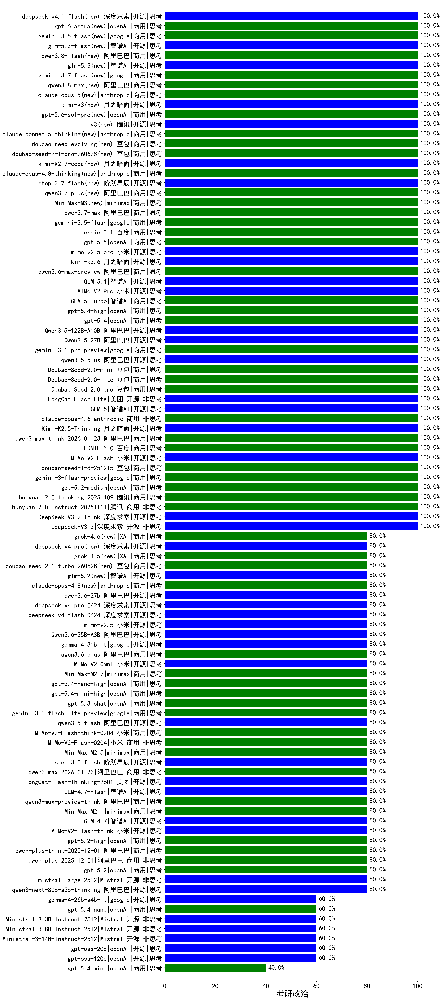

|类别|机构|大模型|【考研政治】准确率|平均耗时|平均消耗token|花费/千次（元）|排名（准确率）|
|---|---|-----|-------------------|-------|-----------|-----------|-----------|
|商用|百川智能|Baichuan4-Turbo(new)|100.0%|/|/|/|1|
|商用|阿里巴巴|qwen3-max-preview(new)|100.0%|10s|512|11.0|2|
|商用|百度|ERNIE-5.0(new)|100.0%|80s|1494|34.8|3|
|开源|小米|MiMo-V2-Flash(new)|100.0%|24s|482|0.0|4|
|商用|豆包|doubao-seed-1-8-251215(new)|100.0%|25s|708|4.9|5|
|商用|google|gemini-3-flash-preview(new)|100.0%|12s|1202|24.4|6|
|商用|openAI|gpt-5.2-medium(new)|100.0%|10s|501|42.3|7|
|商用|腾讯|hunyuan-2.0-thinking-20251109(new)|100.0%|10s|1120|4.3|8|
|商用|腾讯|hunyuan-2.0-instruct-20251111(new)|100.0%|3s|414|0.7|9|
|开源|深度求索|DeepSeek-V3.2-Think(new)|100.0%|39s|1155|3.4|10|
|开源|深度求索|DeepSeek-V3.2(new)|100.0%|101s|377|1.1|11|
|商用|anthropic|claude-opus-4.5(new)|100.0%|15s|854|136.9|12|
|商用|openAI|gpt-5.1-high(new)|100.0%|49s|682|43.1|13|
|开源|月之暗面|kimi-k2-0905(new)|100.0%|68s|478|6.6|14|
|商用|openAI|gpt-5.1-medium(new)|100.0%|203s|639|40.0|15|
|商用|豆包|doubao-seed-1-6-lite-251015(new)|100.0%|20s|867|1.9|16|
|商用|豆包|doubao-seed-1-6-251015(new)|100.0%|7s|713|5.0|17|
|商用|阿里巴巴|qwen3-max-think-2026-01-23(new)|100.0%|173s|3533|34.8|18|
|开源|月之暗面|Kimi-K2.5-Thinking(new)|100.0%|261s|1704|34.6|19|
|商用|anthropic|claude-opus-4.6(new)|100.0%|11s|654|99.6|20|
|开源|阿里巴巴|Qwen3.5-122B-A10B(new)|100.0%|122s|2687|16.8|21|
|商用|阿里巴巴|qwen3.6-max-preview(new)|100.0%|52s|1712|89.2|22|
|开源|智谱AI|GLM-5.1(new)|100.0%|271s|2139|50.1|23|
|商用|小米|MiMo-V2-Pro(new)|100.0%|15s|1141|19.6|24|
|商用|智谱AI|GLM-5-Turbo(new)|100.0%|18s|1242|26.2|25|
|商用|openAI|gpt-5.4-high(new)|100.0%|10s|572|52.5|26|
|商用|openAI|gpt-5.4(new)|100.0%|7s|341|28.3|27|
|开源|阿里巴巴|Qwen3.5-27B(new)|100.0%|349s|3029|14.2|28|
|开源|智谱AI|GLM-5(new)|100.0%|73s|1830|32.0|29|
|商用|google|gemini-3.1-pro-preview(new)|100.0%|48s|1790|147.7|30|
|开源|阿里巴巴|qwen3.5-plus(new)|100.0%|26s|2335|10.9|31|
|商用|豆包|Doubao-Seed-2.0-mini(new)|100.0%|288s|1896|3.6|32|
|商用|豆包|Doubao-Seed-2.0-lite(new)|100.0%|151s|772|2.4|33|
|商用|豆包|Doubao-Seed-2.0-pro(new)|100.0%|231s|977|14.2|34|
|开源|美团|LongCat-Flash-Lite(new)|100.0%|116s|520|0.0|35|
|商用|腾讯|hunyuan-turbos-20250926(new)|100.0%|16s|652|1.2|36|
|开源|月之暗面|kimi-k2.6(new)|100.0%|54s|1362|35.4|37|
|开源|智谱AI|GLM-4-9B-0414(new)|100.0%|10s|632|0|38|
|开源|智谱AI|GLM-4.5-Air-nothink(new)|100.0%|19s|1105|6.3|39|
|商用|百度|ERNIE-4.5-Turbo-32K(new)|100.0%|22s|533|1.6|40|
|开源|阿里巴巴|Qwen3-32B-nothink(new)|100.0%|18s|548|2.0|41|
|商用|智谱AI|GLM-4.5-Flash-nothink(new)|100.0%|19s|1018|0.0|42|
|商用|阿里巴巴|qwen-flash-2025-07-28(new)|100.0%|9s|624|0.8|43|
|商用|google|gemini-2.5-pro(new)|100.0%|42s|2030|142.4|44|
|开源|阿里巴巴|Qwen3-30B-A3B-Instruct-2507(new)|100.0%|5s|598|1.6|45|
|开源|阿里巴巴|qwen3-235b-a22b-instruct-2507(new)|100.0%|12s|516|3.7|46|
|商用|腾讯|hunyuan-t1-20250711(new)|100.0%|19s|1146|4.3|47|
|开源|阿里巴巴|Qwen3-4B(new)|92.3%|112s|1443|4.1|48|
|开源|阿里巴巴|Qwen3-8B(new)|92.3%|144s|3315|0.0|49|
|开源|深度求索|DeepSeek-R1-0528(new)|92.3%|130s|1451|22.4|50|
|商用|google|gemini-2.5-flash(new)|92.3%|9s|1426|24.6|51|
|商用|百度|ERNIE-X1-Turbo-32K(new)|92.3%|34s|805|3.0|52|
|开源|阿里巴巴|Qwen3-14B(new)|92.3%|163s|3136|6.2|53|
|开源|阿里巴巴|Qwen3-32B(new)|92.3%|200s|1456|5.6|54|
|商用|openAI|o4-mini(new)|90.0%|15s|649|18.4|55|
|商用|anthropic|claude-4-sonnet-thinking(new)|90.0%|70s|658|62.4|56|
|开源|阿里巴巴|Qwen3-30B-A3B-Thinking-2507(new)|90.0%|52s|1917|5.2|57|
|商用|阿里巴巴|qwen-turbo-2025-07-15(new)|80.0%|10s|404|0.2|58|
|开源|深度求索|DeepSeek-V3.1-Think(new)|80.0%|86s|1669|19.5|59|
|开源|阶跃星辰|step-3.5-flash(new)|80.0%|18s|1953|4.0|60|
|开源|阿里巴巴|qwen3-235b-a22b-thinking-2507(new)|80.0%|48s|2116|41.0|61|
|开源|阿里巴巴|Qwen3-4B-nothink(new)|80.0%|13s|453|1.2|62|
|商用|阿里巴巴|qwen3-max-2026-01-23(new)|80.0%|124s|554|5.0|63|
|开源|美团|LongCat-Flash-Thinking-2601(new)|80.0%|137s|1730|0.0|64|
|开源|智谱AI|GLM-4.7-Flash(new)|80.0%|1401s|4436|0.0|65|
|商用|minimax|MiniMax-M2.5(new)|80.0%|20s|1017|7.9|66|
|商用|anthropic|claude-4-sonnet(new)|80.0%|41s|602|54.0|67|
|商用|小米|MiMo-V2-Flash-0204(new)|80.0%|251s|555|1.0|68|
|商用|小米|MiMo-V2-Flash-think-0204(new)|80.0%|1182s|2370|4.9|69|
|商用|minimax|MiniMax-M2.1(new)|80.0%|101s|1377|10.9|70|
|开源|阿里巴巴|qwen3.5-flash(new)|80.0%|245s|3698|7.3|71|
|商用|google|gemini-3.1-flash-lite-preview(new)|80.0%|6s|419|3.8|72|
|商用|openAI|gpt-5.3-chat(new)|80.0%|24s|446|36.4|73|
|商用|openAI|gpt-5.4-mini-high(new)|80.0%|97s|635|17.8|74|
|商用|openAI|gpt-5.4-nano-high(new)|80.0%|14s|673|5.3|75|
|商用|minimax|MiniMax-M2.7(new)|80.0%|38s|1530|12.2|76|
|商用|小米|MiMo-V2-Omni(new)|80.0%|518s|1483|17.3|77|
|商用|阿里巴巴|qwen3.6-plus(new)|80.0%|44s|2015|23.5|78|
|开源|google|gemma-4-31b-it(new)|80.0%|72s|600|1.5|79|
|开源|阿里巴巴|Qwen3.6-35B-A3B(new)|80.0%|118s|2757|29.1|80|
|商用|阿里巴巴|qwen3-max-preview-think(new)|80.0%|211s|2293|53.7|81|
|开源|小米|MiMo-V2-Flash-think(new)|80.0%|18s|1702|0.0|82|
|开源|智谱AI|GLM-4.7(new)|80.0%|55s|2025|27.6|83|
|商用|openAI|gpt-5.1(new)|80.0%|537s|323|17.6|84|
|商用|百度|ERNIE-X1.1-Preview(new)|80.0%|142s|938|3.6|85|
|商用|google|gemini-2.5-flash-lite(new)|80.0%|2s|520|1.4|86|
|商用|anthropic|claude-sonnet-4.5(new)|80.0%|9s|650|61.6|87|
|商用|XAI|grok-4-1-fast-reasoning(new)|80.0%|10s|964|2.9|88|
|商用|anthropic|claude-haiku-4.5-thinking(new)|80.0%|18s|2237|76.8|89|
|商用|anthropic|claude-haiku-4.5(new)|80.0%|7s|636|19.6|90|
|开源|月之暗面|Kimi-K2-Thinking(new)|80.0%|72s|1369|21.1|91|
|商用|阿里巴巴|qwen3-max-2025-09-23(new)|80.0%|344s|543|11.7|92|
|商用|openAI|gpt-5-nano-2025-08-07(new)|80.0%|36s|2217|6.2|93|
|商用|阿里巴巴|qwen-flash-think-2025-07-28(new)|80.0%|26s|2765|4.1|94|
|开源|阿里巴巴|qwen3-next-80b-a3b-instruct(new)|80.0%|8s|657|2.4|95|
|开源|豆包|Seed-OSS-36B-Instruct(new)|80.0%|127s|2073|8.1|96|
|开源|深度求索|DeepSeek-V3.1(new)|80.0%|23s|441|4.8|97|
|商用|阿里巴巴|qwen-turbo-think-2025-07-15(new)|80.0%|/|2381|6.9|98|
|商用|百度|ERNIE-5.0-Thinking-Preview(new)|80.0%|141s|1590|37.1|99|
|商用|anthropic|claude-sonnet-4.5-thinking(new)|80.0%|23s|1458|146.8|100|
|商用|openAI|gpt-5-nano-high(new)|80.0%|110s|4842|13.8|101|
|商用|openAI|gpt-5.2(new)|80.0%|10s|268|19.2|102|
|开源|meta|Llama-4-Scout-17B-16E-Instruct(new)|80.0%|39s|574|1.1|103|
|开源|阿里巴巴|qwen3-next-80b-a3b-thinking(new)|80.0%|127s|2906|11.4|104|
|开源|Mistral|mistral-large-2512(new)|80.0%|14s|627|6.0|105|
|开源|阿里巴巴|Qwen3-14B-nothink(new)|80.0%|17s|516|0.9|106|
|商用|智谱AI|GLM-4.5-Flash(new)|80.0%|28s|1541|0.0|107|
|开源|智谱AI|GLM-4.5-Air(new)|80.0%|25s|1359|7.8|108|
|商用|openAI|gpt-5.2-high(new)|80.0%|12s|530|45.2|109|
|商用|阿里巴巴|qwen-plus-think-2025-12-01(new)|80.0%|46s|1872|14.5|110|
|商用|openAI|gpt-5-mini-high(new)|80.0%|691s|1803|25.1|111|
|商用|阿里巴巴|qwen-plus-2025-12-01(new)|80.0%|19s|739|1.4|112|
|开源|阿里巴巴|Qwen3-8B-nothink(new)|60.0%|161s|606|0.0|113|
|开源|google|gemma-4-26b-a4b-it(new)|60.0%|95s|671|1.7|114|
|开源|openAI|gpt-oss-120b(new)|60.0%|3s|786|2.2|115|
|开源|Mistral|Ministral-3-3B-Instruct-2512(new)|60.0%|14s|931|0.7|116|
|开源|Mistral|Ministral-3-8B-Instruct-2512(new)|60.0%|14s|604|0.6|117|
|开源|Mistral|Ministral-3-14B-Instruct-2512(new)|60.0%|16s|593|0.8|118|
|商用|XAI|grok-4-1-fast-non-reasoning(new)|60.0%|5s|596|1.6|119|
|商用|openAI|gpt-5-2025-08-07(new)|60.0%|37s|356|20.7|120|
|开源|openAI|gpt-oss-20b(new)|60.0%|9s|976|1.0|121|
|商用|openAI|gpt-5.4-nano(new)|60.0%|146s|361|2.5|122|
|商用|openAI|gpt-5-mini-2025-08-07(new)|40.0%|27s|955|12.8|123|
|商用|openAI|gpt-5.4-mini(new)|40.0%|14s|279|6.5|124|

