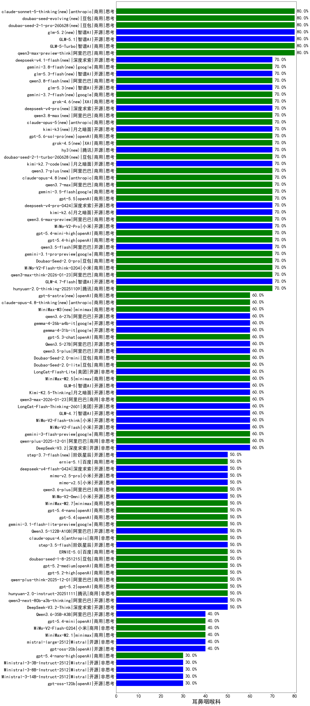

|类别|机构|大模型|【耳鼻咽喉科】准确率|平均耗时|平均消耗token|花费/千次（元）|排名（准确率）|
|---|---|-----|-------------------|-------|-----------|-----------|-----------|
|商用|XAI|grok-4-0709|85.0%|244s|1388|144.0|1|
|商用|XAI|grok-3-mini|80.0%|211s|996|3.5|2|
|商用|百度|ERNIE-4.5-Turbo-32K|80.0%|21s|529|1.6|3|
|商用|智谱AI|GLM-5-Turbo(new)|80.0%|40s|1985|42.6|4|
|商用|阿里巴巴|qwen3-max-preview-think|80.0%|227s|2878|67.9|5|
|商用|豆包|doubao-seed-1-6-250615|72.5%|126s|436|2.8|6|
|开源|智谱AI|GLM-4.7-Flash|70.0%|1079s|2337|0.0|7|
|商用|google|gemini-3.1-pro-preview(new)|70.0%|32s|1501|123.6|8|
|商用|google|gemini-2.5-flash|70.0%|10s|1754|30.7|9|
|商用|google|gemini-2.5-pro|70.0%|45s|2399|169.6|10|
|开源|阿里巴巴|qwen3.5-flash(new)|70.0%|266s|4448|8.8|11|
|商用|腾讯|hunyuan-t1-20250711|70.0%|23s|1395|5.3|12|
|开源|深度求索|DeepSeek-V3.2-Exp-Think|70.0%|320s|1193|3.5|13|
|开源|阿里巴巴|qwen3-235b-a22b-instruct-2507|70.0%|12s|460|3.3|14|
|商用|豆包|Doubao-Seed-2.0-pro(new)|70.0%|235s|988|14.6|15|
|商用|小米|MiMo-V2-Flash-think-0204(new)|70.0%|758s|2270|4.7|16|
|商用|阿里巴巴|qwen-plus-2025-07-28|70.0%|12s|443|0.8|17|
|商用|anthropic|claude-4-sonnet-thinking|70.0%|47s|1113|110.5|18|
|商用|豆包|doubao-seed-1-6-flash-250615|70.0%|4s|275|0.3|19|
|商用|阿里巴巴|qwen3-max-think-2026-01-23|70.0%|110s|2919|28.7|20|
|开源|阿里巴巴|Qwen3-30B-A3B-Thinking-2507|70.0%|58s|2436|6.7|21|
|商用|小米|MiMo-V2-Pro(new)|70.0%|82s|937|15.4|22|
|商用|openAI|gpt-5.4-high(new)|70.0%|17s|948|92.7|23|
|商用|openAI|gpt-5.1-high|70.0%|148s|980|64.8|24|
|开源|meta|Llama-4-Maverick-17B-128E-Instruct-FP8|70.0%|7s|492|1.9|25|
|商用|阿里巴巴|qwen-flash-think-2025-07-28|70.0%|28s|3048|4.5|26|
|商用|阿里巴巴|qwen-turbo-think-2025-07-15|70.0%|/|2138|6.2|27|
|开源|深度求索|DeepSeek-V3.1|70.0%|20s|285|3.0|28|
|商用|百度|ERNIE-X1-Turbo-32K|67.5%|113s|2267|8.9|29|
|开源|阿里巴巴|Qwen3-32B|67.5%|28s|1020|3.9|30|
|开源|深度求索|DeepSeek-R1-0528|67.5%|241s|1875|29.3|31|
|商用|豆包|doubao-seed-1-6-flash-thinking-250615|67.5%|6s|498|0.6|32|
|开源|百度|ERNIE-4.5-300B-A47B|65.0%|24s|317|2.1|33|
|商用|anthropic|claude-4-sonnet|65.0%|40s|571|51.6|34|
|商用|百川智能|Baichuan4-Turbo|62.5%|/|/|/|35|
|商用|阿里巴巴|qwen-flash-2025-07-28|60.0%|5s|460|0.6|36|
|开源|小米|MiMo-V2-Flash-think|60.0%|20s|1862|0.0|37|
|开源|小米|MiMo-V2-Flash|60.0%|72s|378|0.0|38|
|开源|智谱AI|GLM-4.7|60.0%|46s|2178|29.8|39|
|商用|Mistral|mistral-medium-2508|60.0%|62s|396|4.8|40|
|开源|Mistral|Mistral-Small-3.2-24B-Instruct-2506|60.0%|108s|464|0.9|41|
|商用|阿里巴巴|qwen-plus-think-2025-07-28|60.0%|/|3477|27.4|42|
|商用|豆包|doubao-seed-1-6-251015|60.0%|8s|830|6.0|43|
|商用|google|gemini-3-flash-preview|60.0%|49s|1110|22.6|44|
|开源|阿里巴巴|qwen3-next-80b-a3b-instruct|60.0%|8s|443|1.6|45|
|开源|深度求索|DeepSeek-V3.2-Exp|60.0%|76s|315|0.9|46|
|商用|腾讯|hunyuan-turbos-20250926|60.0%|14s|590|1.1|47|
|商用|阿里巴巴|qwen-plus-2025-12-01|60.0%|22s|778|1.5|48|
|开源|minimax|MiniMax-M2|60.0%|35s|2303|18.8|49|
|商用|openAI|gpt-5.1-medium|60.0%|203s|497|30.5|50|
|开源|深度求索|DeepSeek-V3.2|60.0%|76s|273|0.8|51|
|商用|阿里巴巴|qwen3-max-2025-09-23|60.0%|117s|396|8.3|52|
|商用|google|gemini-3-pro-preview|60.0%|54s|2114|175.9|53|
|商用|anthropic|claude-opus-4.5|60.0%|17s|716|114.4|54|
|开源|智谱AI|GLM-4.6|60.0%|74s|3079|42.4|55|
|商用|百度|ERNIE-X1.1-Preview|60.0%|115s|627|2.4|56|
|商用|豆包|Doubao-Seed-2.0-mini(new)|60.0%|393s|1615|3.1|57|
|商用|minimax|MiniMax-M2.5(new)|60.0%|26s|1112|8.8|58|
|开源|阿里巴巴|Qwen3.5-27B(new)|60.0%|442s|4846|23.0|59|
|开源|百度|ERNIE-4.5-21B-A3B|60.0%|35s|306|0.0|60|
|开源|阿里巴巴|qwen3.5-plus(new)|60.0%|31s|2638|12.4|61|
|商用|阿里巴巴|qwen-turbo-2025-07-15|60.0%|9s|356|0.2|62|
|商用|阿里巴巴|qwen3-max-2026-01-23|60.0%|24s|382|3.3|63|
|商用|豆包|Doubao-Seed-2.0-lite(new)|60.0%|230s|1028|3.4|64|
|商用|科大讯飞|xunfei-spark-x1-0725|60.0%|/|802|9.6|65|
|开源|阿里巴巴|Qwen3-8B-nothink|60.0%|20s|482|0.0|66|
|开源|美团|LongCat-Flash-Lite(new)|60.0%|183s|498|0.0|67|
|开源|智谱AI|GLM-5(new)|60.0%|56s|1885|33.1|68|
|商用|openAI|gpt-5.3-chat(new)|60.0%|25s|410|33.5|69|
|开源|月之暗面|Kimi-K2.5-Thinking|60.0%|299s|1618|33.0|70|
|开源|阿里巴巴|Qwen3-30B-A3B-Instruct-2507|60.0%|4s|475|1.3|71|
|开源|阶跃星辰|step-3|60.0%|80s|1574|6.1|72|
|开源|智谱AI|GLM-4.5-nothink|60.0%|19s|693|9.0|73|
|开源|meta|Llama-4-Scout-17B-16E-Instruct|57.5%|8s|517|1.0|74|
|开源|阿里巴巴|Qwen3-8B|52.5%|368s|9491|0.0|75|
|开源|阿里巴巴|Qwen3-4B|52.5%|21s|1601|4.6|76|
|商用|google|gemini-3.1-flash-lite-preview(new)|50.0%|23s|363|3.3|77|
|商用|openAI|gpt-5.4(new)|50.0%|4s|265|20.9|78|
|商用|openAI|gpt-5-nano-high|50.0%|837s|4227|12.1|79|
|开源|深度求索|DeepSeek-V3.2-Think|50.0%|105s|1085|3.2|80|
|开源|美团|LongCat-Flash-Thinking-2601|50.0%|338s|2455|0.0|81|
|商用|腾讯|hunyuan-2.0-instruct-20251111|50.0%|18s|401|0.7|82|
|商用|openAI|gpt-5.2|50.0%|6s|188|11.9|83|
|开源|阿里巴巴|Qwen3.5-122B-A10B(new)|50.0%|297s|4148|26.2|84|
|商用|阿里巴巴|qwen-plus-think-2025-12-01|50.0%|68s|2752|21.6|85|
|商用|anthropic|claude-sonnet-4.5-thinking|50.0%|36s|2276|237.1|86|
|开源|阶跃星辰|step-3.5-flash|50.0%|16s|1765|3.6|87|
|商用|豆包|doubao-seed-1-8-251215|50.0%|25s|682|4.8|88|
|商用|anthropic|claude-opus-4.6|50.0%|19s|651|101.2|89|
|商用|百川智能|Baichuan4-Air|50.0%|/|/|/|90|
|商用|anthropic|claude-sonnet-4.5(new)|50.0%|11s|583|55.5|91|
|开源|月之暗面|Kimi-K2-Thinking|50.0%|181s|2982|47.0|92|
|开源|阿里巴巴|Qwen3-14B|50.0%|29s|1606|3.1|93|
|商用|openAI|o4-mini|50.0%|33s|780|22.8|94|
|开源|深度求索|DeepSeek-R1-0528-Qwen3-8B|50.0%|239s|1517|0.0|95|
|开源|腾讯|Hunyuan-A13B-Instruct|50.0%|44s|1019|3.9|96|
|开源|阿里巴巴|qwen3-235b-a22b-thinking-2507|50.0%|139s|3510|69.0|97|
|开源|阿里巴巴|Qwen3-1.7B-nothink|50.0%|13s|396|1.0|98|
|开源|阿里巴巴|Qwen3-4B-nothink|50.0%|14s|421|1.1|99|
|开源|阿里巴巴|Qwen3-32B-nothink|50.0%|26s|456|1.6|100|
|开源|智谱AI|GLM-4.5-Air|50.0%|30s|1591|9.2|101|
|商用|openAI|gpt-5-2025-08-07|50.0%|23s|284|16.0|102|
|商用|阿里巴巴|qwen3-max-preview|50.0%|10s|432|9.2|103|
|开源|豆包|Seed-OSS-36B-Instruct|50.0%|147s|2178|8.6|104|
|商用|豆包|doubao-seed-1-6-lite-251015|50.0%|113s|920|2.0|105|
|商用|小米|MiMo-V2-Omni(new)|50.0%|110s|1240|13.9|106|
|开源|月之暗面|kimi-k2-0905|50.0%|97s|324|4.2|107|
|商用|XAI|grok-4-1-fast-reasoning|50.0%|99s|1220|3.9|108|
|商用|anthropic|claude-haiku-4.5-thinking|50.0%|41s|2409|83.4|109|
|商用|anthropic|claude-haiku-4.5|50.0%|11s|598|18.6|110|
|开源|智谱AI|GLM-4-9B-0414|47.5%|12s|451|0.0|111|
|商用|小米|MiMo-V2-Flash-0204(new)|40.0%|188s|504|0.9|112|
|开源|智谱AI|GLM-4.5-Air-nothink|40.0%|13s|956|5.4|113|
|开源|google|gemma-3-27b-it|40.0%|/|/|/|114|
|商用|XAI|grok-4-1-fast-non-reasoning|40.0%|5s|649|1.8|115|
|商用|openAI|gpt-5-mini-high|40.0%|80s|1453|20.1|116|
|开源|腾讯|Hunyuan-A13B-Instruct-nothink|40.0%|184s|378|1.3|117|
|商用|openAI|gpt-5.1|40.0%|217s|179|7.9|118|
|开源|阿里巴巴|Qwen3-14B-nothink|40.0%|9s|461|0.8|119|
|商用|智谱AI|GLM-4.5-Flash|40.0%|20s|1232|0.0|120|
|开源|智谱AI|GLM-4.5|40.0%|88s|2117|29.0|121|
|商用|智谱AI|GLM-4.5-Flash-nothink|40.0%|23s|955|0.0|122|
|商用|百度|ERNIE-5.0-Thinking-Preview|40.0%|230s|2062|48.6|123|
|商用|openAI|gpt-5-mini-2025-08-07|40.0%|117s|724|9.5|124|
|开源|openAI|gpt-oss-20b|40.0%|5s|1047|1.1|125|
|开源|深度求索|DeepSeek-V3.1-Think|40.0%|50s|933|10.7|126|
|商用|openAI|gpt-5-nano-2025-08-07|40.0%|21s|1857|5.2|127|
|商用|minimax|MiniMax-M2.1|40.0%|35s|1327|10.6|128|
|开源|阿里巴巴|Qwen3-1.7B|37.5%|19s|1917|5.6|129|
|开源|google|gemma-3-12b-it|35.0%|/|/|/|130|
|开源|阿里巴巴|Qwen3-0.6B|32.5%|6s|1140|3.2|131|
|开源|Mistral|Ministral-3-14B-Instruct-2512|30.0%|5s|537|0.8|132|
|商用|google|gemini-2.5-flash-lite|30.0%|2s|440|1.1|133|
|开源|openAI|gpt-oss-120b|30.0%|119s|645|1.8|134|
|开源|百度|ERNIE-4.5-0.3B|22.5%|33s|367|0.0|135|
|开源|阿里巴巴|Qwen3-0.6B-nothink|20.0%|11s|215|0.5|136|
|开源|google|gemma-3-4b-it|17.5%|/|/|/|137|
|商用|openAI|gpt-5.4-mini(new)|/%|45s|217|4.8|138|
|商用|openAI|gpt-5.2-high|/%|14s|503|43.2|139|
|商用|minimax|MiniMax-M2.7(new)|/%|32s|1292|10.3|140|
|商用|openAI|gpt-5.4-nano-high(new)|/%|13s|614|4.8|141|
|商用|openAI|gpt-5.4-nano(new)|/%|16s|216|1.3|142|
|商用|openAI|gpt-5.4-mini-high(new)|/%|19s|1077|31.9|143|
|商用|百度|ERNIE-5.0|/%|316s|2034|47.9|144|
|商用|openAI|gpt-5.2-medium|/%|7s|319|24.9|145|
|开源|Mistral|Ministral-3-3B-Instruct-2512|/%|7s|539|0.4|146|
|开源|Mistral|mistral-large-2512|/%|13s|483|4.6|147|
|开源|阿里巴巴|qwen3-next-80b-a3b-thinking|/%|76s|3338|13.2|148|
|开源|Mistral|Ministral-3-8B-Instruct-2512|/%|8s|630|0.7|149|
|商用|腾讯|hunyuan-2.0-thinking-20251109|/%|31s|1072|4.1|150|

