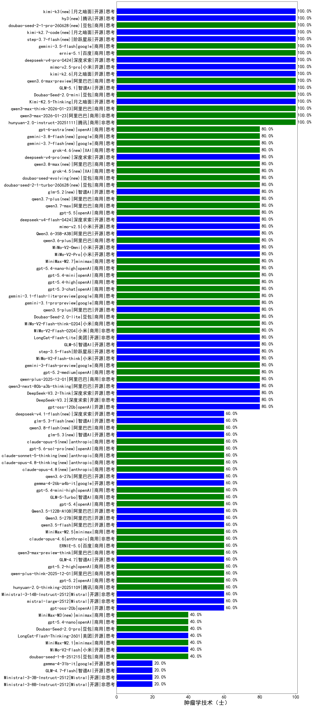

|类别|机构|大模型|【肿瘤学技术（士）】准确率|平均耗时|平均消耗token|花费/千次（元）|排名（准确率）|
|---|---|-----|-------------------|-------|-----------|-----------|-----------|
|开源|月之暗面|kimi-k2-0905|100.0%|117s|422|5.7|1|
|商用|腾讯|hunyuan-2.0-instruct-20251111|100.0%|7s|499|0.9|2|
|商用|阿里巴巴|qwen-plus-2025-07-28|100.0%|13s|412|0.7|3|
|商用|阿里巴巴|qwen3-max-2026-01-23(new)|100.0%|43s|395|3.4|4|
|商用|阿里巴巴|qwen3-max-think-2026-01-23(new)|100.0%|141s|3586|35.3|5|
|开源|月之暗面|Kimi-K2.5-Thinking(new)|100.0%|304s|1741|35.5|6|
|商用|豆包|doubao-seed-1-6-thinking-250715|100.0%|27s|1094|8.3|7|
|商用|阿里巴巴|qwen3-max-2025-09-23|100.0%|213s|421|8.9|8|
|商用|豆包|Doubao-Seed-2.0-mini(new)|100.0%|365s|1583|3.0|9|
|商用|百度|ERNIE-4.5-Turbo-32K|90.0%|23s|607|1.8|10|
|开源|minimax|MiniMax-M2|80.0%|27s|1760|14.2|11|
|商用|豆包|doubao-seed-1-6-251015|80.0%|15s|749|5.3|12|
|商用|anthropic|claude-haiku-4.5|80.0%|10s|546|16.8|13|
|商用|XAI|grok-4-1-fast-reasoning|80.0%|104s|1289|4.1|14|
|商用|google|gemini-3-pro-preview(new)|80.0%|47s|1481|121.6|15|
|开源|深度求索|DeepSeek-V3.2-Exp-Think|80.0%|483s|1127|3.3|16|
|开源|阿里巴巴|qwen3-235b-a22b-instruct-2507|80.0%|11s|466|3.3|17|
|商用|腾讯|hunyuan-turbos-20250926|80.0%|12s|530|0.9|18|
|商用|google|gemini-3.1-pro-preview(new)|80.0%|24s|1426|116.9|19|
|开源|阿里巴巴|qwen3-235b-a22b-thinking-2507|80.0%|81s|3255|63.9|20|
|开源|深度求索|DeepSeek-V3.2-Exp|80.0%|453s|306|0.9|21|
|开源|百度|ERNIE-4.5-300B-A47B|80.0%|11s|340|2.2|22|
|商用|阿里巴巴|qwen3-max-preview|80.0%|9s|432|9.1|23|
|商用|Mistral|mistral-medium-2508|80.0%|29s|472|5.9|24|
|开源|深度求索|DeepSeek-V3.1-Think|80.0%|70s|1263|14.7|25|
|开源|深度求索|DeepSeek-V3.1|80.0%|17s|335|3.5|26|
|商用|智谱AI|GLM-4.5-Flash|80.0%|31s|1944|0.0|27|
|商用|阿里巴巴|qwen-flash-2025-07-28|80.0%|8s|417|0.5|28|
|商用|openAI|gpt-5-nano-2025-08-07|80.0%|31s|1488|4.1|29|
|商用|openAI|gpt-5-mini-2025-08-07|80.0%|19s|693|9.1|30|
|开源|阿里巴巴|qwen3-next-80b-a3b-instruct|80.0%|10s|521|1.9|31|
|开源|openAI|gpt-oss-120b|80.0%|36s|440|1.1|32|
|商用|anthropic|claude-sonnet-4.5(new)|80.0%|14s|505|47.2|33|
|商用|anthropic|claude-sonnet-4.5-thinking|80.0%|18s|1155|115.4|34|
|开源|阿里巴巴|qwen3.5-plus(new)|80.0%|36s|2541|11.9|35|
|商用|豆包|Doubao-Seed-2.0-lite(new)|80.0%|196s|859|2.8|36|
|商用|小米|MiMo-V2-Flash-think-0204(new)|80.0%|1263s|2377|4.9|37|
|商用|小米|MiMo-V2-Flash-0204(new)|80.0%|353s|440|0.8|38|
|开源|美团|LongCat-Flash-Lite(new)|80.0%|91s|365|0.0|39|
|开源|智谱AI|GLM-5(new)|80.0%|58s|2051|36.0|40|
|开源|阶跃星辰|step-3.5-flash(new)|80.0%|23s|2211|4.5|41|
|开源|小米|MiMo-V2-Flash-think(new)|80.0%|29s|2311|0.0|42|
|商用|google|gemini-3-flash-preview(new)|80.0%|89s|892|17.9|43|
|商用|openAI|gpt-5.2-medium(new)|80.0%|4s|309|24.1|44|
|商用|阿里巴巴|qwen-plus-2025-12-01(new)|80.0%|23s|746|1.4|45|
|商用|openAI|o4-mini|80.0%|38s|1154|34.8|46|
|开源|阿里巴巴|qwen3-next-80b-a3b-thinking|80.0%|94s|4605|18.2|47|
|开源|深度求索|DeepSeek-V3.2-Think(new)|80.0%|197s|1665|4.9|48|
|开源|深度求索|DeepSeek-V3.2(new)|80.0%|112s|345|1.0|49|
|商用|openAI|gpt-5-nano-high|80.0%|494s|3770|10.7|50|
|商用|openAI|gpt-5-mini-high|80.0%|796s|1802|25.2|51|
|开源|阶跃星辰|step-3|80.0%|112s|2225|8.7|52|
|商用|百度|ERNIE-5.0-Thinking-Preview|80.0%|161s|1982|46.5|53|
|开源|阿里巴巴|Qwen3-14B|75.0%|33s|1304|2.5|54|
|商用|豆包|doubao-seed-1-6-250615|75.0%|168s|427|2.6|55|
|商用|anthropic|claude-4-sonnet|70.0%|46s|664|62.2|56|
|商用|XAI|grok-4-0709|70.0%|577s|1519|158.4|57|
|商用|阿里巴巴|qwen-long-2025-01-25|65.0%|7s|287|0.5|58|
|商用|豆包|doubao-seed-1-6-flash-thinking-250615|65.0%|5s|745|0.9|59|
|商用|anthropic|claude-opus-4.5(new)|60.0%|18s|572|89.2|60|
|商用|openAI|gpt-5.1-high|60.0%|30s|897|59.0|61|
|商用|腾讯|hunyuan-t1-20250711|60.0%|26s|1651|6.3|62|
|商用|豆包|doubao-seed-1-6-lite-251015|60.0%|27s|675|1.4|63|
|商用|阿里巴巴|qwen-plus-think-2025-12-01(new)|60.0%|97s|3516|27.6|64|
|商用|阿里巴巴|qwen3-max-preview-think(new)|60.0%|225s|2762|65.0|65|
|商用|openAI|gpt-5.1-medium|60.0%|146s|381|22.3|66|
|商用|google|gemini-2.5-pro|60.0%|29s|2283|160.1|67|
|商用|anthropic|claude-haiku-4.5-thinking|60.0%|107s|2201|75.9|68|
|商用|XAI|grok-3-mini|60.0%|153s|1185|4.2|69|
|开源|智谱AI|GLM-4.7(new)|60.0%|64s|2301|31.5|70|
|开源|百度|ERNIE-4.5-21B-A3B|60.0%|56s|313|0.0|71|
|商用|阿里巴巴|qwen-turbo-2025-07-15|60.0%|8s|329|0.2|72|
|开源|阿里巴巴|Qwen3-32B|60.0%|27s|1295|4.9|73|
|商用|百度|ERNIE-X1.1-Preview|60.0%|168s|1143|4.4|74|
|商用|豆包|doubao-seed-1-6-flash-250615|60.0%|2s|276|0.3|75|
|开源|Mistral|mistral-large-2512(new)|60.0%|13s|452|4.2|76|
|开源|Mistral|Ministral-3-14B-Instruct-2512(new)|60.0%|11s|373|0.5|77|
|商用|openAI|gpt-5.2-high(new)|60.0%|10s|531|46.1|78|
|商用|腾讯|hunyuan-2.0-thinking-20251109|60.0%|18s|1256|4.9|79|
|商用|openAI|gpt-5.2(new)|60.0%|5s|152|8.5|80|
|开源|智谱AI|GLM-4.6|60.0%|58s|2295|31.4|81|
|开源|月之暗面|Kimi-K2-Thinking|60.0%|155s|1405|21.7|82|
|商用|阿里巴巴|qwen-flash-think-2025-07-28|60.0%|36s|3952|5.8|83|
|开源|openAI|gpt-oss-20b|60.0%|13s|1116|1.2|84|
|开源|阿里巴巴|Qwen3-32B-nothink|60.0%|18s|544|2.0|85|
|开源|智谱AI|GLM-4.5|60.0%|116s|1841|25.1|86|
|开源|阿里巴巴|Qwen3-8B-nothink|60.0%|18s|358|0.0|87|
|商用|openAI|gpt-5-2025-08-07|60.0%|15s|297|17.1|88|
|商用|minimax|MiniMax-M2.5(new)|60.0%|31s|1569|12.6|89|
|开源|智谱AI|GLM-4.5-Air|60.0%|39s|2256|13.2|90|
|商用|anthropic|claude-opus-4.6(new)|60.0%|18s|489|73.1|91|
|开源|meta|Llama-4-Maverick-17B-128E-Instruct-FP8|60.0%|10s|514|2.0|92|
|商用|阿里巴巴|qwen-turbo-think-2025-07-15|60.0%|/|2692|7.9|93|
|商用|百川智能|Baichuan4-Turbo|60.0%|/|/|/|94|
|开源|豆包|Seed-OSS-36B-Instruct|60.0%|113s|2122|8.3|95|
|商用|百度|ERNIE-5.0(new)|60.0%|187s|2480|58.5|96|
|商用|科大讯飞|xunfei-spark-x1-0725|60.0%|/|1177|14.1|97|
|开源|minimax|MiniMax-Text-01|55.0%|12s|906|7.3|98|
|开源|深度求索|DeepSeek-R1-0528|55.0%|254s|2290|35.7|99|
|商用|百度|ERNIE-X1-Turbo-32K|55.0%|150s|2777|10.9|100|
|开源|阿里巴巴|Qwen3-1.7B|55.0%|23s|1747|5.0|101|
|商用|google|gemini-2.5-flash|55.0%|11s|1949|34.0|102|
|开源|meta|Llama-4-Scout-17B-16E-Instruct|55.0%|11s|533|1.1|103|
|商用|豆包|Doubao-1.5-lite-32k-250115|50.0%|3s|182|0.1|104|
|商用|anthropic|claude-4-sonnet-thinking|50.0%|63s|525|49.4|105|
|开源|智谱AI|GLM-4-9B-0414|50.0%|10s|437|0.0|106|
|开源|月之暗面|kimi-k2-0711-preview|50.0%|27s|490|7.0|107|
|开源|深度求索|DeepSeek-R1-0528-Qwen3-8B|45.0%|294s|2098|0.0|108|
|商用|360|360zhinao2-o1|45.0%|/|/|/|109|
|开源|阿里巴巴|Qwen3-8B|45.0%|604s|17502|0.0|110|
|商用|豆包|doubao-seed-1-8-251215(new)|40.0%|29s|707|4.9|111|
|开源|小米|MiMo-V2-Flash(new)|40.0%|249s|548|0.0|112|
|商用|豆包|Doubao-Seed-2.0-pro(new)|40.0%|410s|1881|28.7|113|
|商用|minimax|MiniMax-M2.1(new)|40.0%|99s|737|5.6|114|
|开源|阿里巴巴|Qwen3-4B|40.0%|24s|1714|4.9|115|
|开源|美团|LongCat-Flash-Thinking-2601(new)|40.0%|366s|2183|0.0|116|
|开源|智谱AI|GLM-4.5-nothink|40.0%|21s|565|7.2|117|
|商用|阿里巴巴|qwen-plus-think-2025-07-28|40.0%|/|4037|31.8|118|
|商用|openAI|gpt-5.1|40.0%|246s|201|9.5|119|
|开源|阿里巴巴|Qwen3-30B-A3B-Thinking-2507|40.0%|85s|3853|10.6|120|
|开源|阿里巴巴|Qwen3-30B-A3B-Instruct-2507|40.0%|3s|427|1.1|121|
|开源|阿里巴巴|Qwen3-14B-nothink|40.0%|12s|520|0.9|122|
|开源|Mistral|Mistral-Small-3.2-24B-Instruct-2506|40.0%|129s|425|0.8|123|
|开源|阿里巴巴|Qwen3-0.6B-nothink|40.0%|24s|207|0.4|124|
|开源|腾讯|Hunyuan-A13B-Instruct-nothink|40.0%|12s|327|1.1|125|
|开源|Mistral|Magistral-Small-2507|40.0%|107s|9445|102.1|126|
|开源|minimax|MiniMax-M1|40.0%|270s|4814|35.3|127|
|商用|XAI|grok-4-1-fast-non-reasoning|40.0%|100s|573|1.5|128|
|商用|百川智能|Baichuan4-Air|35.0%|/|/|/|129|
|开源|腾讯|Hunyuan-A13B-Instruct|35.0%|86s|1305|5.0|130|
|开源|google|gemma-3-4b-it|35.0%|/|/|/|131|
|开源|google|gemma-3-27b-it|30.0%|/|/|/|132|
|商用|google|gemini-2.5-flash-lite|20.0%|40s|13298|38.4|133|
|商用|智谱AI|GLM-4.5-Flash-nothink|20.0%|20s|1023|0.0|134|
|开源|Mistral|Ministral-3-8B-Instruct-2512(new)|20.0%|14s|474|0.5|135|
|商用|百度|ERNIE-Lite-8K|20.0%|/|/|/|136|
|开源|智谱AI|GLM-4.5-Air-nothink|20.0%|14s|965|5.4|137|
|开源|智谱AI|GLM-4.7-Flash(new)|20.0%|1185s|5470|0.0|138|
|开源|阿里巴巴|Qwen3-4B-nothink|20.0%|16s|412|1.0|139|
|开源|Mistral|Ministral-3-3B-Instruct-2512(new)|20.0%|13s|576|0.4|140|
|开源|阿里巴巴|Qwen3-1.7B-nothink|20.0%|16s|445|1.1|141|
|开源|阿里巴巴|Qwen3-0.6B|20.0%|6s|1207|3.4|142|
|开源|百度|ERNIE-4.5-0.3B|10.0%|53s|343|0.0|143|
|开源|google|gemma-3-12b-it|5.0%|/|/|/|144|

