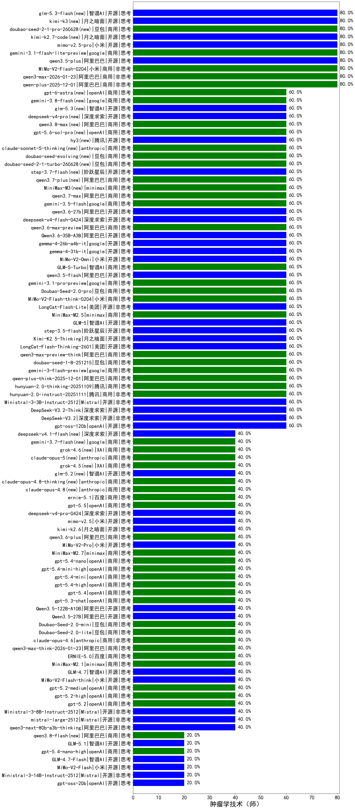

|类别|机构|大模型|【肿瘤学技术（师）】准确率|平均耗时|平均消耗token|花费/千次（元）|排名（准确率）|
|---|---|-----|-------------------|-------|-----------|-----------|-----------|
|开源|月之暗面|kimi-k2-0905(new)|100.0%|89s|556|7.4|1|
|商用|百度|ERNIE-4.5-Turbo-32K(new)|90.0%|22s|542|1.6|2|
|商用|anthropic|claude-4-sonnet-thinking(new)|80.0%|8s|593|50.3|3|
|商用|阿里巴巴|qwen-plus-2025-12-01(new)|80.0%|33s|1153|2.2|4|
|商用|阿里巴巴|qwen-flash-2025-07-28(new)|80.0%|10s|625|0.8|5|
|商用|阿里巴巴|qwen3-max-2026-01-23(new)|80.0%|120s|619|5.3|6|
|商用|anthropic|claude-haiku-4.5-thinking(new)|80.0%|45s|3123|107.2|7|
|开源|阿里巴巴|Qwen3-14B-nothink(new)|80.0%|19s|601|1.0|8|
|开源|阿里巴巴|qwen3.5-plus(new)|80.0%|59s|4516|21.2|9|
|商用|google|gemini-3.1-flash-lite-preview(new)|80.0%|13s|464|3.9|10|
|商用|小米|mimo-v2.5-pro(new)|80.0%|30s|1925|35.4|11|
|商用|小米|MiMo-V2-Flash-0204(new)|80.0%|555s|634|1.1|12|
|商用|百度|ERNIE-X1-Turbo-32K(new)|80.0%|134s|2844|11.2|13|
|开源|阿里巴巴|Qwen3-8B(new)|75.0%|305s|10072|0.0|14|
|开源|阿里巴巴|Qwen3-32B(new)|70.0%|33s|1305|5.0|15|
|商用|google|gemini-2.5-pro(new)|70.0%|35s|2578|182.3|16|
|开源|深度求索|DeepSeek-R1-0528(new)|70.0%|269s|2352|36.8|17|
|开源|阿里巴巴|Qwen3-4B(new)|65.0%|23s|2062|6.0|18|
|开源|阿里巴巴|Qwen3-14B(new)|65.0%|62s|2174|4.2|19|
|商用|google|gemini-3.1-pro-preview(new)|60.0%|51s|2111|171.7|20|
|开源|阿里巴巴|Qwen3.6-35B-A3B(new)|60.0%|107s|2120|21.9|21|
|商用|openAI|gpt-5.1-high(new)|60.0%|130s|2051|137.2|22|
|商用|anthropic|claude-sonnet-4.5(new)|60.0%|14s|681|59.8|23|
|商用|百度|ERNIE-X1.1-Preview(new)|60.0%|88s|676|2.4|24|
|商用|anthropic|claude-opus-4.5(new)|60.0%|18s|737|108.0|25|
|商用|阿里巴巴|qwen3-max-2025-09-23(new)|60.0%|560s|651|13.5|26|
|开源|meta|Llama-4-Scout-17B-16E-Instruct(new)|60.0%|10s|655|1.2|27|
|开源|深度求索|DeepSeek-V3.2-Think(new)|60.0%|200s|2230|6.6|28|
|开源|Mistral|Ministral-3-3B-Instruct-2512(new)|60.0%|11s|919|0.7|29|
|商用|腾讯|hunyuan-2.0-instruct-20251111(new)|60.0%|9s|571|1.0|30|
|商用|腾讯|hunyuan-2.0-thinking-20251109(new)|60.0%|24s|1490|5.7|31|
|商用|阿里巴巴|qwen3.6-max-preview(new)|60.0%|65s|2141|110.6|32|
|商用|阿里巴巴|qwen-plus-think-2025-12-01(new)|60.0%|121s|4268|33.3|33|
|商用|google|gemini-3-flash-preview(new)|60.0%|14s|1640|32.9|34|
|开源|google|gemma-4-31b-it(new)|60.0%|86s|582|1.4|35|
|商用|豆包|doubao-seed-1-8-251215(new)|60.0%|38s|1107|7.8|36|
|商用|阿里巴巴|qwen3-max-preview-think(new)|60.0%|296s|4318|101.5|37|
|开源|美团|LongCat-Flash-Thinking-2601(new)|60.0%|220s|3429|0.0|38|
|商用|小米|MiMo-V2-Omni(new)|60.0%|17s|1724|20.1|39|
|开源|月之暗面|Kimi-K2.5-Thinking(new)|60.0%|873s|5635|116.5|40|
|开源|阶跃星辰|step-3.5-flash(new)|60.0%|30s|3053|6.3|41|
|开源|智谱AI|GLM-5(new)|60.0%|91s|2574|44.8|42|
|商用|minimax|MiniMax-M2.5(new)|60.0%|50s|2796|22.6|43|
|开源|美团|LongCat-Flash-Lite(new)|60.0%|300s|620|0.0|44|
|商用|智谱AI|GLM-5-Turbo(new)|60.0%|42s|2169|45.9|45|
|商用|小米|MiMo-V2-Flash-think-0204(new)|60.0%|1120s|2419|4.9|46|
|商用|豆包|Doubao-Seed-2.0-pro(new)|60.0%|376s|1589|23.5|47|
|开源|阿里巴巴|qwen3.5-flash(new)|60.0%|337s|5525|10.8|48|
|开源|google|gemma-4-26b-a4b-it(new)|60.0%|20s|713|1.8|49|
|开源|深度求索|DeepSeek-V3.2(new)|60.0%|110s|590|1.7|50|
|商用|阿里巴巴|qwen-turbo-think-2025-07-15(new)|60.0%|/|4049|11.8|51|
|开源|豆包|Seed-OSS-36B-Instruct(new)|60.0%|86s|1833|7.1|52|
|开源|阿里巴巴|Qwen3-30B-A3B-Thinking-2507(new)|60.0%|88s|3589|9.9|53|
|商用|智谱AI|GLM-4.5-Flash(new)|60.0%|42s|2434|0.0|54|
|开源|阿里巴巴|Qwen3-8B-nothink(new)|60.0%|159s|621|0.0|55|
|商用|openAI|gpt-5-nano-2025-08-07(new)|60.0%|39s|2934|8.2|56|
|开源|阿里巴巴|qwen3-235b-a22b-thinking-2507(new)|60.0%|87s|3515|68.2|57|
|开源|深度求索|DeepSeek-V3.1(new)|60.0%|20s|420|4.2|58|
|开源|阿里巴巴|qwen3-235b-a22b-instruct-2507(new)|60.0%|15s|709|5.0|59|
|商用|阿里巴巴|qwen-turbo-2025-07-15(new)|60.0%|8s|480|0.3|60|
|开源|openAI|gpt-oss-120b(new)|60.0%|3s|799|2.1|61|
|商用|腾讯|hunyuan-turbos-20250926(new)|60.0%|15s|699|1.2|62|
|商用|腾讯|hunyuan-t1-20250711(new)|60.0%|26s|1638|6.1|63|
|商用|google|gemini-2.5-flash(new)|60.0%|11s|1899|33.3|64|
|商用|openAI|gpt-5.1(new)|60.0%|105s|286|11.9|65|
|商用|anthropic|claude-4-sonnet(new)|60.0%|45s|554|48.8|66|
|商用|百川智能|Baichuan4-Turbo(new)|55.0%|/|/|/|67|
|开源|智谱AI|GLM-4-9B-0414(new)|40.0%|6s|418|0|68|
|商用|anthropic|claude-opus-4.6(new)|40.0%|12s|676|95.4|69|
|开源|智谱AI|GLM-4.5-Air-nothink(new)|40.0%|15s|1096|6.0|70|
|商用|小米|mimo-v2.5(new)|40.0%|28s|1771|20.8|71|
|开源|阿里巴巴|Qwen3-30B-A3B-Instruct-2507(new)|40.0%|7s|732|1.9|72|
|开源|智谱AI|GLM-4.5-Air(new)|40.0%|38s|2042|11.7|73|
|开源|月之暗面|kimi-k2.6(new)|40.0%|106s|2870|75.3|74|
|开源|阿里巴巴|Qwen3-32B-nothink(new)|40.0%|22s|653|2.2|75|
|商用|豆包|Doubao-Seed-2.0-lite(new)|40.0%|278s|1226|4.0|76|
|商用|豆包|Doubao-Seed-2.0-mini(new)|40.0%|552s|2436|4.6|77|
|商用|小米|MiMo-V2-Pro(new)|40.0%|147s|1581|28.2|78|
|开源|阿里巴巴|Qwen3-4B-nothink(new)|40.0%|25s|540|1.3|79|
|商用|minimax|MiniMax-M2.7(new)|40.0%|45s|1718|13.6|80|
|开源|阿里巴巴|Qwen3.5-122B-A10B(new)|40.0%|383s|3388|21.1|81|
|商用|阿里巴巴|qwen3.6-plus(new)|40.0%|50s|2385|27.5|82|
|商用|openAI|gpt-5.3-chat(new)|40.0%|7s|487|36.1|83|
|商用|智谱AI|GLM-4.5-Flash-nothink(new)|40.0%|22s|1136|0.0|84|
|商用|openAI|gpt-5.4(new)|40.0%|9s|292|18.8|85|
|商用|openAI|gpt-5.4-high(new)|40.0%|17s|1057|99.1|86|
|商用|openAI|gpt-5.4-mini(new)|40.0%|12s|319|6.5|87|
|商用|openAI|gpt-5.4-mini-high(new)|40.0%|135s|1929|57.2|88|
|商用|openAI|gpt-5.4-nano(new)|40.0%|12s|297|1.6|89|
|开源|阿里巴巴|Qwen3.5-27B(new)|40.0%|431s|4518|21.2|90|
|商用|阿里巴巴|qwen3-max-think-2026-01-23(new)|40.0%|179s|5343|52.5|91|
|商用|XAI|grok-4-1-fast-reasoning(new)|40.0%|26s|2144|7.0|92|
|商用|openAI|gpt-5.2(new)|40.0%|4s|267|14.7|93|
|商用|XAI|grok-4-1-fast-non-reasoning(new)|40.0%|76s|796|2.2|94|
|商用|openAI|gpt-5.1-medium(new)|40.0%|62s|618|35.4|95|
|商用|anthropic|claude-sonnet-4.5-thinking(new)|40.0%|42s|2693|276.2|96|
|商用|豆包|doubao-seed-1-6-lite-251015(new)|40.0%|50s|1218|2.6|97|
|商用|百度|ERNIE-5.0-Thinking-Preview(new)|40.0%|285s|2367|55.0|98|
|商用|豆包|doubao-seed-1-6-251015(new)|40.0%|14s|922|6.4|99|
|商用|openAI|gpt-5-nano-high(new)|40.0%|100s|5347|15.2|100|
|开源|阿里巴巴|qwen3-next-80b-a3b-instruct(new)|40.0%|13s|706|2.5|101|
|开源|阿里巴巴|qwen3-next-80b-a3b-thinking(new)|40.0%|191s|4909|19.3|102|
|开源|Mistral|mistral-large-2512(new)|40.0%|15s|648|5.8|103|
|商用|阿里巴巴|qwen3-max-preview(new)|40.0%|12s|620|12.8|104|
|开源|Mistral|Ministral-3-8B-Instruct-2512(new)|40.0%|5s|814|0.9|105|
|商用|openAI|gpt-5-mini-2025-08-07(new)|40.0%|20s|1086|14.0|106|
|商用|openAI|gpt-5.2-high(new)|40.0%|16s|735|61.3|107|
|商用|百度|ERNIE-5.0(new)|40.0%|201s|1968|45.5|108|
|商用|openAI|gpt-5-2025-08-07(new)|40.0%|31s|459|25.1|109|
|商用|openAI|gpt-5.2-medium(new)|40.0%|11s|529|40.8|110|
|开源|小米|MiMo-V2-Flash-think(new)|40.0%|28s|2510|0.0|111|
|开源|智谱AI|GLM-4.7(new)|40.0%|129s|3273|44.6|112|
|商用|minimax|MiniMax-M2.1(new)|40.0%|116s|2247|18.0|113|
|商用|openAI|o4-mini(new)|30.0%|41s|1510|45.8|114|
|开源|深度求索|DeepSeek-V3.1-Think(new)|20.0%|64s|1231|13.9|115|
|开源|月之暗面|Kimi-K2-Thinking(new)|20.0%|152s|2577|40.0|116|
|开源|智谱AI|GLM-5.1(new)|20.0%|188s|2340|54.2|117|
|开源|智谱AI|GLM-4.7-Flash(new)|20.0%|861s|5836|0.0|118|
|商用|openAI|gpt-5-mini-high(new)|20.0%|687s|3682|51.7|119|
|商用|google|gemini-2.5-flash-lite(new)|20.0%|6s|1171|3.1|120|
|商用|openAI|gpt-5.4-nano-high(new)|20.0%|19s|996|7.7|121|
|开源|小米|MiMo-V2-Flash(new)|20.0%|247s|529|0.0|122|
|商用|阿里巴巴|qwen-flash-think-2025-07-28(new)|20.0%|36s|3699|5.4|123|
|开源|Mistral|Ministral-3-14B-Instruct-2512(new)|20.0%|8s|574|0.8|124|
|开源|openAI|gpt-oss-20b(new)|20.0%|9s|1340|1.4|125|
|商用|anthropic|claude-haiku-4.5(new)|20.0%|11s|698|20.2|126|

