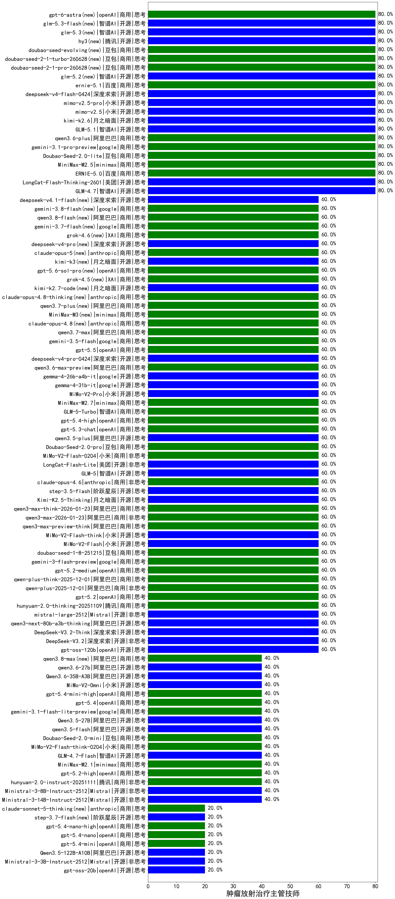

|类别|机构|大模型|【肿瘤放射治疗主管技师】准确率|平均耗时|平均消耗token|花费/千次（元）|排名（准确率）|
|---|---|-----|-------------------|-------|-----------|-----------|-----------|
|商用|openAI|o4-mini(new)|90.0%|35s|906|26.9|1|
|开源|阿里巴巴|Qwen3-32B(new)|85.0%|27s|998|3.7|2|
|开源|深度求索|DeepSeek-R1-0528(new)|85.0%|253s|2380|37.1|3|
|商用|百度|ERNIE-X1-Turbo-32K(new)|85.0%|92s|2198|8.6|4|
|开源|月之暗面|kimi-k2.6(new)|80.0%|106s|2731|72.1|5|
|商用|google|gemini-2.5-pro(new)|80.0%|44s|2405|168.8|6|
|商用|豆包|doubao-seed-1-6-251015(new)|80.0%|7s|798|5.6|7|
|开源|月之暗面|kimi-k2-0905(new)|80.0%|114s|336|4.2|8|
|开源|智谱AI|GLM-4.7(new)|80.0%|55s|2568|35.1|9|
|开源|阿里巴巴|qwen3-235b-a22b-thinking-2507(new)|80.0%|46s|3166|61.7|10|
|开源|美团|LongCat-Flash-Thinking-2601(new)|80.0%|202s|3484|0.0|11|
|商用|百度|ERNIE-5.0(new)|80.0%|108s|2337|54.8|12|
|商用|minimax|MiniMax-M2.5(new)|80.0%|26s|1312|10.3|13|
|商用|anthropic|claude-4-sonnet(new)|80.0%|40s|490|43.9|14|
|商用|豆包|Doubao-Seed-2.0-lite(new)|80.0%|245s|1222|4.0|15|
|商用|google|gemini-3.1-pro-preview(new)|80.0%|38s|2035|167.5|16|
|商用|阿里巴巴|qwen3.6-plus(new)|80.0%|27s|2058|23.9|17|
|开源|阿里巴巴|Qwen3-14B(new)|80.0%|29s|1707|3.3|18|
|开源|智谱AI|GLM-5.1(new)|80.0%|186s|1646|38.1|19|
|商用|腾讯|hunyuan-turbos-20250926(new)|80.0%|24s|992|1.8|20|
|商用|google|gemini-2.5-flash(new)|75.0%|9s|1737|30.1|21|
|商用|百度|ERNIE-4.5-Turbo-32K(new)|75.0%|22s|532|1.5|22|
|开源|阿里巴巴|Qwen3-30B-A3B-Thinking-2507(new)|70.0%|76s|3437|9.4|23|
|商用|百川智能|Baichuan4-Turbo(new)|70.0%|/|/|/|24|
|开源|阿里巴巴|Qwen3-4B(new)|65.0%|22s|1203|3.4|25|
|开源|智谱AI|GLM-4.5-Air(new)|60.0%|42s|2152|12.5|26|
|开源|小米|MiMo-V2-Flash(new)|60.0%|249s|673|0.0|27|
|商用|阿里巴巴|qwen3-max-think-2026-01-23(new)|60.0%|353s|3896|38.3|28|
|商用|阿里巴巴|qwen3-max-2026-01-23(new)|60.0%|14s|603|5.4|29|
|开源|阿里巴巴|qwen3-235b-a22b-instruct-2507(new)|60.0%|11s|477|3.3|30|
|商用|阿里巴巴|qwen3-max-preview-think(new)|60.0%|105s|3115|73.2|31|
|开源|阿里巴巴|Qwen3-4B-nothink(new)|60.0%|18s|361|0.8|32|
|开源|小米|MiMo-V2-Flash-think(new)|60.0%|30s|2122|0.0|33|
|商用|豆包|doubao-seed-1-8-251215(new)|60.0%|25s|667|4.5|34|
|开源|阶跃星辰|step-3.5-flash(new)|60.0%|29s|3314|6.8|35|
|商用|google|gemini-3-flash-preview(new)|60.0%|94s|1293|26.1|36|
|商用|openAI|gpt-5.2-medium(new)|60.0%|11s|514|42.8|37|
|商用|阿里巴巴|qwen-plus-2025-12-01(new)|60.0%|24s|819|1.5|38|
|商用|openAI|gpt-5.2(new)|60.0%|8s|236|15.2|39|
|商用|腾讯|hunyuan-2.0-thinking-20251109(new)|60.0%|10s|1200|4.6|40|
|开源|Mistral|mistral-large-2512(new)|60.0%|15s|551|5.1|41|
|开源|阿里巴巴|qwen3-next-80b-a3b-thinking(new)|60.0%|187s|4671|18.4|42|
|开源|月之暗面|Kimi-K2.5-Thinking(new)|60.0%|443s|2617|53.6|43|
|商用|anthropic|claude-opus-4.6(new)|60.0%|19s|641|95.8|44|
|开源|深度求索|DeepSeek-V3.2(new)|60.0%|50s|484|1.4|45|
|开源|智谱AI|GLM-5(new)|60.0%|84s|3212|56.7|46|
|商用|阿里巴巴|qwen3.6-max-preview(new)|60.0%|73s|1806|93.7|47|
|开源|智谱AI|GLM-4-9B-0414(new)|60.0%|12s|429|0|48|
|开源|google|gemma-4-26b-a4b-it(new)|60.0%|17s|503|1.2|49|
|开源|google|gemma-4-31b-it(new)|60.0%|81s|515|1.3|50|
|开源|阿里巴巴|Qwen3-8B(new)|60.0%|486s|11858|0.0|51|
|商用|小米|MiMo-V2-Pro(new)|60.0%|23s|1602|29.1|52|
|商用|minimax|MiniMax-M2.7(new)|60.0%|35s|1367|10.8|53|
|商用|智谱AI|GLM-5-Turbo(new)|60.0%|60s|1422|29.9|54|
|商用|openAI|gpt-5.4-high(new)|60.0%|19s|1137|111.0|55|
|商用|openAI|gpt-5.3-chat(new)|60.0%|8s|507|41.4|56|
|开源|阿里巴巴|qwen3.5-plus(new)|60.0%|45s|3855|18.2|57|
|商用|豆包|Doubao-Seed-2.0-pro(new)|60.0%|273s|1291|19.1|58|
|商用|小米|MiMo-V2-Flash-0204(new)|60.0%|178s|888|1.7|59|
|开源|美团|LongCat-Flash-Lite(new)|60.0%|59s|543|0.0|60|
|商用|腾讯|hunyuan-t1-20250711(new)|60.0%|29s|1770|6.7|61|
|开源|深度求索|DeepSeek-V3.2-Think(new)|60.0%|61s|1750|5.2|62|
|商用|阿里巴巴|qwen-plus-think-2025-12-01(new)|60.0%|62s|2754|21.4|63|
|开源|meta|Llama-4-Scout-17B-16E-Instruct(new)|60.0%|8s|493|0.9|64|
|商用|openAI|gpt-5.1-medium(new)|60.0%|23s|486|28.6|65|
|商用|智谱AI|GLM-4.5-Flash(new)|60.0%|42s|2340|0.0|66|
|开源|智谱AI|GLM-4.5-Air-nothink(new)|60.0%|18s|972|5.4|67|
|开源|openAI|gpt-oss-120b(new)|60.0%|6s|681|1.8|68|
|商用|openAI|gpt-5-2025-08-07(new)|60.0%|18s|303|16.3|69|
|开源|深度求索|DeepSeek-V3.1(new)|60.0%|22s|352|3.6|70|
|商用|阿里巴巴|qwen-turbo-think-2025-07-15(new)|60.0%|/|2373|6.9|71|
|商用|阿里巴巴|qwen3-max-preview(new)|60.0%|11s|497|10.4|72|
|开源|阿里巴巴|qwen3-next-80b-a3b-instruct(new)|60.0%|8s|599|2.1|73|
|开源|阿里巴巴|Qwen3-14B-nothink(new)|60.0%|24s|589|1.0|74|
|商用|豆包|doubao-seed-1-6-lite-251015(new)|60.0%|32s|720|1.5|75|
|开源|豆包|Seed-OSS-36B-Instruct(new)|60.0%|232s|2391|9.4|76|
|商用|阿里巴巴|qwen3-max-2025-09-23(new)|60.0%|218s|507|10.6|77|
|商用|anthropic|claude-opus-4.5(new)|60.0%|12s|608|91.6|78|
|商用|百度|ERNIE-5.0-Thinking-Preview(new)|60.0%|390s|2716|63.9|79|
|商用|anthropic|claude-sonnet-4.5(new)|40.0%|12s|603|55.4|80|
|商用|openAI|gpt-5.4(new)|40.0%|4s|295|22.0|81|
|商用|豆包|Doubao-Seed-2.0-mini(new)|40.0%|677s|2875|5.5|82|
|商用|openAI|gpt-5.1-high(new)|40.0%|152s|1069|69.9|83|
|开源|阿里巴巴|qwen3.5-flash(new)|40.0%|256s|3834|7.5|84|
|开源|阿里巴巴|Qwen3.5-27B(new)|40.0%|471s|5682|26.9|85|
|商用|google|gemini-3.1-flash-lite-preview(new)|40.0%|21s|396|3.4|86|
|商用|阿里巴巴|qwen-flash-think-2025-07-28(new)|40.0%|30s|3191|4.7|87|
|商用|openAI|gpt-5.4-mini-high(new)|40.0%|14s|1320|39.1|88|
|商用|阿里巴巴|qwen-flash-2025-07-28(new)|40.0%|10s|655|0.9|89|
|商用|google|gemini-2.5-flash-lite(new)|40.0%|2s|489|1.2|90|
|商用|openAI|gpt-5-mini-2025-08-07(new)|40.0%|15s|783|10.1|91|
|开源|Mistral|Ministral-3-8B-Instruct-2512(new)|40.0%|3s|613|0.7|92|
|商用|小米|MiMo-V2-Omni(new)|40.0%|512s|1404|16.0|93|
|开源|Mistral|Ministral-3-14B-Instruct-2512(new)|40.0%|6s|918|1.3|94|
|商用|智谱AI|GLM-4.5-Flash-nothink(new)|40.0%|19s|1011|0.0|95|
|开源|阿里巴巴|Qwen3.6-35B-A3B(new)|40.0%|10s|1791|18.6|96|
|商用|anthropic|claude-4-sonnet-thinking(new)|40.0%|8s|564|51.1|97|
|开源|深度求索|DeepSeek-V3.1-Think(new)|40.0%|51s|1011|11.5|98|
|商用|小米|MiMo-V2-Flash-think-0204(new)|40.0%|420s|2943|6.0|99|
|商用|openAI|gpt-5.1(new)|40.0%|236s|181|6.9|100|
|开源|阿里巴巴|Qwen3-8B-nothink(new)|40.0%|20s|526|0.0|101|
|商用|XAI|grok-4-1-fast-reasoning(new)|40.0%|88s|2355|7.9|102|
|商用|anthropic|claude-haiku-4.5-thinking(new)|40.0%|16s|1994|67.6|103|
|商用|minimax|MiniMax-M2.1(new)|40.0%|160s|1871|15.0|104|
|开源|智谱AI|GLM-4.7-Flash(new)|40.0%|1085s|1940|0.0|105|
|商用|openAI|gpt-5.2-high(new)|40.0%|19s|697|61.0|106|
|商用|腾讯|hunyuan-2.0-instruct-20251111(new)|40.0%|5s|574|1.0|107|
|商用|阿里巴巴|qwen-turbo-2025-07-15(new)|40.0%|5s|332|0.2|108|
|开源|月之暗面|Kimi-K2-Thinking(new)|40.0%|128s|2349|36.7|109|
|开源|阿里巴巴|Qwen3-30B-A3B-Instruct-2507(new)|40.0%|10s|971|2.7|110|
|商用|anthropic|claude-sonnet-4.5-thinking(new)|40.0%|56s|3590|377.7|111|
|开源|阿里巴巴|Qwen3-32B-nothink(new)|40.0%|25s|605|2.1|112|
|商用|百度|ERNIE-X1.1-Preview(new)|40.0%|114s|624|2.3|113|
|商用|openAI|gpt-5-mini-high(new)|40.0%|78s|2196|30.6|114|
|商用|openAI|gpt-5-nano-2025-08-07(new)|20.0%|39s|2182|6.1|115|
|商用|openAI|gpt-5.4-mini(new)|20.0%|53s|244|5.2|116|
|商用|openAI|gpt-5.4-nano(new)|20.0%|12s|279|1.7|117|
|商用|openAI|gpt-5.4-nano-high(new)|20.0%|21s|476|3.5|118|
|开源|阿里巴巴|Qwen3.5-122B-A10B(new)|20.0%|398s|3923|24.6|119|
|商用|anthropic|claude-haiku-4.5(new)|20.0%|9s|665|20.3|120|
|开源|openAI|gpt-oss-20b(new)|20.0%|13s|1472|1.6|121|
|开源|Mistral|Ministral-3-3B-Instruct-2512(new)|20.0%|2s|517|0.4|122|
|商用|XAI|grok-4-1-fast-non-reasoning(new)|20.0%|78s|672|1.9|123|
|商用|openAI|gpt-5-nano-high(new)|20.0%|103s|4013|11.4|124|

