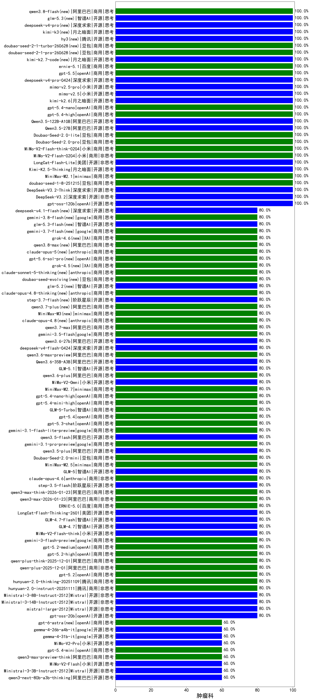

|类别|机构|大模型|【肿瘤科】准确率|平均耗时|平均消耗token|花费/千次（元）|排名（准确率）|
|---|---|-----|-------------------|-------|-----------|-----------|-----------|
|商用|openAI|gpt-5-mini-2025-08-07|100.0%|29s|751|9.1|1|
|开源|深度求索|DeepSeek-V3.2-Think(new)|100.0%|204s|1612|4.7|2|
|商用|openAI|gpt-5-nano-high|100.0%|98s|3390|9.5|3|
|商用|百度|ERNIE-5.0-Thinking-Preview|100.0%|197s|2242|51.8|4|
|商用|百度|ERNIE-X1.1-Preview|100.0%|86s|530|1.8|5|
|开源|月之暗面|kimi-k2-0905|100.0%|62s|546|7.1|6|
|商用|腾讯|hunyuan-t1-20250711|100.0%|28s|1678|6.2|7|
|商用|XAI|grok-4-1-fast-reasoning|100.0%|65s|1272|3.9|8|
|商用|豆包|doubao-seed-1-6-thinking-250715|100.0%|19s|1064|7.7|9|
|商用|科大讯飞|xunfei-spark-x1-0725|100.0%|/|824|9.9|10|
|商用|openAI|gpt-5.1|100.0%|124s|298|12.3|11|
|开源|月之暗面|Kimi-K2-Thinking|100.0%|150s|2664|41.3|12|
|开源|阶跃星辰|step-3|100.0%|122s|2426|9.4|13|
|开源|Mistral|Magistral-Small-2507|100.0%|521s|3739|39.4|14|
|开源|openAI|gpt-oss-120b|100.0%|65s|609|1.5|15|
|开源|深度求索|DeepSeek-V3.1-Think|100.0%|78s|1562|17.9|16|
|开源|深度求索|DeepSeek-V3.1|100.0%|23s|491|5.0|17|
|开源|深度求索|DeepSeek-V3.2(new)|100.0%|153s|662|1.9|18|
|商用|openAI|gpt-5-nano-2025-08-07|100.0%|79s|1764|4.8|19|
|商用|豆包|doubao-seed-1-8-251215(new)|100.0%|29s|766|5.0|20|
|开源|美团|LongCat-Flash-Thinking-2601(new)|100.0%|229s|2666|0.0|21|
|商用|minimax|MiniMax-M2.1(new)|100.0%|47s|1060|8.0|22|
|商用|百度|ERNIE-4.5-Turbo-32K|95.0%|22s|560|1.6|23|
|开源|百度|ERNIE-4.5-300B-A47B|90.0%|19s|315|1.9|24|
|商用|google|gemini-2.5-flash|85.0%|12s|2032|35.3|25|
|商用|百度|ERNIE-X1-Turbo-32K|85.0%|117s|2331|9.1|26|
|开源|meta|Llama-4-Maverick-17B-128E-Instruct-FP8|85.0%|8s|609|2.3|27|
|商用|google|gemini-2.5-pro|85.0%|38s|2451|171.5|28|
|开源|豆包|Seed-OSS-36B-Instruct|80.0%|147s|3607|14.1|29|
|开源|minimax|MiniMax-M2|80.0%|33s|2314|18.5|30|
|商用|豆包|doubao-seed-1-6-251015|80.0%|180s|750|5.0|31|
|开源|智谱AI|GLM-4.6|80.0%|60s|2521|34.0|32|
|商用|腾讯|hunyuan-turbos-20250926|80.0%|19s|816|1.4|33|
|开源|深度求索|DeepSeek-V3.2-Exp-Think|80.0%|505s|1838|5.4|34|
|开源|深度求索|DeepSeek-V3.2-Exp|80.0%|161s|507|1.4|35|
|开源|智谱AI|GLM-4.7-Flash(new)|80.0%|1388s|1584|0.0|36|
|商用|Mistral|mistral-medium-2508|80.0%|149s|687|8.0|37|
|商用|阿里巴巴|qwen3-max-preview|80.0%|17s|647|13.2|38|
|商用|google|gemini-3-flash-preview(new)|80.0%|118s|1205|23.5|39|
|商用|阿里巴巴|qwen-turbo-think-2025-07-15|80.0%|/|1744|4.9|40|
|开源|小米|MiMo-V2-Flash-think(new)|80.0%|32s|2772|0.0|41|
|商用|阿里巴巴|qwen-plus-2025-07-28|80.0%|19s|764|1.4|42|
|开源|Mistral|Mistral-Small-3.2-24B-Instruct-2506|80.0%|15s|717|1.3|43|
|开源|智谱AI|GLM-4.7(new)|80.0%|62s|2489|33.6|44|
|开源|Mistral|mistral-large-2512(new)|80.0%|18s|680|6.0|45|
|商用|anthropic|claude-haiku-4.5|80.0%|11s|760|21.9|46|
|商用|openAI|gpt-5.2-medium(new)|80.0%|9s|475|34.8|47|
|商用|openAI|gpt-5.1-medium|80.0%|193s|553|30.4|48|
|开源|Mistral|Ministral-3-8B-Instruct-2512(new)|80.0%|5s|740|0.8|49|
|商用|腾讯|hunyuan-2.0-instruct-20251111|80.0%|8s|644|1.1|50|
|商用|openAI|gpt-5-mini-high|80.0%|908s|1216|15.8|51|
|商用|阿里巴巴|qwen3-max-2025-09-23|80.0%|168s|617|12.5|52|
|商用|anthropic|claude-opus-4.5(new)|80.0%|15s|712|101.2|53|
|商用|腾讯|hunyuan-2.0-thinking-20251109|80.0%|8s|991|3.7|54|
|商用|openAI|gpt-5.2(new)|80.0%|5s|311|18.5|55|
|商用|anthropic|claude-sonnet-4.5-thinking|80.0%|24s|1810|178.7|56|
|商用|anthropic|claude-sonnet-4.5(new)|80.0%|20s|719|62.6|57|
|商用|阿里巴巴|qwen-flash-think-2025-07-28|80.0%|26s|2936|4.2|58|
|商用|阿里巴巴|qwen-plus-2025-12-01(new)|80.0%|23s|1005|1.9|59|
|商用|google|gemini-3-pro-preview(new)|80.0%|39s|2167|175.8|60|
|商用|XAI|grok-4-1-fast-non-reasoning|80.0%|82s|868|2.5|61|
|商用|阿里巴巴|qwen-plus-think-2025-12-01(new)|80.0%|76s|3146|24.2|62|
|商用|anthropic|claude-haiku-4.5-thinking|80.0%|17s|2292|76.6|63|
|开源|Mistral|Ministral-3-14B-Instruct-2512(new)|80.0%|13s|638|0.9|64|
|商用|openAI|gpt-5.2-high(new)|80.0%|14s|504|37.7|65|
|商用|openAI|gpt-5.1-high|80.0%|124s|883|53.9|66|
|商用|阿里巴巴|qwen-long-2025-01-25|80.0%|87s|442|0.7|67|
|商用|阿里巴巴|qwen-flash-2025-07-28|80.0%|12s|777|1.0|68|
|开源|智谱AI|GLM-4.5-Air|80.0%|37s|1914|10.9|69|
|开源|minimax|MiniMax-Text-01|80.0%|25s|962|7.7|70|
|开源|阿里巴巴|Qwen3-14B|80.0%|24s|741|1.3|71|
|商用|openAI|o4-mini|80.0%|33s|707|19.7|72|
|开源|minimax|MiniMax-M1|80.0%|76s|2022|12.6|73|
|商用|XAI|grok-4-0709|80.0%|449s|1619|166.7|74|
|商用|阿里巴巴|qwen-turbo-2025-07-15|80.0%|9s|587|0.3|75|
|开源|腾讯|Hunyuan-A13B-Instruct-nothink|80.0%|11s|394|1.2|76|
|开源|阿里巴巴|Qwen3-0.6B-nothink|80.0%|8s|340|0.7|77|
|开源|阿里巴巴|Qwen3-1.7B-nothink|80.0%|15s|658|1.6|78|
|商用|智谱AI|GLM-4.5-Flash|80.0%|46s|2425|0.0|79|
|商用|百度|ERNIE-5.0(new)|80.0%|125s|2682|62.4|80|
|商用|openAI|gpt-5-2025-08-07|80.0%|28s|302|13.2|81|
|开源|openAI|gpt-oss-20b|80.0%|5s|839|0.8|82|
|开源|智谱AI|GLM-4.5-Air-nothink|80.0%|12s|988|5.3|83|
|开源|阿里巴巴|Qwen3-30B-A3B-Instruct-2507|80.0%|7s|762|2.0|84|
|开源|阿里巴巴|Qwen3-32B|75.0%|30s|1286|4.9|85|
|开源|智谱AI|GLM-4-9B-0414|75.0%|12s|440|0.0|86|
|商用|豆包|doubao-seed-1-6-flash-250615|75.0%|4s|323|0.4|87|
|商用|豆包|doubao-seed-1-6-250615|75.0%|118s|513|3.3|88|
|开源|阿里巴巴|Qwen3-8B|75.0%|600s|12647|0.0|89|
|开源|深度求索|DeepSeek-R1-0528-Qwen3-8B|75.0%|284s|1777|0.0|90|
|开源|深度求索|DeepSeek-R1-0528|75.0%|225s|2224|34.6|91|
|开源|google|gemma-3-27b-it|75.0%|/|/|/|92|
|商用|豆包|Doubao-1.5-lite-32k-250115|75.0%|6s|193|0.1|93|
|开源|月之暗面|kimi-k2-0711-preview|70.0%|34s|595|8.4|94|
|开源|百度|ERNIE-4.5-21B-A3B|70.0%|3s|303|0.0|95|
|商用|豆包|doubao-seed-1-6-flash-thinking-250615|70.0%|8s|672|0.8|96|
|商用|anthropic|claude-4-sonnet|70.0%|41s|629|54.0|97|
|开源|meta|Llama-4-Scout-17B-16E-Instruct|65.0%|13s|621|1.2|98|
|开源|阿里巴巴|Qwen3-4B|65.0%|24s|2189|6.3|99|
|商用|360|360zhinao2-o1|65.0%|/|/|/|100|
|开源|google|gemma-3-4b-it|60.0%|/|/|/|101|
|开源|小米|MiMo-V2-Flash(new)|60.0%|11s|508|0.0|102|
|开源|Mistral|Ministral-3-3B-Instruct-2512(new)|60.0%|3s|666|0.5|103|
|商用|阿里巴巴|qwen3-max-preview-think(new)|60.0%|99s|3173|73.8|104|
|开源|阿里巴巴|qwen3-next-80b-a3b-thinking|60.0%|153s|3149|12.2|105|
|开源|阿里巴巴|qwen3-next-80b-a3b-instruct|60.0%|13s|685|2.4|106|
|开源|智谱AI|GLM-4.5|60.0%|58s|2462|33.2|107|
|商用|阿里巴巴|qwen-plus-think-2025-07-28|60.0%|/|2526|19.3|108|
|开源|阿里巴巴|Qwen3-32B-nothink|60.0%|30s|755|2.6|109|
|开源|阿里巴巴|Qwen3-14B-nothink|60.0%|28s|789|1.4|110|
|开源|阿里巴巴|Qwen3-8B-nothink|60.0%|37s|641|0.0|111|
|商用|豆包|doubao-seed-1-6-lite-251015|60.0%|24s|1007|2.1|112|
|开源|阿里巴巴|Qwen3-30B-A3B-Thinking-2507|60.0%|79s|2997|8.2|113|
|开源|阿里巴巴|qwen3-235b-a22b-thinking-2507|60.0%|176s|2996|57.6|114|
|商用|anthropic|claude-4-sonnet-thinking|60.0%|51s|1217|117.6|115|
|开源|阿里巴巴|qwen3-235b-a22b-instruct-2507|60.0%|22s|773|5.4|116|
|开源|智谱AI|GLM-4.5-nothink|60.0%|19s|754|9.2|117|
|开源|腾讯|Hunyuan-A13B-Instruct|60.0%|78s|1245|4.8|118|
|商用|百川智能|Baichuan4-Air|60.0%|/|/|/|119|
|商用|智谱AI|GLM-4.5-Flash-nothink|60.0%|20s|1137|0.0|120|
|开源|阿里巴巴|Qwen3-1.7B|55.0%|25s|2789|8.1|121|
|商用|百川智能|Baichuan4-Turbo|55.0%|/|/|/|122|
|开源|google|gemma-3-12b-it|50.0%|/|/|/|123|
|商用|XAI|grok-3-mini|50.0%|127s|1229|4.3|124|
|商用|百度|ERNIE-Lite-8K|50.0%|/|/|/|125|
|商用|google|gemini-2.5-flash-lite|40.0%|5s|1021|2.7|126|
|开源|阿里巴巴|Qwen3-4B-nothink|40.0%|25s|646|1.6|127|
|开源|阿里巴巴|Qwen3-0.6B|25.0%|6s|1189|3.3|128|
|开源|百度|ERNIE-4.5-0.3B|15.0%|64s|421|0.0|129|

