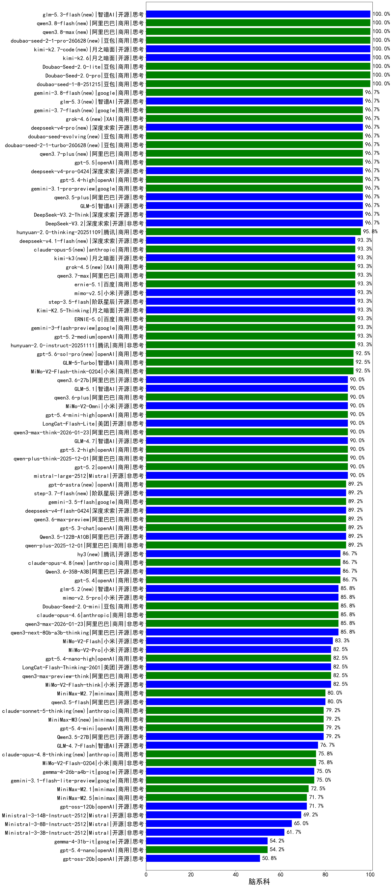

|类别|机构|大模型|【脑系科】准确率|平均耗时|平均消耗token|花费/千次（元）|排名（准确率）|
|---|---|-----|-------------------|-------|-----------|-----------|-----------|
|商用|豆包|Doubao-Seed-2.0-lite(new)|100.0%|197s|945|3.1|1|
|商用|豆包|Doubao-Seed-2.0-pro(new)|100.0%|213s|979|14.2|2|
|开源|深度求索|DeepSeek-V3.2-Exp-Think|100.0%|283s|1043|3.1|3|
|商用|豆包|doubao-seed-1-8-251215|100.0%|24s|668|4.5|4|
|商用|百度|ERNIE-4.5-Turbo-32K|97.5%|22s|556|1.6|5|
|开源|深度求索|DeepSeek-V3.2|96.7%|47s|389|1.1|6|
|开源|阶跃星辰|step-3|96.7%|105s|1937|7.6|7|
|开源|深度求索|DeepSeek-V3.2-Exp|96.7%|293s|358|1.0|8|
|商用|豆包|doubao-seed-1-6-lite-251015|96.7%|53s|826|1.8|9|
|开源|阿里巴巴|qwen3.5-plus(new)|96.7%|33s|2712|12.7|10|
|商用|google|gemini-3.1-pro-preview(new)|96.7%|39s|1690|138.6|11|
|商用|google|gemini-3-pro-preview|96.7%|70s|2086|172.3|12|
|开源|深度求索|DeepSeek-V3.2-Think|96.7%|116s|1237|3.6|13|
|开源|智谱AI|GLM-5(new)|96.7%|86s|2158|37.8|14|
|开源|深度求索|DeepSeek-V3.1-Think|96.7%|51s|990|11.3|15|
|商用|openAI|gpt-5.4-high(new)|96.7%|12s|617|56.7|16|
|开源|豆包|Seed-OSS-36B-Instruct|95.8%|122s|1766|6.9|17|
|商用|百度|ERNIE-X1-Turbo-32K|93.3%|73s|1609|6.3|18|
|商用|阿里巴巴|qwen3-max-think-2026-01-23|93.3%|180s|3496|34.4|19|
|开源|月之暗面|Kimi-K2.5-Thinking|93.3%|320s|1579|32.0|20|
|商用|腾讯|hunyuan-2.0-instruct-20251111|93.3%|18s|445|0.8|21|
|开源|阶跃星辰|step-3.5-flash|93.3%|19s|2077|4.3|22|
|商用|google|gemini-3-flash-preview|93.3%|49s|1316|26.7|23|
|商用|腾讯|hunyuan-turbos-20250926|93.3%|15s|640|1.1|24|
|商用|阿里巴巴|qwen-plus-think-2025-07-28|93.3%|/|2495|18.7|25|
|开源|深度求索|DeepSeek-R1-0528|92.5%|223s|1791|27.9|26|
|开源|阿里巴巴|Qwen3.5-122B-A10B(new)|92.5%|307s|3072|19.2|27|
|商用|小米|MiMo-V2-Flash-think-0204(new)|92.5%|680s|1975|4.0|28|
|商用|anthropic|claude-sonnet-4.5(new)|92.5%|10s|639|59.3|29|
|商用|智谱AI|GLM-5-Turbo(new)|92.5%|74s|2240|48.1|30|
|商用|豆包|doubao-seed-1-6-250615|90.8%|85s|542|3.6|31|
|开源|智谱AI|GLM-4.7|90.0%|61s|2303|31.4|32|
|商用|阿里巴巴|qwen-plus-think-2025-12-01|90.0%|65s|2669|20.8|33|
|商用|openAI|gpt-5.2|90.0%|7s|233|15.1|34|
|开源|美团|LongCat-Flash-Lite(new)|90.0%|202s|615|0.0|35|
|商用|腾讯|hunyuan-t1-20250711|89.2%|31s|1825|7.0|36|
|商用|阿里巴巴|qwen3-max-2026-01-23|89.2%|81s|734|6.7|37|
|商用|阿里巴巴|qwen-plus-2025-12-01|89.2%|24s|972|1.9|38|
|商用|openAI|gpt-5.3-chat(new)|89.2%|20s|444|35.7|39|
|商用|anthropic|claude-opus-4.5|89.2%|14s|731|113.3|40|
|商用|智谱AI|GLM-4.5-Flash|89.2%|28s|1550|0.0|41|
|商用|anthropic|claude-haiku-4.5-thinking|89.2%|35s|1938|65.6|42|
|开源|阿里巴巴|qwen3-235b-a22b-thinking-2507|89.2%|118s|2380|44.8|43|
|商用|anthropic|claude-sonnet-4.5-thinking|89.2%|22s|1547|155.5|44|
|商用|阿里巴巴|qwen3-max-preview|88.3%|12s|509|10.4|45|
|商用|豆包|doubao-seed-1-6-251015|86.7%|48s|722|5.1|46|
|开源|深度求索|DeepSeek-V3.1|86.7%|19s|321|3.3|47|
|开源|美团|LongCat-Flash-Thinking-2601|86.7%|253s|2368|0.0|48|
|商用|openAI|gpt-5.4(new)|86.7%|7s|324|26.0|49|
|商用|anthropic|claude-4-sonnet-thinking|86.7%|50s|1204|120.4|50|
|商用|百度|ERNIE-X1.1-Preview|85.8%|101s|695|2.6|51|
|商用|openAI|gpt-5.1-high|85.8%|92s|1115|73.4|52|
|开源|月之暗面|Kimi-K2-Thinking|85.8%|255s|4052|64.0|53|
|商用|阿里巴巴|qwen-turbo-think-2025-07-15|85.8%|/|1867|5.2|54|
|商用|anthropic|claude-opus-4.6|85.8%|17s|690|104.4|55|
|开源|智谱AI|GLM-4.6|85.8%|62s|2409|32.9|56|
|商用|阿里巴巴|qwen3-max-preview-think|85.8%|128s|2546|59.6|57|
|商用|豆包|Doubao-Seed-2.0-mini(new)|85.8%|326s|2291|4.4|58|
|开源|百度|ERNIE-4.5-300B-A47B|85.8%|23s|346|2.3|59|
|开源|meta|Llama-4-Maverick-17B-128E-Instruct-FP8|85.0%|13s|531|2.1|60|
|开源|智谱AI|GLM-4.5-nothink|85.0%|25s|701|9.0|61|
|商用|豆包|doubao-seed-1-6-flash-250615|84.2%|4s|331|0.4|62|
|开源|阿里巴巴|Qwen3-32B|84.2%|60s|2031|7.9|63|
|商用|Mistral|mistral-medium-2508|83.3%|445s|584|7.2|64|
|开源|阿里巴巴|qwen3-235b-a22b-instruct-2507|83.3%|14s|581|4.2|65|
|商用|百川智能|Baichuan4-Turbo|83.3%|/|/|/|66|
|开源|小米|MiMo-V2-Flash|83.3%|53s|461|0.0|67|
|商用|阿里巴巴|qwen-plus-2025-07-28|83.3%|15s|553|1.0|68|
|商用|阿里巴巴|qwen3-max-2025-09-23|82.5%|221s|770|17.1|69|
|商用|科大讯飞|xunfei-spark-x1-0725|82.5%|/|1164|14.0|70|
|商用|豆包|doubao-seed-1-6-flash-thinking-250615|82.5%|13s|726|0.9|71|
|商用|openAI|gpt-5.1|82.5%|126s|260|12.7|72|
|开源|阿里巴巴|qwen3.5-flash(new)|82.5%|281s|3463|6.8|73|
|开源|阿里巴巴|Qwen3-14B-nothink|82.5%|12s|568|1.0|74|
|商用|openAI|gpt-5.1-medium|82.5%|131s|523|31.4|75|
|开源|阿里巴巴|qwen3-next-80b-a3b-instruct|82.5%|9s|591|2.1|76|
|商用|openAI|gpt-5-2025-08-07|82.5%|20s|333|18.7|77|
|商用|XAI|grok-4-1-fast-reasoning|81.7%|48s|1087|3.4|78|
|开源|阿里巴巴|Qwen3-14B|81.7%|71s|2995|5.9|79|
|开源|百度|ERNIE-4.5-21B-A3B|81.7%|29s|320|0.0|80|
|开源|阿里巴巴|Qwen3.5-27B(new)|80.8%|269s|3602|17.0|81|
|开源|meta|Llama-4-Scout-17B-16E-Instruct|80.8%|13s|559|1.1|82|
|商用|google|gemini-2.5-pro|80.0%|36s|2432|171.8|83|
|商用|anthropic|claude-haiku-4.5|79.2%|9s|655|19.9|84|
|开源|智谱AI|GLM-4.5|79.2%|58s|1711|23.2|85|
|开源|月之暗面|kimi-k2-0905|79.2%|96s|401|5.3|86|
|商用|阿里巴巴|qwen-flash-think-2025-07-28|79.2%|23s|2370|3.3|87|
|商用|百度|ERNIE-5.0-Thinking-Preview|79.2%|273s|2053|48.1|88|
|商用|anthropic|claude-4-sonnet|78.3%|45s|585|53.0|89|
|开源|深度求索|DeepSeek-R1-0528-Qwen3-8B|78.3%|418s|1652|0.0|90|
|开源|腾讯|Hunyuan-A13B-Instruct|78.3%|52s|1020|3.9|91|
|商用|google|gemini-2.5-flash|76.7%|11s|1765|30.8|92|
|开源|智谱AI|GLM-4.5-Air|76.7%|32s|1654|9.5|93|
|商用|XAI|grok-4-0709|76.7%|177s|1362|141.3|94|
|商用|XAI|grok-3-mini|76.7%|184s|1096|3.9|95|
|开源|智谱AI|GLM-4.7-Flash|76.7%|1116s|5443|0.0|96|
|商用|小米|MiMo-V2-Flash-0204(new)|75.8%|215s|544|1.0|97|
|开源|阿里巴巴|Qwen3-30B-A3B-Thinking-2507|75.8%|62s|2591|7.1|98|
|商用|google|gemini-3.1-flash-lite-preview(new)|75.0%|7s|405|3.6|99|
|商用|openAI|gpt-5-nano-high|75.0%|660s|4185|11.9|100|
|开源|minimax|MiniMax-M2|75.0%|56s|2705|22.1|101|
|开源|阿里巴巴|Qwen3-8B|74.2%|355s|9872|0.0|102|
|商用|minimax|MiniMax-M2.1|72.5%|73s|2585|21.1|103|
|商用|openAI|gpt-5-nano-2025-08-07|72.5%|54s|1878|5.2|104|
|商用|阿里巴巴|qwen-flash-2025-07-28|72.5%|8s|634|0.8|105|
|开源|阿里巴巴|Qwen3-8B-nothink|72.5%|25s|530|0.0|106|
|商用|minimax|MiniMax-M2.5(new)|71.7%|29s|1472|11.7|107|
|开源|阿里巴巴|Qwen3-4B|71.7%|40s|1601|4.6|108|
|商用|阿里巴巴|qwen-turbo-2025-07-15|71.7%|19s|383|0.2|109|
|开源|阿里巴巴|Qwen3-32B-nothink|71.7%|43s|556|2.0|110|
|开源|openAI|gpt-oss-120b|71.7%|80s|653|1.8|111|
|商用|openAI|gpt-5-mini-2025-08-07|71.7%|41s|1018|13.6|112|
|开源|腾讯|Hunyuan-A13B-Instruct-nothink|71.7%|115s|410|1.4|113|
|开源|智谱AI|GLM-4.5-Air-nothink|68.3%|17s|1022|5.7|114|
|商用|智谱AI|GLM-4.5-Flash-nothink|68.3%|18s|945|0.0|115|
|商用|openAI|gpt-5-mini-high|67.5%|471s|2255|31.5|116|
|开源|智谱AI|GLM-4-9B-0414|66.1%|12s|456|0.0|117|
|商用|百川智能|Baichuan4-Air|65.0%|/|/|/|118|
|开源|阿里巴巴|Qwen3-1.7B|65.0%|59s|1859|5.4|119|
|开源|阿里巴巴|Qwen3-30B-A3B-Instruct-2507|65.0%|6s|643|1.7|120|
|商用|openAI|o4-mini|63.3%|31s|992|29.6|121|
|商用|google|gemini-2.5-flash-lite|61.7%|2s|537|1.4|122|
|开源|Mistral|Mistral-Small-3.2-24B-Instruct-2506|61.7%|205s|524|1.0|123|
|商用|XAI|grok-4-1-fast-non-reasoning|60.8%|49s|634|1.7|124|
|开源|阿里巴巴|Qwen3-4B-nothink|58.3%|19s|475|1.2|125|
|开源|google|gemma-3-27b-it|57.8%|/|/|/|126|
|开源|阿里巴巴|Qwen3-1.7B-nothink|51.7%|13s|503|1.3|127|
|开源|openAI|gpt-oss-20b|50.8%|8s|966|1.0|128|
|开源|google|gemma-3-12b-it|50.5%|/|/|/|129|
|开源|google|gemma-3-4b-it|40.5%|/|/|/|130|
|开源|阿里巴巴|Qwen3-0.6B|30.8%|42s|1224|3.5|131|
|开源|百度|ERNIE-4.5-0.3B|22.5%|50s|397|0.0|132|
|开源|阿里巴巴|Qwen3-0.6B-nothink|20.8%|10s|278|0.6|133|
|商用|openAI|gpt-5.4-mini(new)|/%|44s|266|6.0|134|
|商用|openAI|gpt-5.4-mini-high(new)|/%|49s|974|28.3|135|
|商用|openAI|gpt-5.4-nano(new)|/%|34s|262|1.6|136|
|商用|openAI|gpt-5.4-nano-high(new)|/%|15s|600|4.6|137|
|开源|小米|MiMo-V2-Flash-think|/%|28s|2264|0.0|138|
|商用|百度|ERNIE-5.0|/%|127s|1990|46.6|139|
|开源|阿里巴巴|qwen3-next-80b-a3b-thinking|/%|157s|3582|14.1|140|
|开源|Mistral|mistral-large-2512|/%|15s|594|5.6|141|
|开源|Mistral|Ministral-3-14B-Instruct-2512|/%|13s|649|0.9|142|
|开源|Mistral|Ministral-3-8B-Instruct-2512|/%|11s|662|0.7|143|
|开源|Mistral|Ministral-3-3B-Instruct-2512|/%|11s|905|0.6|144|
|商用|腾讯|hunyuan-2.0-thinking-20251109|/%|20s|770|2.9|145|
|商用|openAI|gpt-5.2-high|/%|10s|437|35.5|146|
|商用|openAI|gpt-5.2-medium|/%|8s|357|27.5|147|
|商用|minimax|MiniMax-M2.7(new)|/%|/|2020|16.3|148|

