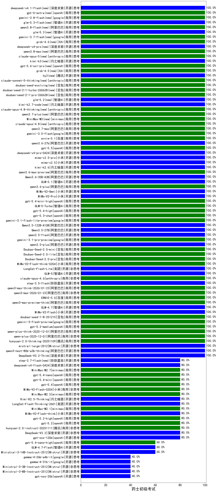

|类别|机构|大模型|【药士初级考试】准确率|平均耗时|平均消耗token|花费/千次（元）|排名（准确率）|
|---|---|-----|-------------------|-------|-----------|-----------|-----------|
|开源|智谱AI|glm-5.2(new)|100.0%|27s|899|24.0|1|
|开源|阿里巴巴|qwen3.5-plus|100.0%|22s|1745|8.1|2|
|开源|美团|LongCat-Flash-Lite|100.0%|107s|453|0.0|3|
|商用|小米|MiMo-V2-Flash-think-0204|100.0%|701s|1233|2.5|4|
|商用|openAI|gpt-5.1-high|100.0%|168s|571|36.1|5|
|开源|月之暗面|kimi-k2-0905|100.0%|86s|242|2.9|6|
|商用|豆包|Doubao-Seed-2.0-pro|100.0%|118s|600|8.3|7|
|商用|豆包|Doubao-Seed-2.0-lite|100.0%|127s|594|1.8|8|
|商用|豆包|Doubao-Seed-2.0-mini|100.0%|205s|1014|1.9|9|
|商用|openAI|gpt-5.1-medium|100.0%|68s|390|23.3|10|
|开源|阿里巴巴|Qwen3.5-27B|100.0%|233s|1489|6.9|11|
|商用|google|gemini-3.1-pro-preview|100.0%|16s|1012|82.2|12|
|开源|阿里巴巴|qwen3.5-flash|100.0%|283s|1995|3.9|13|
|商用|豆包|doubao-seed-1-6-lite-251015|100.0%|11s|501|1.0|14|
|商用|豆包|doubao-seed-1-6-251015|100.0%|181s|572|4.0|15|
|商用|腾讯|hunyuan-turbos-20250926|100.0%|11s|467|0.8|16|
|开源|阿里巴巴|qwen3-next-80b-a3b-instruct|100.0%|5s|414|1.5|17|
|开源|豆包|Seed-OSS-36B-Instruct|100.0%|77s|889|3.4|18|
|商用|百度|ERNIE-X1.1-Preview|100.0%|126s|674|2.6|19|
|商用|百度|ERNIE-5.0-Thinking-Preview|100.0%|149s|1451|34.0|20|
|开源|智谱AI|GLM-5|100.0%|43s|1206|20.9|21|
|商用|阿里巴巴|qwen3-max-2025-09-23|100.0%|343s|323|6.7|22|
|商用|豆包|doubao-seed-1-8-251215|100.0%|19s|461|3.0|23|
|商用|阿里巴巴|qwen-plus-think-2025-12-01|100.0%|45s|2107|16.4|24|
|商用|阿里巴巴|qwen-plus-2025-12-01|100.0%|16s|574|1.1|25|
|开源|小米|MiMo-V2-Flash|100.0%|246s|306|0.0|26|
|商用|腾讯|hunyuan-2.0-thinking-20251109|100.0%|14s|816|3.1|27|
|开源|智谱AI|GLM-4.7|100.0%|34s|1189|16.0|28|
|商用|阿里巴巴|qwen3-max-preview-think|100.0%|33s|1189|27.4|29|
|商用|百度|ERNIE-5.0|100.0%|170s|1629|38.3|30|
|商用|阿里巴巴|qwen3-max-2026-01-23|100.0%|40s|321|2.8|31|
|开源|Mistral|mistral-large-2512|100.0%|8s|386|3.5|32|
|开源|阿里巴巴|qwen3-next-80b-a3b-thinking|100.0%|60s|2558|10.0|33|
|开源|深度求索|DeepSeek-V3.2-Think|100.0%|181s|668|2.0|34|
|商用|阿里巴巴|qwen3-max-think-2026-01-23|100.0%|44s|1295|12.5|35|
|开源|阶跃星辰|step-3.5-flash|100.0%|16s|1270|2.6|36|
|商用|anthropic|claude-opus-4.6|100.0%|10s|538|81.9|37|
|商用|阿里巴巴|qwen3-max-preview|100.0%|8s|380|8.0|38|
|开源|阿里巴巴|Qwen3.5-122B-A10B|100.0%|111s|1711|10.6|39|
|商用|google|gemini-3-flash-preview|100.0%|100s|964|19.5|40|
|商用|百度|ernie-5.1(new)|100.0%|30s|628|10.6|41|
|开源|深度求索|DeepSeek-V3.1-Think|100.0%|50s|890|10.3|42|
|开源|阿里巴巴|qwen3-235b-a22b-thinking-2507|100.0%|57s|2587|50.7|43|
|开源|阿里巴巴|qwen3-235b-a22b-instruct-2507|100.0%|10s|373|2.6|44|
|商用|阿里巴巴|qwen-turbo-2025-07-15|100.0%|8s|266|0.1|45|
|商用|腾讯|hunyuan-t1-20250711|100.0%|20s|1195|4.5|46|
|开源|阿里巴巴|qwen3.6-27b(new)|100.0%|19s|1243|21.5|47|
|商用|google|gemini-3.5-flash(new)|100.0%|6s|983|58.9|48|
|开源|小米|mimo-v2.5-pro(new)|100.0%|37s|854|13.7|49|
|商用|阿里巴巴|qwen3.7-max(new)|100.0%|14s|610|20.6|50|
|商用|anthropic|claude-opus-4.8(new)|100.0%|10s|374|53.5|51|
|商用|minimax|MiniMax-M3(new)|100.0%|18s|531|6.1|52|
|商用|阿里巴巴|qwen3.7-plus(new)|100.0%|19s|601|4.5|53|
|商用|anthropic|claude-opus-4.8-thinking(new)|100.0%|18s|537|82.1|54|
|开源|月之暗面|kimi-k2.7-code(new)|100.0%|50s|481|11.9|55|
|开源|深度求索|deepseek-v4-pro(new)|100.0%|16s|371|8.3|56|
|商用|openAI|gpt-5.5(new)|100.0%|19s|229|35.7|57|
|开源|小米|mimo-v2.5(new)|100.0%|37s|905|9.3|58|
|商用|openAI|gpt-5-2025-08-07|100.0%|23s|231|12.7|59|
|商用|google|gemini-3.1-flash-lite-preview|100.0%|17s|280|2.4|60|
|商用|openAI|gpt-5.3-chat|100.0%|6s|317|25.0|61|
|商用|openAI|gpt-5.4-high|100.0%|7s|340|29.5|62|
|商用|智谱AI|GLM-5-Turbo|100.0%|16s|1077|22.8|63|
|商用|openAI|gpt-5-mini-2025-08-07|100.0%|29s|735|9.8|64|
|开源|月之暗面|kimi-k2.6(new)|100.0%|33s|664|16.8|65|
|商用|openAI|gpt-5.2-medium|100.0%|5s|231|16.8|66|
|商用|openAI|gpt-5.4-mini-high|100.0%|31s|587|16.6|67|
|开源|小米|MiMo-V2-Pro|100.0%|19s|905|14.8|68|
|开源|小米|MiMo-V2-Omni|100.0%|258s|905|9.3|69|
|商用|阿里巴巴|qwen3.6-plus|100.0%|29s|1257|14.5|70|
|开源|智谱AI|GLM-5.1(new)|100.0%|123s|890|20.4|71|
|开源|阿里巴巴|Qwen3.6-35B-A3B(new)|100.0%|14s|1191|12.3|72|
|商用|阿里巴巴|qwen3.6-max-preview(new)|100.0%|33s|1284|66.7|73|
|开源|深度求索|DeepSeek-R1-0528|95.0%|214s|1655|25.8|74|
|商用|百度|ERNIE-X1-Turbo-32K|95.0%|103s|1472|5.7|75|
|商用|百度|ERNIE-4.5-Turbo-32K|90.0%|22s|546|1.6|76|
|商用|openAI|o4-mini|90.0%|27s|1060|32.2|77|
|商用|百川智能|Baichuan4-Turbo|85.0%|/|/|/|78|
|开源|阿里巴巴|Qwen3-14B|85.0%|23s|762|1.4|79|
|商用|google|gemini-2.5-pro|85.0%|23s|1899|134.0|80|
|商用|openAI|gpt-5.2-high|80.0%|11s|289|22.5|81|
|开源|阿里巴巴|Qwen3-30B-A3B-Thinking-2507|80.0%|69s|2774|7.6|82|
|开源|深度求索|DeepSeek-V3.1|80.0%|21s|398|4.4|83|
|商用|阿里巴巴|qwen-flash-think-2025-07-28|80.0%|13s|1454|2.1|84|
|商用|openAI|gpt-5.4|80.0%|4s|242|19.2|85|
|商用|阿里巴巴|qwen-flash-2025-07-28|80.0%|46s|422|0.6|86|
|商用|openAI|gpt-5.2|80.0%|2s|150|8.7|87|
|商用|openAI|gpt-5.4-mini|80.0%|3s|175|3.6|88|
|商用|openAI|gpt-5.4-nano|80.0%|6s|188|1.1|89|
|商用|minimax|MiniMax-M2.7|80.0%|21s|878|6.8|90|
|开源|openAI|gpt-oss-120b|80.0%|3s|579|1.6|91|
|开源|智谱AI|GLM-4.5-Air|80.0%|24s|1254|7.2|92|
|开源|阿里巴巴|Qwen3-30B-A3B-Instruct-2507|80.0%|5s|536|1.5|93|
|商用|阿里巴巴|qwen-turbo-think-2025-07-15|80.0%|/|1916|5.6|94|
|商用|智谱AI|GLM-4.5-Flash|80.0%|21s|1046|0.0|95|
|开源|阿里巴巴|Qwen3-32B-nothink|80.0%|136s|424|1.5|96|
|开源|阿里巴巴|Qwen3-14B-nothink|80.0%|12s|444|0.8|97|
|开源|深度求索|deepseek-v4-flash(new)|80.0%|14s|576|1.1|98|
|商用|google|gemini-2.5-flash|80.0%|9s|1550|27.2|99|
|商用|anthropic|claude-4-sonnet-thinking|80.0%|33s|531|50.1|100|
|开源|阶跃星辰|step-3.7-flash(new)|80.0%|15s|973|7.5|101|
|开源|阿里巴巴|Qwen3-32B|80.0%|38s|1566|6.1|102|
|商用|google|gemini-2.5-flash-lite|80.0%|41s|13183|38.1|103|
|商用|腾讯|hunyuan-2.0-instruct-20251111|80.0%|10s|363|0.6|104|
|开源|月之暗面|Kimi-K2-Thinking|80.0%|83s|1386|21.5|105|
|商用|小米|MiMo-V2-Flash-0204|80.0%|257s|463|0.9|106|
|开源|月之暗面|Kimi-K2.5-Thinking|80.0%|258s|1415|28.8|107|
|商用|openAI|gpt-5.1|80.0%|533s|162|7.1|108|
|商用|anthropic|claude-opus-4.5|80.0%|11s|545|84.6|109|
|开源|美团|LongCat-Flash-Thinking-2601|80.0%|56s|941|0.0|110|
|商用|minimax|MiniMax-M2.5|80.0%|36s|1782|14.4|111|
|商用|anthropic|claude-sonnet-4.5-thinking|80.0%|18s|1125|112.2|112|
|商用|minimax|MiniMax-M2.1|80.0%|156s|1932|15.7|113|
|商用|anthropic|claude-sonnet-4.5|80.0%|12s|523|49.3|114|
|开源|meta|Llama-4-Scout-17B-16E-Instruct|80.0%|13s|498|1.0|115|
|商用|XAI|grok-4-1-fast-reasoning|80.0%|89s|1223|3.9|116|
|开源|小米|MiMo-V2-Flash-think|80.0%|24s|1254|0.0|117|
|开源|深度求索|DeepSeek-V3.2|80.0%|115s|286|0.8|118|
|开源|阿里巴巴|Qwen3-8B|75.0%|24s|2304|0.0|119|
|商用|anthropic|claude-4-sonnet|70.0%|40s|431|39.0|120|
|开源|阿里巴巴|Qwen3-4B|65.0%|27s|2346|6.9|121|
|开源|阿里巴巴|Qwen3-8B-nothink|60.0%|18s|406|0.0|122|
|开源|智谱AI|GLM-4.7-Flash|60.0%|1397s|14838|0.0|123|
|开源|阿里巴巴|Qwen3-4B-nothink|60.0%|17s|321|0.8|124|
|开源|智谱AI|GLM-4-9B-0414|60.0%|12s|414|0|125|
|商用|openAI|gpt-5-nano-high|60.0%|99s|3337|9.5|126|
|开源|Mistral|Ministral-3-14B-Instruct-2512|60.0%|4s|418|0.6|127|
|商用|openAI|gpt-5-mini-high|60.0%|229s|2088|29.4|128|
|开源|智谱AI|GLM-4.5-Air-nothink|60.0%|12s|838|4.7|129|
|商用|智谱AI|GLM-4.5-Flash-nothink|60.0%|17s|829|0.0|130|
|商用|openAI|gpt-5.4-nano-high|60.0%|158s|620|4.9|131|
|商用|XAI|grok-4-1-fast-non-reasoning|60.0%|82s|620|1.7|132|
|商用|anthropic|claude-haiku-4.5-thinking|60.0%|19s|2385|82.7|133|
|商用|anthropic|claude-haiku-4.5|60.0%|10s|591|18.5|134|
|商用|openAI|gpt-5-nano-2025-08-07|60.0%|38s|1189|3.3|135|
|开源|Mistral|Ministral-3-8B-Instruct-2512|40.0%|4s|472|0.5|136|
|开源|google|gemma-4-26b-a4b-it|40.0%|92s|571|1.5|137|
|开源|google|gemma-4-31b-it|40.0%|69s|459|1.2|138|
|开源|Mistral|Ministral-3-3B-Instruct-2512|40.0%|10s|2268|1.6|139|
|开源|openAI|gpt-oss-20b|40.0%|7s|1384|1.5|140|

