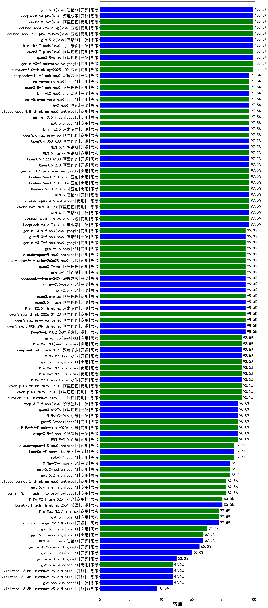

|类别|机构|大模型|【药师】准确率|平均耗时|平均消耗token|花费/千次（元）|排名（准确率）|
|---|---|-----|-------------------|-------|-----------|-----------|-----------|
|商用|豆包|doubao-seed-2-1-pro-260628(new)|100.0%|203s|5115|151.2|1|
|商用|腾讯|hunyuan-2.0-thinking-20251109|100.0%|10s|698|2.6|2|
|开源|月之暗面|kimi-k2.7-code(new)|100.0%|20s|610|15.3|3|
|开源|智谱AI|glm-5.3(new)|100.0%|50s|1405|38.1|4|
|开源|阿里巴巴|qwen3.5-plus|100.0%|26s|1995|9.3|5|
|商用|google|gemini-3-flash-preview|100.0%|78s|971|19.7|6|
|开源|深度求索|deepseek-v4-pro(new)|100.0%|239s|681|16.0|7|
|商用|豆包|doubao-seed-evolving(new)|100.0%|169s|4720|139.3|8|
|商用|阿里巴巴|qwen3.8-max(new)|100.0%|16s|677|22.0|9|
|开源|智谱AI|glm-5.2(new)|100.0%|54s|1460|39.6|10|
|商用|阿里巴巴|qwen3.7-plus(new)|100.0%|19s|781|5.9|11|
|商用|豆包|doubao-seed-1-6-251015|100.0%|31s|602|4.2|12|
|开源|智谱AI|GLM-4.7|97.5%|49s|1956|26.8|13|
|商用|anthropic|claude-opus-4.8-thinking(new)|97.5%|15s|612|96.2|14|
|商用|百度|ERNIE-X1.1-Preview|97.5%|114s|784|3.0|15|
|商用|智谱AI|GLM-5-Turbo|97.5%|41s|1254|26.7|16|
|商用|豆包|Doubao-Seed-2.0-pro|97.5%|203s|924|13.5|17|
|商用|豆包|Doubao-Seed-2.0-lite|97.5%|149s|727|2.3|18|
|开源|深度求索|DeepSeek-V3.2-Think|97.5%|131s|916|2.7|19|
|商用|google|gemini-3.5-flash|97.5%|8s|1204|73.0|20|
|商用|豆包|doubao-seed-1-8-251215|97.5%|23s|520|3.5|21|
|商用|openAI|gpt-5.5|97.5%|9s|340|59.8|22|
|开源|阿里巴巴|Qwen3.6-35B-A3B|97.5%|48s|1557|16.3|23|
|开源|智谱AI|GLM-5.1|97.5%|110s|1229|28.5|24|
|商用|阿里巴巴|qwen3-max-2026-01-23|97.5%|76s|377|3.3|25|
|开源|阿里巴巴|Qwen3.5-122B-A10B|97.5%|242s|2435|15.2|26|
|开源|月之暗面|kimi-k2.6|97.5%|82s|1372|35.9|27|
|商用|豆包|Doubao-Seed-2.0-mini|97.5%|252s|1525|2.9|28|
|商用|阿里巴巴|qwen3.8-flash(new)|97.5%|56s|1047|2.6|29|
|商用|google|gemini-3.1-pro-preview|97.5%|33s|1190|97.4|30|
|开源|智谱AI|GLM-5|97.5%|92s|1626|28.5|31|
|商用|anthropic|claude-opus-4.6|97.5%|15s|516|79.1|32|
|开源|阿里巴巴|Qwen3.5-27B|97.5%|296s|2570|12.1|33|
|商用|腾讯|hunyuan-turbos-20250926|97.5%|12s|512|0.9|34|
|商用|豆包|doubao-seed-1-6-lite-251015|97.5%|65s|599|1.3|35|
|开源|月之暗面|kimi-k3(new)|97.5%|28s|585|47.9|36|
|商用|openAI|gpt-5.6-sol-pro(new)|97.5%|12s|2861|207.4|37|
|开源|腾讯|hy3(new)|97.5%|78s|180|0.5|38|
|商用|阿里巴巴|qwen3.6-max-preview|97.5%|45s|1413|73.6|39|
|商用|阿里巴巴|qwen3.6-plus|95.0%|30s|1410|16.3|40|
|开源|月之暗面|Kimi-K2.5-Thinking|95.0%|317s|1574|32.1|41|
|商用|阿里巴巴|qwen3-max-preview-think|95.0%|147s|1843|43.1|42|
|开源|阿里巴巴|qwen3.5-flash|95.0%|224s|2564|5.0|43|
|商用|阿里巴巴|qwen3-max-think-2026-01-23|95.0%|106s|2131|20.8|44|
|商用|google|gemini-3.8-flash(new)|95.0%|28s|626|30.5|45|
|开源|小米|mimo-v2.5|95.0%|115s|1049|11.3|46|
|开源|小米|mimo-v2.5-pro|95.0%|30s|1203|21.0|47|
|开源|智谱AI|glm-5.3-flash(new)|95.0%|92s|1959|5.4|48|
|商用|google|gemini-3.7-flash(new)|95.0%|9s|681|16.7|49|
|商用|XAI|grok-4.6(new)|95.0%|259s|1490|55.4|50|
|开源|深度求索|DeepSeek-V3.1-Think|95.0%|45s|857|9.9|51|
|商用|anthropic|claude-opus-5(new)|95.0%|12s|560|87.0|52|
|商用|阿里巴巴|qwen3-max-preview|95.0%|9s|394|8.4|53|
|开源|豆包|Seed-OSS-36B-Instruct|95.0%|97s|1301|5.1|54|
|开源|阿里巴巴|qwen3-next-80b-a3b-instruct|95.0%|9s|460|1.7|55|
|商用|豆包|doubao-seed-2-1-turbo-260628(new)|95.0%|131s|5247|77.6|56|
|开源|月之暗面|kimi-k2-0905|95.0%|82s|268|3.4|57|
|商用|anthropic|claude-opus-4.5|95.0%|13s|556|87.6|58|
|商用|阿里巴巴|qwen3-max-2025-09-23|95.0%|164s|375|7.9|59|
|商用|阿里巴巴|qwen3.7-max|95.0%|22s|796|27.2|60|
|开源|阿里巴巴|qwen3-next-80b-a3b-thinking|95.0%|126s|2655|10.4|61|
|商用|百度|ernie-5.1|95.0%|34s|782|13.4|62|
|开源|深度求索|deepseek-v4-pro-0424|95.0%|32s|700|16.2|63|
|开源|深度求索|DeepSeek-V3.2|95.0%|44s|306|0.9|64|
|商用|openAI|gpt-5.4-high|92.5%|19s|629|60.2|65|
|商用|XAI|grok-4.5(new)|92.5%|79s|1222|44.2|66|
|开源|小米|MiMo-V2-Omni|92.5%|145s|1227|13.8|67|
|商用|minimax|MiniMax-M3(new)|92.5%|20s|589|7.1|68|
|开源|深度求索|deepseek-v4-flash-0424|92.5%|38s|950|1.8|69|
|商用|minimax|MiniMax-M2.5|92.5%|23s|1112|8.8|70|
|商用|阿里巴巴|qwen-plus-think-2025-12-01|92.5%|49s|2089|16.3|71|
|商用|阿里巴巴|qwen-plus-2025-12-01|92.5%|19s|663|1.3|72|
|开源|小米|MiMo-V2-Flash-think|92.5%|70s|1687|0.0|73|
|商用|anthropic|claude-sonnet-4.5-thinking|92.5%|20s|1354|137.7|74|
|商用|百度|ERNIE-5.0-Thinking-Preview|92.5%|214s|1561|36.6|75|
|商用|minimax|MiniMax-M2.1|92.5%|110s|2444|20.0|76|
|商用|腾讯|hunyuan-2.0-instruct-20251111|92.5%|8s|385|0.7|77|
|商用|小米|MiMo-V2-Flash-think-0204|90.0%|496s|1573|3.2|78|
|开源|阶跃星辰|step-3.5-flash|90.0%|13s|1385|2.8|79|
|商用|百度|ERNIE-5.0|90.0%|207s|1626|38.2|80|
|商用|openAI|gpt-5.3-chat|90.0%|29s|351|28.7|81|
|开源|阶跃星辰|step-3.7-flash(new)|90.0%|47s|1776|14.0|82|
|开源|阿里巴巴|qwen3.6-27b|90.0%|23s|1503|26.2|83|
|开源|小米|MiMo-V2-Pro|90.0%|224s|1017|17.2|84|
|商用|openAI|gpt-5.2|87.5%|4s|152|9.3|85|
|商用|anthropic|claude-opus-4.8(new)|87.5%|8s|429|64.1|86|
|商用|anthropic|claude-sonnet-4.5|87.5%|11s|534|51.1|87|
|商用|openAI|gpt-5.1-high|87.5%|132s|946|63.0|88|
|开源|美团|LongCat-Flash-Lite|87.5%|164s|445|0.0|89|
|商用|openAI|gpt-5.1-medium|87.5%|162s|496|31.1|90|
|开源|深度求索|DeepSeek-V3.1|85.0%|18s|342|3.7|91|
|商用|openAI|gpt-5.2-medium|85.0%|7s|320|26.0|92|
|商用|openAI|gpt-5.2-high|85.0%|14s|526|46.5|93|
|开源|小米|MiMo-V2-Flash|85.0%|115s|377|0.0|94|
|商用|阿里巴巴|qwen-flash-think-2025-07-28|85.0%|25s|2093|3.1|95|
|商用|openAI|gpt-5-2025-08-07|85.0%|25s|256|14.7|96|
|商用|google|gemini-3.1-flash-lite-preview|82.5%|9s|289|2.5|97|
|商用|anthropic|claude-sonnet-5-thinking(new)|82.5%|17s|700|44.6|98|
|商用|openAI|gpt-5.4-mini-high|82.5%|37s|1141|34.2|99|
|商用|阿里巴巴|qwen-turbo-think-2025-07-15|82.5%|/|2028|5.9|100|
|开源|月之暗面|Kimi-K2-Thinking|82.5%|93s|1214|18.8|101|
|商用|小米|MiMo-V2-Flash-0204|80.0%|218s|458|0.9|102|
|商用|anthropic|claude-haiku-4.5-thinking|80.0%|30s|2177|75.3|103|
|开源|美团|LongCat-Flash-Thinking-2601|80.0%|126s|2017|0.0|104|
|商用|minimax|MiniMax-M2.7|77.5%|32s|1325|10.6|105|
|商用|阿里巴巴|qwen-flash-2025-07-28|77.5%|12s|451|0.6|106|
|开源|Mistral|mistral-large-2512|77.5%|9s|379|3.5|107|
|商用|openAI|gpt-5.4|77.5%|8s|228|18.1|108|
|商用|XAI|grok-4-1-fast-reasoning|75.0%|63s|1184|3.8|109|
|商用|openAI|gpt-5.4-mini|70.0%|21s|195|4.4|110|
|开源|智谱AI|GLM-4.7-Flash|67.5%|889s|3910|0.0|111|
|商用|openAI|gpt-5.4-nano-high|67.5%|60s|583|4.6|112|
|开源|google|gemma-4-26b-a4b-it|65.0%|56s|515|1.3|113|
|商用|anthropic|claude-haiku-4.5|65.0%|10s|543|17.0|114|
|商用|openAI|gpt-5.1|60.0%|170s|149|6.4|115|
|商用|google|gemini-2.5-flash-lite|60.0%|8s|2038|5.8|116|
|开源|openAI|gpt-oss-120b|60.0%|41s|667|1.9|117|
|商用|openAI|gpt-5-mini-high|55.0%|469s|2498|35.4|118|
|商用|openAI|gpt-5-nano-2025-08-07|55.0%|56s|2096|5.9|119|
|商用|XAI|grok-4-1-fast-non-reasoning|52.5%|56s|578|1.6|120|
|商用|openAI|gpt-5-nano-high|52.5%|373s|4707|13.5|121|
|商用|openAI|gpt-5-mini-2025-08-07|52.5%|56s|1015|13.9|122|
|开源|google|gemma-4-31b-it|50.0%|71s|437|1.1|123|
|开源|Mistral|Ministral-3-14B-Instruct-2512|47.5%|9s|418|0.6|124|
|商用|openAI|gpt-5.4-nano|47.5%|29s|186|1.1|125|
|开源|openAI|gpt-oss-20b|47.5%|11s|1946|2.2|126|
|开源|Mistral|Ministral-3-8B-Instruct-2512|47.5%|8s|479|0.5|127|
|开源|Mistral|Ministral-3-3B-Instruct-2512|37.5%|7s|890|0.6|128|

