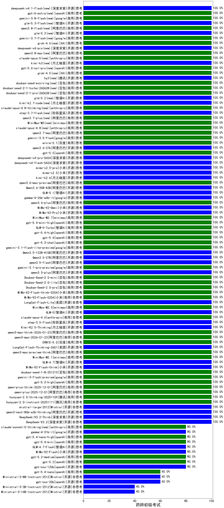

|类别|机构|大模型|【药师初级考试】准确率|平均耗时|平均消耗token|花费/千次（元）|排名（准确率）|
|---|---|-----|-------------------|-------|-----------|-----------|-----------|
|商用|腾讯|hunyuan-2.0-instruct-20251111|100.0%|8s|331|0.5|1|
|开源|深度求索|DeepSeek-V3.2-Think|100.0%|160s|709|2.1|2|
|开源|阿里巴巴|qwen3.5-flash|100.0%|135s|2589|5.1|3|
|商用|google|gemini-3.1-pro-preview|100.0%|31s|1020|82.9|4|
|开源|阿里巴巴|qwen3.5-plus|100.0%|19s|1587|7.4|5|
|商用|豆包|Doubao-Seed-2.0-mini|100.0%|184s|798|1.4|6|
|商用|豆包|Doubao-Seed-2.0-lite|100.0%|85s|642|2.0|7|
|商用|豆包|Doubao-Seed-2.0-pro|100.0%|123s|617|8.6|8|
|商用|小米|MiMo-V2-Flash-think-0204|100.0%|382s|1016|2.0|9|
|商用|小米|MiMo-V2-Flash-0204|100.0%|221s|484|0.9|10|
|开源|美团|LongCat-Flash-Lite|100.0%|120s|485|0.0|11|
|商用|minimax|MiniMax-M2.5|100.0%|19s|1057|8.3|12|
|开源|智谱AI|GLM-5|100.0%|44s|1356|23.6|13|
|商用|anthropic|claude-opus-4.6|100.0%|11s|590|90.9|14|
|开源|阶跃星辰|step-3.5-flash|100.0%|8s|830|1.7|15|
|开源|月之暗面|Kimi-K2.5-Thinking|100.0%|197s|997|19.9|16|
|商用|阿里巴巴|qwen3-max-think-2026-01-23|100.0%|60s|1645|16.0|17|
|商用|阿里巴巴|qwen3-max-2026-01-23|100.0%|127s|380|3.3|18|
|商用|百度|ERNIE-5.0|100.0%|128s|1029|23.7|19|
|开源|美团|LongCat-Flash-Thinking-2601|100.0%|160s|1392|0.0|20|
|商用|阿里巴巴|qwen3-max-preview-think|100.0%|167s|1362|31.5|21|
|商用|minimax|MiniMax-M2.1|100.0%|110s|1050|8.2|22|
|开源|智谱AI|GLM-4.7|100.0%|35s|1383|18.7|23|
|开源|小米|MiMo-V2-Flash-think|100.0%|17s|1310|0.0|24|
|商用|豆包|doubao-seed-1-8-251215|100.0%|16s|537|3.6|25|
|商用|google|gemini-3-flash-preview|100.0%|74s|836|16.8|26|
|商用|openAI|gpt-5.2-high|100.0%|19s|733|66.5|27|
|商用|阿里巴巴|qwen-plus-think-2025-12-01|100.0%|35s|1422|10.9|28|
|商用|阿里巴巴|qwen-plus-2025-12-01|100.0%|18s|578|1.1|29|
|商用|腾讯|hunyuan-2.0-thinking-20251109|100.0%|7s|564|2.1|30|
|开源|Mistral|mistral-large-2512|100.0%|12s|454|4.3|31|
|开源|阿里巴巴|Qwen3.5-27B|100.0%|280s|2112|9.9|32|
|开源|阿里巴巴|Qwen3.5-122B-A10B|100.0%|208s|1334|8.2|33|
|商用|google|gemini-3.1-flash-lite-preview|100.0%|4s|275|2.4|34|
|开源|小米|mimo-v2.5-pro(new)|100.0%|18s|986|16.4|35|
|开源|月之暗面|kimi-k2.7-code(new)|100.0%|11s|312|7.2|36|
|商用|anthropic|claude-opus-4.8-thinking(new)|100.0%|8s|532|80.9|37|
|开源|阶跃星辰|step-3.7-flash(new)|100.0%|18s|1225|9.5|38|
|商用|阿里巴巴|qwen3.7-plus(new)|100.0%|35s|614|4.5|39|
|商用|minimax|MiniMax-M3(new)|100.0%|23s|704|9.0|40|
|商用|anthropic|claude-opus-4.8(new)|100.0%|8s|480|71.8|41|
|商用|阿里巴巴|qwen3.7-max(new)|100.0%|29s|661|22.2|42|
|商用|google|gemini-3.5-flash(new)|100.0%|6s|828|49.2|43|
|商用|百度|ernie-5.1(new)|100.0%|54s|718|12.2|44|
|开源|阿里巴巴|qwen3.6-27b(new)|100.0%|21s|1410|24.4|45|
|商用|openAI|gpt-5.5(new)|100.0%|6s|265|42.7|46|
|开源|深度求索|deepseek-v4-pro(new)|100.0%|14s|467|10.5|47|
|开源|深度求索|deepseek-v4-flash(new)|100.0%|36s|430|0.8|48|
|开源|小米|mimo-v2.5(new)|100.0%|38s|866|8.7|49|
|商用|openAI|gpt-5.3-chat|100.0%|59s|346|27.6|50|
|开源|月之暗面|kimi-k2.6(new)|100.0%|50s|691|17.4|51|
|商用|阿里巴巴|qwen3.6-max-preview(new)|100.0%|37s|1354|70.2|52|
|开源|阿里巴巴|Qwen3.6-35B-A3B(new)|100.0%|8s|1506|15.7|53|
|开源|智谱AI|GLM-5.1(new)|100.0%|144s|945|21.6|54|
|开源|google|gemma-4-26b-a4b-it|100.0%|31s|484|1.2|55|
|商用|阿里巴巴|qwen3.6-plus|100.0%|46s|1309|15.1|56|
|开源|小米|MiMo-V2-Omni|100.0%|53s|957|10.0|57|
|开源|小米|MiMo-V2-Pro|100.0%|493s|1051|17.8|58|
|商用|minimax|MiniMax-M2.7|100.0%|26s|1206|9.5|59|
|商用|openAI|gpt-5.4-mini-high|100.0%|125s|403|10.7|60|
|商用|智谱AI|GLM-5-Turbo|100.0%|16s|946|19.8|61|
|商用|openAI|gpt-5.4-high|100.0%|21s|483|44.3|62|
|商用|openAI|gpt-5.4|100.0%|19s|278|22.7|63|
|开源|阿里巴巴|qwen3-next-80b-a3b-thinking|100.0%|135s|2110|8.2|64|
|开源|智谱AI|glm-5.2(new)|100.0%|27s|1152|30.9|65|
|开源|深度求索|DeepSeek-V3.2|100.0%|8s|279|0.8|66|
|商用|豆包|doubao-seed-1-6-lite-251015|100.0%|189s|543|1.1|67|
|商用|XAI|grok-4-1-fast-reasoning|100.0%|93s|938|2.9|68|
|商用|anthropic|claude-haiku-4.5-thinking|100.0%|16s|1969|67.5|69|
|商用|anthropic|claude-haiku-4.5|100.0%|8s|585|18.2|70|
|商用|openAI|gpt-5.1-medium|100.0%|146s|488|30.0|71|
|商用|智谱AI|GLM-4.5-Flash-nothink|100.0%|19s|904|0.0|72|
|开源|月之暗面|Kimi-K2-Thinking|100.0%|51s|907|13.8|73|
|商用|豆包|doubao-seed-1-6-251015|100.0%|6s|643|4.5|74|
|开源|智谱AI|GLM-4.5-Air|100.0%|23s|1149|6.6|75|
|商用|腾讯|hunyuan-turbos-20250926|100.0%|15s|602|1.1|76|
|开源|阿里巴巴|qwen3-next-80b-a3b-instruct|100.0%|10s|506|1.8|77|
|开源|豆包|Seed-OSS-36B-Instruct|100.0%|122s|883|3.4|78|
|商用|阿里巴巴|qwen3-max-preview|100.0%|10s|413|8.8|79|
|商用|openAI|gpt-5-2025-08-07|100.0%|30s|285|16.4|80|
|商用|google|gemini-2.5-flash-lite|100.0%|2s|337|0.9|81|
|开源|智谱AI|GLM-4.5-Air-nothink|100.0%|21s|887|5.0|82|
|开源|月之暗面|kimi-k2-0905|100.0%|15s|328|4.3|83|
|开源|深度求索|DeepSeek-V3.1|100.0%|15s|299|3.1|84|
|商用|百度|ERNIE-5.0-Thinking-Preview|100.0%|262s|1557|36.4|85|
|商用|anthropic|claude-4-sonnet-thinking|100.0%|8s|536|50.6|86|
|开源|阿里巴巴|qwen3-235b-a22b-instruct-2507|100.0%|10s|469|3.4|87|
|开源|阿里巴巴|qwen3-235b-a22b-thinking-2507|100.0%|19s|1459|28.1|88|
|商用|阿里巴巴|qwen3-max-2025-09-23|100.0%|533s|368|7.7|89|
|商用|openAI|gpt-5.1-high|100.0%|18s|770|50.0|90|
|商用|anthropic|claude-opus-4.5|100.0%|18s|556|86.3|91|
|开源|阿里巴巴|Qwen3-14B-nothink|100.0%|11s|445|0.8|92|
|商用|百度|ERNIE-X1.1-Preview|100.0%|109s|738|2.8|93|
|商用|anthropic|claude-sonnet-4.5-thinking|100.0%|18s|1210|121.4|94|
|开源|阿里巴巴|Qwen3-32B-nothink|100.0%|17s|464|1.7|95|
|商用|anthropic|claude-sonnet-4.5|100.0%|12s|516|48.4|96|
|开源|深度求索|DeepSeek-V3.1-Think|100.0%|39s|707|8.0|97|
|商用|google|gemini-2.5-pro|95.0%|34s|1945|136.9|98|
|开源|深度求索|DeepSeek-R1-0528|95.0%|213s|1682|26.2|99|
|商用|anthropic|claude-4-sonnet|90.0%|44s|455|40.7|100|
|商用|百川智能|Baichuan4-Turbo|90.0%|/|/|/|101|
|开源|阿里巴巴|Qwen3-32B|85.0%|58s|1852|7.2|102|
|开源|阿里巴巴|Qwen3-14B|85.0%|27s|1717|3.3|103|
|商用|百度|ERNIE-4.5-Turbo-32K|85.0%|21s|534|1.6|104|
|商用|百度|ERNIE-X1-Turbo-32K|85.0%|84s|1962|7.7|105|
|商用|阿里巴巴|qwen-flash-think-2025-07-28|80.0%|22s|2131|3.1|106|
|开源|小米|MiMo-V2-Flash|80.0%|9s|339|0.0|107|
|开源|阿里巴巴|Qwen3-8B|80.0%|114s|3289|0.0|108|
|开源|阿里巴巴|Qwen3-4B|80.0%|21s|1075|3.0|109|
|商用|openAI|o4-mini|80.0%|42s|960|28.8|110|
|开源|meta|Llama-4-Scout-17B-16E-Instruct|80.0%|8s|518|1.0|111|
|商用|腾讯|hunyuan-t1-20250711|80.0%|36s|2101|8.1|112|
|商用|阿里巴巴|qwen-turbo-2025-07-15|80.0%|7s|280|0.1|113|
|商用|openAI|gpt-5.2|80.0%|4s|155|9.0|114|
|开源|阿里巴巴|Qwen3-4B-nothink|80.0%|21s|359|0.9|115|
|商用|openAI|gpt-5.2-medium|80.0%|7s|336|26.9|116|
|开源|google|gemma-4-31b-it|80.0%|88s|535|1.4|117|
|开源|阿里巴巴|Qwen3-8B-nothink|80.0%|23s|461|0.0|118|
|商用|智谱AI|GLM-4.5-Flash|80.0%|22s|1442|0.0|119|
|商用|openAI|gpt-5.4-mini|80.0%|13s|223|5.1|120|
|商用|阿里巴巴|qwen-turbo-think-2025-07-15|80.0%|/|1751|5.1|121|
|开源|openAI|gpt-oss-120b|80.0%|226s|520|1.4|122|
|商用|openAI|gpt-5.1|80.0%|113s|171|7.5|123|
|开源|智谱AI|GLM-4.7-Flash|80.0%|265s|1200|0.0|124|
|商用|XAI|grok-4-1-fast-non-reasoning|80.0%|6s|629|1.7|125|
|商用|阿里巴巴|qwen-flash-2025-07-28|80.0%|6s|417|0.5|126|
|开源|阿里巴巴|Qwen3-30B-A3B-Thinking-2507|80.0%|52s|1947|5.3|127|
|商用|openAI|gpt-5.4-nano-high|80.0%|28s|469|3.6|128|
|开源|阿里巴巴|Qwen3-30B-A3B-Instruct-2507|80.0%|3s|414|1.1|129|
|开源|智谱AI|GLM-4-9B-0414|75.0%|6s|400|0|130|
|商用|google|gemini-2.5-flash|70.0%|7s|1299|22.5|131|
|商用|openAI|gpt-5.4-nano|60.0%|133s|235|1.5|132|
|商用|openAI|gpt-5-mini-high|60.0%|732s|2048|28.7|133|
|开源|openAI|gpt-oss-20b|60.0%|11s|2215|2.5|134|
|商用|openAI|gpt-5-nano-high|60.0%|94s|4007|11.4|135|
|商用|openAI|gpt-5-mini-2025-08-07|60.0%|19s|1027|14.0|136|
|商用|openAI|gpt-5-nano-2025-08-07|60.0%|25s|2114|5.9|137|
|开源|Mistral|Ministral-3-8B-Instruct-2512|60.0%|3s|553|0.6|138|
|开源|Mistral|Ministral-3-3B-Instruct-2512|40.0%|4s|880|0.6|139|
|开源|Mistral|Ministral-3-14B-Instruct-2512|40.0%|11s|362|0.5|140|

