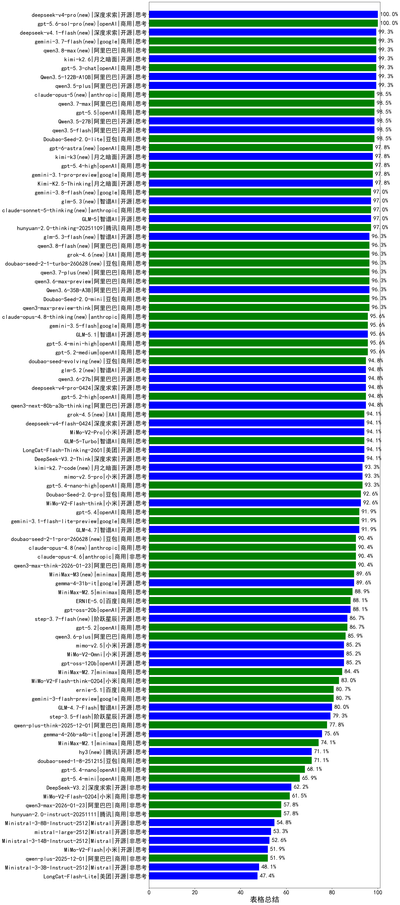

|类别|机构|大模型|【表格总结】准确率|平均耗时|平均消耗token|花费/千次（元）|排名（准确率）|
|---|---|-----|-------------------|-------|-----------|-----------|-----------|
|商用|openAI|gpt-5-mini-high|100.0%|106s|7663|93.7|1|
|开源|阿里巴巴|Qwen3.5-122B-A10B(new)|99.3%|716s|8546|45.6|2|
|开源|阿里巴巴|qwen3.5-plus(new)|99.3%|91s|8790|35.7|3|
|开源|豆包|Seed-OSS-36B-Instruct|98.5%|161s|4143|12.5|4|
|开源|阿里巴巴|Qwen3.5-27B(new)|98.5%|191s|8598|34.5|5|
|开源|阿里巴巴|qwen3.5-flash(new)|98.5%|736s|9069|15.2|6|
|商用|豆包|Doubao-Seed-2.0-lite(new)|98.5%|434s|3478|7.5|7|
|商用|openAI|gpt-5.1-medium|97.8%|272s|2537|94.7|8|
|开源|月之暗面|Kimi-K2.5-Thinking(new)|97.8%|700s|4753|78.0|9|
|商用|google|gemini-3.1-pro-preview(new)|97.8%|52s|5319|335.2|10|
|开源|智谱AI|GLM-5(new)|97.0%|127s|5265|76.4|11|
|商用|腾讯|hunyuan-2.0-thinking-20251109|97.0%|33s|4107|12.6|12|
|商用|google|gemini-2.5-pro|96.3%|60s|3908|178.1|13|
|开源|美团|LongCat-Flash-Thinking-2601(new)|96.3%|847s|6541|0.0|14|
|商用|豆包|Doubao-Seed-2.0-mini(new)|96.3%|684s|4687|6.4|15|
|商用|阿里巴巴|qwen3-max-preview-think(new)|96.3%|100s|6044|116.4|16|
|商用|openAI|gpt-5-mini-2025-08-07|96.3%|45s|3587|34.6|17|
|商用|openAI|gpt-5.2-medium(new)|95.6%|12s|1976|76.7|18|
|商用|openAI|gpt-5.2-high(new)|94.8%|21s|2268|105.8|19|
|开源|阿里巴巴|qwen3-next-80b-a3b-thinking|94.8%|58s|7323|24.5|20|
|商用|XAI|grok-3-mini|94.1%|41s|2591|7.5|21|
|开源|深度求索|DeepSeek-V3.2-Think(new)|94.1%|46s|2751|7.0|22|
|商用|openAI|gpt-5-2025-08-07|94.1%|60s|2816|117.1|23|
|开源|深度求索|DeepSeek-V3.2-Exp-Think|94.1%|614s|3753|10.0|24|
|商用|豆包|doubao-seed-1-6-lite-251015|94.1%|363s|3088|3.9|25|
|商用|google|gemini-2.5-flash|93.3%|42s|3571|38.3|26|
|商用|豆包|doubao-seed-1-6-251015|93.3%|16s|3243|14.0|27|
|商用|XAI|grok-4-0709|93.3%|56s|2346|143.7|28|
|开源|深度求索|DeepSeek-V3.1-Think|92.6%|100s|3375|30.1|29|
|开源|智谱AI|GLM-4.5-Air|92.6%|60s|4015|17.2|30|
|商用|豆包|doubao-seed-1-6-thinking-250715|92.6%|/|3778|18.5|31|
|商用|XAI|grok-4-1-fast-reasoning|92.6%|16s|2784|6.8|32|
|商用|openAI|gpt-5.1-high|92.6%|183s|4473|232.1|33|
|开源|小米|MiMo-V2-Flash-think(new)|92.6%|46s|6063|0.0|34|
|商用|anthropic|claude-4-sonnet-thinking|92.6%|45s|1767|56.7|35|
|商用|豆包|Doubao-Seed-2.0-pro(new)|92.6%|513s|3889|40.9|36|
|开源|智谱AI|GLM-4.6|91.9%|59s|3673|36.8|37|
|商用|百度|ERNIE-X1-Turbo-32K|91.9%|104s|4434|12.9|38|
|开源|智谱AI|GLM-4.7(new)|91.9%|85s|6407|75.1|39|
|开源|月之暗面|Kimi-K2-Thinking|91.1%|218s|4226|52.2|40|
|商用|openAI|o4-mini|91.1%|44s|3297|72.4|41|
|商用|百度|ERNIE-5.0-Thinking-Preview|91.1%|240s|4510|79.2|42|
|商用|阿里巴巴|qwen3-max-think-2026-01-23(new)|90.4%|343s|6828|56.3|43|
|商用|anthropic|claude-opus-4.6(new)|90.4%|19s|1822|100.0|44|
|商用|腾讯|hunyuan-t1-20250711|89.6%|59s|3725|10.0|45|
|开源|深度求索|DeepSeek-R1-0528|89.6%|79s|3684|43.4|46|
|商用|智谱AI|GLM-4.5-Flash|88.9%|74s|3938|0.0|47|
|商用|minimax|MiniMax-M2.5(new)|88.9%|38s|3142|18.2|48|
|商用|anthropic|claude-haiku-4.5-thinking|88.1%|54s|5933|168.5|49|
|商用|google|gemini-3-pro-preview(new)|88.1%|52s|4599|273.9|50|
|开源|阿里巴巴|Qwen3-30B-A3B-Thinking-2507|88.1%|77s|4913|10.4|51|
|商用|anthropic|claude-sonnet-4.5-thinking|88.1%|16s|2540|137.7|52|
|开源|openAI|gpt-oss-20b|88.1%|43s|4181|3.6|53|
|商用|百度|ERNIE-X1.1-Preview|88.1%|217s|4251|12.2|54|
|商用|阿里巴巴|qwen-flash-think-2025-07-28|88.1%|64s|4953|5.3|55|
|商用|百度|ERNIE-5.0(new)|88.1%|258s|4630|82.1|56|
|商用|anthropic|claude-opus-4.5(new)|87.4%|20s|1761|90.7|57|
|开源|阿里巴巴|qwen3-235b-a22b-thinking-2507|87.4%|298s|5944|47.5|58|
|商用|阿里巴巴|qwen-plus-think-2025-07-28|86.7%|/|5470|32.3|59|
|商用|openAI|gpt-5.2(new)|86.7%|11s|1575|36.8|60|
|开源|openAI|gpt-oss-120b|85.2%|36s|2732|5.1|61|
|开源|智谱AI|GLM-4.5|84.4%|140s|4034|41.9|62|
|开源|minimax|MiniMax-M2|84.4%|87s|4909|33.0|63|
|商用|小米|MiMo-V2-Flash-think-0204(new)|83.0%|863s|6568|11.5|64|
|开源|Mistral|Magistral-Small-2507|83.0%|89s|8731|82.5|65|
|开源|minimax|MiniMax-M1|80.7%|426s|9079|56.4|66|
|商用|科大讯飞|xunfei-spark-x1-0725|80.7%|51s|2982|35.8|67|
|商用|google|gemini-3-flash-preview(new)|80.7%|125s|3501|45.1|68|
|开源|智谱AI|GLM-4.7-Flash(new)|80.0%|948s|5171|0.0|69|
|开源|阶跃星辰|step-3.5-flash(new)|79.3%|35s|4261|7.1|70|
|商用|豆包|doubao-seed-1-6-flash-thinking-250615|77.8%|/|2325|1.2|71|
|商用|阿里巴巴|qwen-plus-think-2025-12-01(new)|77.8%|93s|6025|36.7|72|
|商用|openAI|gpt-5-nano-high|76.3%|1270s|17288|46.6|73|
|商用|anthropic|claude-sonnet-4.5(new)|74.8%|4s|1734|52.6|74|
|开源|腾讯|Hunyuan-A13B-Instruct|74.8%|97s|5592|17.6|75|
|开源|阶跃星辰|step-3|74.1%|184s|4598|15.1|76|
|商用|minimax|MiniMax-M2.1(new)|74.1%|101s|2087|9.3|77|
|商用|openAI|gpt-5.1|73.3%|129s|1576|26.4|78|
|开源|meta|Llama-4-Scout-17B-16E-Instruct|73.3%|27s|1568|1.5|79|
|商用|阿里巴巴|qwen-turbo-think-2025-07-15|72.6%|/|3899|7.4|80|
|商用|openAI|gpt-5-nano-2025-08-07|72.6%|67s|7623|18.6|81|
|商用|豆包|doubao-seed-1-6-250615|71.9%|/|1839|2.8|82|
|商用|豆包|doubao-seed-1-8-251215(new)|71.1%|37s|2624|9.0|83|
|商用|anthropic|claude-4-sonnet|71.1%|34s|1706|56.8|84|
|商用|XAI|grok-4-1-fast-non-reasoning|70.4%|123s|1578|2.5|85|
|开源|深度求索|DeepSeek-V3.2-Exp|68.9%|528s|1447|3.0|86|
|开源|智谱AI|GLM-4.5-nothink|68.1%|36s|1506|6.4|87|
|开源|google|gemma-3-27b-it|64.4%|32s|1869|1.5|88|
|开源|深度求索|DeepSeek-V3.1|64.4%|35s|1459|7.1|89|
|开源|meta|Llama-4-Maverick-17B-128E-Instruct-FP8|63.7%|28s|1556|2.9|90|
|开源|阿里巴巴|Qwen3-32B|63.0%|132s|5111|15.7|91|
|开源|深度求索|DeepSeek-V3.2(new)|62.2%|8s|1451|3.1|92|
|商用|Mistral|mistral-medium-2508|62.2%|15s|2009|9.2|93|
|商用|小米|MiMo-V2-Flash-0204(new)|61.5%|108s|1801|1.5|94|
|开源|google|gemma-3-12b-it|61.5%|33s|1897|0.8|95|
|开源|百度|ERNIE-4.5-300B-A47B|61.5%|34s|1678|4.3|96|
|商用|anthropic|claude-haiku-4.5|60.7%|67s|1800|19.5|97|
|商用|豆包|Doubao-1.5-lite-32k-250115|60.7%|34s|1853|0.6|98|
|开源|阿里巴巴|Qwen3-8B|60.7%|/|/|/|99|
|商用|百川智能|Baichuan4-Turbo|60.0%|43s|1818|27.3|100|
|商用|百度|ERNIE-4.5-Turbo-32K|60.0%|34s|1772|1.8|101|
|商用|阿里巴巴|qwen-long-2025-01-25|59.3%|41s|1761|1.1|102|
|开源|深度求索|DeepSeek-R1-0528-Qwen3-8B|59.3%|/|/|/|103|
|开源|阿里巴巴|Qwen3-4B|59.3%|115s|5341|11.7|104|
|商用|豆包|doubao-seed-1-6-flash-250615|57.8%|/|1783|0.5|105|
|商用|腾讯|hunyuan-2.0-instruct-20251111|57.8%|6s|1546|1.5|106|
|商用|阿里巴巴|qwen3-max-2026-01-23(new)|57.8%|104s|1770|5.8|107|
|开源|智谱AI|GLM-4.5-Air-nothink|56.3%|34s|1479|1.9|108|
|商用|智谱AI|GLM-4.5-Flash-nothink|56.3%|4s|1484|0.0|109|
|商用|腾讯|hunyuan-turbos-20250926|55.6%|7s|1842|1.7|110|
|开源|月之暗面|kimi-k2-0711-preview|55.6%|16s|1427|7.5|111|
|开源|百度|ERNIE-4.5-21B-A3B|55.6%|30s|1996|1.5|112|
|开源|Mistral|Ministral-3-8B-Instruct-2512(new)|54.8%|12s|2049|2.2|113|
|商用|阿里巴巴|qwen3-max-preview|54.1%|5s|1771|13.9|114|
|商用|百川智能|Baichuan4-Air|54.1%|40s|1814|1.8|115|
|开源|Mistral|mistral-large-2512(new)|53.3%|9s|2029|9.4|116|
|开源|阿里巴巴|Qwen3-14B|53.3%|85s|5569|8.8|117|
|开源|Mistral|Mistral-Small-3.2-24B-Instruct-2506|52.6%|38s|1941|1.7|118|
|开源|阿里巴巴|qwen3-235b-a22b-instruct-2507|52.6%|36s|1762|4.6|119|
|开源|Mistral|Ministral-3-14B-Instruct-2512(new)|52.6%|15s|2133|3.0|120|
|开源|小米|MiMo-V2-Flash(new)|51.9%|10s|1880|0.0|121|
|商用|阿里巴巴|qwen-plus-2025-07-28|51.9%|6s|1766|1.6|122|
|商用|阿里巴巴|qwen-plus-2025-12-01(new)|51.9%|10s|1868|1.8|123|
|开源|阿里巴巴|Qwen3-32B-nothink|51.1%|44s|1779|2.3|124|
|商用|阿里巴巴|qwen-flash-2025-07-28|50.4%|35s|1807|0.6|125|
|商用|阿里巴巴|qwen-turbo-2025-07-15|49.6%|36s|1760|0.6|126|
|商用|google|gemini-2.5-flash-lite|48.9%|23s|1811|1.6|127|
|开源|minimax|MiniMax-Text-01|48.9%|39s|2039|3.6|128|
|商用|阿里巴巴|qwen3-max-2025-09-23|48.1%|192s|1769|13.8|129|
|开源|Mistral|Ministral-3-3B-Instruct-2512(new)|48.1%|13s|2185|1.6|130|
|开源|美团|LongCat-Flash-Lite(new)|47.4%|31s|1794|0.0|131|
|开源|月之暗面|kimi-k2-0905|47.4%|47s|1446|7.5|132|
|开源|阿里巴巴|Qwen3-30B-A3B-Instruct-2507|47.4%|40s|1816|1.7|133|
|开源|腾讯|Hunyuan-A13B-Instruct-nothink|45.9%|42s|1783|2.4|134|
|开源|阿里巴巴|qwen3-next-80b-a3b-instruct|45.9%|9s|1811|2.5|135|
|开源|阿里巴巴|Qwen3-4B-nothink|45.2%|39s|1789|1.1|136|
|开源|阿里巴巴|Qwen3-14B-nothink|45.2%|59s|1774|1.2|137|
|开源|阿里巴巴|Qwen3-8B-nothink|44.4%|/|/|/|138|
|开源|智谱AI|GLM-4-9B-0414|42.2%|/|/|/|139|
|开源|阿里巴巴|Qwen3-1.7B|40.0%|66s|4359|8.8|140|
|开源|阿里巴巴|Qwen3-1.7B-nothink|38.5%|40s|1911|1.4|141|
|开源|google|gemma-3-4b-it|37.8%|27s|1951|0.3|142|
|商用|360|360zhinao2-o1|36.3%|166s|9993|90.4|143|
|商用|百度|ERNIE-Lite-8K|36.3%|32s|2033|0.0|144|
|开源|阿里巴巴|Qwen3-0.6B|26.7%|40s|2513|3.2|145|
|开源|阿里巴巴|Qwen3-0.6B-nothink|23.0%|33s|1838|1.2|146|
|开源|百度|ERNIE-4.5-0.3B|20.7%|32s|2601|0.5|147|

