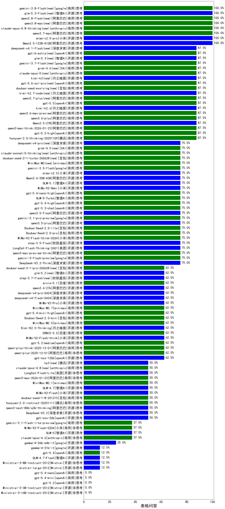

|类别|机构|大模型|【表格问答】准确率|平均耗时|平均消耗token|花费/千次（元）|排名（准确率）|
|---|---|-----|-------------------|-------|-----------|-----------|-----------|
|商用|anthropic|claude-opus-4.8-thinking(new)|100.0%|34s|4561|410.1|1|
|商用|openAI|gpt-5.1-high|100.0%|56s|7668|406.2|2|
|开源|小米|mimo-v2.5-pro(new)|100.0%|60s|7327|107.9|3|
|商用|阿里巴巴|qwen3.7-max(new)|100.0%|60s|6829|171.9|4|
|商用|anthropic|claude-4-sonnet|100.0%|35s|361|19.5|5|
|开源|智谱AI|GLM-4.5-Air|100.0%|60s|5394|23.2|6|
|开源|阿里巴巴|Qwen3.5-122B-A10B|100.0%|378s|8040|34.2|7|
|开源|阿里巴巴|Qwen3.5-27B|87.5%|502s|9759|33.9|8|
|商用|阿里巴巴|qwen3.7-plus(new)|87.5%|136s|10512|65.6|9|
|商用|openAI|gpt-5-mini-high|87.5%|694s|8241|91.3|10|
|商用|腾讯|hunyuan-2.0-thinking-20251109|87.5%|65s|8429|27.1|11|
|商用|openAI|gpt-5.2-high|87.5%|22s|3505|154.9|12|
|开源|月之暗面|kimi-k2.7-code(new)|87.5%|70s|4668|80.5|13|
|商用|阿里巴巴|qwen3-max-think-2026-01-23|87.5%|222s|10968|86.9|14|
|商用|openAI|gpt-5.1-medium|87.5%|253s|4151|156.5|15|
|商用|豆包|doubao-seed-evolving(new)|87.5%|462s|25772|698.3|16|
|开源|月之暗面|kimi-k2.6(new)|87.5%|329s|8309|178.8|17|
|商用|阿里巴巴|qwen3.6-max-preview|87.5%|112s|7146|247.2|18|
|商用|openAI|gpt-5.5(new)|87.5%|23s|3408|326.3|19|
|商用|阿里巴巴|qwen3.6-plus|87.5%|72s|7584|60.2|20|
|商用|openAI|o4-mini|87.5%|22s|2657|45.1|21|
|开源|阿里巴巴|qwen3.5-flash|75.0%|271s|8091|10.6|22|
|商用|google|gemini-3-flash-preview|75.0%|21s|6326|80.1|23|
|开源|阿里巴巴|Qwen3.6-35B-A3B|75.0%|28s|7270|50.8|24|
|开源|智谱AI|GLM-5.1|75.0%|202s|7513|137.6|25|
|开源|小米|mimo-v2.5(new)|75.0%|33s|6120|49.0|26|
|开源|深度求索|DeepSeek-V3.2-Think|75.0%|79s|4713|11.9|27|
|商用|minimax|MiniMax-M3(new)|75.0%|75s|4958|53.3|28|
|商用|google|gemini-3.5-flash(new)|75.0%|22s|7073|283.9|29|
|开源|小米|MiMo-V2-Omni|75.0%|106s|6486|54.1|30|
|商用|阿里巴巴|qwen3-max-preview-think|75.0%|271s|9441|171.8|31|
|商用|google|gemini-3.1-pro-preview|75.0%|57s|6287|317.0|32|
|开源|美团|LongCat-Flash-Thinking-2601|75.0%|315s|13860|0.0|33|
|商用|openAI|gpt-5.4-nano-high|75.0%|24s|3998|18.6|34|
|商用|智谱AI|GLM-5-Turbo|75.0%|100s|5270|75.6|35|
|开源|阶跃星辰|step-3.5-flash|75.0%|42s|8593|14.9|36|
|商用|openAI|gpt-5.4-high|75.0%|31s|3743|198.4|37|
|商用|小米|MiMo-V2-Flash-think-0204|75.0%|1325s|9283|15.2|38|
|商用|豆包|Doubao-Seed-2.0-pro|75.0%|540s|5695|51.2|39|
|开源|阿里巴巴|qwen3.5-plus|75.0%|63s|8542|28.7|40|
|商用|openAI|gpt-5.3-chat|75.0%|10s|3075|110.5|41|
|商用|豆包|Doubao-Seed-2.0-lite|75.0%|726s|6155|12.8|42|
|商用|openAI|gpt-5-nano-high|75.0%|132s|15102|38.1|43|
|商用|豆包|doubao-seed-2-1-turbo-260628(new)|75.0%|280s|18673|242.7|44|
|商用|阿里巴巴|qwen3-max-preview|75.0%|13s|2867|28.3|45|
|商用|openAI|gpt-5-2025-08-07|75.0%|30s|2171|52.6|46|
|开源|阿里巴巴|Qwen3-30B-A3B-Thinking-2507|75.0%|55s|4821|8.8|47|
|开源|阿里巴巴|qwen3-235b-a22b-thinking-2507|75.0%|53s|4817|55.8|48|
|商用|腾讯|hunyuan-t1-20250711|75.0%|50s|5204|14.0|49|
|商用|openAI|gpt-5-mini-2025-08-07|75.0%|44s|2926|21.4|50|
|商用|anthropic|claude-sonnet-5-thinking(new)|75.0%|22s|4793|180.3|51|
|开源|深度求索|DeepSeek-R1-0528|75.0%|270s|5327|65.5|52|
|开源|深度求索|deepseek-v4-flash(new)|62.5%|55s|4583|6.9|53|
|商用|minimax|MiniMax-M2.5|62.5%|85s|7513|48.9|54|
|商用|阿里巴巴|qwen-plus-think-2025-12-01|62.5%|89s|7412|37.4|55|
|商用|openAI|gpt-5.2-medium|62.5%|16s|3383|142.8|56|
|开源|小米|MiMo-V2-Flash-think|62.5%|74s|12281|0.0|57|
|开源|阿里巴巴|qwen3.6-27b(new)|62.5%|58s|7194|83.3|58|
|商用|百度|ERNIE-5.0|62.5%|240s|8906|158.6|59|
|开源|阿里巴巴|Qwen3-14B|62.5%|44s|4158|6.0|60|
|开源|月之暗面|Kimi-K2.5-Thinking|62.5%|330s|6901|107.2|61|
|商用|智谱AI|GLM-4.5-Flash|62.5%|76s|6011|0.0|62|
|商用|openAI|gpt-5.4-mini-high|62.5%|69s|4258|75.7|63|
|开源|智谱AI|glm-5.2(new)|62.5%|95s|6553|135.9|64|
|商用|豆包|doubao-seed-2-1-pro-260628(new)|62.5%|412s|22469|599.3|65|
|商用|豆包|Doubao-Seed-2.0-mini|62.5%|695s|8588|11.6|66|
|商用|阿里巴巴|qwen-plus-2025-12-01|62.5%|49s|5494|7.3|67|
|开源|小米|MiMo-V2-Pro|62.5%|414s|4719|53.2|68|
|商用|google|gemini-2.5-pro|62.5%|18s|4046|148.7|69|
|商用|minimax|MiniMax-M2.7|62.5%|232s|14432|107.1|70|
|开源|深度求索|deepseek-v4-pro(new)|62.5%|127s|4810|86.7|71|
|商用|腾讯|hunyuan-turbos-20250926|62.5%|27s|3192|3.6|72|
|开源|openAI|gpt-oss-120b|62.5%|5s|2724|4.4|73|
|商用|百度|ernie-5.1(new)|62.5%|86s|6965|82.3|74|
|开源|月之暗面|Kimi-K2-Thinking|62.5%|232s|6098|70.9|75|
|商用|阿里巴巴|qwen-flash-think-2025-07-28|62.5%|34s|5130|4.7|76|
|商用|anthropic|claude-haiku-4.5-thinking|62.5%|38s|7813|201.9|77|
|开源|阶跃星辰|step-3.7-flash(new)|62.5%|46s|10050|66.4|78|
|商用|openAI|gpt-5-nano-2025-08-07|62.5%|24s|4179|7.9|79|
|开源|豆包|Seed-OSS-36B-Instruct|50.0%|247s|5621|16.8|80|
|开源|阿里巴巴|Qwen3-32B|50.0%|94s|4566|13.7|81|
|商用|XAI|grok-4-1-fast-reasoning|50.0%|32s|5089|13.0|82|
|开源|深度求索|DeepSeek-V3.1-Think|50.0%|88s|3270|26.1|83|
|商用|百度|ERNIE-X1-Turbo-32K|50.0%|552s|5355|12.5|84|
|商用|google|gemini-2.5-flash|50.0%|7s|3539|27.8|85|
|开源|阿里巴巴|qwen3-235b-a22b-instruct-2507|50.0%|17s|2985|10.4|86|
|商用|anthropic|claude-sonnet-4.5-thinking|50.0%|30s|5325|336.3|87|
|商用|腾讯|hunyuan-2.0-instruct-20251111|50.0%|16s|3625|4.5|88|
|商用|阿里巴巴|qwen3-max-2025-09-23|50.0%|229s|4750|59.3|89|
|开源|美团|LongCat-Flash-Lite|50.0%|132s|4157|0.0|90|
|开源|腾讯|hy3(new)|50.0%|102s|3082|5.7|91|
|开源|深度求索|DeepSeek-V3.2|50.0%|30s|2995|6.8|92|
|商用|阿里巴巴|qwen-flash-2025-07-28|50.0%|11s|3111|1.6|93|
|开源|openAI|gpt-oss-20b|50.0%|240s|3131|2.1|94|
|商用|阿里巴巴|qwen3-max-2026-01-23|50.0%|69s|4929|26.5|95|
|商用|豆包|doubao-seed-1-8-251215|50.0%|52s|4935|17.0|96|
|开源|小米|MiMo-V2-Flash|50.0%|164s|4207|0.0|97|
|开源|阿里巴巴|qwen3-next-80b-a3b-thinking|50.0%|137s|8751|25.9|98|
|商用|anthropic|claude-opus-4.8(new)|50.0%|9s|3338|196.0|99|
|开源|智谱AI|GLM-4.7|50.0%|69s|6300|62.1|100|
|商用|minimax|MiniMax-M2.1|50.0%|190s|10433|73.5|101|
|商用|anthropic|claude-opus-4.6|37.5%|17s|3551|235.0|102|
|商用|阿里巴巴|qwen-turbo-think-2025-07-15|37.5%|/|4760|8.2|103|
|商用|豆包|doubao-seed-1-6-lite-251015|37.5%|169s|4982|5.4|104|
|开源|阿里巴巴|qwen3-next-80b-a3b-instruct|37.5%|19s|3147|5.8|105|
|开源|智谱AI|GLM-5|37.5%|269s|8274|115.7|106|
|商用|豆包|doubao-seed-1-6-251015|37.5%|127s|5299|20.0|107|
|商用|google|gemini-3.1-flash-lite-preview|37.5%|5s|3619|11.0|108|
|商用|百度|ERNIE-X1.1-Preview|37.5%|299s|8028|22.9|109|
|开源|阿里巴巴|Qwen3-30B-A3B-Instruct-2507|37.5%|8s|2984|3.9|110|
|商用|小米|MiMo-V2-Flash-0204|37.5%|445s|3698|3.5|111|
|商用|百度|ERNIE-5.0-Thinking-Preview|37.5%|239s|7024|113.4|112|
|商用|anthropic|claude-opus-4.5|37.5%|18s|3444|219.8|113|
|商用|百度|ERNIE-4.5-Turbo-32K|25.0%|32s|2581|2.8|114|
|商用|智谱AI|GLM-4.5-Flash-nothink|25.0%|12s|2301|0.0|115|
|商用|anthropic|claude-4-sonnet-thinking|25.0%|55s|3227|110.7|116|
|商用|openAI|gpt-5.1|25.0%|343s|2626|48.3|117|
|开源|阿里巴巴|Qwen3-4B|25.0%|23s|3170|5.4|118|
|开源|阿里巴巴|Qwen3-8B|25.0%|600s|16837|0.0|119|
|开源|google|gemma-4-26b-a4b-it|25.0%|68s|3608|4.3|120|
|商用|google|gemini-2.5-flash-lite|25.0%|9s|2808|3.2|121|
|商用|阿里巴巴|qwen-turbo-2025-07-15|25.0%|10s|2717|1.0|122|
|商用|anthropic|claude-sonnet-4.5|25.0%|10s|3183|106.0|123|
|开源|深度求索|DeepSeek-V3.1|25.0%|25s|2089|11.9|124|
|商用|百川智能|Baichuan4-Turbo|12.5%|12s|3502|52.5|125|
|开源|google|gemma-4-31b-it|12.5%|76s|3604|4.5|126|
|开源|meta|Llama-4-Scout-17B-16E-Instruct|12.5%|5s|264|0.3|127|
|开源|阿里巴巴|Qwen3-4B-nothink|12.5%|18s|2705|2.0|128|
|开源|Mistral|mistral-large-2512|12.5%|16s|3806|18.9|129|
|开源|Mistral|Ministral-3-8B-Instruct-2512|12.5%|11s|4026|4.3|130|
|开源|月之暗面|kimi-k2-0905|12.5%|57s|2882|19.2|131|
|开源|智谱AI|GLM-4.7-Flash|12.5%|386s|6979|0.0|132|
|商用|openAI|gpt-5.4|12.5%|7s|2501|68.0|133|
|开源|Mistral|Ministral-3-3B-Instruct-2512|0.0%|8s|4284|3.1|134|
|开源|Mistral|Ministral-3-14B-Instruct-2512|0.0%|5s|3621|5.2|135|
|商用|openAI|gpt-5.4-nano|0.0%|3s|2521|5.7|136|
|商用|XAI|grok-4-1-fast-non-reasoning|0.0%|3s|2640|4.3|137|
|商用|anthropic|claude-haiku-4.5|0.0%|13s|3220|36.2|138|
|开源|智谱AI|GLM-4.5-Air-nothink|0.0%|9s|2567|6.2|139|
|开源|阿里巴巴|Qwen3-32B-nothink|0.0%|61s|2869|4.7|140|
|开源|阿里巴巴|Qwen3-14B-nothink|0.0%|14s|2811|2.2|141|
|开源|阿里巴巴|Qwen3-8B-nothink|0.0%|46s|2799|0.0|142|
|商用|openAI|gpt-5.4-mini|0.0%|27s|2459|19.1|143|
|开源|智谱AI|GLM-4-9B-0414|0.0%|5s|1350|0.0|144|
|商用|openAI|gpt-5.2|0.0%|5s|2497|54.7|145|

