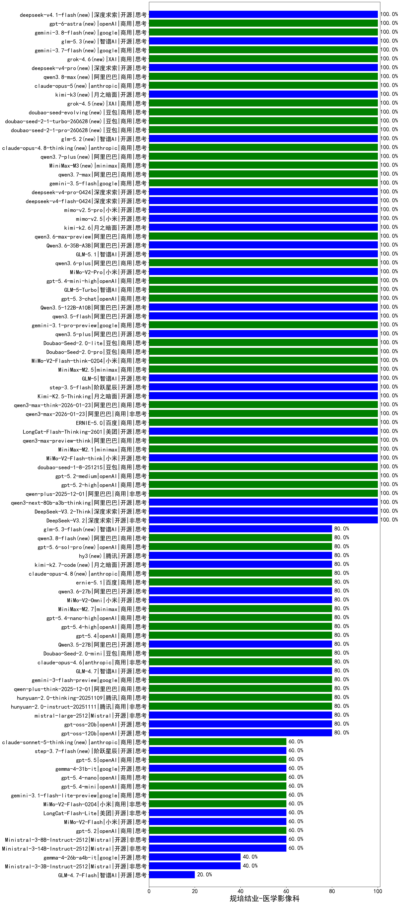

|类别|机构|大模型|【规培结业-医学影像科】准确率|平均耗时|平均消耗token|花费/千次（元）|排名（准确率）|
|---|---|-----|-------------------|-------|-----------|-----------|-----------|
|商用|智谱AI|GLM-5-Turbo(new)|100.0%|38s|1199|25.4|1|
|商用|openAI|gpt-5-mini-2025-08-07|100.0%|28s|760|10.1|2|
|商用|阿里巴巴|qwen-plus-2025-12-01(new)|100.0%|19s|812|1.6|3|
|开源|智谱AI|GLM-4.5-nothink|100.0%|17s|457|5.7|4|
|开源|阶跃星辰|step-3|100.0%|118s|2245|8.8|5|
|开源|阿里巴巴|Qwen3-30B-A3B-Thinking-2507|100.0%|54s|2404|6.6|6|
|开源|智谱AI|GLM-4.5|100.0%|53s|1734|23.7|7|
|开源|智谱AI|GLM-4.5-Air|100.0%|54s|2284|13.4|8|
|商用|openAI|gpt-5.2-high(new)|100.0%|11s|493|42.9|9|
|商用|openAI|gpt-5.2-medium(new)|100.0%|9s|293|23.0|10|
|商用|豆包|doubao-seed-1-8-251215(new)|100.0%|17s|591|4.0|11|
|开源|小米|MiMo-V2-Flash-think(new)|100.0%|26s|2306|0.0|12|
|商用|minimax|MiniMax-M2.1(new)|100.0%|139s|1962|15.9|13|
|商用|阿里巴巴|qwen3-max-preview-think(new)|100.0%|182s|1680|39.2|14|
|商用|百度|ERNIE-5.0(new)|100.0%|101s|2196|51.9|15|
|开源|阿里巴巴|qwen3-235b-a22b-instruct-2507|100.0%|12s|507|3.7|16|
|商用|阿里巴巴|qwen3-max-2026-01-23(new)|100.0%|98s|344|3.0|17|
|开源|阿里巴巴|qwen3-next-80b-a3b-thinking|100.0%|140s|3274|12.9|18|
|开源|深度求索|DeepSeek-V3.2-Think(new)|100.0%|81s|2339|7.0|19|
|开源|月之暗面|Kimi-K2.5-Thinking(new)|100.0%|334s|1474|30.0|20|
|开源|深度求索|DeepSeek-V3.2(new)|100.0%|99s|307|0.9|21|
|商用|anthropic|claude-haiku-4.5-thinking|100.0%|45s|2202|76.1|22|
|商用|XAI|grok-4-1-fast-reasoning|100.0%|11s|1126|3.5|23|
|商用|XAI|grok-4-1-fast-non-reasoning|100.0%|84s|573|1.6|24|
|开源|深度求索|DeepSeek-V3.2-Exp-Think|100.0%|73s|1375|4.1|25|
|商用|google|gemini-3-pro-preview(new)|100.0%|72s|1295|106.4|26|
|商用|anthropic|claude-sonnet-4.5-thinking|100.0%|36s|2366|247.3|27|
|商用|百度|ERNIE-5.0-Thinking-Preview|100.0%|322s|2503|59.2|28|
|商用|阿里巴巴|qwen-turbo-think-2025-07-15|100.0%|/|1818|5.3|29|
|商用|阿里巴巴|qwen-plus-think-2025-07-28|100.0%|/|2299|18.0|30|
|商用|阿里巴巴|qwen-plus-2025-07-28|100.0%|13s|392|0.7|31|
|商用|阿里巴巴|qwen3-max-2025-09-23|100.0%|194s|384|8.1|32|
|商用|google|gemini-2.5-flash-lite|100.0%|7s|709|1.9|33|
|开源|深度求索|DeepSeek-V3.1-Think|100.0%|88s|1619|19.0|34|
|开源|深度求索|DeepSeek-V3.1|100.0%|16s|296|3.1|35|
|商用|openAI|gpt-5-mini-high|100.0%|122s|1431|19.9|36|
|商用|阿里巴巴|qwen3-max-think-2026-01-23(new)|100.0%|312s|2824|27.8|37|
|开源|美团|LongCat-Flash-Thinking-2601(new)|100.0%|447s|2054|0.0|38|
|开源|月之暗面|kimi-k2-0711-preview|100.0%|81s|851|12.8|39|
|商用|豆包|doubao-seed-1-6-flash-thinking-250615|100.0%|13s|607|0.7|40|
|商用|openAI|gpt-5.3-chat(new)|100.0%|36s|325|25.9|41|
|开源|阿里巴巴|Qwen3.5-122B-A10B(new)|100.0%|196s|3618|22.8|42|
|开源|阿里巴巴|qwen3.5-flash(new)|100.0%|208s|2627|5.1|43|
|商用|google|gemini-3.1-pro-preview(new)|100.0%|24s|1132|92.5|44|
|开源|阿里巴巴|qwen3.5-plus(new)|100.0%|35s|2297|10.8|45|
|开源|阿里巴巴|Qwen3-32B|100.0%|30s|858|3.2|46|
|商用|豆包|Doubao-Seed-2.0-lite(new)|100.0%|129s|651|2.0|47|
|商用|豆包|Doubao-Seed-2.0-pro(new)|100.0%|207s|921|13.5|48|
|商用|小米|MiMo-V2-Flash-think-0204(new)|100.0%|600s|2797|5.8|49|
|商用|google|gemini-2.5-pro|100.0%|25s|2212|155.7|50|
|商用|minimax|MiniMax-M2.5(new)|100.0%|25s|907|7.1|51|
|开源|智谱AI|GLM-5(new)|100.0%|69s|2188|38.6|52|
|开源|minimax|MiniMax-M2|100.0%|56s|2010|16.3|53|
|商用|XAI|grok-3-mini|100.0%|441s|1128|4.0|54|
|开源|阶跃星辰|step-3.5-flash(new)|100.0%|24s|2934|6.1|55|
|商用|google|gemini-2.5-flash|95.0%|9s|1537|26.7|56|
|开源|腾讯|Hunyuan-A13B-Instruct|95.0%|28s|970|3.7|57|
|开源|阿里巴巴|Qwen3-4B|95.0%|12s|1053|2.9|58|
|开源|百度|ERNIE-4.5-300B-A47B|95.0%|23s|335|2.2|59|
|商用|百度|ERNIE-4.5-Turbo-32K|95.0%|22s|558|1.6|60|
|商用|XAI|grok-4-0709|90.0%|135s|2033|214.3|61|
|开源|阿里巴巴|Qwen3-14B|90.0%|27s|1681|3.2|62|
|商用|豆包|doubao-seed-1-6-flash-250615|90.0%|3s|297|0.3|63|
|商用|百度|ERNIE-X1-Turbo-32K|90.0%|220s|1957|7.6|64|
|商用|anthropic|claude-4-sonnet|90.0%|44s|601|55.1|65|
|商用|豆包|doubao-seed-1-6-250615|90.0%|160s|443|2.8|66|
|开源|深度求索|DeepSeek-R1-0528|90.0%|234s|1704|26.5|67|
|开源|minimax|MiniMax-Text-01|85.0%|7s|880|7.1|68|
|开源|minimax|MiniMax-M1|85.0%|200s|2042|13.2|69|
|开源|阿里巴巴|Qwen3.5-27B(new)|80.0%|379s|3326|15.7|70|
|商用|openAI|gpt-5.4(new)|80.0%|3s|210|16.0|71|
|商用|openAI|gpt-5.4-high(new)|80.0%|17s|624|59.4|72|
|商用|openAI|gpt-5.1|80.0%|76s|220|11.2|73|
|商用|anthropic|claude-sonnet-4.5(new)|80.0%|17s|578|55.5|74|
|商用|阿里巴巴|qwen-plus-think-2025-12-01(new)|80.0%|65s|2438|19.1|75|
|开源|月之暗面|Kimi-K2-Thinking|80.0%|209s|2329|36.6|76|
|开源|智谱AI|GLM-4.7(new)|80.0%|51s|1928|26.4|77|
|商用|anthropic|claude-opus-4.5(new)|80.0%|19s|507|78.2|78|
|商用|google|gemini-3-flash-preview(new)|80.0%|12s|1061|21.6|79|
|商用|anthropic|claude-opus-4.6(new)|80.0%|24s|527|80.4|80|
|开源|Mistral|mistral-large-2512(new)|80.0%|13s|498|4.8|81|
|商用|腾讯|hunyuan-2.0-instruct-20251111|80.0%|19s|417|0.7|82|
|商用|腾讯|hunyuan-2.0-thinking-20251109|80.0%|16s|948|3.6|83|
|商用|豆包|Doubao-Seed-2.0-mini(new)|80.0%|697s|3777|7.4|84|
|商用|百川智能|Baichuan4-Air|80.0%|/|/|/|85|
|商用|豆包|doubao-seed-1-6-lite-251015|80.0%|16s|747|1.6|86|
|商用|openAI|gpt-5-2025-08-07|80.0%|25s|438|27.7|87|
|商用|豆包|Doubao-1.5-lite-32k-250115|80.0%|6s|188|0.1|88|
|开源|阿里巴巴|Qwen3-8B|80.0%|600s|15395|0.0|89|
|商用|openAI|o4-mini|80.0%|27s|767|22.3|90|
|开源|百度|ERNIE-4.5-21B-A3B|80.0%|6s|308|0.0|91|
|商用|阿里巴巴|qwen-turbo-2025-07-15|80.0%|7s|287|0.2|92|
|商用|豆包|doubao-seed-1-6-thinking-250715|80.0%|17s|1020|7.7|93|
|开源|阿里巴巴|qwen3-235b-a22b-thinking-2507|80.0%|51s|2257|44.1|94|
|商用|科大讯飞|xunfei-spark-x1-0725|80.0%|/|878|10.5|95|
|开源|阿里巴巴|Qwen3-4B-nothink|80.0%|25s|436|1.1|96|
|开源|阿里巴巴|Qwen3-32B-nothink|80.0%|17s|450|1.6|97|
|商用|智谱AI|GLM-4.5-Flash|80.0%|36s|2135|0.0|98|
|开源|openAI|gpt-oss-120b|80.0%|8s|523|1.4|99|
|开源|openAI|gpt-oss-20b|80.0%|6s|756|0.8|100|
|商用|阿里巴巴|qwen3-max-preview|80.0%|10s|474|10.3|101|
|开源|阿里巴巴|qwen3-next-80b-a3b-instruct|80.0%|11s|481|1.7|102|
|开源|深度求索|DeepSeek-V3.2-Exp|80.0%|13s|270|0.8|103|
|商用|豆包|doubao-seed-1-6-251015|80.0%|14s|616|4.3|104|
|商用|阿里巴巴|qwen-flash-think-2025-07-28|80.0%|33s|3523|5.2|105|
|商用|Mistral|mistral-medium-2508|80.0%|23s|429|5.3|106|
|开源|智谱AI|GLM-4.6|80.0%|68s|2089|28.6|107|
|开源|豆包|Seed-OSS-36B-Instruct|80.0%|185s|3056|12.1|108|
|商用|腾讯|hunyuan-turbos-20250926|80.0%|12s|514|0.9|109|
|开源|meta|Llama-4-Maverick-17B-128E-Instruct-FP8|75.0%|8s|554|2.2|110|
|开源|深度求索|DeepSeek-R1-0528-Qwen3-8B|75.0%|296s|1543|0.0|111|
|开源|meta|Llama-4-Scout-17B-16E-Instruct|75.0%|13s|629|1.3|112|
|商用|百川智能|Baichuan4-Turbo|70.0%|/|/|/|113|
|开源|阿里巴巴|Qwen3-1.7B|65.0%|19s|2131|6.2|114|
|商用|阿里巴巴|qwen-flash-2025-07-28|60.0%|7s|481|0.6|115|
|开源|腾讯|Hunyuan-A13B-Instruct-nothink|60.0%|14s|307|1.1|116|
|商用|openAI|gpt-5-nano-high|60.0%|79s|3239|9.2|117|
|商用|腾讯|hunyuan-t1-20250711|60.0%|37s|2128|8.2|118|
|商用|openAI|gpt-5.1-high|60.0%|159s|884|58.4|119|
|开源|美团|LongCat-Flash-Lite(new)|60.0%|93s|307|0.0|120|
|商用|小米|MiMo-V2-Flash-0204(new)|60.0%|177s|477|0.9|121|
|开源|阿里巴巴|Qwen3-0.6B|60.0%|7s|1110|3.1|122|
|商用|anthropic|claude-4-sonnet-thinking|60.0%|9s|527|49.9|123|
|开源|google|gemma-3-27b-it|60.0%|/|/|/|124|
|商用|google|gemini-3.1-flash-lite-preview(new)|60.0%|5s|358|3.3|125|
|开源|小米|MiMo-V2-Flash(new)|60.0%|10s|366|0.0|126|
|商用|openAI|gpt-5.1-medium|60.0%|191s|498|31.0|127|
|开源|阿里巴巴|Qwen3-14B-nothink|60.0%|20s|577|1.1|128|
|商用|百度|ERNIE-X1.1-Preview|60.0%|133s|1266|4.9|129|
|开源|阿里巴巴|Qwen3-30B-A3B-Instruct-2507|60.0%|3s|377|1.0|130|
|开源|智谱AI|GLM-4.5-Air-nothink|60.0%|13s|882|5.0|131|
|商用|openAI|gpt-5.2(new)|60.0%|8s|167|10.5|132|
|商用|智谱AI|GLM-4.5-Flash-nothink|60.0%|17s|906|0.0|133|
|商用|anthropic|claude-haiku-4.5|60.0%|9s|530|16.3|134|
|开源|Mistral|Ministral-3-8B-Instruct-2512(new)|60.0%|10s|401|0.4|135|
|开源|Mistral|Ministral-3-14B-Instruct-2512(new)|60.0%|4s|443|0.6|136|
|商用|openAI|gpt-5-nano-2025-08-07|60.0%|38s|1896|5.3|137|
|开源|智谱AI|GLM-4-9B-0414|60.0%|8s|445|0.0|138|
|商用|百度|ERNIE-Lite-8K|55.0%|/|/|/|139|
|开源|google|gemma-3-12b-it|45.0%|/|/|/|140|
|开源|月之暗面|kimi-k2-0905|40.0%|88s|227|2.7|141|
|开源|阿里巴巴|Qwen3-0.6B-nothink|40.0%|6s|186|0.4|142|
|开源|Mistral|Mistral-Small-3.2-24B-Instruct-2506|40.0%|232s|402|0.8|143|
|开源|Mistral|Ministral-3-3B-Instruct-2512(new)|40.0%|12s|661|0.5|144|
|开源|阿里巴巴|Qwen3-8B-nothink|40.0%|19s|428|0.0|145|
|开源|百度|ERNIE-4.5-0.3B|35.0%|5s|400|0.0|146|
|开源|google|gemma-3-4b-it|35.0%|/|/|/|147|
|开源|智谱AI|GLM-4.7-Flash(new)|20.0%|1493s|1953|0.0|148|
|开源|阿里巴巴|Qwen3-1.7B-nothink|20.0%|10s|396|1.0|149|

