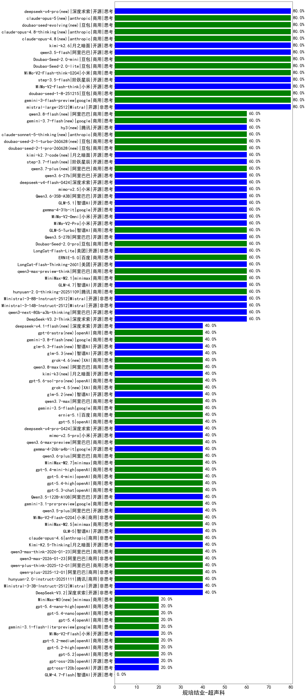

|类别|机构|大模型|【规培结业-超声科】准确率|平均耗时|平均消耗token|花费/千次（元）|排名（准确率）|
|---|---|-----|-------------------|-------|-----------|-----------|-----------|
|商用|百度|ERNIE-4.5-Turbo-32K(new)|95.0%|24s|582|1.7|1|
|商用|百度|ERNIE-X1-Turbo-32K(new)|85.0%|113s|2133|8.3|2|
|商用|豆包|doubao-seed-1-8-251215(new)|80.0%|39s|938|6.7|3|
|商用|google|gemini-2.5-pro(new)|80.0%|51s|2887|203.1|4|
|开源|Mistral|mistral-large-2512(new)|80.0%|13s|558|5.2|5|
|开源|阶跃星辰|step-3.5-flash(new)|80.0%|28s|3191|6.6|6|
|商用|google|gemini-3-flash-preview(new)|80.0%|134s|1383|28.2|7|
|开源|阿里巴巴|qwen3.5-flash(new)|80.0%|362s|3535|6.9|8|
|商用|智谱AI|GLM-4.5-Flash(new)|80.0%|31s|1792|0.0|9|
|商用|腾讯|hunyuan-turbos-20250926(new)|80.0%|18s|711|1.3|10|
|商用|豆包|Doubao-Seed-2.0-mini(new)|80.0%|610s|2506|4.8|11|
|商用|豆包|Doubao-Seed-2.0-lite(new)|80.0%|270s|1125|3.7|12|
|开源|月之暗面|kimi-k2.6(new)|80.0%|124s|1977|52.0|13|
|商用|小米|MiMo-V2-Flash-think-0204(new)|80.0%|1189s|2328|4.8|14|
|开源|小米|MiMo-V2-Flash-think(new)|80.0%|65s|2443|0.0|15|
|商用|google|gemini-2.5-flash(new)|70.0%|11s|1952|33.8|16|
|开源|阿里巴巴|Qwen3-32B(new)|70.0%|34s|1281|4.8|17|
|开源|阿里巴巴|Qwen3-14B(new)|65.0%|30s|1035|1.9|18|
|开源|阿里巴巴|qwen3-next-80b-a3b-thinking(new)|60.0%|71s|3278|12.9|19|
|商用|阿里巴巴|qwen-flash-think-2025-07-28(new)|60.0%|34s|3444|5.1|20|
|开源|Mistral|Ministral-3-14B-Instruct-2512(new)|60.0%|13s|823|1.2|21|
|商用|百度|ERNIE-5.0(new)|60.0%|121s|2330|54.9|22|
|开源|阿里巴巴|Qwen3.5-27B(new)|60.0%|252s|3546|16.7|23|
|开源|月之暗面|kimi-k2-0905(new)|60.0%|105s|327|4.2|24|
|商用|anthropic|claude-haiku-4.5(new)|60.0%|10s|749|23.6|25|
|开源|阿里巴巴|qwen3-next-80b-a3b-instruct(new)|60.0%|14s|561|2.0|26|
|开源|深度求索|DeepSeek-V3.2-Think(new)|60.0%|212s|1993|5.9|27|
|商用|豆包|doubao-seed-1-6-lite-251015(new)|60.0%|39s|916|2.0|28|
|商用|XAI|grok-4-1-fast-reasoning(new)|60.0%|90s|1504|4.8|29|
|商用|anthropic|claude-haiku-4.5-thinking(new)|60.0%|46s|2443|84.1|30|
|商用|智谱AI|GLM-5-Turbo(new)|60.0%|33s|1653|35.2|31|
|商用|豆包|Doubao-Seed-2.0-pro(new)|60.0%|461s|2083|32.0|32|
|商用|阿里巴巴|qwen-flash-2025-07-28(new)|60.0%|45s|704|0.9|33|
|商用|小米|MiMo-V2-Omni(new)|60.0%|7s|1111|12.0|34|
|开源|Mistral|Ministral-3-8B-Instruct-2512(new)|60.0%|12s|736|0.8|35|
|开源|智谱AI|GLM-5.1(new)|60.0%|244s|1992|46.5|36|
|商用|小米|mimo-v2.5(new)|60.0%|14s|1710|20.4|37|
|开源|深度求索|DeepSeek-R1-0528(new)|60.0%|222s|1942|30.1|38|
|商用|腾讯|hunyuan-t1-20250711(new)|60.0%|37s|2131|8.2|39|
|开源|阿里巴巴|qwen3-235b-a22b-instruct-2507(new)|60.0%|13s|531|3.8|40|
|开源|智谱AI|GLM-4.7(new)|60.0%|70s|3155|43.4|41|
|开源|美团|LongCat-Flash-Thinking-2601(new)|60.0%|246s|2708|0.0|42|
|开源|阿里巴巴|Qwen3.6-35B-A3B(new)|60.0%|116s|2432|25.6|43|
|开源|阿里巴巴|Qwen3-4B-nothink(new)|60.0%|27s|562|1.5|44|
|商用|minimax|MiniMax-M2.1(new)|60.0%|89s|1405|11.2|45|
|开源|智谱AI|GLM-4.5-Air(new)|60.0%|46s|2159|12.6|46|
|开源|google|gemma-4-31b-it(new)|60.0%|444s|643|1.6|47|
|商用|腾讯|hunyuan-2.0-thinking-20251109(new)|60.0%|19s|1083|4.2|48|
|商用|小米|MiMo-V2-Pro(new)|60.0%|482s|1374|24.4|49|
|商用|阿里巴巴|qwen3-max-preview-think(new)|60.0%|93s|2816|66.1|50|
|开源|美团|LongCat-Flash-Lite(new)|60.0%|93s|514|0.0|51|
|开源|智谱AI|GLM-4-9B-0414(new)|55.0%|13s|494|0|52|
|开源|阿里巴巴|Qwen3-30B-A3B-Thinking-2507(new)|50.0%|75s|3218|8.8|53|
|商用|anthropic|claude-4-sonnet-thinking(new)|50.0%|65s|597|55.5|54|
|商用|anthropic|claude-4-sonnet(new)|50.0%|46s|660|57.6|55|
|开源|阿里巴巴|Qwen3-4B(new)|50.0%|28s|2619|7.6|56|
|商用|百川智能|Baichuan4-Turbo(new)|45.0%|/|/|/|57|
|开源|阿里巴巴|Qwen3-8B(new)|45.0%|477s|7962|0.0|58|
|开源|智谱AI|GLM-5(new)|40.0%|68s|2073|36.3|59|
|商用|openAI|gpt-5.4-high(new)|40.0%|13s|660|61.6|60|
|商用|阿里巴巴|qwen3.6-max-preview(new)|40.0%|57s|1815|94.7|61|
|开源|google|gemma-4-26b-a4b-it(new)|40.0%|72s|700|1.8|62|
|商用|阿里巴巴|qwen3.6-plus(new)|40.0%|30s|1684|19.5|63|
|商用|minimax|MiniMax-M2.7(new)|40.0%|38s|1448|11.5|64|
|商用|openAI|gpt-5.4-mini-high(new)|40.0%|176s|1957|59.3|65|
|商用|openAI|gpt-5.4-mini(new)|40.0%|14s|312|7.5|66|
|商用|openAI|gpt-5.3-chat(new)|40.0%|52s|363|28.0|67|
|商用|anthropic|claude-opus-4.6(new)|40.0%|24s|673|102.7|68|
|商用|google|gemini-3.1-pro-preview(new)|40.0%|39s|1565|128.2|69|
|开源|阿里巴巴|qwen3.5-plus(new)|40.0%|33s|2588|12.1|70|
|商用|小米|MiMo-V2-Flash-0204(new)|40.0%|313s|659|1.2|71|
|商用|阿里巴巴|qwen3-max-2026-01-23(new)|40.0%|45s|481|4.2|72|
|商用|阿里巴巴|qwen3-max-think-2026-01-23(new)|40.0%|295s|2943|28.8|73|
|开源|月之暗面|Kimi-K2.5-Thinking(new)|40.0%|397s|1961|40.0|74|
|商用|minimax|MiniMax-M2.5(new)|40.0%|40s|1722|13.8|75|
|开源|阿里巴巴|Qwen3.5-122B-A10B(new)|40.0%|352s|3370|21.2|76|
|开源|深度求索|DeepSeek-V3.2(new)|40.0%|12s|388|1.1|77|
|开源|豆包|Seed-OSS-36B-Instruct(new)|40.0%|136s|2488|9.8|78|
|商用|anthropic|claude-sonnet-4.5-thinking(new)|40.0%|24s|1616|163.9|79|
|商用|openAI|o4-mini(new)|40.0%|44s|987|28.6|80|
|开源|阿里巴巴|qwen3-235b-a22b-thinking-2507(new)|40.0%|32s|2293|44.4|81|
|开源|阿里巴巴|Qwen3-30B-A3B-Instruct-2507(new)|40.0%|6s|641|1.7|82|
|开源|智谱AI|GLM-4.5-Air-nothink(new)|40.0%|16s|1061|6.0|83|
|开源|深度求索|DeepSeek-V3.1(new)|40.0%|27s|434|4.7|84|
|开源|深度求索|DeepSeek-V3.1-Think(new)|40.0%|43s|859|9.8|85|
|商用|google|gemini-2.5-flash-lite(new)|40.0%|3s|607|1.6|86|
|商用|阿里巴巴|qwen3-max-preview(new)|40.0%|12s|491|10.4|87|
|商用|豆包|doubao-seed-1-6-251015(new)|40.0%|8s|801|5.7|88|
|开源|月之暗面|Kimi-K2-Thinking(new)|40.0%|108s|1671|25.9|89|
|商用|openAI|gpt-5.1(new)|40.0%|528s|183|7.5|90|
|商用|XAI|grok-4-1-fast-non-reasoning(new)|40.0%|6s|674|1.9|91|
|商用|anthropic|claude-sonnet-4.5(new)|40.0%|14s|633|59.4|92|
|商用|小米|mimo-v2.5-pro(new)|40.0%|25s|1580|28.7|93|
|商用|百度|ERNIE-X1.1-Preview(new)|40.0%|171s|1221|4.7|94|
|商用|阿里巴巴|qwen-plus-think-2025-12-01(new)|40.0%|58s|2424|18.8|95|
|商用|百度|ERNIE-5.0-Thinking-Preview(new)|40.0%|291s|2470|58.2|96|
|商用|腾讯|hunyuan-2.0-instruct-20251111(new)|40.0%|15s|497|0.9|97|
|开源|Mistral|Ministral-3-3B-Instruct-2512(new)|40.0%|13s|499|0.4|98|
|商用|阿里巴巴|qwen-plus-2025-12-01(new)|40.0%|25s|970|1.8|99|
|商用|阿里巴巴|qwen3-max-2025-09-23(new)|40.0%|775s|517|11.0|100|
|商用|anthropic|claude-opus-4.5(new)|40.0%|15s|679|105.4|101|
|开源|阿里巴巴|Qwen3-8B-nothink(new)|20.0%|23s|568|0.0|102|
|开源|阿里巴巴|Qwen3-32B-nothink(new)|20.0%|26s|684|2.5|103|
|商用|openAI|gpt-5.4-nano(new)|20.0%|149s|302|2.0|104|
|商用|openAI|gpt-5.2(new)|20.0%|6s|208|13.0|105|
|商用|阿里巴巴|qwen-turbo-2025-07-15(new)|20.0%|10s|492|0.3|106|
|商用|智谱AI|GLM-4.5-Flash-nothink(new)|20.0%|19s|985|0.0|107|
|开源|openAI|gpt-oss-120b(new)|20.0%|11s|775|2.2|108|
|开源|openAI|gpt-oss-20b(new)|20.0%|11s|959|1.0|109|
|开源|小米|MiMo-V2-Flash(new)|20.0%|12s|495|0.0|110|
|商用|openAI|gpt-5.4-nano-high(new)|20.0%|14s|679|5.3|111|
|商用|openAI|gpt-5-nano-2025-08-07(new)|20.0%|125s|2398|6.7|112|
|商用|openAI|gpt-5-2025-08-07(new)|20.0%|22s|361|20.9|113|
|商用|openAI|gpt-5-mini-2025-08-07(new)|20.0%|46s|987|13.2|114|
|商用|openAI|gpt-5.4(new)|20.0%|7s|371|31.2|115|
|商用|google|gemini-3.1-flash-lite-preview(new)|20.0%|5s|509|4.7|116|
|商用|阿里巴巴|qwen-turbo-think-2025-07-15(new)|20.0%|/|4014|11.8|117|
|开源|meta|Llama-4-Scout-17B-16E-Instruct(new)|20.0%|11s|595|1.2|118|
|商用|openAI|gpt-5.2-high(new)|20.0%|11s|530|45.0|119|
|商用|openAI|gpt-5-nano-high(new)|20.0%|696s|5186|14.8|120|
|商用|openAI|gpt-5-mini-high(new)|20.0%|1019s|1964|27.4|121|
|商用|openAI|gpt-5.1-medium(new)|20.0%|158s|512|30.9|122|
|商用|openAI|gpt-5.1-high(new)|20.0%|34s|1061|69.8|123|
|商用|openAI|gpt-5.2-medium(new)|20.0%|11s|377|29.8|124|
|开源|智谱AI|GLM-4.7-Flash(new)|0.0%|1275s|3981|0.0|125|
|开源|阿里巴巴|Qwen3-14B-nothink(new)|0.0%|23s|721|1.3|126|

