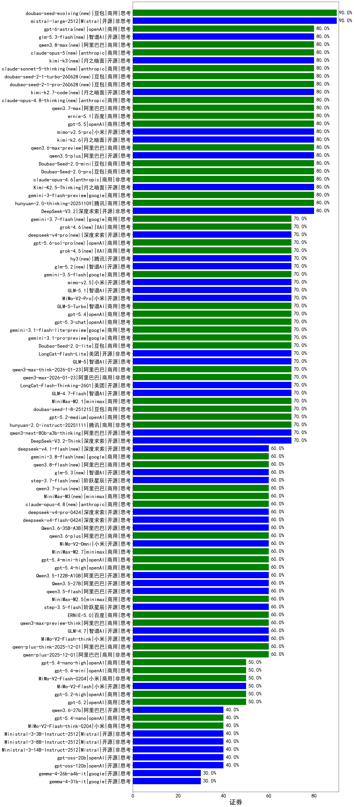

|类别|机构|大模型|【证券】准确率|平均耗时|平均消耗token|花费/千次（元）|排名（准确率）|
|---|---|-----|-------------------|-------|-----------|-----------|-----------|
|开源|Mistral|mistral-large-2512|90.0%|9s|368|3.4|1|
|商用|豆包|doubao-seed-evolving(new)|90.0%|232s|8542|253.8|2|
|开源|月之暗面|Kimi-K2.5-Thinking|80.0%|244s|1218|24.6|3|
|商用|openAI|gpt-5.5|80.0%|8s|395|71.0|4|
|开源|月之暗面|kimi-k2.6|80.0%|57s|1160|30.2|5|
|商用|阿里巴巴|qwen3.6-max-preview|80.0%|50s|1319|68.5|6|
|开源|深度求索|DeepSeek-V3.2|80.0%|14s|204|0.6|7|
|商用|百度|ernie-5.1|80.0%|27s|709|12.0|8|
|商用|google|gemini-3-flash-preview|80.0%|77s|1091|22.2|9|
|商用|阿里巴巴|qwen3.7-max|80.0%|18s|860|29.5|10|
|商用|anthropic|claude-opus-4.8-thinking(new)|80.0%|11s|537|80.9|11|
|开源|月之暗面|kimi-k2.7-code(new)|80.0%|19s|553|13.8|12|
|商用|腾讯|hunyuan-2.0-thinking-20251109|80.0%|7s|673|2.5|13|
|商用|豆包|doubao-seed-2-1-turbo-260628(new)|80.0%|163s|6491|96.1|14|
|商用|anthropic|claude-sonnet-5-thinking(new)|80.0%|10s|532|32.0|15|
|商用|豆包|doubao-seed-2-1-pro-260628(new)|80.0%|244s|10623|316.2|16|
|商用|anthropic|claude-opus-4.6|80.0%|8s|461|67.5|17|
|开源|月之暗面|kimi-k3(new)|80.0%|70s|875|76.7|18|
|商用|阿里巴巴|qwen3.8-max(new)|80.0%|19s|723|23.7|19|
|开源|阿里巴巴|qwen3.5-plus|80.0%|34s|2781|13.1|20|
|商用|anthropic|claude-opus-5(new)|80.0%|10s|545|82.3|21|
|商用|豆包|Doubao-Seed-2.0-mini|80.0%|392s|2705|5.2|22|
|开源|小米|mimo-v2.5-pro|80.0%|18s|852|13.6|23|
|商用|豆包|Doubao-Seed-2.0-pro|80.0%|215s|1021|15.0|24|
|商用|阿里巴巴|qwen3-max-preview|80.0%|6s|343|7.1|25|
|商用|阿里巴巴|qwen3-max-2026-01-23|70.0%|84s|328|2.8|26|
|开源|小米|mimo-v2.5|70.0%|389s|1363|15.7|27|
|商用|openAI|gpt-5.4|70.0%|3s|192|14.2|28|
|商用|google|gemini-3.1-pro-preview|70.0%|26s|1202|98.2|29|
|开源|美团|LongCat-Flash-Lite|70.0%|109s|288|0.0|30|
|商用|openAI|gpt-5.2-medium|70.0%|7s|288|22.6|31|
|商用|智谱AI|GLM-5-Turbo|70.0%|42s|1088|23.0|32|
|商用|阿里巴巴|qwen3-max-think-2026-01-23|70.0%|97s|2202|21.5|33|
|商用|豆包|Doubao-Seed-2.0-lite|70.0%|165s|787|2.5|34|
|商用|豆包|doubao-seed-1-8-251215|70.0%|18s|606|4.1|35|
|开源|智谱AI|GLM-5.1|70.0%|86s|1085|25.0|36|
|开源|智谱AI|GLM-5|70.0%|73s|1851|32.5|37|
|开源|智谱AI|GLM-4.7-Flash|70.0%|886s|1701|0.0|38|
|开源|美团|LongCat-Flash-Thinking-2601|70.0%|113s|1435|0.0|39|
|开源|小米|MiMo-V2-Pro|70.0%|476s|928|15.2|40|
|商用|minimax|MiniMax-M2.1|70.0%|54s|1420|11.4|41|
|商用|XAI|grok-4.6(new)|70.0%|24s|1238|44.7|42|
|商用|腾讯|hunyuan-2.0-instruct-20251111|70.0%|6s|271|0.4|43|
|开源|智谱AI|glm-5.2(new)|70.0%|63s|1457|39.5|44|
|商用|openAI|gpt-5-2025-08-07|70.0%|64s|189|9.7|45|
|开源|深度求索|deepseek-v4-pro(new)|70.0%|27s|994|24.4|46|
|商用|阿里巴巴|qwen-flash-2025-07-28|70.0%|5s|374|0.5|47|
|开源|深度求索|DeepSeek-V3.1|70.0%|16s|315|3.4|48|
|开源|深度求索|DeepSeek-V3.1-Think|70.0%|36s|709|8.1|49|
|商用|openAI|gpt-5.6-sol-pro(new)|70.0%|12s|2893|210.5|50|
|商用|XAI|grok-4.5(new)|70.0%|88s|1223|44.0|51|
|开源|腾讯|hy3(new)|70.0%|52s|183|0.5|52|
|商用|腾讯|hunyuan-turbos-20250926|70.0%|9s|427|0.7|53|
|商用|豆包|doubao-seed-1-6-251015|70.0%|10s|623|4.3|54|
|商用|豆包|doubao-seed-1-6-lite-251015|70.0%|15s|665|1.4|55|
|商用|openAI|gpt-5.3-chat|70.0%|23s|301|23.5|56|
|商用|anthropic|claude-sonnet-4.5-thinking|70.0%|23s|1410|142.6|57|
|商用|google|gemini-3.1-flash-lite-preview|70.0%|38s|311|2.7|58|
|开源|阿里巴巴|qwen3-next-80b-a3b-thinking|70.0%|177s|3132|12.3|59|
|商用|百度|ERNIE-X1.1-Preview|70.0%|90s|552|2.1|60|
|开源|深度求索|DeepSeek-V3.2-Think|70.0%|27s|829|2.4|61|
|商用|google|gemini-3.5-flash|70.0%|7s|1234|74.7|62|
|商用|anthropic|claude-opus-4.5|70.0%|23s|574|88.7|63|
|商用|minimax|MiniMax-M3(new)|60.0%|22s|652|8.2|64|
|商用|openAI|gpt-5.4-high|60.0%|14s|690|66.5|65|
|开源|深度求索|deepseek-v4-pro-0424|60.0%|39s|648|14.9|66|
|商用|anthropic|claude-opus-4.8(new)|60.0%|12s|426|61.6|67|
|开源|阿里巴巴|Qwen3.6-35B-A3B|60.0%|58s|1402|14.6|68|
|商用|阿里巴巴|qwen3.7-plus(new)|60.0%|17s|883|6.7|69|
|商用|openAI|gpt-5.4-mini-high|60.0%|17s|702|20.3|70|
|商用|阿里巴巴|qwen3.6-plus|60.0%|41s|1449|16.8|71|
|商用|minimax|MiniMax-M2.7|60.0%|27s|1086|8.6|72|
|开源|小米|MiMo-V2-Omni|60.0%|5s|975|10.2|73|
|开源|深度求索|deepseek-v4-flash-0424|60.0%|30s|798|1.5|74|
|开源|阶跃星辰|step-3.7-flash(new)|60.0%|22s|2780|22.1|75|
|开源|阶跃星辰|step-3.5-flash|60.0%|24s|1813|3.7|76|
|开源|阿里巴巴|Qwen3.5-122B-A10B|60.0%|338s|2657|16.7|77|
|开源|小米|MiMo-V2-Flash-think|60.0%|25s|2010|0.0|78|
|商用|anthropic|claude-haiku-4.5-thinking|60.0%|31s|2388|82.5|79|
|商用|XAI|grok-4-1-fast-reasoning|60.0%|50s|909|2.8|80|
|商用|openAI|gpt-5.1|60.0%|64s|152|6.5|81|
|开源|月之暗面|kimi-k2-0905|60.0%|42s|248|3.0|82|
|商用|openAI|gpt-5.1-high|60.0%|143s|889|58.8|83|
|商用|阿里巴巴|qwen3-max-2025-09-23|60.0%|31s|340|7.0|84|
|商用|openAI|gpt-5-mini-high|60.0%|63s|1244|17.2|85|
|开源|月之暗面|Kimi-K2-Thinking|60.0%|161s|1709|26.7|86|
|开源|阿里巴巴|Qwen3.5-27B|60.0%|232s|2503|11.8|87|
|开源|阿里巴巴|qwen3-next-80b-a3b-instruct|60.0%|5s|422|1.5|88|
|开源|豆包|Seed-OSS-36B-Instruct|60.0%|45s|1033|4.0|89|
|商用|阿里巴巴|qwen-plus-2025-12-01|60.0%|15s|596|1.1|90|
|商用|openAI|gpt-5.1-medium|60.0%|106s|458|28.2|91|
|商用|阿里巴巴|qwen-plus-think-2025-12-01|60.0%|60s|2448|19.1|92|
|商用|anthropic|claude-haiku-4.5|60.0%|6s|512|15.4|93|
|商用|阿里巴巴|qwen-turbo-think-2025-07-15|60.0%|/|2368|6.9|94|
|开源|阿里巴巴|qwen3.5-flash|60.0%|273s|3502|6.9|95|
|商用|openAI|gpt-5-mini-2025-08-07|60.0%|21s|526|6.8|96|
|开源|智谱AI|GLM-4.7|60.0%|71s|2716|37.4|97|
|商用|阿里巴巴|qwen3-max-preview-think|60.0%|182s|1577|36.7|98|
|商用|百度|ERNIE-5.0|60.0%|130s|1861|43.8|99|
|商用|阿里巴巴|qwen-flash-think-2025-07-28|60.0%|26s|2555|3.7|100|
|商用|minimax|MiniMax-M2.5|60.0%|25s|1007|7.9|101|
|商用|anthropic|claude-sonnet-4.5|50.0%|10s|505|46.6|102|
|商用|小米|MiMo-V2-Flash-0204|50.0%|290s|424|0.8|103|
|商用|openAI|gpt-5.4-mini|50.0%|8s|181|3.9|104|
|开源|小米|MiMo-V2-Flash|50.0%|14s|333|0.0|105|
|商用|百度|ERNIE-5.0-Thinking-Preview|50.0%|168s|1667|39.1|106|
|商用|openAI|gpt-5.2-high|50.0%|11s|489|42.6|107|
|商用|openAI|gpt-5-nano-high|50.0%|802s|3045|8.7|108|
|商用|openAI|gpt-5.2|50.0%|6s|173|11.2|109|
|商用|openAI|gpt-5.4-nano-high|50.0%|68s|360|2.6|110|
|商用|openAI|gpt-5-nano-2025-08-07|40.0%|45s|1146|3.1|111|
|商用|google|gemini-2.5-flash-lite|40.0%|3s|424|1.1|112|
|开源|Mistral|Ministral-3-14B-Instruct-2512|40.0%|5s|397|0.6|113|
|商用|XAI|grok-4-1-fast-non-reasoning|40.0%|3s|531|1.4|114|
|开源|阿里巴巴|qwen3.6-27b|40.0%|21s|1359|23.5|115|
|开源|Mistral|Ministral-3-8B-Instruct-2512|40.0%|9s|450|0.5|116|
|开源|Mistral|Ministral-3-3B-Instruct-2512|40.0%|6s|360|0.3|117|
|开源|openAI|gpt-oss-20b|40.0%|94s|685|0.7|118|
|商用|openAI|gpt-5.4-nano|40.0%|8s|161|0.9|119|
|商用|小米|MiMo-V2-Flash-think-0204|40.0%|706s|1511|3.1|120|
|开源|openAI|gpt-oss-120b|40.0%|30s|507|1.3|121|
|开源|google|gemma-4-26b-a4b-it|30.0%|43s|515|1.3|122|
|开源|google|gemma-4-31b-it|30.0%|59s|432|1.1|123|

