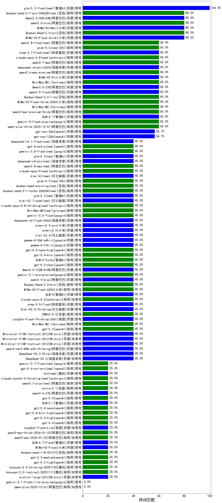

|类别|机构|大模型|【诗词匹配】准确率|平均耗时|平均消耗token|花费/千次（元）|排名（准确率）|
|---|---|-----|-------------------|-------|-----------|-----------|-----------|
|开源|阿里巴巴|Qwen3.6-35B-A3B(new)|80.0%|112s|2610|27.7|1|
|商用|豆包|Doubao-Seed-2.0-pro(new)|80.0%|426s|1926|29.6|2|
|商用|百度|ERNIE-X1.1-Preview|80.0%|138s|1877|7.3|3|
|开源|小米|MiMo-V2-Flash-think|80.0%|37s|3903|0.0|4|
|商用|小米|MiMo-V2-Omni(new)|80.0%|163s|2320|29.1|5|
|商用|阿里巴巴|qwen3.6-plus(new)|80.0%|46s|3374|39.9|6|
|开源|深度求索|DeepSeek-V3.1|70.0%|18s|355|3.8|7|
|商用|豆包|doubao-seed-1-6-lite-251015|66.7%|55s|637|1.4|8|
|商用|豆包|doubao-seed-1-6-251015|63.3%|43s|678|4.8|9|
|开源|深度求索|DeepSeek-R1-0528|63.3%|128s|2007|31.4|10|
|商用|阿里巴巴|qwen-turbo-think-2025-07-15|60.0%|1087s|1895|5.5|11|
|商用|google|gemini-2.5-flash-lite|60.0%|207s|390|1.0|12|
|开源|阿里巴巴|qwen3-235b-a22b-thinking-2507|60.0%|114s|3460|59.4|13|
|商用|anthropic|claude-sonnet-4.5-thinking|60.0%|30s|1681|172.9|14|
|商用|anthropic|claude-opus-4.5|60.0%|18s|684|109.8|15|
|商用|openAI|gpt-5-nano-high|60.0%|845s|4556|13.1|16|
|商用|阿里巴巴|qwen-plus-think-2025-12-01|60.0%|144s|5652|44.8|17|
|商用|google|gemini-3-flash-preview|60.0%|112s|2208|46.0|18|
|开源|智谱AI|GLM-4.7|60.0%|182s|7424|103.3|19|
|商用|小米|MiMo-V2-Pro(new)|60.0%|174s|2406|46.4|20|
|商用|阿里巴巴|qwen3-max-preview-think|60.0%|298s|4371|103.9|21|
|商用|腾讯|hunyuan-t1-20250711|60.0%|329s|1266|4.8|22|
|商用|minimax|MiniMax-M2.5(new)|60.0%|28s|1370|10.9|23|
|商用|minimax|MiniMax-M2.7(new)|60.0%|97s|3460|28.5|24|
|开源|阿里巴巴|Qwen3.5-27B(new)|60.0%|417s|4898|23.3|25|
|商用|小米|MiMo-V2-Flash-think-0204(new)|60.0%|1272s|2493|5.1|26|
|开源|阿里巴巴|qwen3.5-flash(new)|60.0%|260s|4712|9.3|27|
|商用|豆包|Doubao-Seed-2.0-lite(new)|60.0%|487s|2155|7.5|28|
|开源|openAI|gpt-oss-20b|56.7%|20s|972|1.0|29|
|商用|openAI|gpt-5-mini-2025-08-07|56.7%|237s|724|9.6|30|
|商用|阿里巴巴|qwen-flash-think-2025-07-28|56.7%|34s|2479|3.6|31|
|商用|阿里巴巴|qwen3-max-preview|56.7%|229s|483|10.5|32|
|开源|openAI|gpt-oss-120b|56.7%|142s|541|1.4|33|
|开源|阿里巴巴|Qwen3-30B-A3B-Thinking-2507|56.7%|315s|2739|7.5|34|
|商用|百度|ERNIE-X1-Turbo-32K|53.8%|387s|1053|4.0|35|
|商用|腾讯|hunyuan-turbos-20250926|53.3%|16s|688|1.3|36|
|商用|google|gemini-2.5-flash|53.3%|20s|1603|28.1|37|
|开源|深度求索|DeepSeek-V3.1-Think|53.3%|62s|1308|15.2|38|
|开源|阿里巴巴|qwen3-235b-a22b-instruct-2507|53.3%|200s|634|4.7|39|
|开源|阿里巴巴|Qwen3-4B-nothink|53.3%|288s|432|1.1|40|
|开源|meta|Llama-4-Scout-17B-16E-Instruct|50.0%|9s|557|1.1|41|
|商用|百川智能|Baichuan4-Turbo|50.0%|/|/|/|42|
|开源|阿里巴巴|Qwen3-32B-nothink|50.0%|340s|507|1.8|43|
|商用|openAI|gpt-5-2025-08-07|50.0%|267s|404|25.3|44|
|商用|阿里巴巴|qwen-flash-2025-07-28|50.0%|19s|705|1.0|45|
|开源|豆包|Seed-OSS-36B-Instruct|50.0%|66s|1434|5.6|46|
|商用|智谱AI|GLM-4.5-Flash|50.0%|106s|2865|0.0|47|
|商用|anthropic|claude-4-sonnet-thinking|50.0%|68s|464|43.1|48|
|商用|anthropic|claude-4-sonnet|50.0%|47s|468|42.9|49|
|开源|智谱AI|GLM-4.5-Air|50.0%|236s|2311|13.6|50|
|开源|阿里巴巴|Qwen3-30B-A3B-Instruct-2507|50.0%|23s|706|1.9|51|
|商用|智谱AI|GLM-4.5-Flash-nothink|50.0%|45s|939|0.0|52|
|商用|阿里巴巴|qwen-turbo-2025-07-15|46.7%|227s|410|0.2|53|
|商用|google|gemini-2.5-pro|46.7%|178s|2313|163.7|54|
|开源|阿里巴巴|Qwen3-14B-nothink|46.7%|149s|522|0.9|55|
|开源|智谱AI|GLM-4.5-Air-nothink|46.7%|247s|1063|6.1|56|
|开源|阿里巴巴|qwen3-next-80b-a3b-instruct|46.7%|312s|657|2.4|57|
|开源|阿里巴巴|Qwen3-8B|46.7%|77s|2094|0.0|58|
|商用|openAI|gpt-5-nano-2025-08-07|46.7%|295s|1383|3.8|59|
|开源|阿里巴巴|Qwen3-4B|46.2%|75s|1245|3.6|60|
|商用|百度|ERNIE-4.5-Turbo-32K|46.2%|362s|345|0.9|61|
|商用|anthropic|claude-opus-4.6|40.0%|30s|681|107.4|62|
|开源|google|gemma-4-26b-a4b-it(new)|40.0%|55s|491|1.2|63|
|开源|google|gemma-4-31b-it(new)|40.0%|46s|437|1.1|64|
|开源|美团|LongCat-Flash-Thinking-2601|40.0%|400s|5465|0.0|65|
|商用|百度|ERNIE-5.0|40.0%|174s|3774|89.6|66|
|开源|月之暗面|Kimi-K2.5-Thinking|40.0%|344s|5128|106.8|67|
|开源|阶跃星辰|step-3.5-flash|40.0%|150s|11251|23.5|68|
|商用|google|gemini-3.1-pro-preview(new)|40.0%|213s|14212|1206.9|69|
|开源|智谱AI|GLM-5(new)|40.0%|411s|3952|70.4|70|
|开源|阿里巴巴|qwen3.5-plus(new)|40.0%|60s|4504|21.4|71|
|商用|小米|MiMo-V2-Flash-0204(new)|40.0%|388s|395|0.7|72|
|商用|openAI|gpt-5.4-nano-high(new)|40.0%|10s|351|2.6|73|
|商用|openAI|gpt-5.4-mini(new)|40.0%|4s|182|4.1|74|
|商用|智谱AI|GLM-5-Turbo(new)|40.0%|42s|2558|55.4|75|
|商用|openAI|gpt-5.3-chat(new)|40.0%|47s|437|37.5|76|
|开源|阿里巴巴|Qwen3.5-122B-A10B(new)|40.0%|501s|6222|39.5|77|
|商用|豆包|Doubao-Seed-2.0-mini(new)|40.0%|594s|2958|5.7|78|
|商用|minimax|MiniMax-M2.1|40.0%|28s|1482|11.9|79|
|商用|百度|ERNIE-5.0-Thinking-Preview|40.0%|141s|1527|35.7|80|
|商用|XAI|grok-4-1-fast-non-reasoning|40.0%|73s|596|1.6|81|
|商用|anthropic|claude-sonnet-4.5(new)|40.0%|13s|447|41.3|82|
|开源|深度求索|DeepSeek-V3.2|40.0%|64s|455|1.3|83|
|开源|深度求索|DeepSeek-V3.2-Think|40.0%|217s|2399|7.1|84|
|开源|阿里巴巴|qwen3-next-80b-a3b-thinking|40.0%|144s|7003|27.8|85|
|商用|XAI|grok-4-1-fast-reasoning|40.0%|46s|3571|12.2|86|
|商用|anthropic|claude-haiku-4.5-thinking|40.0%|51s|3029|106.1|87|
|开源|Mistral|Ministral-3-14B-Instruct-2512|40.0%|9s|556|0.8|88|
|开源|Mistral|Ministral-3-8B-Instruct-2512|40.0%|2s|337|0.4|89|
|开源|Mistral|Ministral-3-3B-Instruct-2512|40.0%|1s|241|0.2|90|
|商用|anthropic|claude-haiku-4.5|40.0%|7s|492|15.0|91|
|商用|openAI|gpt-5.1-medium|40.0%|161s|1187|80.4|92|
|商用|openAI|gpt-5.2|40.0%|7s|215|16.1|93|
|开源|月之暗面|Kimi-K2-Thinking|40.0%|759s|14798|236.1|94|
|开源|智谱AI|GLM-4-9B-0414|33.3%|11s|366|0|95|
|开源|阿里巴巴|Qwen3-8B-nothink|30.8%|21s|440|0.0|96|
|商用|openAI|o4-mini|25.0%|33s|846|25.5|97|
|开源|阿里巴巴|Qwen3-32B|23.1%|134s|1702|6.6|98|
|商用|openAI|gpt-5.4-mini-high(new)|20.0%|26s|1595|48.6|99|
|商用|openAI|gpt-5.4-nano(new)|20.0%|28s|183|1.1|100|
|开源|智谱AI|GLM-5.1(new)|20.0%|498s|8194|195.7|101|
|商用|openAI|gpt-5.4-high(new)|20.0%|33s|1257|126.8|102|
|商用|openAI|gpt-5.4(new)|20.0%|19s|238|19.6|103|
|开源|小米|MiMo-V2-Flash|20.0%|14s|354|0.0|104|
|商用|阿里巴巴|qwen3-max-think-2026-01-23|20.0%|365s|5199|51.6|105|
|商用|腾讯|hunyuan-2.0-instruct-20251111|20.0%|4s|475|0.8|106|
|商用|openAI|gpt-5.2-medium|20.0%|11s|500|44.4|107|
|商用|openAI|gpt-5.2-high|20.0%|13s|645|58.8|108|
|开源|智谱AI|GLM-4.7-Flash|20.0%|1160s|9271|0.0|109|
|商用|阿里巴巴|qwen3-max-2026-01-23|20.0%|111s|531|4.9|110|
|商用|腾讯|hunyuan-2.0-thinking-20251109|20.0%|18s|1417|5.5|111|
|商用|openAI|gpt-5-mini-high|20.0%|79s|2174|30.7|112|
|开源|美团|LongCat-Flash-Lite(new)|20.0%|456s|511|0.0|113|
|开源|Mistral|mistral-large-2512|20.0%|9s|312|2.9|114|
|商用|阿里巴巴|qwen3-max-2025-09-23|20.0%|378s|564|12.5|115|
|商用|豆包|doubao-seed-1-8-251215|20.0%|31s|1033|7.6|116|
|商用|openAI|gpt-5.1-high|20.0%|41s|2655|184.7|117|
|开源|阿里巴巴|Qwen3-14B|15.4%|149s|2223|4.3|118|
|商用|google|gemini-3.1-flash-lite-preview(new)|0.0%|36s|360|3.3|119|
|商用|阿里巴巴|qwen-plus-2025-12-01|0.0%|26s|939|1.8|120|
|商用|openAI|gpt-5.1|0.0%|239s|149|6.8|121|
|开源|月之暗面|kimi-k2-0905|0.0%|47s|435|6.1|122|

