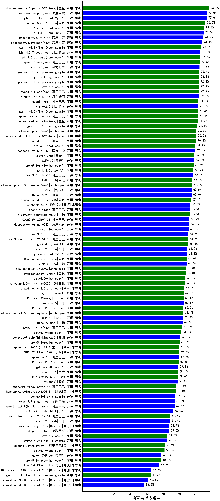

|类别|机构|大模型|【语言与指令遵从】准确率|平均耗时|平均消耗token|花费/千次（元）|排名（准确率）|
|---|---|-----|-------------------|-------|-----------|-----------|-----------|
|商用|anthropic|claude-4-sonnet|78.5%|40s|436|34.1|1|
|商用|豆包|Doubao-Seed-2.0-pro(new)|76.0%|267s|1299|18.4|2|
|商用|豆包|doubao-seed-1-6-251015|75.8%|33s|873|5.8|3|
|商用|openAI|gpt-5-2025-08-07|75.6%|138s|508|27.9|4|
|开源|深度求索|DeepSeek-V3.2-Think|74.7%|131s|1366|4.0|5|
|商用|openAI|o4-mini|73.2%|32s|939|27.5|6|
|开源|深度求索|DeepSeek-R1-0528|72.9%|140s|1645|24.9|7|
|商用|腾讯|hunyuan-t1-20250711|72.9%|76s|1117|4.0|8|
|商用|google|gemini-3.1-pro-preview(new)|72.4%|54s|3073|251.3|9|
|商用|openAI|gpt-5.4-high(new)|72.3%|18s|787|67.4|10|
|开源|深度求索|DeepSeek-V3.1|72.3%|15s|343|3.2|11|
|商用|google|gemini-3-flash-preview|72.2%|69s|1364|26.4|12|
|开源|月之暗面|Kimi-K2.5-Thinking|72.1%|300s|1941|38.7|13|
|商用|阿里巴巴|qwen3-max-preview|71.9%|120s|417|7.7|14|
|开源|深度求索|DeepSeek-V3.1-Think|71.7%|43s|932|10.3|15|
|商用|腾讯|hunyuan-turbos-20250926|71.7%|9s|493|0.8|16|
|开源|百度|ERNIE-4.5-300B-A47B|71.5%|150s|244|1.2|17|
|商用|google|gemini-2.5-pro|70.6%|125s|1910|130.4|18|
|商用|豆包|doubao-seed-1-6-lite-251015|70.6%|46s|706|1.3|19|
|商用|openAI|gpt-5-mini-2025-08-07|70.4%|146s|876|10.8|20|
|商用|阿里巴巴|qwen3.6-plus(new)|70.3%|42s|1874|21.1|21|
|开源|阿里巴巴|qwen3-235b-a22b-instruct-2507|70.0%|49s|487|3.1|22|
|商用|openAI|gpt-5.3-chat(new)|69.9%|19s|449|29.1|23|
|开源|豆包|Seed-OSS-36B-Instruct|69.8%|202s|1216|4.5|24|
|商用|智谱AI|GLM-5-Turbo(new)|69.3%|42s|1637|33.7|25|
|开源|智谱AI|GLM-4.7|69.3%|82s|3288|44.6|26|
|开源|阿里巴巴|qwen3-next-80b-a3b-instruct|69.0%|157s|530|1.7|27|
|商用|openAI|gpt-5.4-mini-high(new)|68.9%|33s|1050|28.5|28|
|商用|阿里巴巴|qwen-flash-think-2025-07-28|68.0%|106s|2080|2.9|29|
|商用|百度|ERNIE-5.0|68.0%|137s|1834|41.8|30|
|开源|智谱AI|GLM-5(new)|67.6%|106s|2511|43.3|31|
|开源|阿里巴巴|Qwen3.5-27B(new)|67.6%|285s|3634|16.9|32|
|商用|豆包|doubao-seed-1-8-251215|67.1%|24s|698|4.3|33|
|商用|openAI|gpt-5.1-high|67.0%|116s|1591|102.2|34|
|开源|深度求索|DeepSeek-V3.2|66.8%|68s|388|1.0|35|
|开源|阿里巴巴|Qwen3-30B-A3B-Thinking-2507|66.8%|113s|2163|5.8|36|
|开源|阿里巴巴|qwen3-235b-a22b-thinking-2507|66.6%|161s|2378|41.1|37|
|开源|阿里巴巴|qwen3.5-flash(new)|66.5%|316s|3753|7.3|38|
|商用|小米|MiMo-V2-Flash-think-0204(new)|66.5%|710s|2255|4.5|39|
|开源|阿里巴巴|Qwen3.5-122B-A10B(new)|66.2%|353s|3614|22.4|40|
|商用|百度|ERNIE-5.0-Thinking-Preview|65.9%|150s|985|21.4|41|
|开源|meta|Llama-4-Scout-17B-16E-Instruct|65.9%|6s|380|0.7|42|
|开源|腾讯|Hunyuan-A13B-Instruct|65.7%|119s|971|3.5|43|
|开源|openAI|gpt-oss-120b|65.7%|129s|689|1.7|44|
|开源|阶跃星辰|step-3|65.6%|124s|1653|6.3|45|
|商用|智谱AI|GLM-4.5-Flash|65.5%|51s|1762|0.0|46|
|商用|阿里巴巴|qwen3-max-think-2026-01-23|65.5%|159s|3240|31.3|47|
|开源|阿里巴巴|qwen3.5-plus(new)|65.5%|47s|3725|17.3|48|
|开源|meta|Llama-4-Maverick-17B-128E-Instruct-FP8|65.1%|5s|403|1.5|49|
|商用|google|gemini-2.5-flash|65.0%|71s|1460|24.4|50|
|商用|豆包|Doubao-Seed-2.0-lite(new)|64.6%|250s|1230|3.9|51|
|商用|openAI|gpt-5.1-medium|64.5%|112s|817|47.2|52|
|开源|智谱AI|GLM-4.5-Air|64.5%|142s|1696|9.5|53|
|商用|小米|MiMo-V2-Pro(new)|64.5%|212s|1307|22.0|54|
|开源|腾讯|Hunyuan-A13B-Instruct-nothink|64.4%|312s|326|0.9|55|
|商用|anthropic|claude-sonnet-4.5-thinking|64.2%|21s|1518|142.1|56|
|商用|百度|ERNIE-X1.1-Preview|64.2%|110s|1005|3.7|57|
|商用|openAI|gpt-5-nano-2025-08-07|64.0%|93s|1802|4.9|58|
|商用|豆包|Doubao-Seed-2.0-mini(new)|64.0%|262s|1750|3.2|59|
|商用|openAI|gpt-5.2-high|63.8%|12s|614|45.9|60|
|商用|腾讯|hunyuan-2.0-thinking-20251109|63.8%|14s|1262|4.7|61|
|开源|阿里巴巴|Qwen3-30B-A3B-Instruct-2507|63.8%|97s|527|1.3|62|
|商用|百度|ERNIE-X1-Turbo-32K|63.6%|299s|1077|4.0|63|
|开源|百度|ERNIE-4.5-21B-A3B|63.4%|84s|290|0.1|64|
|开源|月之暗面|Kimi-K2-Thinking|63.4%|145s|2531|39.0|65|
|商用|anthropic|claude-opus-4.6|63.0%|13s|569|66.6|66|
|商用|阿里巴巴|qwen-turbo-think-2025-07-15|62.9%|/|1399|3.9|67|
|商用|阿里巴巴|qwen-flash-2025-07-28|62.8%|101s|519|0.6|68|
|商用|openAI|gpt-5.4(new)|62.7%|7s|336|20.1|69|
|商用|minimax|MiniMax-M2.1|62.5%|74s|1577|12.2|70|
|商用|anthropic|claude-opus-4.5|62.3%|15s|599|73.0|71|
|开源|智谱AI|GLM-5.1(new)|62.2%|206s|2519|58.1|72|
|商用|小米|MiMo-V2-Omni(new)|62.0%|253s|1389|15.1|73|
|商用|anthropic|claude-sonnet-4.5(new)|61.9%|8s|543|38.6|74|
|商用|openAI|gpt-5.4-mini(new)|61.3%|31s|297|4.8|75|
|开源|阿里巴巴|Qwen3-32B-nothink|60.8%|151s|403|1.2|76|
|开源|美团|LongCat-Flash-Thinking-2601|60.7%|207s|2472|0.0|77|
|商用|anthropic|claude-4-sonnet-thinking|60.6%|47s|863|80.5|78|
|商用|google|gemini-2.5-flash-lite|60.2%|89s|586|1.4|79|
|商用|openAI|gpt-5.2-medium|60.2%|8s|475|32.1|80|
|商用|阿里巴巴|qwen3-max-2026-01-23|60.0%|81s|506|4.0|81|
|商用|阿里巴巴|qwen-turbo-2025-07-15|59.8%|90s|351|0.2|82|
|商用|小米|MiMo-V2-Flash-0204(new)|59.8%|166s|448|0.7|83|
|商用|minimax|MiniMax-M2.7(new)|59.6%|48s|1940|15.3|84|
|商用|百度|ERNIE-4.5-Turbo-32K|59.6%|145s|292|0.6|85|
|商用|openAI|gpt-5.1|59.4%|201s|329|12.6|86|
|开源|openAI|gpt-oss-20b|59.3%|146s|1324|1.4|87|
|商用|minimax|MiniMax-M2.5(new)|59.0%|32s|1668|13.0|88|
|商用|阿里巴巴|qwen3-max-preview-think|58.1%|148s|2388|54.7|89|
|商用|腾讯|hunyuan-2.0-instruct-20251111|57.8%|7s|500|0.8|90|
|开源|阿里巴巴|Qwen3-8B|57.8%|56s|1477|0.0|91|
|开源|google|gemma-4-31b-it(new)|57.3%|46s|380|0.8|92|
|开源|阿里巴巴|qwen3-next-80b-a3b-thinking|57.1%|138s|3657|14.2|93|
|商用|智谱AI|GLM-4.5-Flash-nothink|57.1%|19s|563|0.0|94|
|商用|百川智能|Baichuan4-Turbo|56.7%|/|/|/|95|
|商用|阿里巴巴|qwen3-max-2025-09-23|56.7%|171s|516|9.8|96|
|开源|智谱AI|GLM-4.5-Air-nothink|56.5%|134s|616|3.1|97|
|开源|阿里巴巴|Qwen3-32B|56.4%|108s|1393|5.2|98|
|开源|深度求索|DeepSeek-R1-0528-Qwen3-8B|56.3%|453s|1307|0.0|99|
|开源|小米|MiMo-V2-Flash-think|56.0%|37s|2226|0.0|100|
|开源|阿里巴巴|Qwen3-4B|56.0%|64s|1145|3.1|101|
|商用|anthropic|claude-haiku-4.5|55.8%|10s|600|14.5|102|
|商用|openAI|gpt-5-mini-high|55.8%|519s|2366|32.1|103|
|商用|anthropic|claude-haiku-4.5-thinking|54.9%|33s|2330|76.4|104|
|开源|阿里巴巴|Qwen3-14B-nothink|54.6%|74s|422|0.7|105|
|商用|阿里巴巴|qwen-plus-think-2025-12-01|54.4%|61s|2841|21.7|106|
|开源|阿里巴巴|Qwen3-4B-nothink|54.4%|161s|407|0.9|107|
|开源|小米|MiMo-V2-Flash|54.4%|27s|379|0.0|108|
|开源|Mistral|mistral-large-2512|53.7%|9s|464|3.6|109|
|开源|月之暗面|kimi-k2-0905|53.7%|59s|421|5.0|110|
|开源|阶跃星辰|step-3.5-flash|53.6%|32s|2978|6.1|111|
|商用|百川智能|Baichuan4-Air|53.4%|/|/|/|112|
|开源|阿里巴巴|Qwen3-14B|53.3%|124s|1809|3.4|113|
|商用|XAI|grok-4-1-fast-reasoning|52.8%|55s|1369|4.2|114|
|商用|openAI|gpt-5-nano-high|52.7%|354s|4732|13.3|115|
|商用|openAI|gpt-5.2|52.5%|6s|308|15.5|116|
|开源|智谱AI|GLM-4-9B-0414|52.3%|6s|295|0|117|
|开源|google|gemma-4-26b-a4b-it(new)|52.1%|35s|442|0.9|118|
|商用|Mistral|mistral-medium-2508|52.0%|67s|420|4.3|119|
|商用|阿里巴巴|qwen-plus-2025-12-01|50.9%|20s|901|1.6|120|
|商用|openAI|gpt-5.4-nano(new)|50.8%|23s|294|1.3|121|
|开源|阿里巴巴|Qwen3-0.6B|49.6%|/|/|/|122|
|开源|google|gemma-3-27b-it|49.1%|/|/|/|123|
|开源|阿里巴巴|Qwen3-1.7B|49.0%|/|/|/|124|
|开源|智谱AI|GLM-4.7-Flash|48.9%|1098s|4518|0.0|125|
|商用|openAI|gpt-5.4-nano-high(new)|48.7%|30s|630|4.2|126|
|开源|阿里巴巴|Qwen3-8B-nothink|48.6%|16s|392|0.0|127|
|开源|阿里巴巴|Qwen3-1.7B-nothink|48.6%|99s|440|1.0|128|
|开源|google|gemma-3-12b-it|47.6%|/|/|/|129|
|开源|美团|LongCat-Flash-Lite(new)|47.5%|153s|425|0.0|130|
|开源|阿里巴巴|Qwen3-0.6B-nothink|44.1%|144s|224|0.3|131|
|商用|XAI|grok-4-1-fast-non-reasoning|44.0%|71s|527|1.2|132|
|开源|Mistral|Mistral-Small-3.2-24B-Instruct-2506|43.7%|203s|464|0.8|133|
|开源|Mistral|Ministral-3-14B-Instruct-2512|42.5%|14s|1116|1.6|134|
|商用|google|gemini-3.1-flash-lite-preview(new)|42.2%|13s|362|2.5|135|
|开源|google|gemma-3-4b-it|41.8%|/|/|/|136|
|开源|Mistral|Ministral-3-8B-Instruct-2512|40.8%|6s|493|0.5|137|
|开源|Mistral|Ministral-3-3B-Instruct-2512|38.2%|6s|473|0.3|138|
|开源|百度|ERNIE-4.5-0.3B|35.5%|127s|271|0.0|139|

