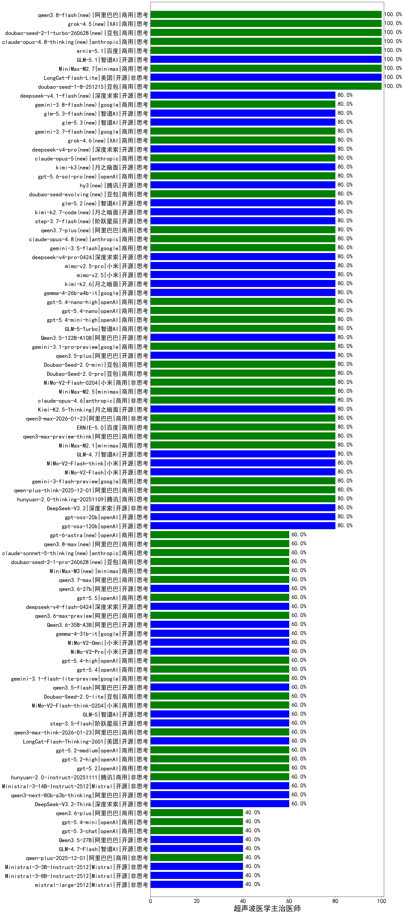

|类别|机构|大模型|【超声波医学主治医师】准确率|平均耗时|平均消耗token|花费/千次（元）|排名（准确率）|
|---|---|-----|-------------------|-------|-----------|-----------|-----------|
|开源|智谱AI|GLM-5.1(new)|100.0%|75s|1811|42.2|1|
|商用|minimax|MiniMax-M2.7|100.0%|38s|1481|11.8|2|
|商用|百度|ernie-5.1(new)|100.0%|58s|1325|23.0|3|
|商用|豆包|doubao-seed-1-8-251215|100.0%|36s|696|4.8|4|
|商用|豆包|doubao-seed-1-6-251015|100.0%|8s|724|5.1|5|
|商用|百度|ERNIE-X1.1-Preview|100.0%|116s|475|1.7|6|
|商用|百度|ERNIE-4.5-Turbo-32K|100.0%|23s|562|1.6|7|
|开源|美团|LongCat-Flash-Lite|100.0%|48s|395|0.0|8|
|开源|阿里巴巴|Qwen3-4B|90.0%|11s|914|2.5|9|
|商用|google|gemini-3-flash-preview|80.0%|104s|1278|25.9|10|
|开源|小米|MiMo-V2-Flash|80.0%|7s|542|0.0|11|
|商用|百川智能|Baichuan4-Turbo|80.0%|/|/|/|12|
|开源|小米|MiMo-V2-Flash-think|80.0%|45s|2408|0.0|13|
|商用|腾讯|hunyuan-2.0-thinking-20251109|80.0%|19s|628|2.3|14|
|开源|智谱AI|GLM-4.7|80.0%|74s|2972|40.9|15|
|商用|minimax|MiniMax-M2.1|80.0%|85s|1188|9.3|16|
|商用|阿里巴巴|qwen-plus-think-2025-12-01|80.0%|67s|2991|23.4|17|
|商用|阿里巴巴|qwen3-max-2025-09-23|80.0%|565s|609|13.3|18|
|开源|深度求索|DeepSeek-V3.2|80.0%|46s|366|1.0|19|
|商用|openAI|gpt-5-nano-high|80.0%|676s|3981|11.3|20|
|商用|openAI|gpt-5-mini-high|80.0%|122s|2314|32.4|21|
|商用|百度|ERNIE-5.0|80.0%|219s|2517|59.4|22|
|商用|anthropic|claude-opus-4.5|80.0%|10s|665|102.6|23|
|商用|百度|ERNIE-5.0-Thinking-Preview|80.0%|249s|1903|44.6|24|
|商用|anthropic|claude-sonnet-4.5|80.0%|9s|651|61.2|25|
|商用|openAI|gpt-5.1-high|80.0%|134s|1034|67.8|26|
|商用|阿里巴巴|qwen3-max-preview-think|80.0%|246s|3095|72.9|27|
|商用|anthropic|claude-opus-4.6|80.0%|12s|727|111.7|28|
|商用|阿里巴巴|qwen3-max-2026-01-23|80.0%|69s|605|5.5|29|
|开源|月之暗面|Kimi-K2.5-Thinking|80.0%|322s|1610|32.7|30|
|开源|深度求索|deepseek-v4-pro(new)|80.0%|38s|811|18.7|31|
|商用|小米|mimo-v2.5-pro(new)|80.0%|33s|1485|26.7|32|
|商用|小米|mimo-v2.5(new)|80.0%|32s|1540|18.1|33|
|开源|月之暗面|kimi-k2.6(new)|80.0%|81s|1496|39.0|34|
|开源|google|gemma-4-26b-a4b-it(new)|80.0%|21s|625|1.6|35|
|商用|openAI|gpt-5.4-nano-high|80.0%|9s|542|4.1|36|
|商用|openAI|gpt-5.4-nano|80.0%|167s|325|2.2|37|
|商用|openAI|gpt-5.4-mini-high|80.0%|51s|1089|31.9|38|
|商用|智谱AI|GLM-5-Turbo|80.0%|37s|1417|30.0|39|
|开源|阿里巴巴|Qwen3.5-122B-A10B|80.0%|158s|3341|21.0|40|
|商用|google|gemini-3.1-pro-preview|80.0%|69s|1562|127.8|41|
|开源|阿里巴巴|qwen3.5-plus|80.0%|34s|2295|10.7|42|
|商用|豆包|Doubao-Seed-2.0-mini|80.0%|584s|2818|5.4|43|
|商用|豆包|Doubao-Seed-2.0-pro|80.0%|195s|925|13.4|44|
|商用|小米|MiMo-V2-Flash-0204|80.0%|145s|648|1.2|45|
|商用|minimax|MiniMax-M2.5|80.0%|34s|1895|15.3|46|
|商用|anthropic|claude-haiku-4.5|80.0%|7s|655|20.1|47|
|开源|月之暗面|kimi-k2-0905|80.0%|116s|414|5.5|48|
|商用|google|gemini-3.5-flash(new)|80.0%|8s|1527|92.3|49|
|开源|openAI|gpt-oss-120b|80.0%|4s|813|2.3|50|
|开源|豆包|Seed-OSS-36B-Instruct|80.0%|116s|2175|8.5|51|
|商用|腾讯|hunyuan-t1-20250711|80.0%|23s|1330|5.0|52|
|开源|阿里巴巴|qwen3-235b-a22b-thinking-2507|80.0%|165s|2859|55.8|53|
|开源|阿里巴巴|Qwen3-32B-nothink|80.0%|276s|634|2.3|54|
|商用|openAI|o4-mini|80.0%|34s|1014|30.0|55|
|开源|智谱AI|GLM-4.5-Air-nothink|80.0%|18s|960|5.4|56|
|商用|智谱AI|GLM-4.5-Flash-nothink|80.0%|19s|870|0.0|57|
|开源|openAI|gpt-oss-20b|80.0%|8s|1525|1.6|58|
|商用|openAI|gpt-5-nano-2025-08-07|80.0%|44s|2332|6.5|59|
|商用|anthropic|claude-4-sonnet|80.0%|46s|600|53.9|60|
|商用|豆包|doubao-seed-1-6-lite-251015|80.0%|46s|1109|2.5|61|
|开源|月之暗面|Kimi-K2-Thinking|80.0%|816s|13995|223.1|62|
|开源|阿里巴巴|Qwen3-14B|75.0%|28s|1175|2.2|63|
|开源|阿里巴巴|Qwen3-32B|75.0%|27s|1008|3.8|64|
|商用|百度|ERNIE-X1-Turbo-32K|75.0%|148s|1734|6.7|65|
|开源|深度求索|DeepSeek-R1-0528|70.0%|243s|1965|30.5|66|
|商用|google|gemini-2.5-flash|70.0%|10s|1857|32.3|67|
|开源|阿里巴巴|Qwen3-8B|70.0%|600s|14387|0.0|68|
|商用|google|gemini-2.5-pro|65.0%|35s|2796|197.4|69|
|开源|智谱AI|GLM-4.5-Air|60.0%|41s|2034|11.8|70|
|开源|智谱AI|GLM-5|60.0%|130s|2489|43.9|71|
|商用|智谱AI|GLM-4.5-Flash|60.0%|34s|1887|0.0|72|
|商用|openAI|gpt-5.1|60.0%|99s|249|12.1|73|
|开源|阿里巴巴|Qwen3-14B-nothink|60.0%|14s|545|1.0|74|
|商用|小米|MiMo-V2-Flash-think-0204|60.0%|1282s|2324|4.8|75|
|商用|阿里巴巴|qwen3.6-max-preview(new)|60.0%|51s|1625|84.5|76|
|商用|阿里巴巴|qwen3-max-preview|60.0%|12s|570|12.3|77|
|商用|豆包|Doubao-Seed-2.0-lite|60.0%|223s|983|3.2|78|
|开源|阿里巴巴|Qwen3.6-35B-A3B(new)|60.0%|109s|1762|18.4|79|
|开源|阿里巴巴|qwen3.5-flash|60.0%|209s|2990|5.8|80|
|开源|google|gemma-4-31b-it|60.0%|69s|562|1.4|81|
|商用|google|gemini-3.1-flash-lite-preview|60.0%|5s|426|3.8|82|
|商用|openAI|gpt-5.4|60.0%|5s|371|31.1|83|
|商用|openAI|gpt-5.4-high|60.0%|17s|801|76.2|84|
|商用|XAI|grok-4-1-fast-reasoning|60.0%|11s|1050|3.2|85|
|商用|小米|MiMo-V2-Omni|60.0%|689s|1807|21.8|86|
|商用|anthropic|claude-4-sonnet-thinking|60.0%|9s|602|55.8|87|
|商用|anthropic|claude-haiku-4.5-thinking|60.0%|15s|1881|63.7|88|
|开源|阿里巴巴|Qwen3-30B-A3B-Thinking-2507|60.0%|71s|3169|8.7|89|
|商用|阿里巴巴|qwen3-max-think-2026-01-23|60.0%|146s|3948|38.9|90|
|商用|阿里巴巴|qwen-turbo-think-2025-07-15|60.0%|/|2815|8.2|91|
|开源|阿里巴巴|qwen3.6-27b(new)|60.0%|41s|2053|35.9|92|
|开源|深度求索|DeepSeek-V3.1-Think|60.0%|70s|1330|15.4|93|
|开源|深度求索|DeepSeek-V3.2-Think|60.0%|48s|1393|4.1|94|
|开源|阿里巴巴|qwen3-next-80b-a3b-thinking|60.0%|187s|3907|15.4|95|
|开源|meta|Llama-4-Scout-17B-16E-Instruct|60.0%|8s|493|1.0|96|
|开源|Mistral|Ministral-3-14B-Instruct-2512|60.0%|13s|555|0.8|97|
|商用|openAI|gpt-5.5(new)|60.0%|42s|970|187.8|98|
|商用|腾讯|hunyuan-2.0-instruct-20251111|60.0%|8s|418|0.7|99|
|开源|深度求索|DeepSeek-V3.1|60.0%|18s|349|3.7|100|
|商用|openAI|gpt-5.2|60.0%|7s|256|17.6|101|
|开源|深度求索|deepseek-v4-flash(new)|60.0%|47s|695|1.3|102|
|商用|阿里巴巴|qwen-flash-think-2025-07-28|60.0%|30s|3061|4.5|103|
|商用|openAI|gpt-5.2-high|60.0%|17s|603|52.1|104|
|商用|openAI|gpt-5.2-medium|60.0%|13s|499|41.7|105|
|开源|阿里巴巴|qwen3-next-80b-a3b-instruct|60.0%|14s|766|2.8|106|
|商用|openAI|gpt-5-mini-2025-08-07|60.0%|82s|806|10.5|107|
|商用|openAI|gpt-5-2025-08-07|60.0%|24s|379|22.2|108|
|商用|腾讯|hunyuan-turbos-20250926|60.0%|15s|644|1.2|109|
|商用|小米|MiMo-V2-Pro|60.0%|373s|1312|23.1|110|
|商用|anthropic|claude-sonnet-4.5-thinking|60.0%|30s|1939|198.8|111|
|开源|美团|LongCat-Flash-Thinking-2601|60.0%|197s|3355|0.0|112|
|开源|阶跃星辰|step-3.5-flash|60.0%|17s|1965|4.0|113|
|开源|智谱AI|GLM-4-9B-0414|55.0%|11s|473|0|114|
|商用|阿里巴巴|qwen3.6-plus|40.0%|67s|1342|15.4|115|
|商用|openAI|gpt-5.1-medium|40.0%|32s|777|49.6|116|
|商用|openAI|gpt-5.4-mini|40.0%|11s|262|5.9|117|
|商用|openAI|gpt-5.3-chat|40.0%|7s|461|37.4|118|
|商用|阿里巴巴|qwen-turbo-2025-07-15|40.0%|8s|423|0.2|119|
|开源|阿里巴巴|Qwen3.5-27B|40.0%|388s|3618|17.1|120|
|开源|阿里巴巴|qwen3-235b-a22b-instruct-2507|40.0%|15s|624|4.5|121|
|开源|阿里巴巴|Qwen3-4B-nothink|40.0%|16s|567|1.5|122|
|开源|阿里巴巴|Qwen3-8B-nothink|40.0%|27s|589|0.0|123|
|开源|阿里巴巴|Qwen3-30B-A3B-Instruct-2507|40.0%|5s|581|1.6|124|
|开源|智谱AI|GLM-4.7-Flash|40.0%|359s|2600|0.0|125|
|商用|阿里巴巴|qwen-flash-2025-07-28|40.0%|9s|576|0.8|126|
|商用|阿里巴巴|qwen-plus-2025-12-01|40.0%|26s|1041|2.0|127|
|开源|Mistral|Ministral-3-3B-Instruct-2512|40.0%|13s|652|0.5|128|
|开源|Mistral|Ministral-3-8B-Instruct-2512|40.0%|15s|590|0.6|129|
|商用|google|gemini-2.5-flash-lite|40.0%|8s|589|1.5|130|
|商用|XAI|grok-4-1-fast-non-reasoning|40.0%|5s|620|1.7|131|
|开源|Mistral|mistral-large-2512|40.0%|15s|577|5.5|132|

