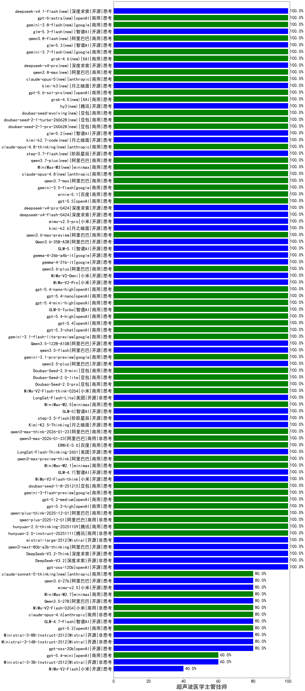

|类别|机构|大模型|【超声波医学主管技师】准确率|平均耗时|平均消耗token|花费/千次（元）|排名（准确率）|
|---|---|-----|-------------------|-------|-----------|-----------|-----------|
|开源|阿里巴巴|Qwen3.6-35B-A3B(new)|100.0%|104s|1317|13.6|1|
|开源|meta|Llama-4-Scout-17B-16E-Instruct|100.0%|9s|564|1.1|2|
|商用|腾讯|hunyuan-2.0-instruct-20251111|100.0%|6s|306|0.5|3|
|开源|阿里巴巴|qwen3.5-plus(new)|100.0%|18s|1468|6.8|4|
|商用|google|gemini-3.1-pro-preview(new)|100.0%|25s|1205|97.8|5|
|开源|阿里巴巴|qwen3.5-flash(new)|100.0%|86s|2190|4.3|6|
|开源|Mistral|mistral-large-2512|100.0%|10s|473|4.4|7|
|开源|阿里巴巴|qwen3-next-80b-a3b-thinking|100.0%|132s|1823|7.1|8|
|开源|深度求索|DeepSeek-V3.2-Think|100.0%|19s|601|1.7|9|
|开源|深度求索|DeepSeek-V3.2|100.0%|30s|251|0.7|10|
|商用|openAI|gpt-5-nano-high|100.0%|1040s|3684|10.5|11|
|商用|anthropic|claude-opus-4.5|100.0%|13s|726|114.7|12|
|商用|openAI|gpt-5.1-medium|100.0%|144s|542|33.3|13|
|商用|百度|ERNIE-5.0-Thinking-Preview|100.0%|136s|1241|28.8|14|
|商用|百度|ERNIE-X1.1-Preview|100.0%|112s|496|1.8|15|
|商用|anthropic|claude-sonnet-4.5-thinking|100.0%|19s|1277|127.4|16|
|开源|阿里巴巴|Qwen3.5-122B-A10B(new)|100.0%|79s|1845|11.4|17|
|商用|google|gemini-3.1-flash-lite-preview(new)|100.0%|6s|381|3.4|18|
|开源|月之暗面|kimi-k2-0905|100.0%|115s|288|3.6|19|
|商用|openAI|gpt-5.3-chat(new)|100.0%|44s|373|29.4|20|
|商用|XAI|grok-4-1-fast-reasoning|100.0%|15s|1470|4.7|21|
|商用|openAI|gpt-5.4(new)|100.0%|19s|277|21.8|22|
|商用|腾讯|hunyuan-2.0-thinking-20251109|100.0%|4s|472|1.7|23|
|商用|豆包|Doubao-Seed-2.0-mini(new)|100.0%|300s|1111|2.0|24|
|商用|阿里巴巴|qwen-plus-2025-12-01|100.0%|16s|702|1.3|25|
|商用|阿里巴巴|qwen-plus-think-2025-12-01|100.0%|35s|1498|11.4|26|
|商用|minimax|MiniMax-M2.5(new)|100.0%|18s|765|5.8|27|
|开源|智谱AI|GLM-5(new)|100.0%|42s|1510|26.2|28|
|商用|小米|MiMo-V2-Flash-think-0204(new)|100.0%|440s|966|1.9|29|
|开源|阶跃星辰|step-3.5-flash|100.0%|17s|1394|2.8|30|
|开源|月之暗面|Kimi-K2.5-Thinking|100.0%|198s|1201|24.1|31|
|商用|阿里巴巴|qwen3-max-think-2026-01-23|100.0%|274s|1680|16.2|32|
|商用|阿里巴巴|qwen3-max-2026-01-23|100.0%|115s|419|3.6|33|
|商用|百度|ERNIE-5.0|100.0%|59s|1072|24.7|34|
|开源|美团|LongCat-Flash-Thinking-2601|100.0%|180s|1574|0.0|35|
|商用|豆包|Doubao-Seed-2.0-pro(new)|100.0%|127s|636|8.8|36|
|商用|阿里巴巴|qwen3-max-preview-think|100.0%|175s|1446|33.3|37|
|商用|minimax|MiniMax-M2.1|100.0%|69s|909|7.0|38|
|开源|智谱AI|GLM-4.7|100.0%|33s|1392|18.8|39|
|开源|小米|MiMo-V2-Flash-think|100.0%|16s|1325|0.0|40|
|商用|豆包|Doubao-Seed-2.0-lite(new)|100.0%|110s|609|1.9|41|
|商用|豆包|doubao-seed-1-8-251215|100.0%|31s|572|3.8|42|
|商用|google|gemini-3-flash-preview|100.0%|93s|2324|48.3|43|
|商用|openAI|gpt-5.2-medium|100.0%|5s|329|25.5|44|
|商用|openAI|gpt-5.2-high|100.0%|13s|399|32.4|45|
|商用|openAI|gpt-5.4-high(new)|100.0%|9s|516|46.9|46|
|商用|openAI|gpt-5.1|100.0%|83s|201|9.1|47|
|开源|美团|LongCat-Flash-Lite(new)|100.0%|70s|458|0.0|48|
|开源|阿里巴巴|qwen3-235b-a22b-thinking-2507|100.0%|75s|1298|24.6|49|
|开源|阿里巴巴|Qwen3-30B-A3B-Instruct-2507|100.0%|3s|440|1.2|50|
|开源|月之暗面|Kimi-K2-Thinking|100.0%|150s|1071|16.4|51|
|商用|智谱AI|GLM-4.5-Flash|100.0%|27s|1230|0.0|52|
|开源|阿里巴巴|Qwen3-32B-nothink|100.0%|143s|492|1.7|53|
|开源|阿里巴巴|Qwen3-14B-nothink|100.0%|26s|511|0.9|54|
|商用|小米|MiMo-V2-Pro(new)|100.0%|48s|1192|20.6|55|
|商用|小米|MiMo-V2-Omni(new)|100.0%|157s|1201|13.3|56|
|商用|阿里巴巴|qwen3.6-plus(new)|100.0%|29s|1288|14.8|57|
|商用|openAI|gpt-5.4-nano(new)|100.0%|10s|297|2.0|58|
|开源|google|gemma-4-31b-it(new)|100.0%|19s|596|1.5|59|
|商用|腾讯|hunyuan-t1-20250711|100.0%|17s|947|3.5|60|
|商用|anthropic|claude-4-sonnet-thinking|100.0%|9s|586|54.9|61|
|商用|百度|ERNIE-4.5-Turbo-32K|100.0%|23s|557|1.6|62|
|开源|深度求索|DeepSeek-R1-0528|100.0%|206s|1489|23.0|63|
|商用|openAI|o4-mini|100.0%|32s|792|23.1|64|
|开源|google|gemma-4-26b-a4b-it(new)|100.0%|43s|577|1.5|65|
|商用|openAI|gpt-5.4-nano-high(new)|100.0%|18s|440|3.2|66|
|开源|阿里巴巴|Qwen3-30B-A3B-Thinking-2507|100.0%|73s|2042|5.5|67|
|开源|openAI|gpt-oss-120b|100.0%|4s|631|1.7|68|
|开源|深度求索|DeepSeek-V3.1-Think|100.0%|38s|739|8.4|69|
|商用|豆包|doubao-seed-1-6-lite-251015|100.0%|29s|619|1.3|70|
|商用|豆包|doubao-seed-1-6-251015|100.0%|13s|620|4.3|71|
|商用|腾讯|hunyuan-turbos-20250926|100.0%|14s|579|1.0|72|
|开源|阿里巴巴|qwen3-next-80b-a3b-instruct|100.0%|7s|603|2.2|73|
|开源|豆包|Seed-OSS-36B-Instruct|100.0%|79s|1279|5.0|74|
|商用|阿里巴巴|qwen3-max-preview|100.0%|8s|383|7.8|75|
|商用|openAI|gpt-5.4-mini-high(new)|100.0%|13s|674|19.1|76|
|商用|智谱AI|GLM-5-Turbo(new)|100.0%|51s|1121|23.5|77|
|商用|阿里巴巴|qwen-turbo-think-2025-07-15|100.0%|/|1573|4.5|78|
|开源|深度求索|DeepSeek-V3.1|100.0%|21s|314|3.3|79|
|商用|阿里巴巴|qwen-flash-think-2025-07-28|100.0%|15s|1597|2.3|80|
|开源|智谱AI|GLM-5.1(new)|100.0%|137s|1171|26.9|81|
|商用|阿里巴巴|qwen-flash-2025-07-28|100.0%|7s|454|0.6|82|
|商用|openAI|gpt-5-nano-2025-08-07|100.0%|39s|1685|4.7|83|
|商用|openAI|gpt-5-mini-2025-08-07|100.0%|20s|739|9.7|84|
|商用|openAI|gpt-5-2025-08-07|100.0%|20s|298|16.7|85|
|商用|google|gemini-2.5-pro|95.0%|26s|2203|154.8|86|
|商用|google|gemini-2.5-flash|95.0%|9s|1615|28.0|87|
|商用|百度|ERNIE-X1-Turbo-32K|95.0%|57s|1283|4.9|88|
|开源|阿里巴巴|Qwen3-32B|95.0%|33s|1404|5.4|89|
|开源|阿里巴巴|Qwen3-8B|95.0%|608s|14894|0.0|90|
|商用|anthropic|claude-4-sonnet|90.0%|42s|591|54.1|91|
|开源|阿里巴巴|Qwen3-14B|90.0%|20s|695|1.3|92|
|商用|小米|MiMo-V2-Flash-0204(new)|80.0%|374s|549|1.0|93|
|开源|阿里巴巴|Qwen3.5-27B(new)|80.0%|300s|2342|10.9|94|
|商用|minimax|MiniMax-M2.7(new)|80.0%|32s|1209|9.5|95|
|商用|openAI|gpt-5-mini-high|80.0%|84s|1993|27.8|96|
|商用|anthropic|claude-opus-4.6|80.0%|24s|630|96.0|97|
|商用|openAI|gpt-5.1-high|80.0%|147s|719|45.9|98|
|开源|智谱AI|GLM-4.5-Air|80.0%|24s|1178|6.7|99|
|开源|智谱AI|GLM-4.5-Air-nothink|80.0%|13s|897|5.0|100|
|商用|智谱AI|GLM-4.5-Flash-nothink|80.0%|18s|952|0.0|101|
|开源|openAI|gpt-oss-20b|80.0%|13s|1276|1.4|102|
|开源|智谱AI|GLM-4.7-Flash|80.0%|2340s|3829|0.0|103|
|商用|阿里巴巴|qwen-turbo-2025-07-15|80.0%|7s|343|0.2|104|
|开源|阿里巴巴|Qwen3-4B|80.0%|17s|1595|4.6|105|
|商用|anthropic|claude-haiku-4.5-thinking|80.0%|43s|1695|57.2|106|
|商用|anthropic|claude-sonnet-4.5(new)|80.0%|12s|564|52.5|107|
|商用|阿里巴巴|qwen3-max-2025-09-23|80.0%|53s|403|8.3|108|
|开源|Mistral|Ministral-3-14B-Instruct-2512|80.0%|13s|489|0.7|109|
|开源|Mistral|Ministral-3-8B-Instruct-2512|80.0%|12s|555|0.6|110|
|商用|openAI|gpt-5.2|80.0%|5s|236|16.2|111|
|开源|智谱AI|GLM-4-9B-0414|80.0%|10s|501|0|112|
|开源|阿里巴巴|qwen3-235b-a22b-instruct-2507|80.0%|10s|421|2.9|113|
|商用|anthropic|claude-haiku-4.5|60.0%|10s|605|18.6|114|
|商用|openAI|gpt-5.4-mini(new)|60.0%|56s|257|5.9|115|
|开源|Mistral|Ministral-3-3B-Instruct-2512|60.0%|10s|547|0.4|116|
|开源|阿里巴巴|Qwen3-8B-nothink|60.0%|157s|588|0.0|117|
|开源|阿里巴巴|Qwen3-4B-nothink|60.0%|31s|506|1.3|118|
|商用|百川智能|Baichuan4-Turbo|50.0%|/|/|/|119|
|商用|XAI|grok-4-1-fast-non-reasoning|40.0%|7s|766|2.2|120|
|开源|小米|MiMo-V2-Flash|40.0%|127s|456|0.0|121|
|商用|google|gemini-2.5-flash-lite|40.0%|28s|13184|38.1|122|

