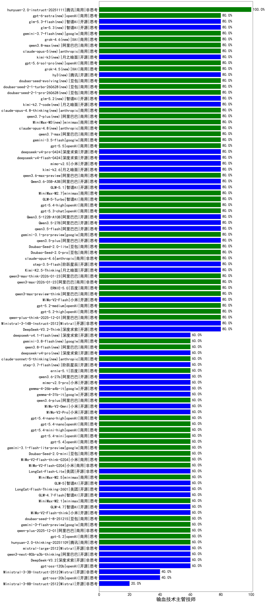

|类别|机构|大模型|【输血技术主管技师】准确率|平均耗时|平均消耗token|花费/千次（元）|排名（准确率）|
|---|---|-----|-------------------|-------|-----------|-----------|-----------|
|商用|anthropic|claude-4-sonnet-thinking|100.0%|38s|587|54.2|1|
|商用|XAI|grok-4-1-fast-reasoning|100.0%|92s|1423|4.5|2|
|开源|月之暗面|kimi-k2-0905|100.0%|88s|390|5.1|3|
|商用|anthropic|claude-haiku-4.5|100.0%|29s|601|18.2|4|
|商用|腾讯|hunyuan-2.0-instruct-20251111|100.0%|10s|349|0.6|5|
|商用|百度|ERNIE-4.5-Turbo-32K|85.0%|23s|586|1.7|6|
|开源|深度求索|DeepSeek-V3.1|80.0%|14s|291|2.9|7|
|开源|Mistral|Ministral-3-14B-Instruct-2512(new)|80.0%|12s|586|0.8|8|
|开源|深度求索|DeepSeek-V3.2-Think(new)|80.0%|36s|1150|3.4|9|
|商用|阿里巴巴|qwen3-max-2025-09-23|80.0%|194s|487|10.1|10|
|商用|anthropic|claude-opus-4.5(new)|80.0%|11s|626|95.7|11|
|商用|anthropic|claude-sonnet-4.5-thinking|80.0%|21s|1409|141.1|12|
|商用|anthropic|claude-sonnet-4.5(new)|80.0%|10s|656|61.7|13|
|商用|阿里巴巴|qwen-plus-2025-07-28|80.0%|10s|410|0.7|14|
|商用|阿里巴巴|qwen-plus-think-2025-07-28|80.0%|/|2280|17.6|15|
|商用|anthropic|claude-haiku-4.5-thinking|80.0%|37s|1974|67.1|16|
|商用|阿里巴巴|qwen-plus-think-2025-12-01(new)|80.0%|54s|2193|16.9|17|
|开源|minimax|MiniMax-M2|80.0%|50s|1627|13.0|18|
|商用|豆包|doubao-seed-1-6-251015|80.0%|13s|633|4.3|19|
|商用|腾讯|hunyuan-turbos-20250926|80.0%|14s|629|1.1|20|
|开源|深度求索|DeepSeek-V3.2-Exp-Think|80.0%|46s|1205|3.5|21|
|开源|深度求索|DeepSeek-V3.2-Exp|80.0%|93s|270|0.7|22|
|开源|深度求索|DeepSeek-V3.1-Think|80.0%|59s|1052|12.0|23|
|商用|阿里巴巴|qwen3-max-preview|80.0%|9s|442|9.0|24|
|商用|智谱AI|GLM-4.5-Flash|80.0%|46s|2488|0.0|25|
|商用|openAI|gpt-5.2-high(new)|80.0%|5s|314|23.3|26|
|商用|openAI|gpt-5.4-high(new)|80.0%|11s|488|43.2|27|
|商用|openAI|gpt-5.3-chat(new)|80.0%|4s|357|27.2|28|
|开源|阿里巴巴|Qwen3.5-122B-A10B(new)|80.0%|325s|2657|16.5|29|
|开源|阿里巴巴|Qwen3.5-27B(new)|80.0%|174s|2990|14.0|30|
|开源|阿里巴巴|qwen3.5-flash(new)|80.0%|388s|3500|6.8|31|
|商用|google|gemini-3.1-pro-preview(new)|80.0%|79s|2391|197.7|32|
|开源|阿里巴巴|qwen3.5-plus(new)|80.0%|45s|3467|16.3|33|
|商用|豆包|Doubao-Seed-2.0-lite(new)|80.0%|163s|751|2.3|34|
|商用|豆包|Doubao-Seed-2.0-pro(new)|80.0%|280s|1146|16.7|35|
|商用|anthropic|claude-opus-4.6(new)|80.0%|10s|624|92.9|36|
|开源|阶跃星辰|step-3.5-flash(new)|80.0%|12s|1102|2.2|37|
|开源|月之暗面|Kimi-K2.5-Thinking(new)|80.0%|287s|1469|29.5|38|
|商用|阿里巴巴|qwen3-max-think-2026-01-23(new)|80.0%|305s|2496|24.3|39|
|商用|阿里巴巴|qwen3-max-2026-01-23(new)|80.0%|61s|663|6.0|40|
|商用|百度|ERNIE-5.0(new)|80.0%|260s|2482|58.2|41|
|开源|美团|LongCat-Flash-Thinking-2601(new)|80.0%|479s|2677|0.0|42|
|商用|阿里巴巴|qwen3-max-preview-think(new)|80.0%|99s|2675|62.5|43|
|开源|小米|MiMo-V2-Flash(new)|80.0%|20s|461|0.0|44|
|商用|openAI|gpt-5.2-medium(new)|80.0%|11s|273|19.2|45|
|开源|智谱AI|GLM-4.5|80.0%|75s|1833|24.8|46|
|商用|智谱AI|GLM-5-Turbo(new)|80.0%|46s|1136|23.6|47|
|商用|豆包|Doubao-1.5-lite-32k-250115|80.0%|2s|196|0.1|48|
|商用|豆包|doubao-seed-1-6-flash-250615|80.0%|4s|314|0.4|49|
|开源|阿里巴巴|qwen3-235b-a22b-instruct-2507|80.0%|12s|481|3.3|50|
|开源|阿里巴巴|Qwen3-32B|80.0%|33s|1181|4.5|51|
|开源|百度|ERNIE-4.5-300B-A47B|75.0%|10s|339|2.2|52|
|商用|豆包|doubao-seed-1-6-flash-thinking-250615|75.0%|7s|1671|2.3|53|
|商用|百度|ERNIE-X1-Turbo-32K|75.0%|178s|3087|12.1|54|
|开源|meta|Llama-4-Maverick-17B-128E-Instruct-FP8|70.0%|9s|470|1.8|55|
|商用|google|gemini-2.5-pro|70.0%|22s|2072|145.0|56|
|商用|豆包|doubao-seed-1-6-250615|70.0%|88s|403|2.4|57|
|开源|腾讯|Hunyuan-A13B-Instruct|70.0%|66s|1263|4.8|58|
|开源|深度求索|DeepSeek-R1-0528-Qwen3-8B|65.0%|264s|2245|0.0|59|
|商用|minimax|MiniMax-M2.5(new)|60.0%|28s|1285|10.1|60|
|开源|阿里巴巴|Qwen3-14B-nothink|60.0%|11s|595|1.0|61|
|商用|百度|ERNIE-5.0-Thinking-Preview|60.0%|262s|3519|83.0|62|
|开源|阿里巴巴|Qwen3-8B-nothink|60.0%|31s|499|0.0|63|
|商用|百度|ERNIE-X1.1-Preview|60.0%|78s|429|1.5|64|
|商用|openAI|gpt-5-nano-high|60.0%|65s|3239|9.2|65|
|商用|openAI|gpt-5.1-high|60.0%|123s|674|42.2|66|
|商用|google|gemini-2.5-flash|60.0%|12s|2184|38.3|67|
|商用|google|gemini-3-pro-preview(new)|60.0%|92s|4501|377.5|68|
|商用|XAI|grok-4-1-fast-non-reasoning|60.0%|6s|602|1.6|69|
|商用|XAI|grok-4-0709|60.0%|294s|2021|211.6|70|
|商用|openAI|gpt-5-mini-high|60.0%|692s|1762|24.4|71|
|开源|Mistral|mistral-large-2512(new)|60.0%|11s|443|4.0|72|
|开源|深度求索|DeepSeek-V3.2(new)|60.0%|98s|276|0.8|73|
|开源|minimax|MiniMax-M1|60.0%|298s|4243|30.7|74|
|开源|阿里巴巴|qwen3-next-80b-a3b-thinking|60.0%|67s|3055|11.9|75|
|开源|智谱AI|GLM-5(new)|60.0%|62s|2188|38.3|76|
|商用|腾讯|hunyuan-2.0-thinking-20251109|60.0%|15s|831|3.1|77|
|商用|openAI|gpt-5.2(new)|60.0%|3s|195|11.5|78|
|商用|阿里巴巴|qwen-plus-2025-12-01(new)|60.0%|20s|879|1.6|79|
|商用|google|gemini-3-flash-preview(new)|60.0%|123s|1627|33.1|80|
|商用|豆包|doubao-seed-1-8-251215(new)|60.0%|27s|682|4.6|81|
|开源|小米|MiMo-V2-Flash-think(new)|60.0%|34s|2910|0.0|82|
|开源|智谱AI|GLM-4.7(new)|60.0%|59s|2178|29.6|83|
|商用|minimax|MiniMax-M2.1(new)|60.0%|151s|862|6.5|84|
|开源|智谱AI|GLM-4.7-Flash(new)|60.0%|302s|1646|0.0|85|
|开源|美团|LongCat-Flash-Lite(new)|60.0%|440s|423|0.0|86|
|商用|小米|MiMo-V2-Flash-0204(new)|60.0%|124s|542|1.0|87|
|开源|阿里巴巴|Qwen3-4B|60.0%|28s|2545|7.4|88|
|开源|openAI|gpt-oss-120b|60.0%|48s|440|1.1|89|
|商用|openAI|gpt-5.1|60.0%|65s|199|8.4|90|
|商用|阿里巴巴|qwen-flash-2025-07-28|60.0%|6s|436|0.5|91|
|商用|openAI|gpt-5-nano-2025-08-07|60.0%|14s|1161|3.1|92|
|商用|openAI|gpt-5-mini-2025-08-07|60.0%|122s|736|9.5|93|
|商用|openAI|gpt-5-2025-08-07|60.0%|17s|384|22.4|94|
|开源|meta|Llama-4-Scout-17B-16E-Instruct|60.0%|11s|631|1.2|95|
|商用|智谱AI|GLM-4.5-Flash-nothink|60.0%|23s|816|0.0|96|
|商用|科大讯飞|xunfei-spark-x1-0725|60.0%|/|1058|12.7|97|
|开源|智谱AI|GLM-4.5-nothink|60.0%|18s|594|7.4|98|
|商用|google|gemini-3.1-flash-lite-preview(new)|60.0%|12s|307|2.5|99|
|开源|阿里巴巴|Qwen3-30B-A3B-Instruct-2507|60.0%|4s|469|1.2|100|
|开源|智谱AI|GLM-4.5-Air|60.0%|53s|3191|18.7|101|
|商用|openAI|gpt-5.4(new)|60.0%|5s|271|20.5|102|
|开源|minimax|MiniMax-Text-01|60.0%|14s|915|7.3|103|
|商用|豆包|Doubao-Seed-2.0-mini(new)|60.0%|540s|2301|4.4|104|
|商用|阿里巴巴|qwen-flash-think-2025-07-28|60.0%|25s|2821|4.1|105|
|商用|Mistral|mistral-medium-2508|60.0%|106s|355|3.9|106|
|商用|豆包|doubao-seed-1-6-lite-251015|60.0%|22s|587|1.2|107|
|开源|阿里巴巴|qwen3-235b-a22b-thinking-2507|60.0%|174s|2873|55.8|108|
|商用|豆包|doubao-seed-1-6-thinking-250715|60.0%|54s|1487|11.3|109|
|商用|阿里巴巴|qwen-turbo-think-2025-07-15|60.0%|/|1591|4.5|110|
|商用|百川智能|Baichuan4-Turbo|60.0%|/|/|/|111|
|开源|豆包|Seed-OSS-36B-Instruct|60.0%|78s|3009|11.8|112|
|开源|阿里巴巴|qwen3-next-80b-a3b-instruct|60.0%|13s|531|1.9|113|
|开源|腾讯|Hunyuan-A13B-Instruct-nothink|60.0%|10s|307|1.0|114|
|商用|小米|MiMo-V2-Flash-think-0204(new)|60.0%|552s|3344|6.9|115|
|商用|阿里巴巴|qwen-turbo-2025-07-15|60.0%|8s|358|0.2|116|
|开源|智谱AI|GLM-4.6|60.0%|68s|2086|28.3|117|
|商用|腾讯|hunyuan-t1-20250711|60.0%|25s|1420|5.3|118|
|开源|深度求索|DeepSeek-R1-0528|55.0%|263s|2495|39.1|119|
|开源|阿里巴巴|Qwen3-8B|55.0%|28s|2659|0.0|120|
|商用|百度|ERNIE-Lite-8K|50.0%|/|/|/|121|
|开源|月之暗面|kimi-k2-0711-preview|50.0%|83s|828|12.2|122|
|开源|阿里巴巴|Qwen3-14B|50.0%|57s|2284|4.4|123|
|开源|google|gemma-3-12b-it|45.0%|/|/|/|124|
|开源|智谱AI|GLM-4-9B-0414|40.0%|13s|452|0.0|125|
|开源|百度|ERNIE-4.5-21B-A3B|40.0%|4s|354|0.0|126|
|商用|google|gemini-2.5-flash-lite|40.0%|3s|568|1.5|127|
|开源|openAI|gpt-oss-20b|40.0%|8s|633|0.6|128|
|开源|阿里巴巴|Qwen3-4B-nothink|40.0%|14s|450|1.1|129|
|开源|阿里巴巴|Qwen3-1.7B-nothink|40.0%|10s|458|1.1|130|
|开源|Mistral|Ministral-3-3B-Instruct-2512(new)|40.0%|13s|486|0.3|131|
|开源|阿里巴巴|Qwen3-30B-A3B-Thinking-2507|40.0%|93s|3359|9.2|132|
|开源|阶跃星辰|step-3|40.0%|112s|2179|8.5|133|
|商用|XAI|grok-3-mini|40.0%|245s|1317|4.6|134|
|商用|openAI|gpt-5.1-medium|40.0%|166s|348|19.0|135|
|开源|月之暗面|Kimi-K2-Thinking|40.0%|105s|1408|21.6|136|
|开源|Mistral|Mistral-Small-3.2-24B-Instruct-2506|40.0%|716s|442|0.8|137|
|开源|智谱AI|GLM-4.5-Air-nothink|40.0%|10s|826|4.5|138|
|开源|阿里巴巴|Qwen3-0.6B-nothink|40.0%|5s|250|0.5|139|
|商用|百川智能|Baichuan4-Air|35.0%|/|/|/|140|
|开源|阿里巴巴|Qwen3-0.6B|30.0%|11s|1290|3.6|141|
|开源|google|gemma-3-27b-it|30.0%|/|/|/|142|
|商用|anthropic|claude-4-sonnet|30.0%|47s|564|49.9|143|
|开源|阿里巴巴|Qwen3-1.7B|30.0%|27s|3056|8.9|144|
|开源|google|gemma-3-4b-it|25.0%|/|/|/|145|
|开源|Mistral|Ministral-3-8B-Instruct-2512(new)|20.0%|13s|610|0.7|146|
|商用|openAI|o4-mini|20.0%|37s|978|28.8|147|
|开源|阿里巴巴|Qwen3-32B-nothink|20.0%|30s|509|1.8|148|
|开源|百度|ERNIE-4.5-0.3B|/%|2s|380|0.0|149|

