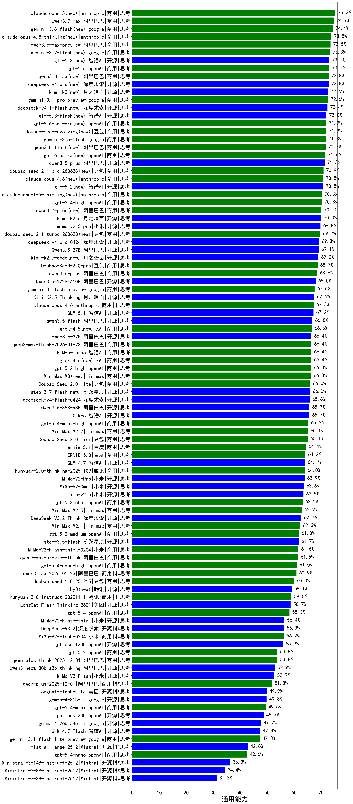

|类别|机构|大模型|【通用能力】准确率|平均耗时|平均消耗token|花费/千次（元）|排名（准确率）|
|---|---|-----|-------------------|-------|-----------|-----------|-----------|
|商用|阿里巴巴|qwen3.7-max(new)|74.7%|66s|4017|135.0|1|
|商用|anthropic|claude-opus-4.8-thinking(new)|73.8%|23s|2129|308.3|2|
|商用|阿里巴巴|qwen3.6-max-preview|73.5%|91s|3455|168.5|3|
|商用|openAI|gpt-5.5(new)|73.1%|17s|1130|175.3|4|
|商用|google|gemini-3.1-pro-preview|72.6%|64s|4324|339.4|5|
|商用|openAI|gpt-5.6-sol-pro(new)|71.9%|28s|5586|443.2|6|
|商用|豆包|doubao-seed-evolving(new)|71.9%|288s|11507|334.6|7|
|商用|google|gemini-3.5-flash(new)|71.8%|15s|3383|191.7|8|
|开源|阿里巴巴|qwen3.5-plus|71.3%|71s|6301|28.6|9|
|商用|豆包|doubao-seed-2-1-pro-260628(new)|70.9%|301s|11894|346.2|10|
|商用|anthropic|claude-opus-4.8(new)|70.8%|10s|991|109.1|11|
|开源|智谱AI|glm-5.2(new)|70.8%|121s|5563|148.8|12|
|商用|anthropic|claude-sonnet-5-thinking(new)|70.3%|21s|1909|107.9|13|
|商用|openAI|gpt-5.4-high|70.3%|28s|1673|144.7|14|
|商用|阿里巴巴|qwen3.7-plus(new)|70.1%|99s|5696|43.2|15|
|开源|月之暗面|kimi-k2.6(new)|70.0%|211s|4958|127.3|16|
|开源|小米|mimo-v2.5-pro(new)|69.8%|69s|4331|81.9|17|
|商用|豆包|doubao-seed-2-1-turbo-260628(new)|69.7%|221s|10334|149.7|18|
|开源|深度求索|deepseek-v4-pro(new)|69.3%|79s|3204|72.9|19|
|开源|阿里巴巴|Qwen3.5-27B|69.1%|299s|6766|30.8|20|
|开源|月之暗面|kimi-k2.7-code(new)|69.0%|66s|2372|57.4|21|
|商用|豆包|Doubao-Seed-2.0-pro|68.7%|358s|2066|27.3|22|
|商用|阿里巴巴|qwen3.6-plus|68.6%|84s|5034|56.4|23|
|开源|阿里巴巴|Qwen3.5-122B-A10B|68.0%|393s|6591|39.9|24|
|商用|google|gemini-3-flash-preview|67.6%|71s|3481|66.9|25|
|开源|月之暗面|Kimi-K2.5-Thinking|67.5%|361s|4684|92.9|26|
|商用|anthropic|claude-opus-4.6|67.3%|13s|861|89.4|27|
|开源|智谱AI|GLM-5.1|67.2%|191s|4210|94.9|28|
|开源|阿里巴巴|qwen3.5-flash|66.8%|363s|6370|12.0|29|
|商用|openAI|gpt-5.1-high|66.6%|121s|3272|210.3|30|
|商用|XAI|grok-4.5(new)|66.6%|102s|3927|149.8|31|
|商用|openAI|gpt-5.1-medium|66.5%|147s|1876|111.2|32|
|开源|阿里巴巴|qwen3.6-27b(new)|66.4%|84s|5936|100.8|33|
|商用|阿里巴巴|qwen3-max-think-2026-01-23|66.4%|230s|5156|48.5|34|
|商用|智谱AI|GLM-5-Turbo|66.4%|59s|3659|74.7|35|
|商用|openAI|gpt-5.2-high|66.3%|53s|1638|111.6|36|
|商用|minimax|MiniMax-M3(new)|66.3%|130s|3169|47.1|37|
|商用|openAI|gpt-5-2025-08-07|66.3%|102s|793|37.5|38|
|商用|豆包|Doubao-Seed-2.0-lite|66.0%|319s|2353|7.1|39|
|开源|阶跃星辰|step-3.7-flash(new)|66.0%|60s|6591|51.1|40|
|开源|深度求索|deepseek-v4-flash(new)|65.8%|60s|3628|6.9|41|
|开源|阿里巴巴|Qwen3.6-35B-A3B|65.7%|80s|5418|54.9|42|
|开源|智谱AI|GLM-5|65.7%|146s|4307|72.8|43|
|商用|openAI|gpt-5.4-mini-high|65.3%|65s|3330|95.6|44|
|商用|minimax|MiniMax-M2.7|65.1%|110s|5348|42.7|45|
|商用|豆包|Doubao-Seed-2.0-mini|65.1%|312s|4397|8.0|46|
|商用|google|gemini-2.5-pro|64.6%|96s|2996|194.9|47|
|商用|百度|ernie-5.1(new)|64.4%|58s|2400|37.5|48|
|开源|月之暗面|Kimi-K2-Thinking|64.2%|334s|5894|90.4|49|
|商用|百度|ERNIE-5.0|64.2%|251s|4904|110.7|50|
|开源|智谱AI|GLM-4.7|64.1%|118s|5058|67.1|51|
|商用|腾讯|hunyuan-2.0-thinking-20251109|64.0%|34s|3542|13.2|52|
|开源|小米|MiMo-V2-Pro|63.9%|237s|3817|71.2|53|
|商用|openAI|o4-mini|63.8%|39s|1682|46.8|54|
|开源|小米|MiMo-V2-Omni|63.6%|290s|3725|45.0|55|
|开源|小米|mimo-v2.5(new)|63.5%|42s|3957|48.2|56|
|商用|openAI|gpt-5.3-chat|63.2%|23s|938|61.5|57|
|商用|anthropic|claude-sonnet-4.5-thinking|63.2%|42s|3442|333.7|58|
|商用|minimax|MiniMax-M2.5|62.9%|65s|4312|34.0|59|
|开源|深度求索|DeepSeek-V3.2-Think|62.7%|158s|3368|9.8|60|
|商用|minimax|MiniMax-M2.1|62.3%|112s|4172|32.8|61|
|商用|百度|ERNIE-5.0-Thinking-Preview|61.8%|332s|4109|91.6|62|
|商用|openAI|gpt-5.2-medium|61.8%|45s|1204|88.9|63|
|开源|阶跃星辰|step-3.5-flash|61.7%|44s|6021|12.2|64|
|商用|小米|MiMo-V2-Flash-think-0204|61.6%|706s|5134|10.2|65|
|商用|阿里巴巴|qwen3-max-preview-think|61.5%|184s|4586|102.8|66|
|商用|openAI|gpt-5.4-nano-high|61.0%|93s|2546|17.7|67|
|商用|阿里巴巴|qwen3-max-2026-01-23|60.9%|104s|1468|11.7|68|
|商用|anthropic|claude-haiku-4.5-thinking|60.3%|45s|5131|172.0|69|
|商用|openAI|gpt-5-mini-2025-08-07|60.1%|110s|1630|19.7|70|
|商用|豆包|doubao-seed-1-8-251215|60.0%|37s|1507|8.8|71|
|商用|阿里巴巴|qwen3-max-2025-09-23|59.6%|172s|1475|28.2|72|
|商用|openAI|gpt-5-mini-high|59.2%|465s|4306|57.9|73|
|开源|腾讯|hy3(new)|59.1%|64s|883|2.5|74|
|商用|腾讯|hunyuan-2.0-instruct-20251111|59.0%|12s|1202|1.9|75|
|商用|anthropic|claude-sonnet-4.5|58.9%|8s|801|49.1|76|
|商用|anthropic|claude-opus-4.5|58.7%|18s|1281|165.6|77|
|商用|anthropic|claude-4-sonnet|58.7%|47s|585|42.0|78|
|开源|美团|LongCat-Flash-Thinking-2601|58.7%|210s|5567|0.0|79|
|开源|深度求索|DeepSeek-V3.1-Think|58.6%|138s|3014|33.9|80|
|商用|openAI|gpt-5.4|58.3%|7s|677|40.1|81|
|开源|智谱AI|GLM-4.5-Air|57.4%|127s|4153|23.0|82|
|开源|阿里巴巴|qwen3-235b-a22b-instruct-2507|57.2%|61s|1340|8.6|83|
|商用|智谱AI|GLM-4.5-Flash|57.1%|85s|4121|0.0|84|
|商用|XAI|grok-4-1-fast-reasoning|56.9%|62s|3176|10.2|85|
|商用|阿里巴巴|qwen3-max-preview|56.8%|94s|1147|21.3|86|
|开源|小米|MiMo-V2-Flash-think|56.4%|77s|5089|0.0|87|
|开源|深度求索|DeepSeek-V3.2|56.3%|85s|1130|3.1|88|
|商用|腾讯|hunyuan-turbos-20250926|56.3%|30s|1503|2.5|89|
|商用|小米|MiMo-V2-Flash-0204|56.2%|214s|1133|1.8|90|
|开源|深度求索|DeepSeek-R1-0528|56.1%|214s|3766|58.9|91|
|开源|openAI|gpt-oss-120b|55.9%|102s|1322|3.4|92|
|开源|阿里巴巴|Qwen3-30B-A3B-Thinking-2507|55.7%|128s|3693|9.6|93|
|开源|阿里巴巴|qwen3-235b-a22b-thinking-2507|54.9%|180s|3909|66.7|94|
|商用|google|gemini-2.5-flash|54.5%|61s|2921|47.3|95|
|商用|腾讯|hunyuan-t1-20250711|54.5%|101s|3512|12.8|96|
|商用|openAI|gpt-5-nano-high|54.5%|497s|7889|22.0|97|
|开源|深度求索|DeepSeek-V3.1|54.4%|31s|829|7.7|98|
|商用|openAI|gpt-5-nano-2025-08-07|54.2%|99s|2920|7.7|99|
|商用|openAI|gpt-5.2|53.8%|7s|582|27.0|100|
|商用|阿里巴巴|qwen-plus-think-2025-12-01|53.8%|91s|4044|29.5|101|
|商用|豆包|doubao-seed-1-6-lite-251015|53.5%|101s|1962|3.8|102|
|商用|阿里巴巴|qwen-flash-think-2025-07-28|53.5%|96s|3605|4.9|103|
|开源|阿里巴巴|qwen3-next-80b-a3b-thinking|52.9%|153s|5020|18.9|104|
|开源|阿里巴巴|qwen3-next-80b-a3b-instruct|52.9%|113s|1448|4.7|105|
|开源|小米|MiMo-V2-Flash|52.7%|71s|1722|0.0|106|
|商用|百度|ERNIE-X1.1-Preview|52.6%|215s|3617|13.3|107|
|开源|豆包|Seed-OSS-36B-Instruct|52.5%|263s|3408|12.8|108|
|商用|阿里巴巴|qwen-plus-2025-12-01|51.8%|38s|1882|3.3|109|
|商用|anthropic|claude-haiku-4.5|51.4%|16s|837|17.2|110|
|商用|anthropic|claude-4-sonnet-thinking|50.8%|39s|816|50.7|111|
|开源|月之暗面|kimi-k2-0905|50.2%|79s|1311|16.9|112|
|商用|豆包|doubao-seed-1-6-251015|50.0%|69s|1635|10.0|113|
|开源|美团|LongCat-Flash-Lite|49.9%|157s|1576|0.0|114|
|开源|google|gemma-4-31b-it|49.8%|76s|757|1.4|115|
|商用|openAI|gpt-5.1|49.7%|178s|576|18.9|116|
|商用|openAI|gpt-5.4-mini|49.5%|32s|508|6.7|117|
|开源|openAI|gpt-oss-20b|48.7%|184s|2288|2.3|118|
|开源|google|gemma-4-26b-a4b-it|47.7%|39s|858|1.6|119|
|开源|阿里巴巴|Qwen3-30B-A3B-Instruct-2507|47.7%|79s|1459|3.6|120|
|开源|智谱AI|GLM-4.7-Flash|47.4%|1273s|6723|0.0|121|
|商用|google|gemini-3.1-flash-lite-preview|47.3%|11s|694|3.7|122|
|开源|智谱AI|GLM-4.5-Air-nothink|46.8%|91s|1924|10.0|123|
|商用|百度|ERNIE-X1-Turbo-32K|46.6%|366s|3052|11.1|124|
|商用|智谱AI|GLM-4.5-Flash-nothink|46.3%|37s|1669|0.0|125|
|商用|阿里巴巴|qwen-flash-2025-07-28|46.2%|82s|1480|1.8|126|
|商用|百度|ERNIE-4.5-Turbo-32K|45.7%|93s|792|1.7|127|
|开源|阿里巴巴|Qwen3-14B|45.7%|119s|3303|6.1|128|
|商用|阿里巴巴|qwen-turbo-think-2025-07-15|44.2%|/|3434|9.4|129|
|开源|阿里巴巴|Qwen3-32B|43.5%|116s|2682|9.8|130|
|开源|Mistral|mistral-large-2512|42.8%|13s|994|7.5|131|
|商用|openAI|gpt-5.4-nano|42.6%|37s|539|2.1|132|
|开源|阿里巴巴|Qwen3-8B|42.2%|147s|4442|0.0|133|
|开源|阿里巴巴|Qwen3-4B|41.8%|68s|2281|6.0|134|
|商用|XAI|grok-4-1-fast-non-reasoning|41.7%|69s|731|1.5|135|
|商用|阿里巴巴|qwen-turbo-2025-07-15|40.5%|73s|846|0.4|136|
|开源|阿里巴巴|Qwen3-32B-nothink|40.3%|124s|812|2.2|137|
|商用|google|gemini-2.5-flash-lite|40.3%|71s|3551|9.5|138|
|开源|meta|Llama-4-Scout-17B-16E-Instruct|37.2%|8s|553|0.9|139|
|开源|阿里巴巴|Qwen3-14B-nothink|36.7%|65s|983|1.4|140|
|开源|Mistral|Ministral-3-14B-Instruct-2512|36.3%|21s|2105|3.0|141|
|商用|百川智能|Baichuan4-Turbo|34.8%|/|/|nan|142|
|开源|Mistral|Ministral-3-8B-Instruct-2512|34.4%|13s|1731|1.9|143|
|开源|阿里巴巴|Qwen3-8B-nothink|33.6%|34s|944|0.0|144|
|开源|阿里巴巴|Qwen3-4B-nothink|31.7%|115s|883|1.7|145|
|开源|Mistral|Ministral-3-3B-Instruct-2512|31.3%|15s|2277|1.6|146|
|开源|智谱AI|GLM-4-9B-0414|29.9%|7s|500|0.0|147|

