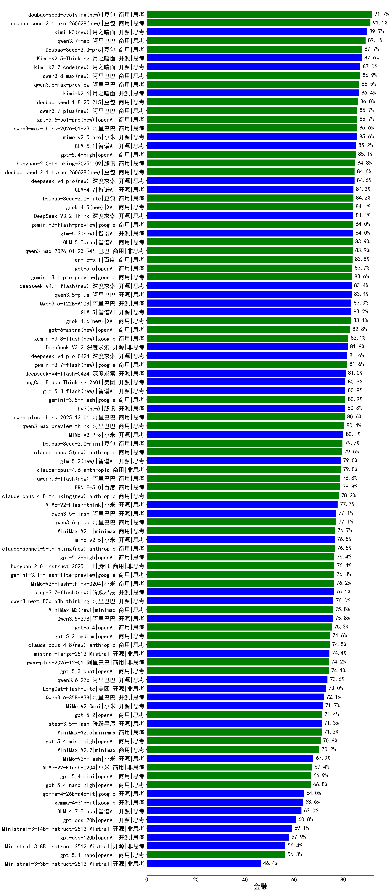

|类别|机构|大模型|【金融】准确率|平均耗时|平均消耗token|花费/千次（元）|排名（准确率）|
|---|---|-----|-------------------|-------|-----------|-----------|-----------|
|商用|豆包|Doubao-Seed-2.0-pro(new)|87.7%|231s|1083|15.6|1|
|开源|月之暗面|Kimi-K2.5-Thinking(new)|87.6%|317s|1972|40.0|2|
|商用|豆包|doubao-seed-1-8-251215(new)|86.0%|25s|719|4.8|3|
|商用|百度|ERNIE-4.5-Turbo-32K|85.8%|22s|520|1.5|4|
|商用|阿里巴巴|qwen3-max-think-2026-01-23(new)|85.6%|171s|3277|32.0|5|
|商用|阿里巴巴|qwen3-max-preview|85.1%|11s|547|11.4|6|
|商用|腾讯|hunyuan-2.0-thinking-20251109|84.8%|13s|1087|4.1|7|
|开源|智谱AI|GLM-4.7(new)|84.2%|58s|2385|32.5|8|
|商用|豆包|Doubao-Seed-2.0-lite(new)|84.2%|200s|982|3.1|9|
|商用|豆包|doubao-seed-1-6-thinking-250715|84.1%|28s|1472|11.1|10|
|开源|深度求索|DeepSeek-V3.2-Think(new)|84.1%|102s|1453|4.3|11|
|商用|google|gemini-3-flash-preview(new)|84.0%|63s|1476|29.8|12|
|商用|阿里巴巴|qwen3-max-2026-01-23(new)|83.9%|64s|576|5.1|13|
|商用|腾讯|hunyuan-t1-20250711|83.6%|28s|1806|6.8|14|
|开源|智谱AI|GLM-5(new)|83.2%|96s|2253|39.4|15|
|商用|阿里巴巴|qwen-plus-think-2025-07-28|83.0%|/|2760|21.4|16|
|开源|深度求索|DeepSeek-V3.1-Think|82.8%|61s|1230|14.1|17|
|商用|google|gemini-3-pro-preview(new)|82.8%|49s|2100|172.3|18|
|商用|阿里巴巴|qwen-plus-2025-07-28|82.8%|18s|709|1.3|19|
|商用|百度|ERNIE-X1-Turbo-32K|82.5%|123s|2085|8.1|20|
|开源|深度求索|DeepSeek-V3.2-Exp-Think|82.5%|146s|1298|3.8|21|
|商用|豆包|doubao-seed-1-6-250615|82.0%|86s|417|2.4|22|
|商用|anthropic|claude-opus-4.5(new)|81.8%|14s|716|107.6|23|
|开源|深度求索|DeepSeek-V3.2(new)|81.8%|55s|407|1.1|24|
|开源|阿里巴巴|qwen3-235b-a22b-instruct-2507|81.7%|14s|637|4.5|25|
|商用|阿里巴巴|qwen3-max-2025-09-23|81.4%|185s|597|12.6|26|
|商用|豆包|doubao-seed-1-6-lite-251015|80.8%|52s|920|2.0|27|
|商用|豆包|doubao-seed-1-6-251015|80.6%|17s|749|5.1|28|
|商用|阿里巴巴|qwen-plus-think-2025-12-01(new)|80.6%|70s|2686|20.8|29|
|商用|阿里巴巴|qwen3-max-preview-think(new)|80.4%|170s|2452|57.1|30|
|开源|阿里巴巴|Qwen3-14B|80.2%|32s|1516|2.9|31|
|商用|腾讯|hunyuan-turbos-20250926|80.1%|16s|714|1.3|32|
|开源|美团|LongCat-Flash-Thinking-2601(new)|79.8%|262s|2657|0.0|33|
|开源|阿里巴巴|Qwen3-32B|79.7%|32s|1218|4.6|34|
|商用|豆包|Doubao-Seed-2.0-mini(new)|79.7%|368s|2294|4.3|35|
|开源|阿里巴巴|qwen3-235b-a22b-thinking-2507|79.6%|111s|2682|51.9|36|
|商用|豆包|doubao-seed-1-6-flash-thinking-250615|79.2%|19s|1052|1.4|37|
|开源|深度求索|DeepSeek-V3.2-Exp|79.0%|159s|389|1.1|38|
|商用|anthropic|claude-opus-4.6(new)|79.0%|15s|583|82.5|39|
|开源|深度求索|DeepSeek-R1-0528|79.0%|240s|2222|34.5|40|
|开源|百度|ERNIE-4.5-300B-A47B|78.9%|23s|507|3.5|41|
|商用|百度|ERNIE-5.0(new)|78.8%|190s|2766|65.0|42|
|开源|阿里巴巴|qwen3-next-80b-a3b-instruct|78.7%|10s|631|2.2|43|
|开源|月之暗面|kimi-k2-0711-preview|78.6%|26s|438|6.0|44|
|开源|深度求索|DeepSeek-V3.1|78.5%|21s|405|4.2|45|
|商用|google|gemini-2.5-pro|78.5%|30s|2196|153.3|46|
|商用|anthropic|claude-sonnet-4.5-thinking|78.0%|29s|2056|209.0|47|
|开源|小米|MiMo-V2-Flash-think(new)|77.7%|75s|2645|0.0|48|
|开源|智谱AI|GLM-4.6|77.7%|51s|2116|28.7|49|
|开源|月之暗面|kimi-k2-0905|77.6%|59s|458|6.1|50|
|商用|百度|ERNIE-X1.1-Preview|77.3%|127s|1107|4.2|51|
|商用|豆包|doubao-seed-1-6-flash-250615|77.2%|9s|487|0.6|52|
|商用|豆包|Doubao-1.5-lite-32k-250115|77.2%|6s|288|0.1|53|
|商用|阿里巴巴|qwen-long-2025-01-25|77.2%|43s|377|0.6|54|
|开源|智谱AI|GLM-4.5|76.9%|81s|2191|29.7|55|
|商用|minimax|MiniMax-M2.1(new)|76.7%|114s|3132|25.6|56|
|商用|openAI|gpt-5.2-high(new)|76.4%|18s|783|68.8|57|
|商用|腾讯|hunyuan-2.0-instruct-20251111|76.4%|6s|421|0.7|58|
|商用|小米|MiMo-V2-Flash-think-0204(new)|76.2%|691s|2319|4.7|59|
|开源|阿里巴巴|qwen3-next-80b-a3b-thinking|76.0%|120s|3049|11.9|60|
|开源|豆包|Seed-OSS-36B-Instruct|75.9%|104s|2137|8.3|61|
|开源|minimax|MiniMax-M1|75.6%|211s|3469|24.4|62|
|商用|openAI|gpt-5.1-medium|75.4%|164s|675|41.5|63|
|商用|XAI|grok-4-0709|75.1%|308s|1701|176.9|64|
|商用|科大讯飞|xunfei-spark-x1-0725|75.0%|/|1318|15.8|65|
|商用|openAI|gpt-5.2-medium(new)|74.6%|8s|461|36.9|66|
|商用|阿里巴巴|qwen-flash-2025-07-28|74.5%|11s|809|1.1|67|
|开源|Mistral|mistral-large-2512(new)|74.4%|11s|520|4.7|68|
|商用|阿里巴巴|qwen-plus-2025-12-01(new)|74.2%|24s|950|1.8|69|
|商用|百度|ERNIE-5.0-Thinking-Preview|74.1%|257s|2114|49.3|70|
|开源|智谱AI|GLM-4.5-nothink|73.7%|33s|1121|14.7|71|
|开源|阶跃星辰|step-3|73.5%|133s|2564|10.0|72|
|开源|阿里巴巴|Qwen3-30B-A3B-Instruct-2507|73.2%|7s|756|2.1|73|
|商用|Mistral|mistral-medium-2508|73.1%|65s|525|6.2|74|
|开源|美团|LongCat-Flash-Lite(new)|73.0%|229s|592|0.0|75|
|开源|meta|Llama-4-Maverick-17B-128E-Instruct-FP8|72.8%|8s|542|2.1|76|
|商用|openAI|gpt-5.1-high|72.6%|103s|1513|101.0|77|
|开源|阿里巴巴|Qwen3-8B|72.4%|403s|10152|0.0|78|
|商用|anthropic|claude-4-sonnet-thinking|72.2%|60s|1251|123.4|79|
|开源|月之暗面|Kimi-K2-Thinking|71.9%|287s|4710|74.4|80|
|开源|阿里巴巴|Qwen3-30B-A3B-Thinking-2507|71.8%|70s|2724|7.4|81|
|商用|阿里巴巴|qwen-turbo-think-2025-07-15|71.7%|/|2774|8.1|82|
|商用|阿里巴巴|qwen-flash-think-2025-07-28|71.5%|29s|2814|4.1|83|
|商用|openAI|gpt-5.2(new)|71.4%|5s|227|13.6|84|
|开源|智谱AI|GLM-4.5-Air|71.3%|45s|2327|13.5|85|
|商用|openAI|gpt-5-2025-08-07|71.3%|39s|391|22.2|86|
|开源|阶跃星辰|step-3.5-flash(new)|71.3%|28s|2986|6.1|87|
|商用|minimax|MiniMax-M2.5(new)|71.2%|38s|1921|15.4|88|
|商用|anthropic|claude-4-sonnet|71.1%|46s|549|47.0|89|
|商用|阿里巴巴|qwen-turbo-2025-07-15|70.8%|9s|484|0.3|90|
|开源|阿里巴巴|Qwen3-4B|70.6%|24s|1769|5.0|91|
|商用|XAI|grok-4-1-fast-reasoning|70.6%|72s|1733|5.6|92|
|商用|智谱AI|GLM-4.5-Flash|70.3%|42s|2394|0.0|93|
|商用|google|gemini-2.5-flash|70.3%|10s|1850|32.0|94|
|商用|anthropic|claude-haiku-4.5-thinking|70.1%|37s|3082|106.4|95|
|商用|百川智能|Baichuan4-Turbo|70.1%|/|/|/|96|
|商用|智谱AI|GLM-4.5-Flash-nothink|69.6%|20s|1035|0.0|97|
|开源|minimax|MiniMax-Text-01|69.5%|12s|912|7.3|98|
|开源|腾讯|Hunyuan-A13B-Instruct|69.4%|61s|1289|4.9|99|
|开源|智谱AI|GLM-4.5-Air-nothink|68.8%|26s|1570|8.9|100|
|开源|阿里巴巴|Qwen3-32B-nothink|68.3%|72s|555|1.9|101|
|商用|openAI|gpt-5-mini-high|68.3%|446s|2355|32.8|102|
|开源|阿里巴巴|Qwen3-14B-nothink|68.2%|17s|598|1.1|103|
|开源|小米|MiMo-V2-Flash(new)|67.9%|46s|591|0.0|104|
|开源|百度|ERNIE-4.5-21B-A3B|67.9%|31s|530|0.0|105|
|开源|深度求索|DeepSeek-R1-0528-Qwen3-8B|67.4%|308s|2324|0.0|106|
|商用|anthropic|claude-sonnet-4.5(new)|67.4%|9s|573|50.1|107|
|商用|openAI|gpt-5.1|67.4%|181s|254|11.7|108|
|商用|小米|MiMo-V2-Flash-0204(new)|67.4%|234s|578|1.1|109|
|商用|openAI|o4-mini|66.5%|32s|1016|30.0|110|
|开源|minimax|MiniMax-M2|65.6%|39s|2304|18.6|111|
|商用|360|360zhinao2-o1|65.4%|/|/|/|112|
|商用|openAI|gpt-5-mini-2025-08-07|65.3%|49s|940|12.3|113|
|开源|阿里巴巴|Qwen3-8B-nothink|64.2%|46s|557|0.0|114|
|开源|智谱AI|GLM-4-9B-0414|64.1%|10s|439|0.0|115|
|开源|阿里巴巴|Qwen3-4B-nothink|63.4%|16s|486|1.2|116|
|商用|anthropic|claude-haiku-4.5|63.2%|10s|596|17.2|117|
|开源|智谱AI|GLM-4.7-Flash(new)|63.0%|1276s|6073|0.0|118|
|开源|meta|Llama-4-Scout-17B-16E-Instruct|62.6%|9s|558|1.1|119|
|商用|XAI|grok-3-mini|62.4%|203s|1116|3.9|120|
|开源|openAI|gpt-oss-20b|60.8%|67s|1540|1.7|121|
|开源|Mistral|Ministral-3-14B-Instruct-2512(new)|59.1%|10s|725|1.0|122|
|开源|阿里巴巴|Qwen3-1.7B|59.1%|20s|1953|5.6|123|
|商用|openAI|gpt-5-nano-2025-08-07|58.4%|63s|1990|5.5|124|
|开源|openAI|gpt-oss-120b|57.9%|24s|696|1.9|125|
|商用|google|gemini-2.5-flash-lite|57.8%|9s|1524|4.2|126|
|商用|openAI|gpt-5-nano-high|57.5%|556s|4860|13.8|127|
|商用|百川智能|Baichuan4-Air|57.4%|/|/|/|128|
|开源|google|gemma-3-27b-it|56.4%|/|/|/|129|
|开源|Mistral|Ministral-3-8B-Instruct-2512(new)|56.4%|19s|1746|1.9|130|
|开源|Mistral|Magistral-Small-2507|55.9%|140s|5837|62.6|131|
|开源|Mistral|Mistral-Small-3.2-24B-Instruct-2506|54.5%|112s|731|1.4|132|
|开源|腾讯|Hunyuan-A13B-Instruct-nothink|54.5%|319s|457|1.6|133|
|商用|XAI|grok-4-1-fast-non-reasoning|51.5%|34s|582|1.5|134|
|开源|阿里巴巴|Qwen3-1.7B-nothink|49.9%|11s|474|1.2|135|
|商用|百度|ERNIE-Lite-8K|49.2%|/|/|/|136|
|开源|google|gemma-3-12b-it|47.7%|/|/|/|137|
|开源|Mistral|Ministral-3-3B-Instruct-2512(new)|46.4%|13s|1680|1.2|138|
|开源|阿里巴巴|Qwen3-0.6B|40.5%|10s|1637|4.7|139|
|开源|google|gemma-3-4b-it|39.4%|/|/|/|140|
|开源|阿里巴巴|Qwen3-0.6B-nothink|35.5%|9s|264|0.5|141|
|开源|百度|ERNIE-4.5-0.3B|27.0%|32s|390|0.0|142|

