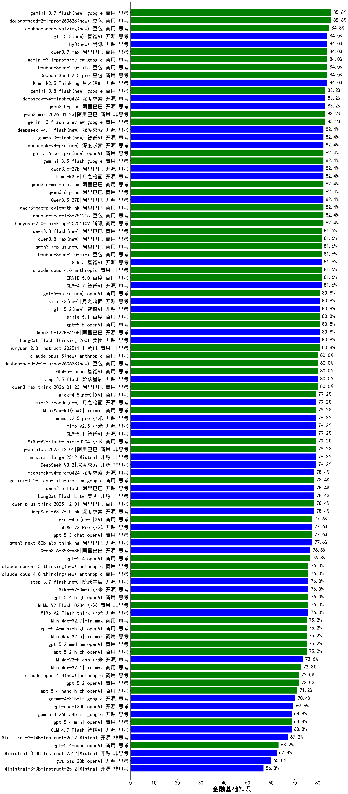

|类别|机构|大模型|【金融基础知识】准确率|平均耗时|平均消耗token|花费/千次（元）|排名（准确率）|
|---|---|-----|-------------------|-------|-----------|-----------|-----------|
|商用|豆包|doubao-seed-1-6-251015|86.4%|25s|817|5.7|1|
|商用|百度|ERNIE-4.5-Turbo-32K|85.1%|22s|568|1.6|2|
|商用|百度|ERNIE-X1-Turbo-32K|84.5%|151s|2371|9.3|3|
|开源|月之暗面|kimi-k2-0711-preview|84.4%|38s|555|8.0|4|
|商用|豆包|doubao-seed-1-6-250615|84.3%|103s|478|3.0|5|
|商用|google|gemini-3.1-pro-preview(new)|84.0%|58s|1881|154.1|6|
|商用|豆包|doubao-seed-1-6-thinking-250715|84.0%|33s|1614|12.3|7|
|开源|月之暗面|Kimi-K2.5-Thinking(new)|84.0%|358s|2420|49.5|8|
|商用|豆包|doubao-seed-1-6-lite-251015|84.0%|49s|1019|2.2|9|
|商用|google|gemini-3-pro-preview(new)|83.2%|56s|2290|189.0|10|
|商用|阿里巴巴|qwen3-max-preview|83.2%|12s|580|12.3|11|
|开源|阿里巴巴|qwen3.5-plus(new)|83.2%|38s|3026|14.2|12|
|商用|阿里巴巴|qwen3-max-2026-01-23(new)|83.2%|69s|796|7.3|13|
|开源|百度|ERNIE-4.5-300B-A47B|83.1%|28s|612|4.4|14|
|开源|深度求索|DeepSeek-R1-0528|83.0%|247s|2418|37.8|15|
|商用|豆包|doubao-seed-1-6-flash-thinking-250615|82.3%|15s|1299|1.8|16|
|开源|豆包|Seed-OSS-36B-Instruct|81.6%|131s|2537|9.9|17|
|商用|anthropic|claude-opus-4.6(new)|81.6%|15s|631|92.3|18|
|开源|智谱AI|GLM-5(new)|81.6%|81s|2457|43.1|19|
|商用|腾讯|hunyuan-t1-20250711|81.6%|33s|2057|7.9|20|
|开源|minimax|MiniMax-M1|81.0%|190s|3124|21.7|21|
|开源|阿里巴巴|Qwen3-14B|80.9%|32s|1301|2.5|22|
|商用|百度|ERNIE-5.0-Thinking-Preview|80.8%|296s|2348|55.0|23|
|商用|腾讯|hunyuan-turbos-20250926|80.8%|17s|718|1.3|24|
|商用|google|gemini-2.5-pro|80.5%|34s|2402|168.9|25|
|开源|阿里巴巴|Qwen3-32B|80.1%|49s|1971|7.6|26|
|开源|阿里巴巴|qwen3-235b-a22b-instruct-2507|80.0%|22s|805|5.9|27|
|商用|科大讯飞|xunfei-spark-x1-0725|80.0%|/|1497|18.0|28|
|商用|anthropic|claude-opus-4.5(new)|80.0%|16s|854|133.6|29|
|商用|阿里巴巴|qwen3-max-think-2026-01-23(new)|80.0%|162s|3405|33.4|30|
|商用|智谱AI|GLM-5-Turbo(new)|80.0%|54s|2016|43.0|31|
|商用|阿里巴巴|qwen-plus-2025-12-01(new)|79.2%|26s|1097|2.1|32|
|开源|深度求索|DeepSeek-V3.2-Exp-Think|79.2%|243s|1286|3.8|33|
|开源|深度求索|DeepSeek-V3.2-Exp|79.2%|205s|396|1.1|34|
|开源|阿里巴巴|qwen3-next-80b-a3b-instruct|79.2%|14s|842|3.1|35|
|商用|XAI|grok-4-0709|78.8%|271s|2010|211.5|36|
|开源|阿里巴巴|Qwen3-30B-A3B-Thinking-2507|78.8%|69s|2702|7.4|37|
|开源|阿里巴巴|qwen3-235b-a22b-thinking-2507|78.4%|97s|2817|54.3|38|
|商用|阿里巴巴|qwen-plus-think-2025-12-01(new)|78.4%|80s|2803|21.8|39|
|开源|美团|LongCat-Flash-Lite(new)|78.4%|243s|687|0.0|40|
|商用|阿里巴巴|qwen-plus-think-2025-07-28|78.4%|/|2770|21.4|41|
|商用|阿里巴巴|qwen-plus-2025-07-28|78.4%|24s|888|1.7|42|
|开源|深度求索|DeepSeek-V3.1-Think|78.4%|67s|1324|15.3|43|
|商用|豆包|doubao-seed-1-6-flash-250615|78.4%|9s|565|0.7|44|
|商用|豆包|Doubao-1.5-lite-32k-250115|78.0%|6s|331|0.2|45|
|开源|智谱AI|GLM-4.6|77.6%|56s|2422|33.0|46|
|商用|百度|ERNIE-X1.1-Preview|76.8%|152s|1618|6.3|47|
|商用|anthropic|claude-sonnet-4.5-thinking|76.8%|31s|2148|219.9|48|
|商用|anthropic|claude-sonnet-4.5(new)|76.8%|10s|601|54.2|49|
|开源|月之暗面|kimi-k2-0905|76.8%|69s|945|13.9|50|
|商用|openAI|gpt-5.4(new)|76.8%|8s|285|21.5|51|
|开源|深度求索|DeepSeek-V3.1|76.8%|23s|428|4.5|52|
|开源|meta|Llama-4-Maverick-17B-128E-Instruct-FP8|76.8%|8s|556|2.2|53|
|商用|google|gemini-2.5-flash|76.2%|11s|1935|33.7|54|
|商用|openAI|gpt-5.4-high(new)|76.0%|19s|759|71.3|55|
|商用|阿里巴巴|qwen-turbo-2025-07-15|76.0%|8s|466|0.3|56|
|商用|小米|MiMo-V2-Flash-0204(new)|76.0%|211s|667|1.3|57|
|商用|minimax|MiniMax-M2.5(new)|75.2%|36s|1911|15.4|58|
|开源|智谱AI|GLM-4.5|75.2%|76s|2431|33.2|59|
|开源|月之暗面|Kimi-K2-Thinking|75.2%|229s|3943|62.2|60|
|开源|阿里巴巴|Qwen3-32B-nothink|75.2%|83s|588|2.1|61|
|商用|anthropic|claude-haiku-4.5-thinking|74.4%|36s|3211|111.4|62|
|商用|阿里巴巴|qwen-flash-think-2025-07-28|74.4%|30s|2732|4.0|63|
|商用|openAI|gpt-5-2025-08-07|74.4%|25s|402|23.4|64|
|商用|openAI|gpt-5.1-high|74.4%|63s|1429|95.4|65|
|商用|智谱AI|GLM-4.5-Flash|74.4%|46s|2519|0.0|66|
|开源|minimax|MiniMax-Text-01|74.1%|13s|910|7.3|67|
|商用|智谱AI|GLM-4.5-Flash-nothink|73.6%|31s|1596|0.0|68|
|开源|智谱AI|GLM-4.5-nothink|73.6%|37s|1292|17.1|69|
|商用|Mistral|mistral-medium-2508|73.6%|94s|521|6.2|70|
|商用|openAI|gpt-5.1-medium|73.6%|155s|633|38.9|71|
|商用|XAI|grok-3-mini|73.6%|232s|1114|3.9|72|
|商用|阿里巴巴|qwen-turbo-think-2025-07-15|73.6%|/|2748|7.9|73|
|商用|anthropic|claude-4-sonnet|73.2%|44s|539|47.5|74|
|商用|XAI|grok-4-1-fast-reasoning|72.8%|69s|1801|5.9|75|
|开源|阶跃星辰|step-3|72.8%|149s|2684|10.5|76|
|开源|智谱AI|GLM-4.5-Air|72.8%|51s|2604|15.2|77|
|开源|阿里巴巴|Qwen3-4B|72.6%|39s|2789|8.1|78|
|商用|openAI|gpt-5.2(new)|72.0%|5s|228|14.3|79|
|开源|阿里巴巴|Qwen3-8B|71.8%|59s|3156|0.0|80|
|开源|腾讯|Hunyuan-A13B-Instruct|71.4%|79s|1605|6.2|81|
|商用|anthropic|claude-4-sonnet-thinking|71.2%|53s|1129|111.7|82|
|开源|智谱AI|GLM-4.5-Air-nothink|71.2%|26s|1600|9.1|83|
|开源|深度求索|DeepSeek-R1-0528-Qwen3-8B|71.0%|341s|2627|0.0|84|
|商用|阿里巴巴|qwen-flash-2025-07-28|70.4%|11s|947|1.3|85|
|商用|google|gemini-2.5-flash-lite|70.4%|7s|1452|4.0|86|
|商用|百川智能|Baichuan4-Turbo|70.3%|/|/|/|87|
|开源|百度|ERNIE-4.5-21B-A3B|70.0%|26s|696|0.0|88|
|开源|openAI|gpt-oss-120b|69.6%|44s|743|2.0|89|
|开源|阿里巴巴|Qwen3-30B-A3B-Instruct-2507|69.6%|8s|908|2.5|90|
|商用|openAI|gpt-5.1|68.8%|220s|252|11.9|91|
|开源|minimax|MiniMax-M2|68.8%|47s|2468|20.1|92|
|开源|阿里巴巴|Qwen3-14B-nothink|68.8%|18s|667|1.2|93|
|开源|智谱AI|GLM-4.7-Flash(new)|68.8%|1278s|6860|0.0|94|
|开源|阿里巴巴|Qwen3-4B-nothink|68.0%|18s|530|1.3|95|
|开源|meta|Llama-4-Scout-17B-16E-Instruct|67.9%|10s|599|1.2|96|
|商用|anthropic|claude-haiku-4.5|67.2%|10s|616|18.2|97|
|商用|openAI|o4-mini|66.4%|33s|1011|30.0|98|
|开源|Mistral|Mistral-Small-3.2-24B-Instruct-2506|64.0%|96s|870|1.7|99|
|开源|腾讯|Hunyuan-A13B-Instruct-nothink|64.0%|378s|531|1.9|100|
|商用|openAI|gpt-5-mini-2025-08-07|64.0%|72s|966|12.8|101|
|开源|智谱AI|GLM-4-9B-0414|63.8%|11s|481|0.0|102|
|商用|openAI|gpt-5-nano-2025-08-07|63.2%|75s|2128|5.9|103|
|开源|阿里巴巴|Qwen3-8B-nothink|62.4%|48s|579|0.0|104|
|商用|XAI|grok-4-1-fast-non-reasoning|60.8%|52s|591|1.6|105|
|开源|阿里巴巴|Qwen3-1.7B|60.6%|24s|2111|6.1|106|
|开源|openAI|gpt-oss-20b|60.0%|68s|1287|1.4|107|
|开源|google|gemma-3-27b-it|58.7%|/|/|/|108|
|商用|百川智能|Baichuan4-Air|56.2%|/|/|/|109|
|开源|阿里巴巴|Qwen3-1.7B-nothink|52.8%|11s|490|1.2|110|
|开源|google|gemma-3-12b-it|52.4%|/|/|/|111|
|商用|百度|ERNIE-Lite-8K|45.9%|/|/|/|112|
|开源|google|gemma-3-4b-it|43.7%|/|/|/|113|
|开源|阿里巴巴|Qwen3-0.6B|38.6%|14s|2211|6.4|114|
|开源|阿里巴巴|Qwen3-0.6B-nothink|31.2%|9s|301|0.7|115|
|开源|百度|ERNIE-4.5-0.3B|30.5%|19s|423|0.0|116|
|开源|阿里巴巴|qwen3-next-80b-a3b-thinking|/%|145s|3305|12.9|117|
|商用|豆包|Doubao-Seed-2.0-mini(new)|/%|367s|2471|4.7|118|
|开源|Mistral|Ministral-3-3B-Instruct-2512(new)|/%|13s|1947|1.4|119|
|商用|小米|MiMo-V2-Flash-think-0204(new)|/%|673s|2506|5.1|120|
|商用|豆包|Doubao-Seed-2.0-pro(new)|/%|/|1189|17.4|121|
|商用|豆包|Doubao-Seed-2.0-lite(new)|/%|230s|1061|3.4|122|
|开源|Mistral|Ministral-3-8B-Instruct-2512(new)|/%|14s|1213|1.3|123|
|商用|阿里巴巴|qwen3-max-2025-09-23|/%|201s|725|15.8|124|
|开源|阿里巴巴|qwen3.5-flash(new)|/%|295s|3815|7.5|125|
|开源|阿里巴巴|Qwen3.5-27B(new)|/%|269s|3468|16.3|126|
|开源|阿里巴巴|Qwen3.5-122B-A10B(new)|/%|286s|3241|20.3|127|
|商用|google|gemini-3.1-flash-lite-preview(new)|/%|16s|421|3.7|128|
|商用|openAI|gpt-5.3-chat(new)|/%|18s|409|31.8|129|
|商用|腾讯|hunyuan-2.0-instruct-20251111|/%|7s|517|0.9|130|
|商用|腾讯|hunyuan-2.0-thinking-20251109|/%|15s|1324|5.1|131|
|开源|深度求索|DeepSeek-V3.2-Think(new)|/%|141s|1669|4.9|132|
|开源|阶跃星辰|step-3.5-flash(new)|/%|33s|3443|7.1|133|
|开源|深度求索|DeepSeek-V3.2(new)|/%|74s|454|1.3|134|
|商用|openAI|gpt-5.2-high(new)|/%|14s|598|51.0|135|
|商用|openAI|gpt-5.2-medium(new)|/%|9s|449|36.3|136|
|商用|google|gemini-3-flash-preview(new)|/%|53s|1653|33.7|137|
|商用|豆包|doubao-seed-1-8-251215(new)|/%|29s|787|5.4|138|
|开源|小米|MiMo-V2-Flash(new)|/%|27s|703|0.0|139|
|开源|小米|MiMo-V2-Flash-think(new)|/%|95s|2697|0.0|140|
|开源|智谱AI|GLM-4.7(new)|/%|75s|2648|36.2|141|
|商用|minimax|MiniMax-M2.1(new)|/%|104s|2464|20.0|142|
|商用|阿里巴巴|qwen3-max-preview-think(new)|/%|156s|2489|58.1|143|
|商用|openAI|gpt-5-nano-high|/%|528s|5195|14.8|144|
|开源|美团|LongCat-Flash-Thinking-2601(new)|/%|293s|3067|0.0|145|
|商用|百度|ERNIE-5.0(new)|/%|205s|2639|62.0|146|
|商用|openAI|gpt-5-mini-high|/%|607s|2284|31.9|147|
|开源|Mistral|Ministral-3-14B-Instruct-2512(new)|/%|11s|961|1.4|148|
|开源|Mistral|mistral-large-2512(new)|/%|13s|579|5.4|149|

